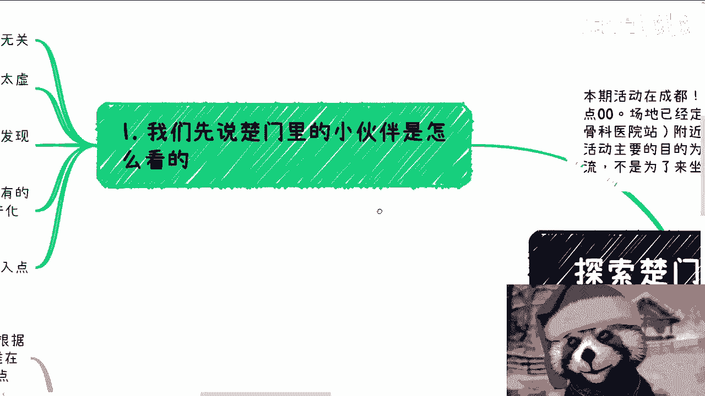
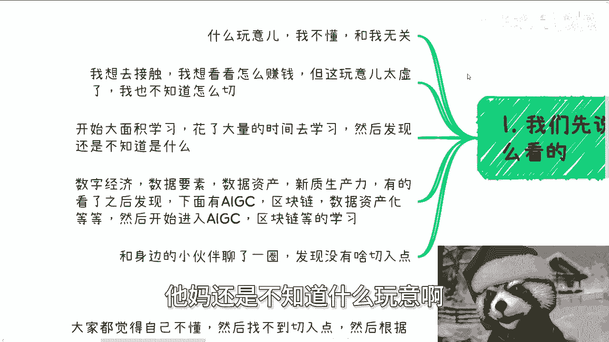
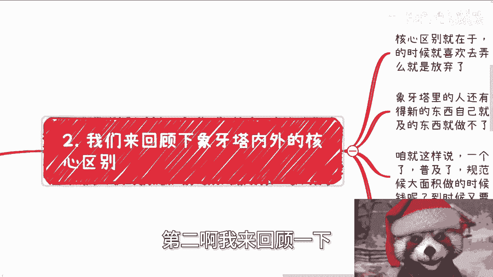
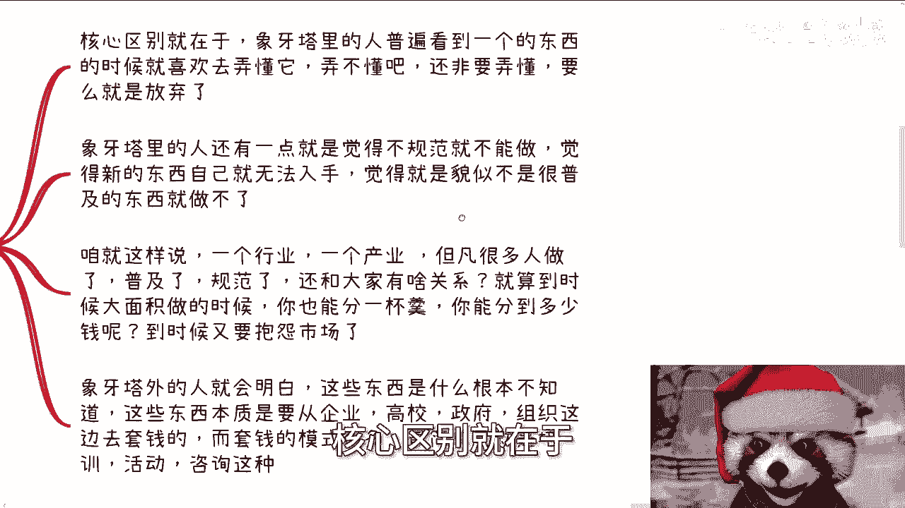
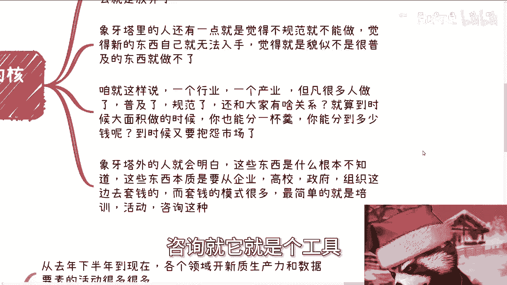
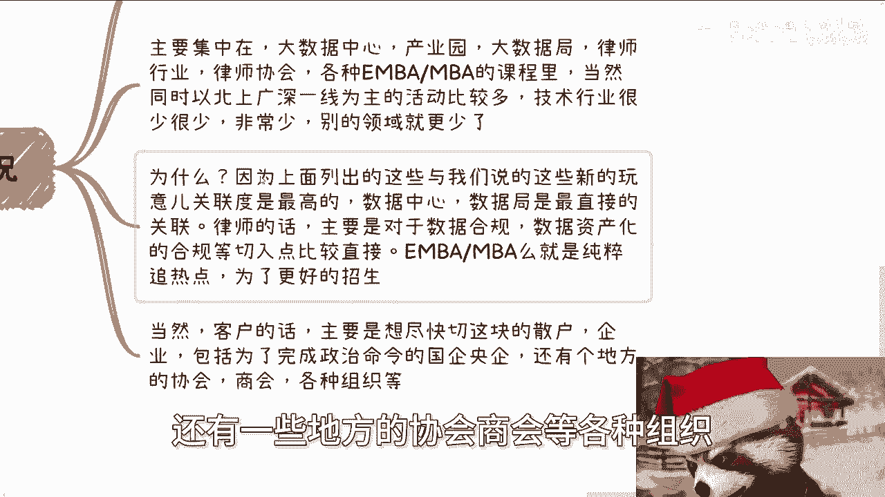
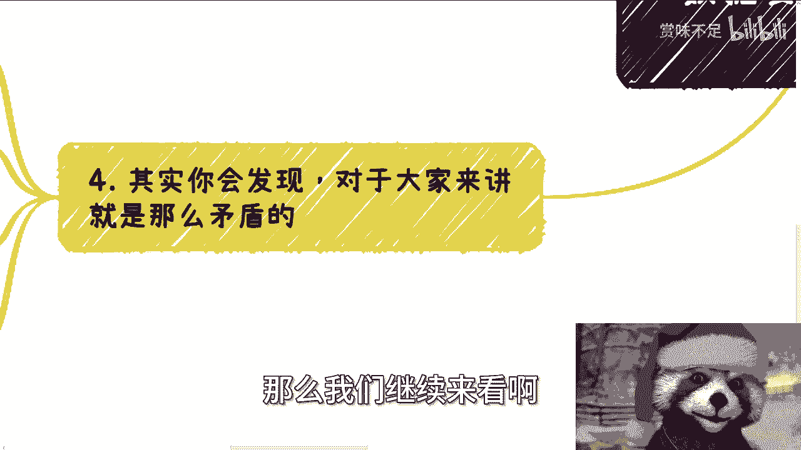
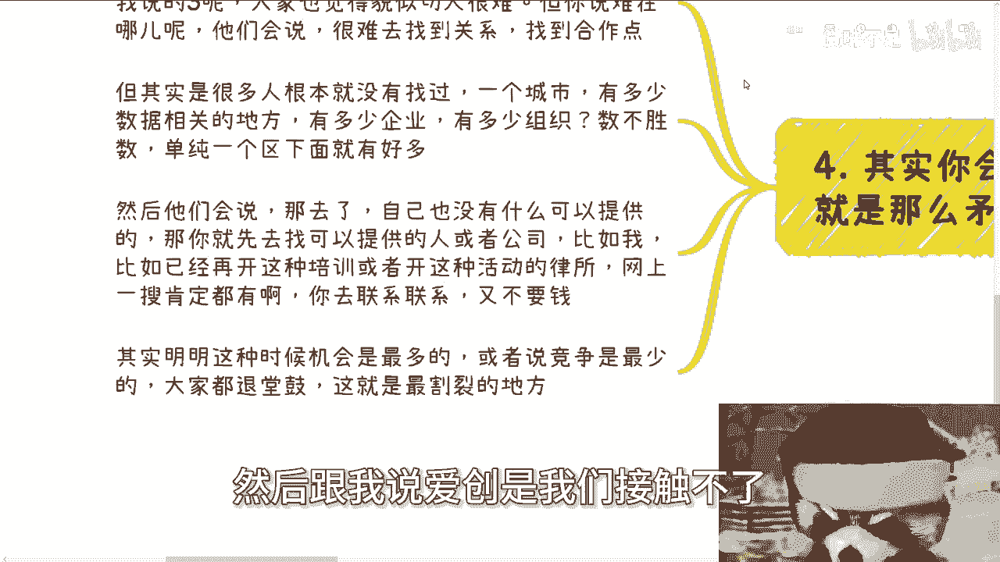
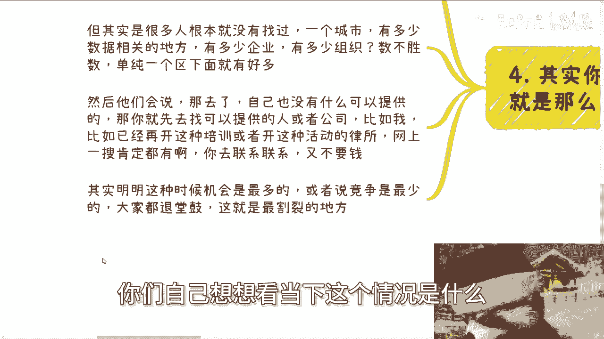
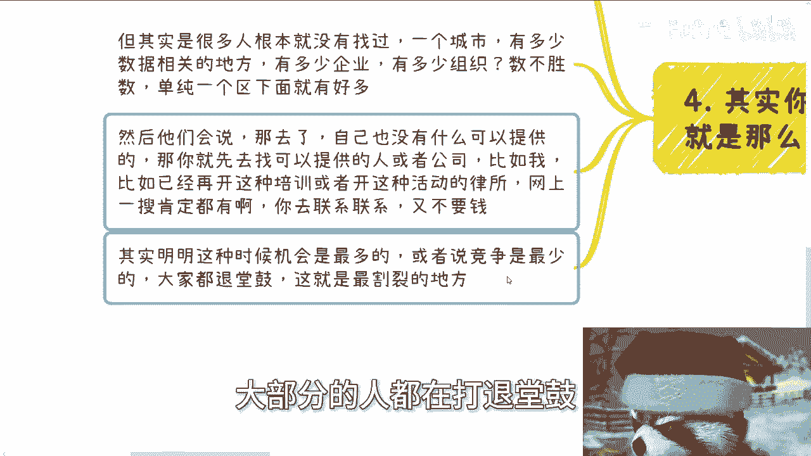

# 探索楚门的世界 23：以数据要素与新质生产力为例看外部世界 🌍

在本节课中，我们将探讨“楚门的世界”内外人群在面对“数据要素”和“新质生产力”等新兴概念时的不同思维模式与行动差异。我们将分析象牙塔内外的核心区别，并指出在当下环境中寻找机会的关键不在于“弄懂一切”，而在于掌握核心的运作逻辑并付诸行动。



---


## 活动通知 📅


本次活动将于6月16日下午1:30至6点在成都青羊区神谷科医院附近举行。如需了解详情或报名，请继续私信联系。



---

## 1. 象牙塔内的常见反应


上一节我们介绍了课程主题，本节中我们来看看“楚门世界”内的小伙伴们通常如何看待“数据要素”和“新质生产力”这类主题。


以下是几种典型的反应态度：


*   **态度一：漠不关心**。认为“什么玩意”、“不懂”、“与我无关”。
*   **态度二：浅尝辄止**。有兴趣接触并想了解如何赚钱，但初步了解后觉得“太虚”，不知道如何切入。
*   **态度三：闭门苦学**。开始花大量时间自主学习（如在YouTube等平台），但不与外界沟通。学完后发现“还是不知道什么玩意”。
*   **态度四：陷入分支**。注意到这些概念下有AIGC、区块链、数据资产化等分支，于是转而投入这些具体技术的学习。
*   **态度五：从众放弃**。与身边人交流后，发现大家都不懂，也找不到好的切入点，于是随之放弃。



以上是目前象牙塔内最常见的几种想法。



---


## 2. 象牙塔内外的核心区别

回顾了内部反应后，我们来看看象牙塔内外的核心区别在哪里。


核心区别在于，象牙塔内的人普遍存在以下思维定式：

*   **执着于“弄懂”**：看到一个东西就自信能且必须“弄懂它”。在弄不懂时，往往选择放弃。
*   **追求“规范”与“普及”**：认为一个事物如果没有大面积铺开、不够普及，就无法入手，觉得“做不了”。


---

## 3. 关于“普及”与“机会”的思考



上一节我们指出了内部的思维定式，本节中我们来深入思考“普及”与“机会”的关系。


一个行业或产业，一旦做的人多了、普及了、规范了，那它和你还有什么关系？即便到时能分一杯羹，竞争也会异常激烈，能分到的利益也有限。市场好的时候，你们在做什么呢？

象牙塔外的人明白，这些概念的本质是**工具**、**翘板**或**撬棍**。它的作用就是当下可以从企业、高校、政府组织那里撬出资源。最简单的模式就是我们常说的**培训、活动、咨询**。


**目的公式**：
```
你的核心目的 = 赚钱？ 还是 弄懂概念？
```
你不需要完全弄懂它，你的目的是利用它。

---

## 4. 当前的市场活动现状

了解了核心思维差异后，我们来看看当前围绕“数据要素”的实际市场活动情况。


从去年下半年至今，与数据要素相关的活动已经很多，主要集中在以下领域：


*   **大数据相关机构**：如大数据中心、产业园、大数据局。它们与数据要素概念最贴近，跟风最快。
*   **律师行业**：因为数据合规是数据要素、数据资产化中至关重要的一环，自然由律师和律师协会介入。
*   **商学院课程**：如EMBA/MBA课程，纯粹是为了追热点、更好招生。
*   **地域分布**：活动主要集中在一线城市（北上广深）。这是中国的发展规律，能赚钱、跟风的往往先从一线城市开始。



客户（付费方）主要包括：想切入该领域的散户与企业、需要完成政治任务的国企央企、以及地方协会/商会等组织。



---


## 5. 矛盾点与行动建议

根据前面介绍的市场现状，大家普遍觉得不懂、难切入。但问题究竟在哪？

以下是常见的退缩理由与对应的行动建议：

*   **理由**：“很难找到关系（如大数据局）。”
    *   **建议**：一个城市有多少数据相关的地方、产业园、中心？你找过吗？联系过对应的商务人员吗？**没行动过，就不要说接触不到**。
*   **理由**：“自己没什么可提供的东西。”
    *   **建议**：先去找能提供东西的人或公司合作。例如，已经在网上开展数据资产业务的律所或协会，主动联系他们并不需要成本。

当下的情况是：**机会最多，竞争相对较少，大部分人却在根本没行动的情况下就打退堂鼓**。这是最割裂的地方。





---

## 6. 掌握本质逻辑而非行业本身




有人会问某个行业或市场何时会变好。关键在于，好不好不重要，重要的是掌握从中央到地方做事的**同一套底层逻辑**。

**核心逻辑**：
```
成功的关键 = 通过具体案例（case）落地，摸索出运作的本质逻辑。
```
这个逻辑与具体行业（金融、医疗、农业、数据要素）无关。一旦你掌握了与某个系统（如高校）打交道的合作本质和运作模式，那么无论到哪个城市、做哪个行业，运作方式都是一样的。

因此，纠结于进入哪个行业并不重要。**哪个行业能让你摸到一点运作逻辑，你就去做哪个**。本质上，没有人阻碍你去探索。

---

## 7. 服务与咨询说明

最后，关于个人咨询与服务，说明如下：

1.  **职业与商业规划**：如有关于合同、期权、股权、分润、分红、项目计划书、白皮书等问题，或希望从我这里获得更贴近未来发展的规划建议，请整理好相关问题和个人背景，再进行详细咨询。
2.  **咨询的局限性**：如果指望通过一次咨询就能带来财务自由或质变，请不要找我。我没有这个能力。

---

## 总结

本节课中，我们一起学习了：
1.  “楚门世界”内外人群面对新概念时的思维与行动差异。
2.  象牙塔内的思维定式是执着于“弄懂”和等待“规范”。
3.  新概念的本质是**工具**，目的是利用它撬动资源，而非完全弄懂。
4.  当前市场活动已在一线城市的特定领域展开，存在机会。
5.  最大的障碍是“不行动”，真正的机会在于主动联系和寻找合作。
6.  应追求掌握跨行业通用的**运作本质逻辑**，而非绑定于某个具体行业。
7.  咨询能提供的是基于经验的规划和思路，而非“点石成金”的魔法。

希望本教程能帮助你以更务实、更行动的视角看待外部世界的机会。