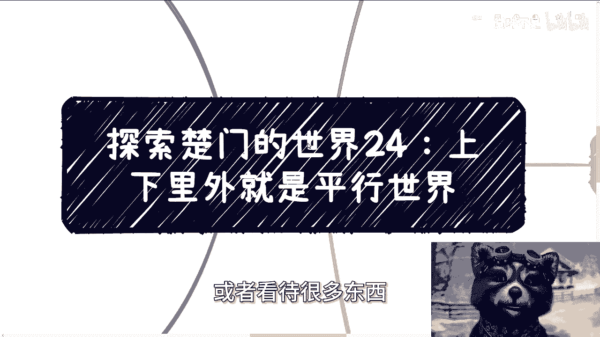
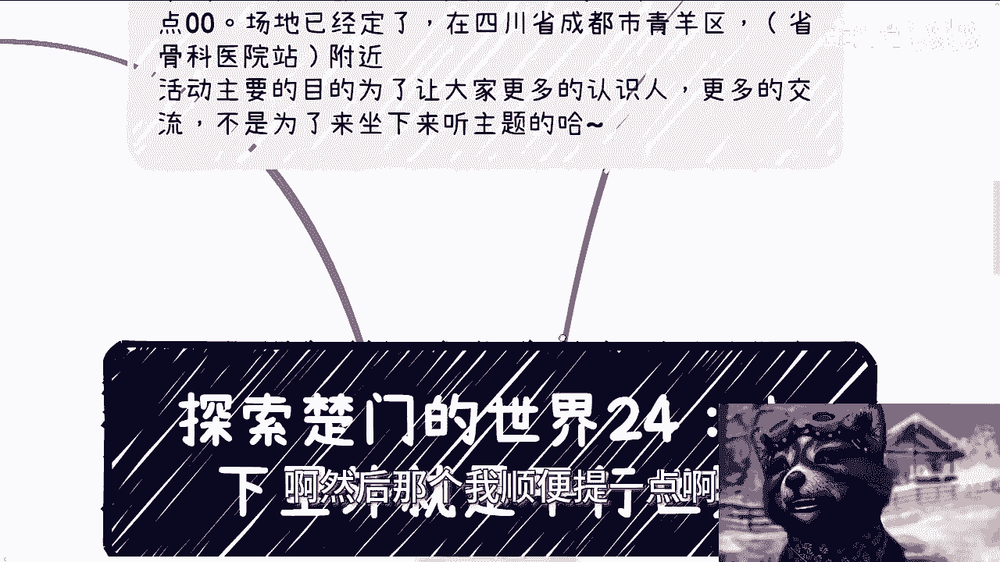
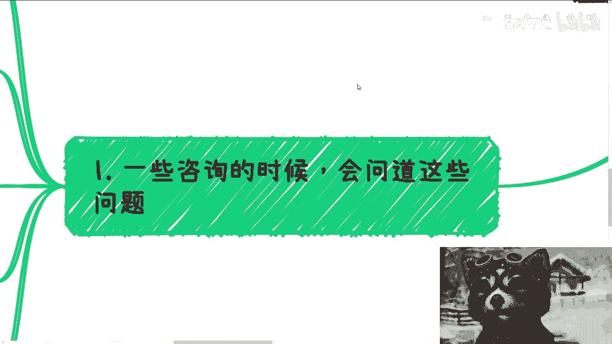
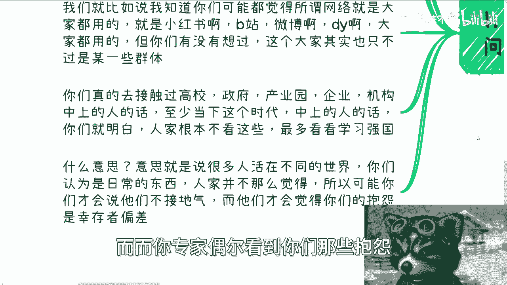
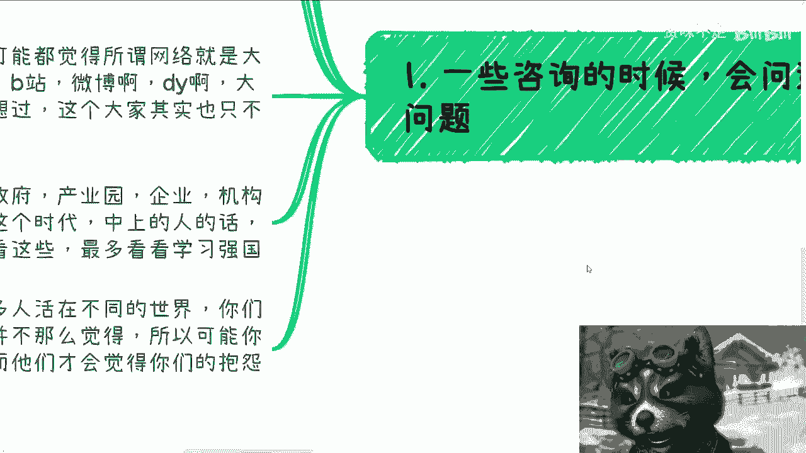
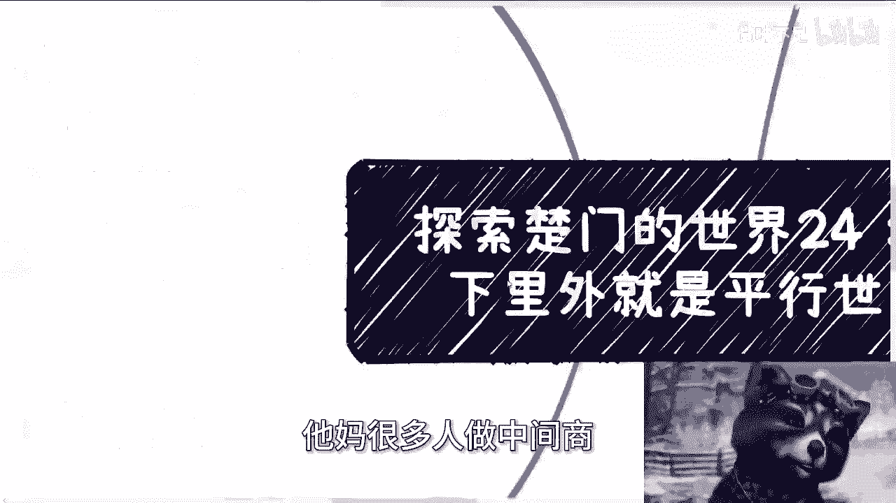

# 探索楚门的世界24：上下里外都是平行世界 - P1 - 赏味不足 - BV1fn4y197i2

哈大家好啊，这个由于昨天我精神状态比较美丽对吧。

那那一直美丽到了今天啊，我尽量克制啊，尽量克制啊，今天我们来讲的呢是探索楚门的世界，第24啊，就是核心是什么呢，叫做上下里外都是平行世界，呃，怎么说呢，今天我们讲的东西啊。

就是我只是希望大家能够有一个辩证的态度，去看待这个社会，或者看待很多东西。

就不要再二极管了啊，不没有二极管这个东西的，好吧啊。

然后那个我顺便提一点啊，就是活动在成都好吧，在成都6月16号下午01：30到六点啊。

场地已经定了，在青阳区省骨科医院附近啊，然后呃想了解详情或者报名的啊。

你们私信我好吧啊，那我们今天一个个来讲啊。

首先呃一些咨询的时候呢会问到这些问题，比如说啊他说很多时候呢会问到，就说失业率上升了啊，社会稳定性问题啊，包括就是说这个陈老师，你觉得学校为什么还他妈一天，一天到晚在开一些莫名其妙的这种新专业啊。

比如说什么区块链啊啊，数字经济啊啊什么人工智能啊对吧，包括以前还开过什么元宇宙啊对吧，这种吊毛玩意儿啊，那我之前就说过啊，很多时候我们不是人啊，这其实当中包含两两个意思啊，什么意思呢。

一方面就是说的确啊，我们主动，我们是没有主动权的，我们也没有什么主导权啊，基本上就是任人鱼肉对吧，尤其是你们选择打工的时候啊，但另外一方面呢你们有没有想过啊，很多信息很多事情他就是因为信息不一致啊。

导致了就是你活在世界A，他活在世界B啊，那么压根就是平行世界，你不能说谁对谁错，大家都是对的，只不过大家得到的信息不一样，那么那就像我们刚刚说的啊，你说这个而失业率上升，社会稳定性问题。

那我就会说那只是你觉得有稳定性问题啊，那上面不觉得对吧，别人不觉得啊，你包括那个学校啊，一直在开一些莫名其妙的专业，那你觉得是莫名其妙的专业，学校不觉得对不对，你明白吗，就是你看到的样子是这个样子。

那学校这边领导看到他不是这个样子，那你说谁对谁错呢，啊你就比如说啊，可能啊我知道你们可能都觉得啊，所谓网络啊，所谓这个internet对吧，大家做的大家用什么小红书，B站微博抖音，大家都用过啊。

那你有没有想过，你们所谓的大家其实只不过是某一个群体，而不是真正的大家，就是我就跟你们讲啊，你们真的但凡去接触过高校啊，政府府啊，产业园啊，企业啊，资本啊，机构当中的这个中上层，我不说高层了啊。

我以后我不敢说，你们去接触过，你们就会明白，人家他妈压根就不看这些好吗啊，什么小红书吗，搞笑了，你问别人知道吗，知道的，你看嘛，不看呢，谁他妈看啊，哎呦我真他妈服了，真的是对不对啊。

你们觉得所有人你们觉得大家就真的打架吗，不是啊对吧，什么意思，意思就是说很多人活在不同的世界，你们认为是日常的东西，人家并不这么觉得，所以可能你们才会觉得他们不接地气。

而他们才会觉得你们的抱怨是幸存者偏差，这句话能明白吗，你意思就是说你们觉得专家都是对吧，而而你专家偶尔看到你们那些抱怨。

觉得你们就是心存者偏差，而而不是个大量的你，你说谁对谁错呢。

对吧，就是哎就是说就是说大家看问题。

不是说我们能不能解决，我们能不能解决是一回事，但你们看问题你们一定要看到本质。

一定要看到多元化的东西，对吧啊，好那么你就拿有钱没钱来讲，真的我跟你们讲啊，你们有机会去了解了解体制内每天在干什么啊，不不要他妈的道听途说，你们真的就去找人了解，你们问问看他们每天开会的内容是什么。

他们每天学习的内容是什么啊，我们可以说我们没有钱，我们可以说我们找不到工作，我们可以说找工作很艰难，大家很尖，很难去找到，就当下这个社会啊，你很难找到赚钱的切入点，没有错呀，但他们或者很多机构。

他们不会这么觉得，为什么，因为他们每天开会的内容是老百姓很有钱，只不过不愿意花，只不过找不到切入点花，那你说谁对谁错呢，啊你你觉得谁对谁错，你不能说你们不对，你们你也不能说他们不对。

因为大家得到的信息不一样，当然你说信息源肯定有问题对吧，你但他们也会觉得信息有问题，OK那我只能谜语人了，你让我怎么说呢，怎么说呢，对吧好，第三你就拿项目申报跟学历来讲啊。

很多人到今天都认为项目申报是靠学历，靠技术，靠硬实力得来的，然后项目申报的目的是为了做好项目，项目落地产生价值，那我就这么反过来问你们，中国到现在十多年，每一年有无数的项目申报。

我请问你们有多少项目是有价值的，我不敢说没完全没有价值，对不对，很多当然有价值，你比如说高铁修了这么多，你比如说飞机对吧，你比如说各种各样的科研肯定有啊，但是占整个比例能有多少呢啊。

你更多的项目靠的什么，靠的是关系，靠的是转介绍，拿下的同时申报到交付到落地本身只是个流程，每年都会做的流程，说白了大家就是走个形式，大家演场戏能明白吗，啊你认为学历是敲门砖敲门砖，但其实学历就是项目。

项目里的工具列表里的一部分，就是整个项目表格里的一部分，比如说我这个项目要多少博士，多少硕士，多少本科，然后去要经费，那说难听点，这些人到底能力如何，能不能做出来，who care啊啊who care。

然而很多人还认为啊，项目的工作量，比如说多少人日啊，多少人天是按照实际情况评估的，但事实上呢往往是你实际情况的几倍，甚至十几倍，几十倍，为什么，因为自从有了互联网之后，项目的评估就没有标准了啊。

你你很多实体类的项目你是可以评估啊，你很多软件的项目，怎么评估，你告诉我啊，怎么评估，我说嘛我要300个人，你跟我说只要30个人，那凭什么我就给你给你列出来，就要300个人，怎么了呢啊。

第四再回到我们昨天说的赚钱的逻辑，就比如大家觉得赚钱是什么，是打工，然后晋升，然后打涨工资，然后算，然后就算赚到钱了，但你其实看看现在的物价，房价，我你能买，你能够有一定的资产，我他妈都觉得你算温饱了。

你没有他妈温饱可能都困难啊，而且更何况谁敢一下子压未来10年工作，自己工作很稳定啊，啊你们谁敢压对吧，再比如说大家觉得赚钱是做好万全的准备，找一些人站台，然后去融资，但其实你们不知道是什么，真正的融资。

你们自己去问问看大比例他妈都是熟人，都是以前认识的，而不是真的靠路演，哎呦我他妈真的，我给你们，我给你们跪了，我跟你们讲啊对吧，你包括前两天有人问我创投还有没有，我说有啊，但跟你们想的不一样啊。

创投是什么，创投就是看情况，说白了给学校的很多，但单笔不高，30万到50万够你入坑，你听得懂什么叫供你入坑这句话吗，够你入坑，这句话就是说你拿着这个钱你去做，你不可能半途而废的，你后面还得背贷背债。

你不背，你试试看啊，你你试试看，你下的了台吗啊而且而而另外一方面，国家或者一些基金的创投，我直说你没关系，就拿不到，你听明白吗，不是你什么清华北大出来就能拿得到的，他妈没有关系的。

你懂吗啊赚钱这个事儿我跟你讲，到底就看你怎么博，怎么舍弃一些东西，你就比如说我跟你们讲了，我认识很多抖音做的不错的人家，但凡一早就想着哎呀陈老师啊，我要是做了做不好的话，工作也没了，那人家也没有现在了。

对不对，你总归要舍弃些东西的呀，你你你既要又要你怎么做呢，啊你你你只要遇到最后就抱怨哎呀，人家有好的时间，人家有好的时机，那我就说了，时机每个时刻都有了，你抓住了吧啦。

对吧，那第五点来说说大家说的中介啊，对我跟你讲，我核心逻辑的确是大家去做中介商没有错，但问题是这并不是说我想让大家去做中间商，而是大部分人两方面，一方面是大部分人他他妈只能有这个切入点，你还能做什么呢。

你告诉我你不做中间商怎么起步，怎么领到一，你自己投钱吗，作死对不对，而在另外一方面，中间商本身也是整个商业逻辑当中，性价比最高的，你比如说你攒了一个培训，攒了一个电商，你甚至可以什么活都不做。

就拿着中间渠道费躺赚，你不香吗，啊你性价比不高吗，你非要自己他妈的投笔钱做个公司吗，哎我就不明白了对吧，你就如我们一直开玩笑说是我不想考清华吗，是他妈我不行啊对吧，所以是我不想做甲方吗，我没这个能力。

我没这个取，我没这个关系链，对不对，是我不想做乙方吗，哼那也搞笑了，乙方乙你你让一个普通老百姓做做看啊，你怎么做，而且我以前就说过了，谁都是中间商，你以为你接触到的甲方跟乙方，就是真正的甲方跟乙方吗。

大概率不是啊，只是你不知道啊，啊你你你跟我讲讲看，大家既然认为你们跟我是一个普通人，那普通人怎么接触到真正的甲方，你跟我讲，你妈在搞笑吗，你不是谁不是中间商啊，啊我就这么跟你们讲，你们去看看百度阿里。

你们去看看字节呃，整个OA系统里面有非常多的下拉列表，都是执行方，那他妈这些字字节那个BT不也是中间商吗，有什么区别啦，啊我们为什么要做执行方，就是因为他们作为中间商，他们能接触到甲方。

他们能接触到项目方，所以我们才是甘愿给他们，成为他们列表里面的一部分。

怎么了呢，做中间商怎么了呢，诶我就觉得很奇怪，他妈很多人做中间好像看不起一样的。

那你能做啥啊，我就问你能做啥。

你我我还是那句话，你但凡有本事做一个完整的乙方，你但凡有本事做一个完，做一个真正的甲方，就不是普通人，对不对，你就好像我以前做咨询，我是乙方不了，我不是呀对吧，那些咨询公司，培训公司。

那些白名单供应商才是乙方呀，我无非只不过是白名单供应商的一个工具人啊，对吧，这他妈叫普通人，哎哟我他妈真服了，就很多时候啊，我还是那句话，你们做事情啊，你们千万不要觉得是因为你们能力不行。

或者你们怎么样跟你们所谓的能力根本没关系，跟你们所谓的学历也根本没关系，因为你们所认为的世界的运作模式，整个商业的运作逻辑跟真正的逻辑，他妈这不就不一不一样，就，对吧哎你好吧。

就这么着吧啊就这么着吧好吧，然后那个呃成都活动啊。

你们要报名的或者要咨询的呃，要要了解详情的，你们在那个私信我好吧，然后另外一方面就是职业规划，商业规划啊，股权股权期权啊，分红分润啊，合同啊，包括就是说你们手上有什么牌，你们手上没有什么牌。

你们希望通过我的一些视野或者视角，能给你们更多的一些接地气的一些建议的话，那么你们可以来整理好个人问题和背景，我们再来做咨询好吧，然后另外一方面，如果你们生活很拮据，如果你们没有钱。

你们就不要来找我了啊，另外一方面是你们希望通过我这个咨询，就财务自由，或者来说就什么什么1111步登天，或者怎么样子，那你们请请请请找别人啊，不要找我，你们这个钱该给谁骗。

给谁骗啊。