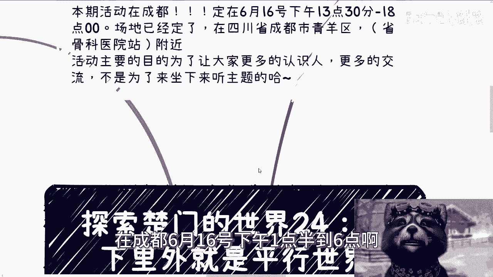
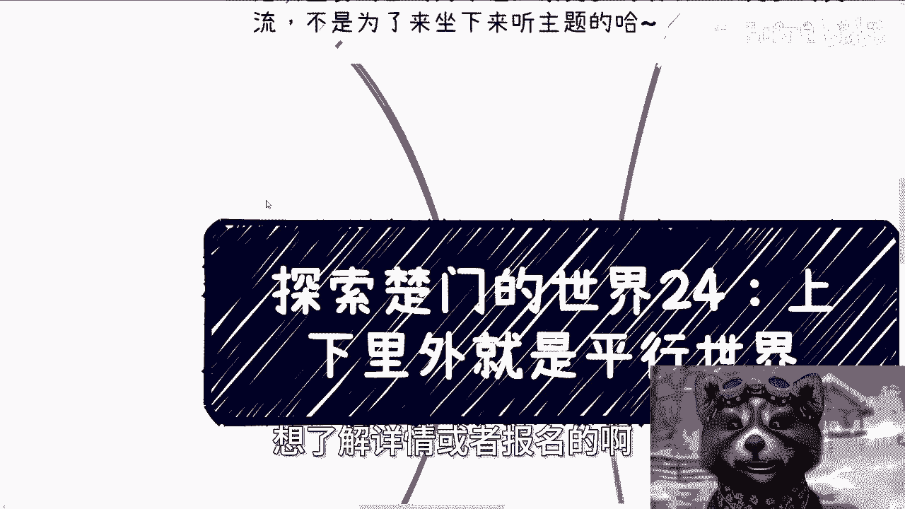
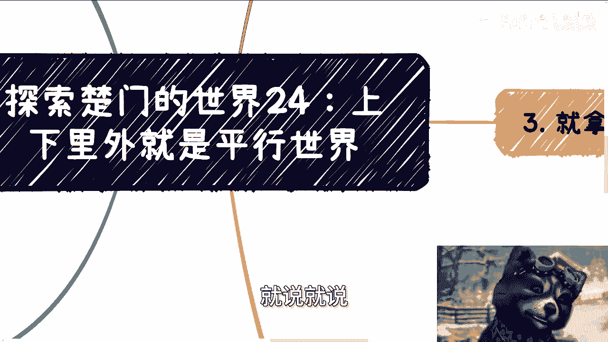
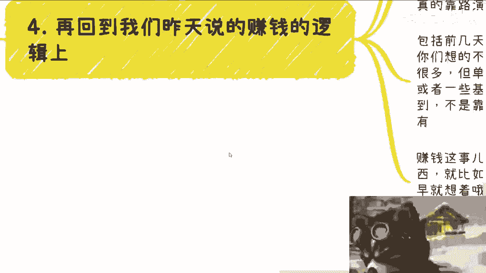
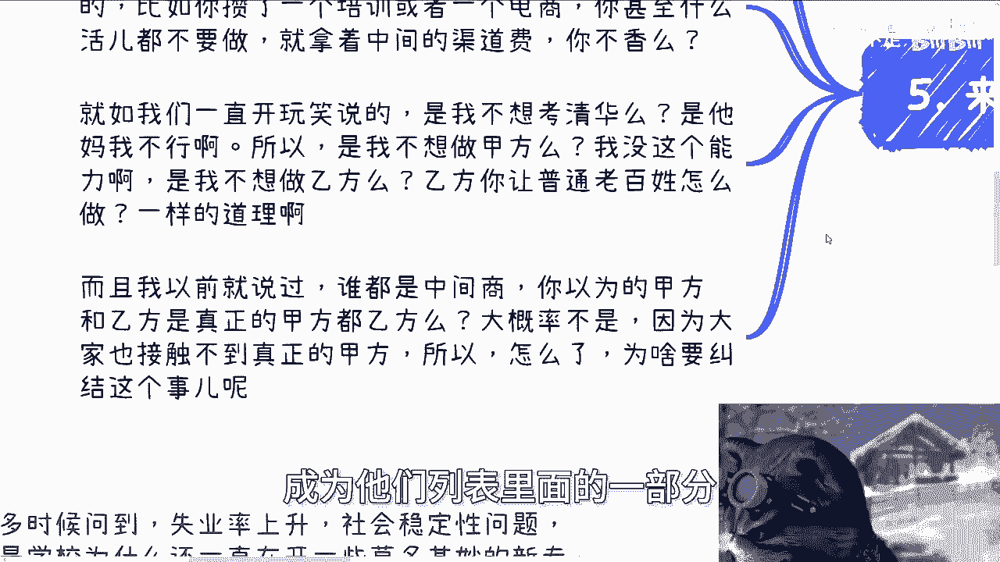
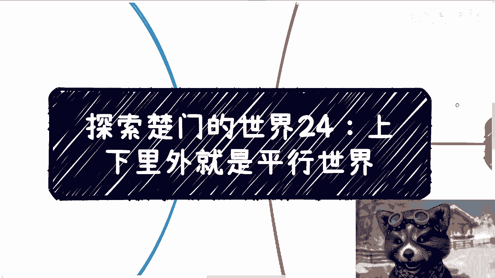
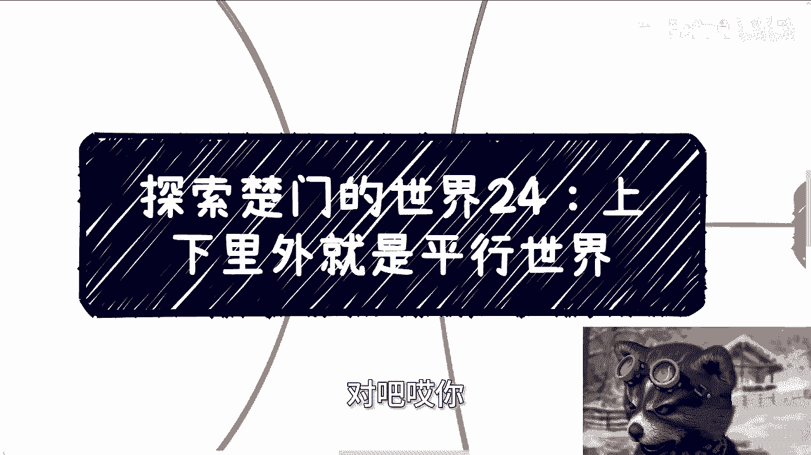
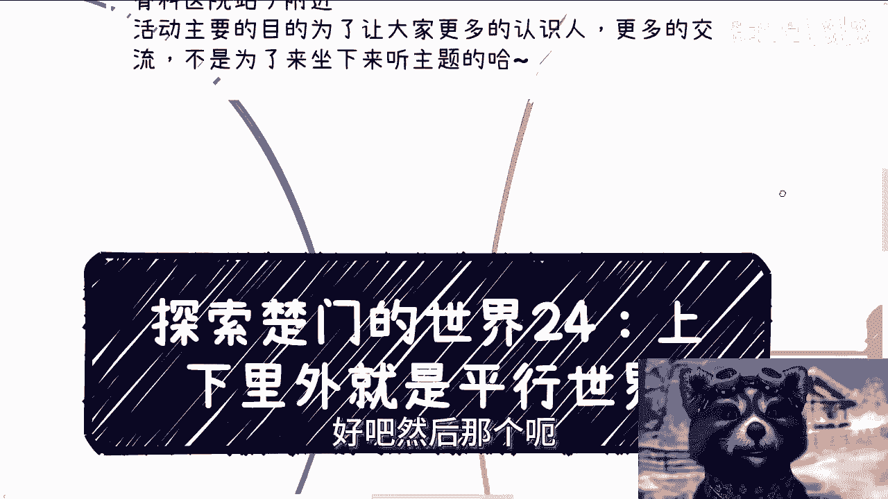
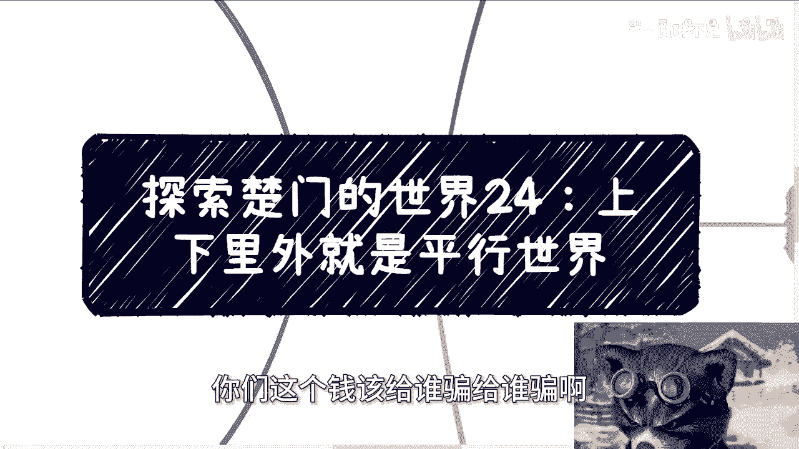

# 探索楚门的世界 24：上下里外都是平行世界 🌐


在本节课中，我们将探讨一个核心概念：我们所处的社会并非单一的现实，而是由无数个基于不同信息、视角和立场的“平行世界”构成的。理解这一点，有助于我们以更辩证、更全面的态度看待社会现象和个人处境，避免陷入非此即彼的“二极管”思维。






---

## 概述：多元视角下的平行世界

我们常常认为，自己看到、听到和感受到的就是世界的全部真相。然而，本节课将揭示一个事实：不同的人、不同的群体，往往生活在基于不同信息源和认知框架的“平行世界”中。这些世界并行不悖，各自有其内在的逻辑和“正确性”。认识到这一点，是理解许多社会矛盾和个人困惑的第一步。

---

## 核心概念解析：信息不对称与平行世界


上一节我们概述了平行世界的概念，本节中我们来深入看看其核心成因：**信息不对称**。这可以用一个简单的公式来描述不同认知的形成：




**个人认知 = 接收到的信息 × 个人背景与立场**

这意味着，即使面对同一件事，不同的人因获取的信息不同、所处的立场不同，会得出截然不同的结论。双方可能都是“对的”，只是他们的“世界”不同。

---

## 平行世界的具体表现

以下是几个生活中常见的“平行世界”现象，它们展示了不同群体间认知的巨大差异。

### 1. 关于社会问题的认知差异
许多人担忧失业率上升和社会稳定问题。然而，这种担忧可能只存在于“世界A”。在“世界B”（例如某些决策层或机构）的认知里，可能并不存在所谓的“稳定性问题”。学校开设看似“莫名其妙”的新专业（如区块链、元宇宙），在学生看来难以理解，但在校方领导的世界里，这或许符合其战略规划或资源分配逻辑。**关键在于，双方基于不同的信息和目标行动。**

### 2. 互联网使用与“大家”的错觉
我们常以为“大家”都在使用小红书、B站、抖音等平台。但这个“大家”很可能只是我们所在的特定群体（如年轻网民）。对于许多身处高校、政府、企业中上层的群体而言，这些可能并非他们获取信息或进行社交的主要渠道。因此，一方觉得另一方“不接地气”，另一方则可能认为对方的抱怨是“幸存者偏差”。**“日常”的定义因世界而异。**

### 3. 体制内与民间的经济感知
普通人可能深感赚钱艰难、消费谨慎。然而，在一些体制内会议或机构的研究中，议题可能是“老百姓有钱但不愿消费”或“如何激发消费潜力”。**双方对经济现状的感受和判断，源于完全不同的信息输入和观察视角。**

### 4. 项目申报与学历的“真相”
许多人认为项目申报靠的是学历、技术和硬实力，目的是为了做出有价值的成果。但在实际的“项目世界”里，关系、转介绍常常是关键。项目中的学历要求、工作量（人日/人天）评估，尤其是软件类项目，往往与实际需求脱节，成为申请经费的“表格工具”或流程的一部分。**项目的核心逻辑可能是“走形式”和“演戏”，而非纯粹的技术攻关。** 例如，一个软件项目的评估可能没有客观标准：
```plaintext
宣称所需人力：300人
实际所需人力：30人
评估依据：项目计划书/关系/历史惯例
```
**最终，谁能质疑这个“300人”的评估呢？**



### 5. 赚钱逻辑的平行认知
*   **世界A（传统路径）**：认为赚钱等于打工、晋升、涨工资。
*   **世界B（现实路径）**：认识到仅靠工资难以积累资产，且长期职业稳定性存疑。真正的融资往往依靠熟人网络而非公开路演。所谓的“创投”，可能成为诱使创业者持续投入甚至背负债务的“入坑金”。**赚钱的本质常在于权衡与舍弃（如放弃稳定的工作去博取机会），而非万事俱备。**

### 6. 中间商角色的再认识
建议普通人从“中间商”角色切入，并非因为这是最优选择，而是因为：
1.  **可行性**：对于缺乏资本、关系和核心技术的普通人，这是最现实的起步点。
2.  **性价比**：作为渠道整合者（如培训、电商），可以不做具体执行而赚取渠道费，风险相对较低。
**商业世界中，几乎所有人都是某种意义上的“中间商”。** 即使是大型互联网公司的供应商白名单中的执行方，也不过是更上一级“中间商”的组成部分。鄙视“中间商”可能源于对真实商业链条的误解。

---




## 总结与启示



本节课我们一起学习了“平行世界”的概念及其在社会各个层面的体现。从社会心态、互联网使用、经济感知，到项目运作、赚钱逻辑和商业角色，无处不在的信息不对称塑造了彼此隔离的认知世界。



理解这一点，并非为了抱怨或消极应对，而是为了：
*   **培养辩证思维**：摆脱“非黑即白”的简单判断，理解同一事件的多重逻辑。
*   **认清自身位置**：明白自己的观点和困境源于所处的“世界”，同时知晓其他“世界”的存在。
*   **寻求有效行动**：在认识到现实复杂性的基础上，更务实地评估机会与风险，例如理解“中间商”角色的实际价值，而非追求不切实际的“完美角色”。



世界的运行规则往往比表面看起来更复杂，我们看到的只是冰山一角。保持开放心态，尝试理解不同视角，是在这个多元“平行世界”中更好前行的开始。



---
**附注**：成都线下活动（6月16日，青羊区）及个人咨询（职业/商业规划、合同股权等）事宜，请通过私信具体沟通。咨询需整理好个人背景与问题，且无法解决极端财务困境或承诺一步登天。