# 探索楚门的世界25：你有没有想过，很多问题为什么解决不了 🧐

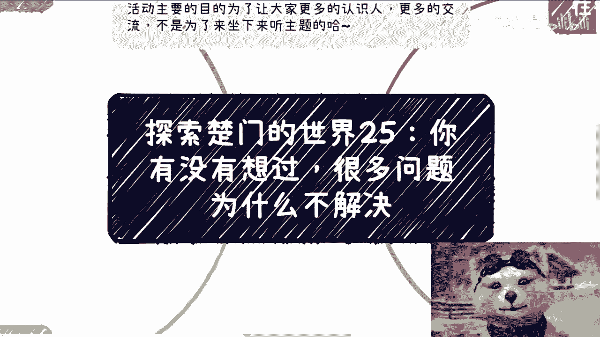

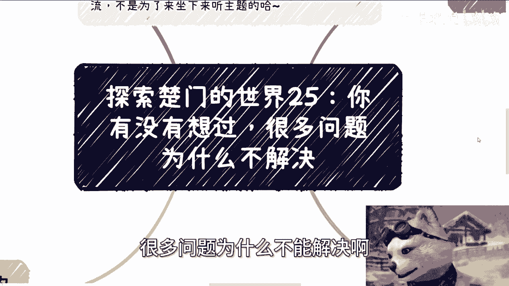

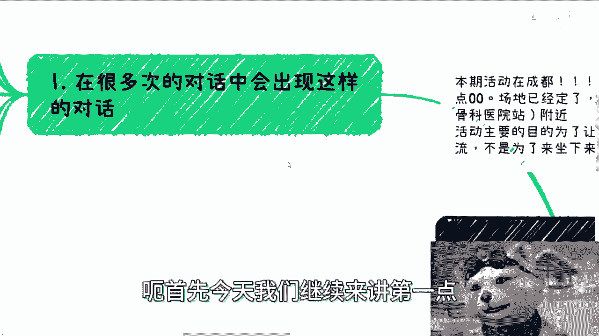

在本节课中，我们将要探讨一个核心问题：为什么社会上许多看似明显的问题，却迟迟得不到解决。我们将分析问题定义的偏差、不同群体的利益视角，并理解“问题”本身在不同立场下的不同含义。

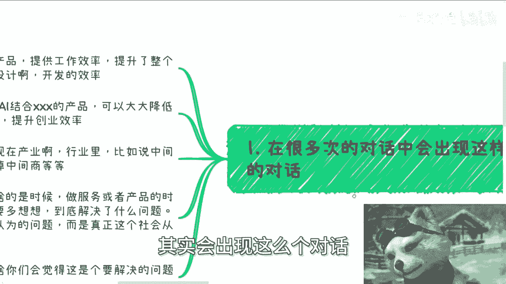

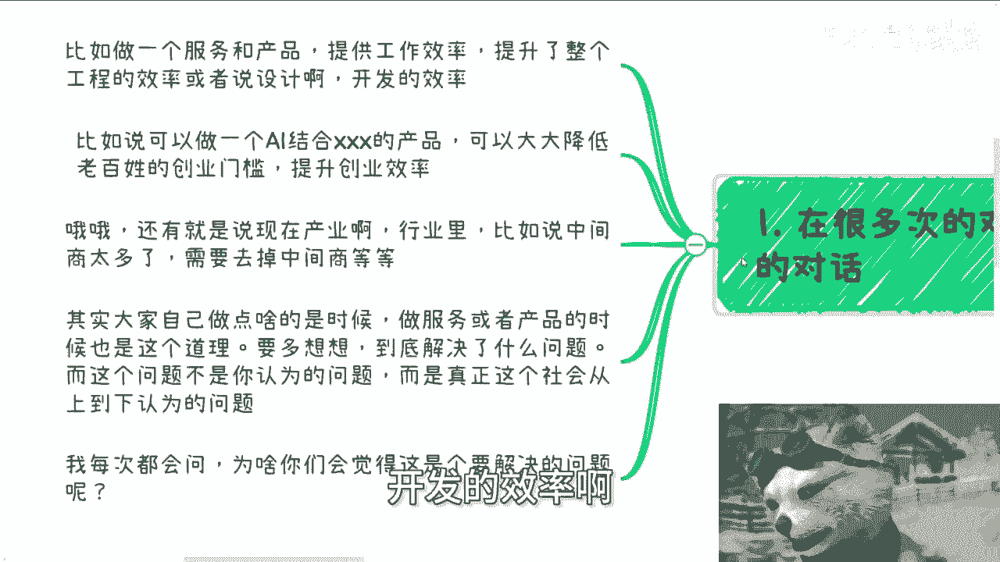

## 问题定义的偏差

上一节我们介绍了课程主题，本节中我们来看看第一个关键点：我们自认为需要解决的问题，可能并非社会真正需要解决的问题。

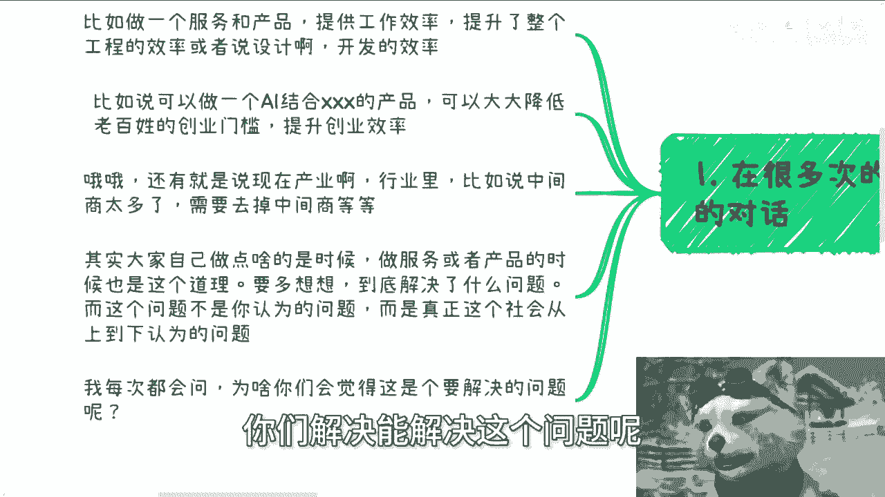

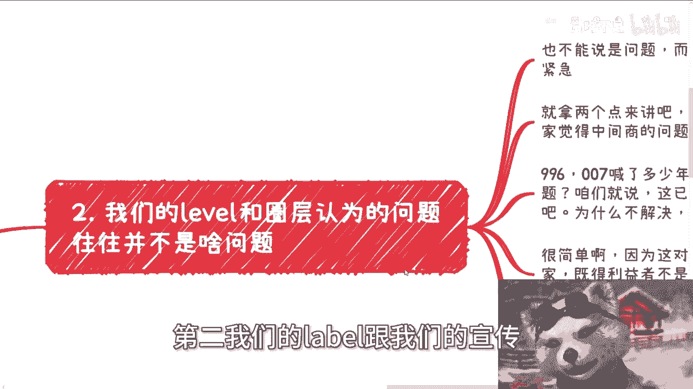

许多对话和商业计划中，常出现这样的表述：某个产品或服务能“提高工作效率”、“降低创业门槛”或“去除中间商”。然而，我们需要思考的是：这究竟解决了谁的问题？

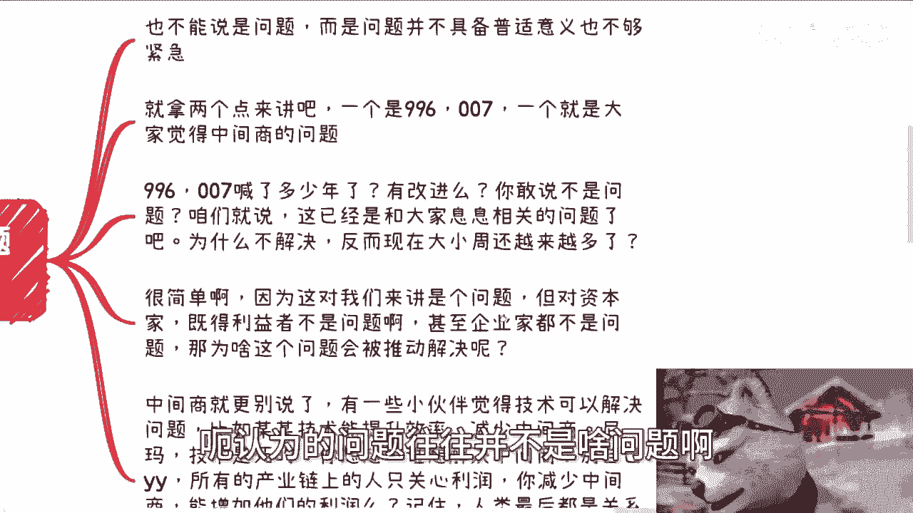

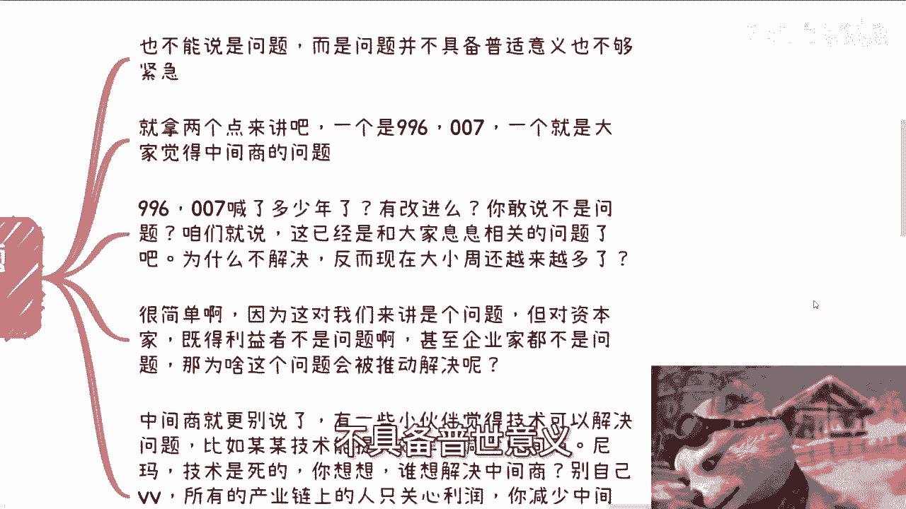

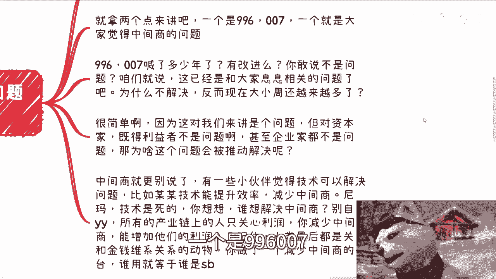

以下是提出质疑的几个角度：
*   这个问题是“你认为的问题”，还是“社会上从上到下公认的问题”？
*   是什么依据让你觉得这是一个“需要被解决的问题”？
*   又是什么让你确信“你的方案能解决这个问题”？

## 圈层局限与问题的普世性

认识到问题定义的偏差后，我们进一步探讨：我们所在圈层认为的问题，往往不具备普世性或紧迫性。

这并非说它们完全不是问题，而是说这些问题可能不够普遍或不够紧急。我们可以通过两个例子来理解。

以下是两个典型例子的分析：
*   **996/007工作制**：这对广大劳动者而言是严峻的问题，但多年来改善有限。原因在于，这对资本方或既得利益者而言并非问题，甚至是有利的。问题的解决需要推动力，而推动力来源于利益相关方的共识。
*   **“去除中间商”**：技术爱好者常认为技术能消除中间环节。但需要思考：整个产业链中，谁真正想“去除”中间商？实际上，各方可能只想“优化”或“管理”中间商，而非彻底消除，因为中间商常常承担着拓展业务、维系关系的功能。产业链的核心关切是**利润**，而非单纯的环节数量。

## 脱离实际的“解决方案”

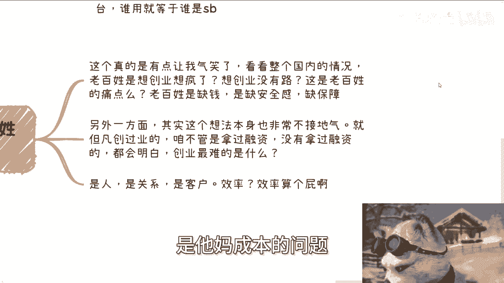

在分析了圈层局限后，我们来看看一些看似合理实则脱离实际的“解决方案”构想。

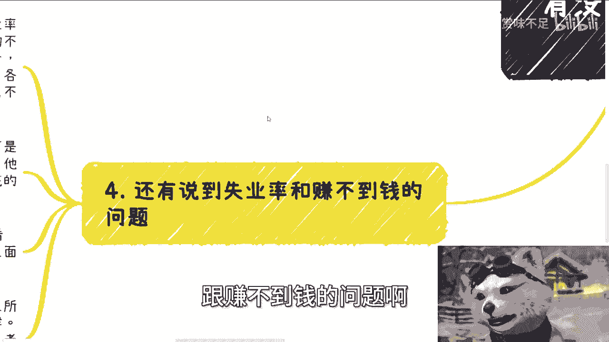

以“降低老百姓创业门槛”为例。这个构想可能源于对“痛点”的错误判断。当前老百姓的核心痛点可能是**缺乏资金、安全感和保障**，而非缺乏创业途径。创业真正的难点在于**人才、关系、客户和成本控制**，而非简单的流程效率。

## 视角差异与问题的本质

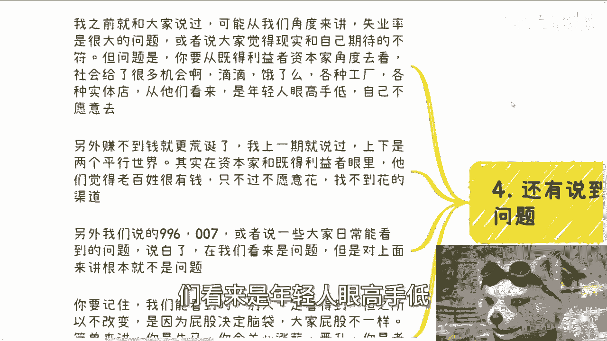

最后，我们来总结不同视角如何根本性地影响对问题的认知。

关于“失业率”和“赚不到钱”的问题：
*   从劳动者角度看，这是严峻的社会问题。
*   但从某些既得利益者角度看，这可能不被视为问题，或被认为是“年轻人眼高手低”、“不愿从事基础工作”的结果。
*   甚至在某些视角下，会认为“老百姓有钱但不愿消费”。

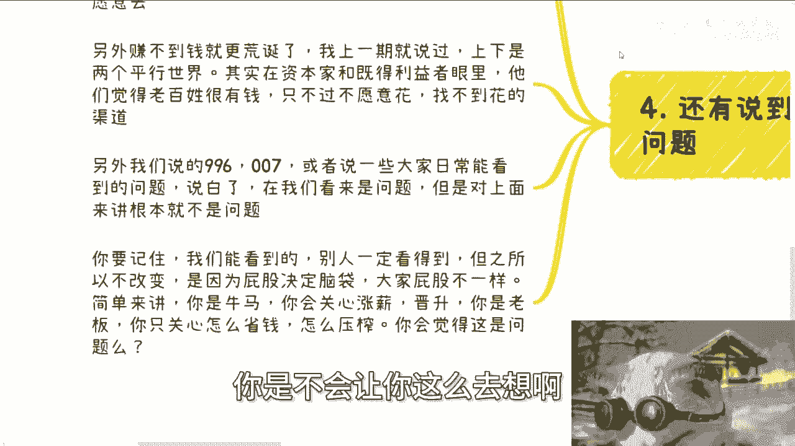

关键在于：**立场决定观点**。你能看到的问题，别人也一定能看到。之所以不改变，是因为不同群体的利益诉求不同。例如，员工关心加薪晋升，而老板可能更关心如何控制成本。

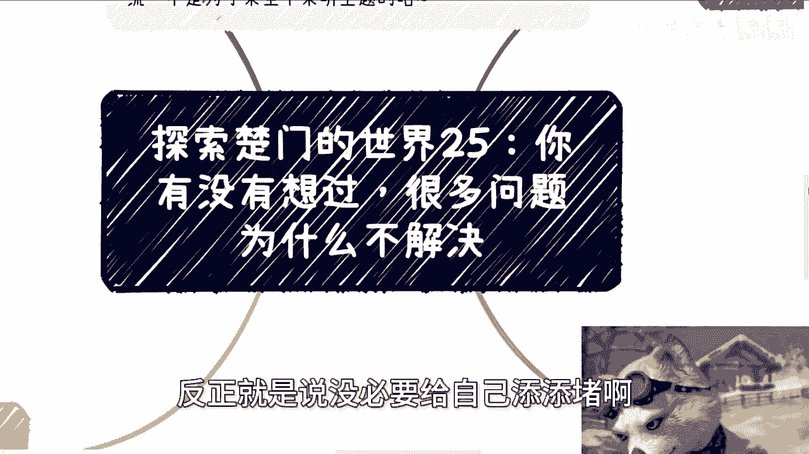

世界上有许多可以改进的问题，也有许多现成的解决方案。但并非所有值得解决的问题都会被解决，也并非所有好的方案都会被采纳。理解这一点，有助于我们更理性地看待社会现象，避免将个人资源和精力投入到基于错误前提的努力中。

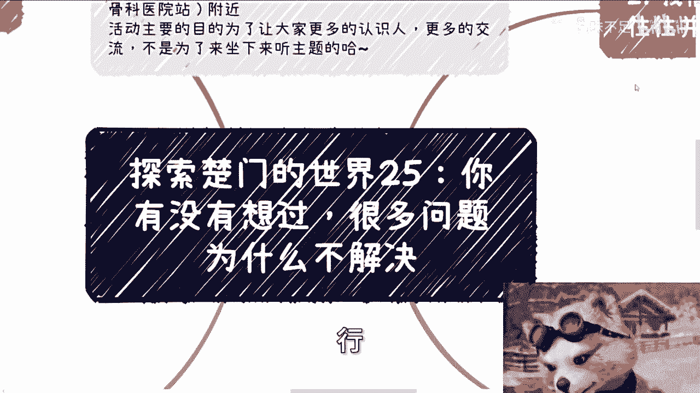

本节课中我们一起学习了如何审视一个“问题”是否真正成立。我们认识到，问题的定义深受个人圈层和立场的影响，许多我们认为亟待解决的“问题”，在更大的系统或不同的利益方看来可能并非优先事项。理解这种差异，是进行有效商业思考和社会分析的第一步。