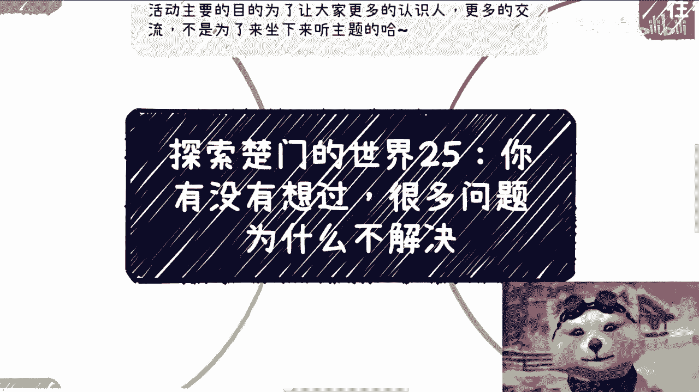
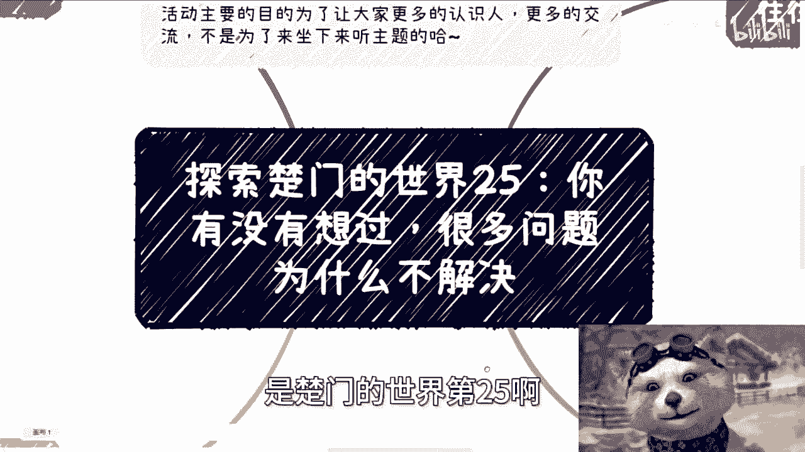
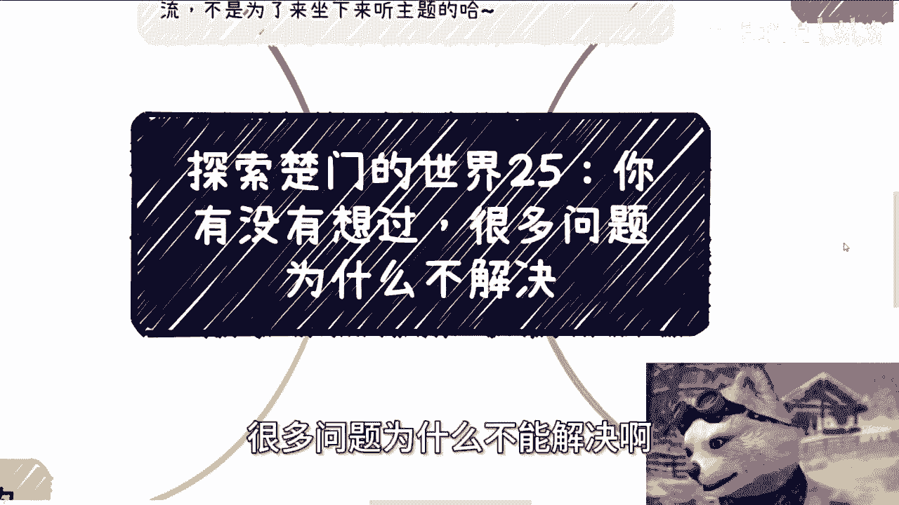
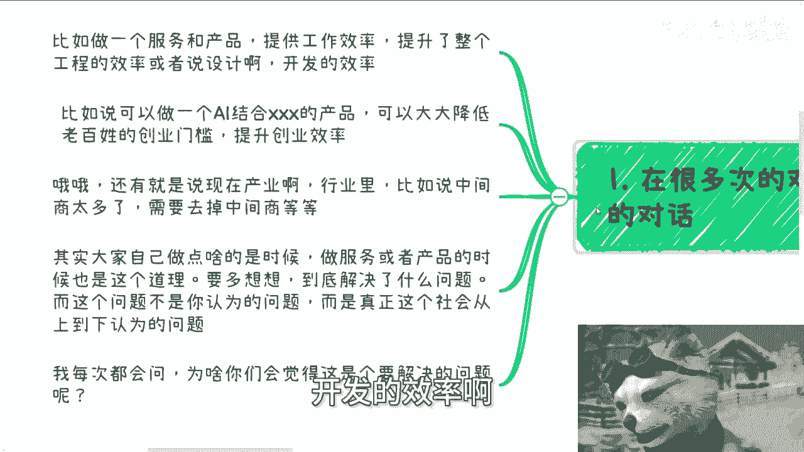
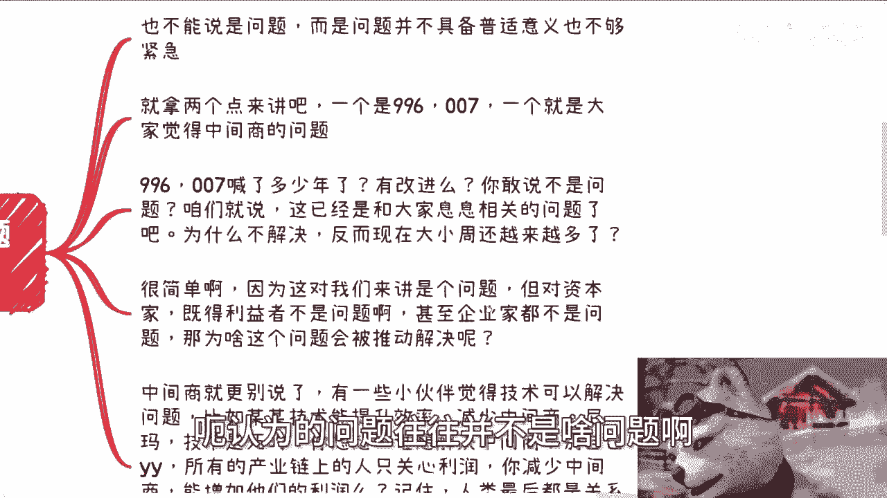
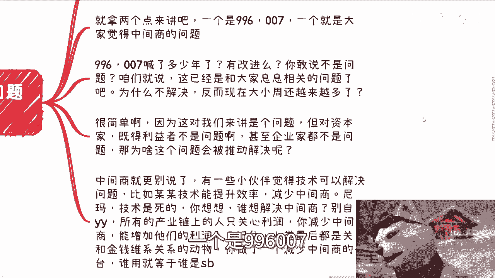
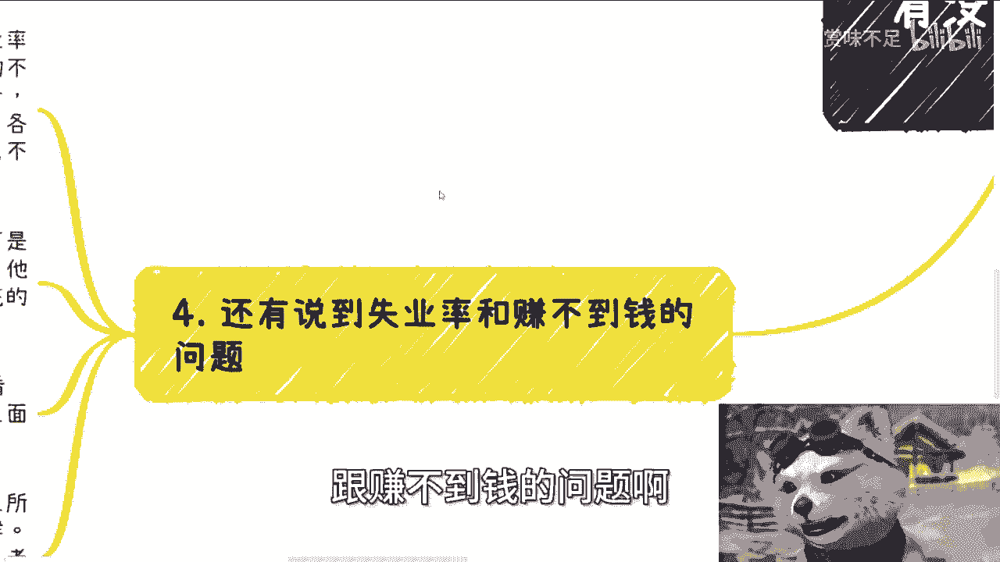
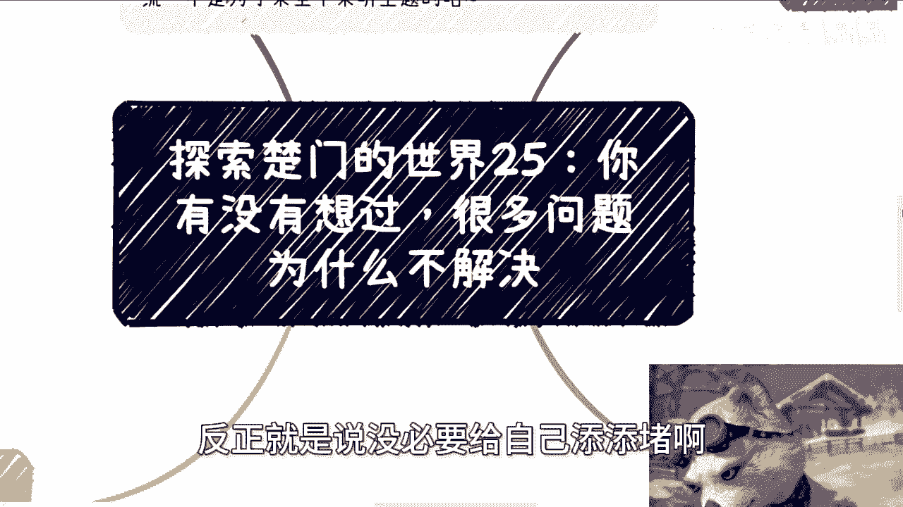

# 探索楚门的世界25：你有没有想过，很多问题为什么解决不了 - P1 - 赏味不足 - BV1Zz421b7FB

好大家好，今天我们来讲的呢是楚门的世界第25啊。

我从来没想过这个系列他妈能讲到25啊，我也我针对我也觉得我自己很牛逼啊，今天我这个主题呢叫做你有没有想过啊，很多问题为什么不能解决啊，是不能解决还是不解决啊。

首先啊这个成都活动这个报名的继续报啊，6月16号好吧，下午01：30到六点，然后这个在青羊区啊，省骨科医院附近好吧，然后要了解或者报名的私信我啊，呃首先今天我们继续来讲第一点。

很多次的对话当中其实会出现这么个对话。

就是比如说啊一个服务和一个产品啊，提提高了啊，提提高了，我写错了啊，呃提高了工作效率啊，提升了整个工程的效率，或者说设计啊开发的效率啊。

比如说呢做一个AI啊，结合什么什么的一个产品，可以大大降低老百姓的创业门槛啊，提高提升这个创业效率啊，还有呢就是说现在产业行业里面，比如说什么中间商太多了啊，需要出去掉中间商等等等啊。

其实大家自己做点啥的时候呢，就是做服务或者做产品的时候呢，也是这个道理，什么意思啊，就是要多想想到底解决了什么问题，而这个问题不是你认为的问题，而是真正这个社会上从上到下认为的问题，你解决了什么啊。

那么我每次其实都会问，就跟对方聊的时候，我其实都会问，我说，我说你们为什么就会觉得，这是一个就或者说是什么样的事情，让你们觉得这就是一个需要解决的问题呢，或者说又是怎么样的一个错觉。

让你们觉得你们解决能解决这个问题呢。

对吧嗯仔细想想看啊，第二我们的label跟我们的圈层啊。

认为的问题往往并不是啥问题啊。

当然你要硬要说呢，也不能说不是问题，而是说这些问题呢不具备普世意义。

也也不够紧急啊，就拿两两点来讲，一个是996007，一个就是大家觉得中间商的问题啊。

我们就这么说啊，996007喊了多少年，有改进吗，有改进吗，对吧，你敢说996007不是问题吗，啊咱就这么说啊，这已经是最跟年轻人大众息息相关的问题了，那为什么不解决。

反而现在大小周就是那种什么默认六天，甚至还有默认七七天没有啊，默认六天的，然后什么什么什么什么什么呃，早上十点上到晚上11点的这种越来越多，为什么，很简单，因为这对我们来讲是问题。

但对资本家或者基德来既得利益者来讲，它不是问题，甚至对企业家来企业家来讲都不是问题，那我就问了，那为什么这个问题会被推动解决呢，你想想看对吧，你你再就是举一反三，一想再去想想看别的很多问题。

你们你们想到的问题就是你们觉得是问题，但是这些问题在上面看来是吗。

对不对啊，中间上勾就更别说了，有些小伙伴很牛逼啊，觉得技术可以解决一切啊，比如说什么某某某技术能提升效率，减少中间商，尼玛我就想说技术是死的大哥啊，你想想看谁想解决中间商，你有没有想过整个产业链。

整个供应链从上到下，谁想解决中间商啊，啊你要明白一点啊，解决中间商或者不要中间商，这句话对不对对，但这句话的背后是什么意思，你知道吗，是去解决那些没有关系，乱捣乱的中间商，不是不要中间商，你能明白吗。

啊你不要误以为就是说哎呀好像我们很牛逼，我们能通过一个什么产业东西对吧，一个平台能把中间商干死，你妈也是搞笑的啊，你你你我跟你讲，你这不是在干中间商，你这是在干整个产业链啊，你别自己YY啊，我跟你讲啊。

所有产业链上的人只关心什么，只关心利润，你减少中间商，你能增加他们的利润吗，能吗，你仔细想想看，就是呵呵呵，就有一种很搞笑的想法，就是你减少中间商，不就是个中间商吗，对吧，你能减少。

你能增加他们的利润吗，不能啊，中间商存在就是为了增加他们整个利润的啊，否则哪来这么多单子，哪来这么多业务啊，记住啊，人类最后到最后就是关系，跟金钱来维系关系的这么一个动物，你做了一个减少中间商平台。

我跟你讲啊，整个产业链整个从上到下。

整个生态都知道谁用谁，真的就就我说的不好听点，你单纯有这种id，你就是个啊，第三包括之前还有人说，就是我们刚刚说的，就说降低老百姓这个创业门槛，和增加创业效率的。

真的我跟你讲这个当时聊的时候把我气笑了啊，就是你看看整个国内情况，老百姓是想创业，想疯了吗，还是想创业没有路去创业，这是老百姓的痛点吗，老百姓他妈的饭都吃不起了啊，老百姓是缺钱，缺安全感，缺保障。

这个是老百姓的痛点，对吧，你说我出了个平台，能让老百姓降低老百姓的这个创业的门槛，我把我气笑了，怎么滴啊，卧槽老百姓是他妈的想穿又想疯了啊，另外一方面啊，其实这个想法本身也非常不接地气，就但凡创过业的。

我就这么说啊，咱不管拿过融资还是没有拿过融资，都会明白创业最难的是什么，创业最难的是人，是察言观色，是关系，是客户啊，是他妈成本的问题。

是效率的问题吗，哈哎呦，真的把我气笑了，真的是啊。

然后第四啊，就还是说到那个失业率跟赚不到钱的问题啊。

首先我之前就跟大家讲过，你可能从我们的角度来讲，失业率是很大的问题，很多人跟我提过这个说东西，说哎这个可能导致有些不稳定因素对吧，怎么样子啊，我就这么说啊，你认为是问题，以及你认为是不稳定因素没问题。

但是你要从既得利益者，跟资本家的角度来讲两点，第一他们并不认为这是个问题，第二他也不认为这是一个会影响稳定性的问题，为什么参考疫情啊，别的我就不能多说了，你们自己去想对吧啊，然后呢社会同样的在他们看来。

社会给了很多机会，滴滴啊，饿了么，各种工厂啊，摆摊啊对吧，包括那个前两前两去年的时候，不是不是那个媒体上还大肆宣传吗，叫什么对吧，各种实体店在他们看来是年轻人眼高手低。

不是没有机会，是自己不愿意去，你明白吗啊，首先这是第一点啊，另外赚不到钱，我跟你讲就更荒诞了，我上一期其实说过，上下是两个平行世界，我告诉你们，其实在资本家跟基德基基的利益者眼里，他们觉得老百姓很有钱。

只不过不愿意花，找不到花的渠道，你明白吗，当然你可能不明白，但是我现在告诉你，他们是这么觉得的啊，另外我们说的990007，或者一些大家日常能看到的问题，说白了还是那句话，在我们看来是问题。

在整个链条上它就不是问题啊，当然还有些更细节的，更深入的东西，我就不敢讲了，那讲了，你举报我是没问题，你你举报这个视频就很麻烦对吧，你要记住啊，我们能看到的别人一定看得到，你们所觉得是问题的。

别人也一定都知道，但之所以不改变，只不过你们的屁股跟别人的屁股不一样，简单来讲，你是牛马，你会关心掌心晋升，但如果你是老板，你只会关心怎么省钱，怎么压榨，你会觉得涨薪晋升是问题吗，你不会的呀。

因为你屁股不决定你是不会让你这么去想啊。

懂吗啊就是你们一定要明白一点啊，就是这个社会，这个地球上有太多的问题是值得解决的，但是或者说有太多太多问题，是是是能够去改进的，而且方法我相信你也好，我也好，大家都想得出来。

但是不是这些东西想得出来就会去改进的啊，所以说就是说你一定要明白这个道理，以及在明白这个道理的基础之上，你不要花额外的精力跟额外的这种尤，尤其是自己掏钱往这里面去投，没有意义的啊，没有意义的好吗。

就是唉先这么着吧啊，反正就是说没必要给自己添添堵啊。

好吧然后那个成都活动好吧，继续报名，然后剩下的话就是商业规划，职业规划额，股权期权分认分红啊，合同商业计划书白皮书嗯，包括你们手上有什么牌，你们没有什么牌的，你们想通过跟我的沟通来呃。

讨论出一些能够更贴近于当下社会发展的，一些道路或者一些建议的话，那么你们可以整理好个人的问题，我们再来做咨询啊，那如果来说，你们想通过单纯的通过这个咨询说啊，我想这个产生质变啊，我想暴富。

我想怎么样子好，你们就别来找我啊。

