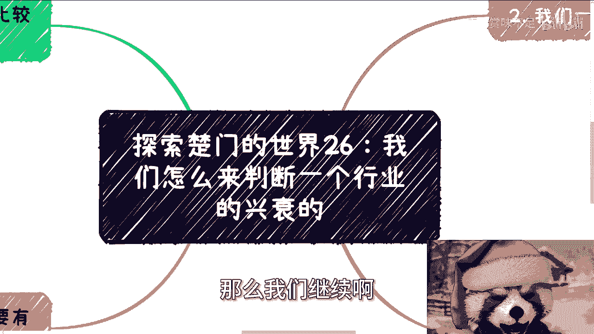
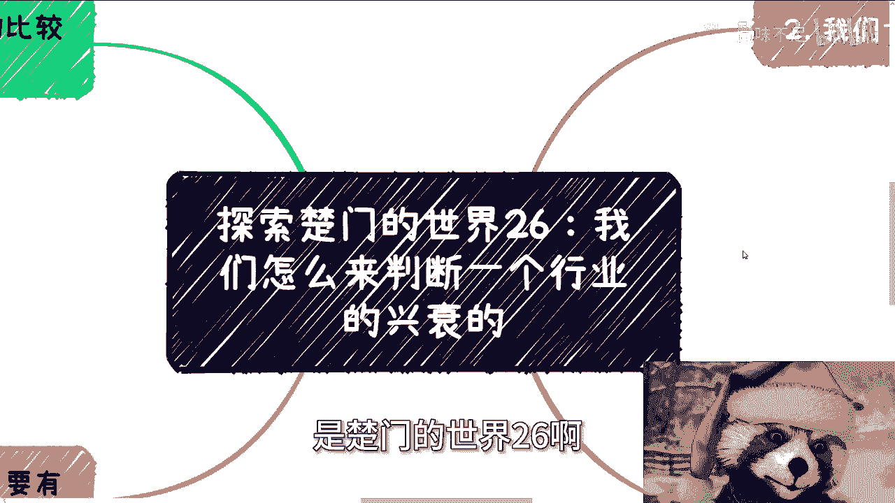
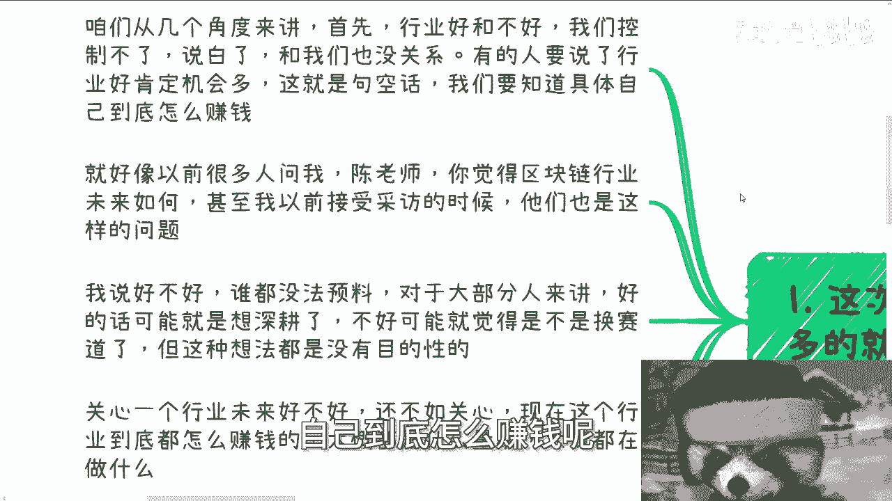
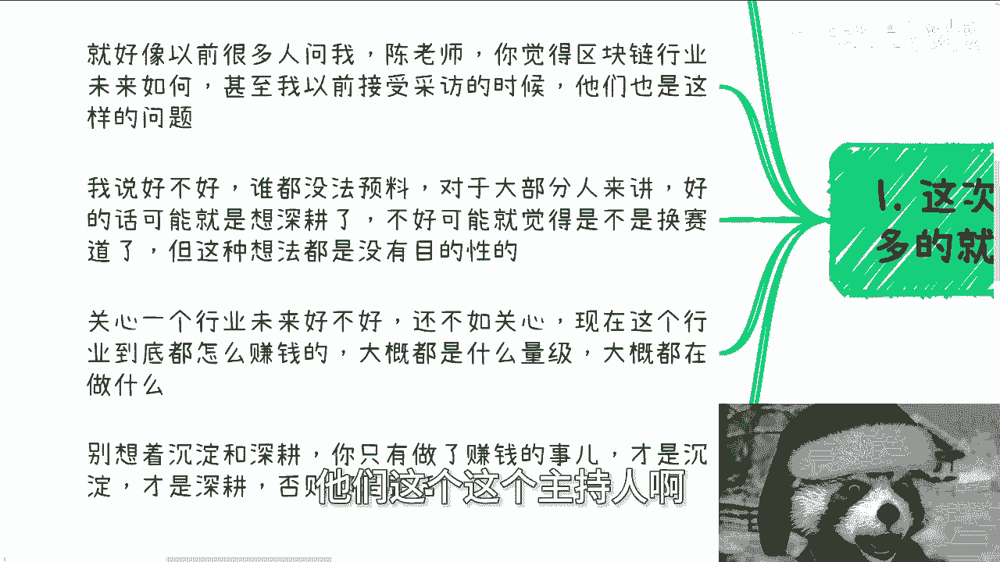
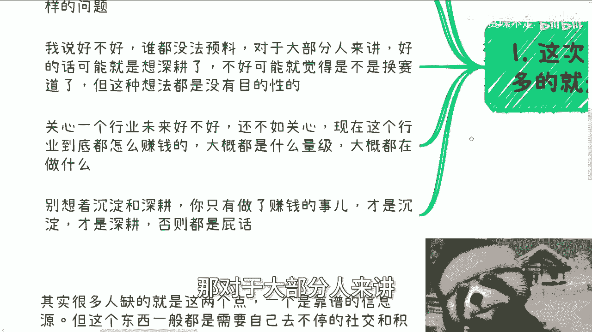
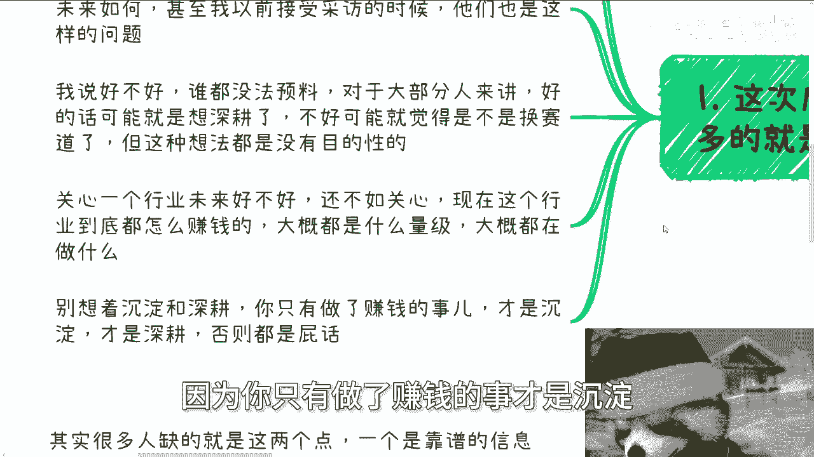
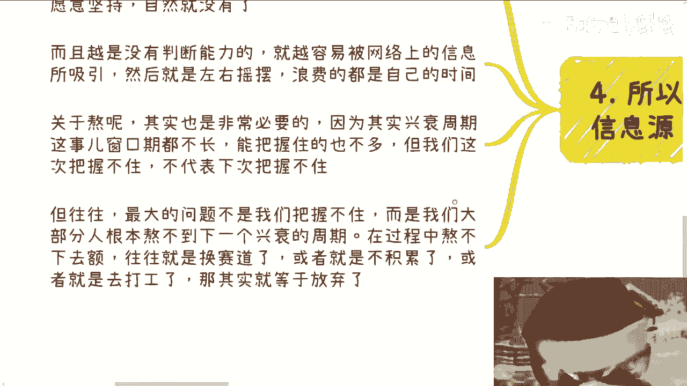

# 探索楚门的世界26：如何判断行业的兴衰周期 📈

在本节课中，我们将学习如何判断一个行业的兴衰周期。我们将探讨哪些因素真正影响一个行业的赚钱窗口，并分析为什么关注行业“好坏”本身可能是一个误区。课程的核心在于理解行业周期的本质，并掌握获取关键信息的方法。

## 行业“好坏”与我们无关

上一节我们介绍了课程主题，本节中我们来看看为什么单纯关注行业“好坏”意义不大。

行业的好坏是我们无法控制的，因此它与我们个人的赚钱路径关系不大。有人认为“行业好，机会就多”，但这是一种空洞的说法。关键在于，即使机会多，如果你不知道如何具体赚钱，这些机会也与你无关。例如，你只是在行业内打工，那么所谓的“机会多”对你而言并无实际意义。

因此，与其关心一个行业未来是否“好”，不如关心它现在是如何赚钱的。你需要了解其盈利模式、市场规模和主要参与者。所谓的“沉淀”和“深耕”，只有与赚钱的实际行动结合才有意义。不赚钱的“沉淀”都是空谈。

## 判断行业兴衰的两个核心指标

理解了关注点的误区后，我们来看看判断行业兴衰周期的两个核心指标。

以下是判断行业兴衰周期的两个关键观察点：

1.  **政策与领导关注的方向**：关注政府、行业协会、商会、高校及企业内部关键人物的态度和动向。这需要积累体制内关系，并保持定期沟通（例如每季度一次），以了解政策风向。
2.  **补贴与资本的投入意愿**：观察各地方政府补贴和风险资本是否愿意向该领域投入资金。补贴和资本是市场最敏感的晴雨表。一旦补贴和资本停止投入，该行业在国内的赚钱前景通常就结束了。

**核心逻辑公式**：
`行业赚钱窗口期 ≈ 政策扶持 + 资本投入`

当这两个条件同时具备时，行业往往处于赚钱的上升周期；当它们减弱或消失时，赚钱周期便走向衰落。

## 需要警惕的信息来源

明确了该看什么之后，我们同样需要知道应该忽略哪些噪音。

最不值得参考的信息来源是网络信息和大众媒体。原因有三点：

*   首先，网络和媒体信息的发布往往带有商业目的或KPI考核导向，并非客观事实。
*   其次，发布这些信息的人（如媒体从业者、网络博主）本质上属于传媒行业，他们对所谈论的行业（如AI、元宇宙）通常并不真正了解。
*   最后，这里讨论的“兴衰”特指**赚钱周期的兴衰**，而非技术的生命周期。一个技术可能生命周期很长，但其赚钱的黄金窗口期往往非常短暂。

例如，AI技术虽然当前（以2024年为例）在媒体上热度很高，但其最容易赚钱的周期可能已经过去（如前年至去年）。这与当年阿尔法狗（AlphaGo）带来的热潮相似。

## 理解生命周期与赚钱窗口

为了更清晰地行动，我们必须区分行业的生命周期和赚钱窗口期。

一个行业的生命周期可能很长，例如自媒体从微信公众号兴起至今已超过十年。但其中赚钱的“兴衰周期”往往只是几个短暂的窗口。这些窗口的出现，无一例外都伴随着我们之前提到的政策扶持和资本投入。

国内市场的规律很简单：**没有持续的扶持与投入，就没有持续的赚钱窗口**。一个技术（如AI）在其漫长的生命周期中，可能会因不同突破点（如阿尔法狗、ChatGPT）而出现多个赚钱窗口，但每个窗口都遵循上述规律。

## 给个人的核心建议

分析了外部规律后，本节我们将聚焦于个人该如何应对。

对于个人而言，要想把握行业周期，核心在于两点：

1.  **拥有可靠的信息源**：这需要通过持续的社会交往和积累来获得，不能依赖网络上的二手信息。缺乏可靠信息源，就容易受到干扰，左右摇摆，浪费自己的时间。
2.  **具备“熬”的能力**：赚钱的窗口期不长，能抓住的人不多。更关键的问题是，大部分人**熬不到**下一个兴衰周期。在等待下一个窗口的过程中，可能会因为自我怀疑、资金压力等原因而放弃积累、更换赛道或选择打工，从而错失未来的机会。

当前很多人仍在追逐某些看似火热的方向（如AI、新能源车），主要是因为信息滞后和受媒体影响。一方面担心试错成本高，另一方面却在做无用功，这是一种常见的循环。

---

本节课中我们一起学习了如何判断行业的兴衰周期。我们认识到，应关注行业的**具体盈利现状**而非空泛的“好坏”；判断周期需紧盯**政策风向**和**资本投入**这两个核心指标；同时要警惕网络媒体的噪音，分清**技术生命周期**与**赚钱窗口期**的区别。最后，对于个人而言，建立**可靠信息源**和培养**长期坚持**的能力至关重要。记住，在国内市场，赚钱的机会总是与政策和资本的流向紧密相关。