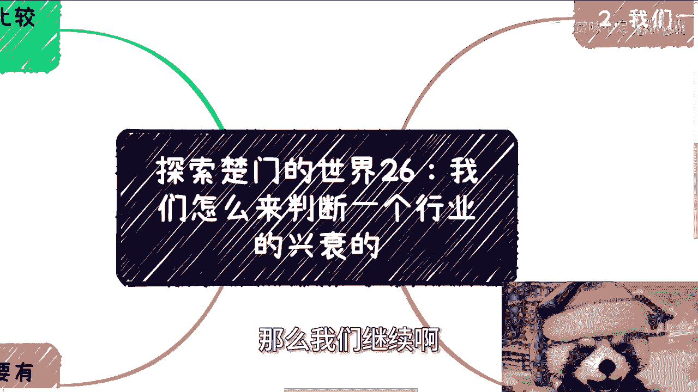
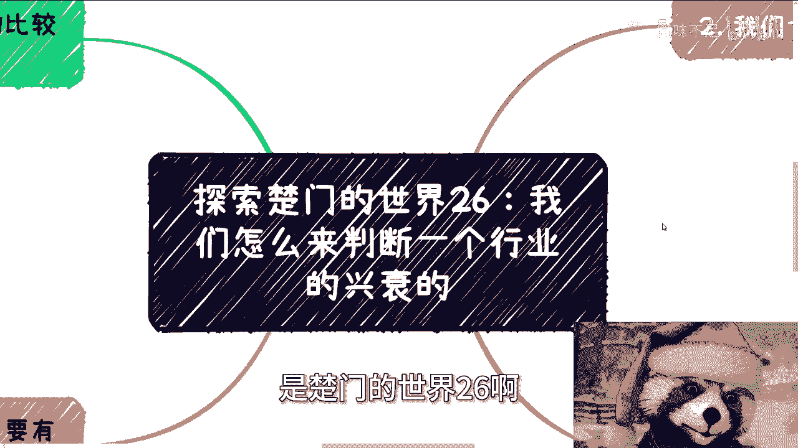
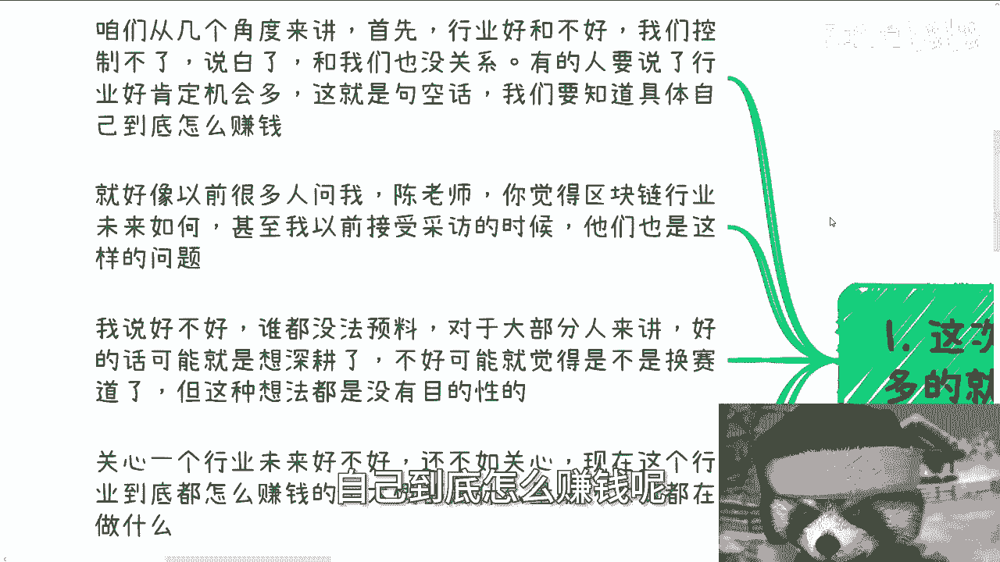
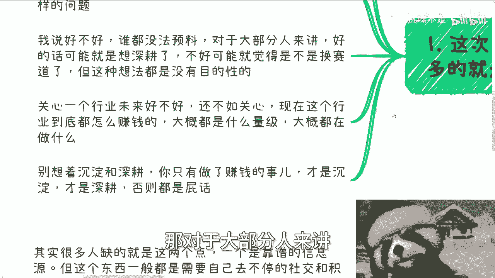
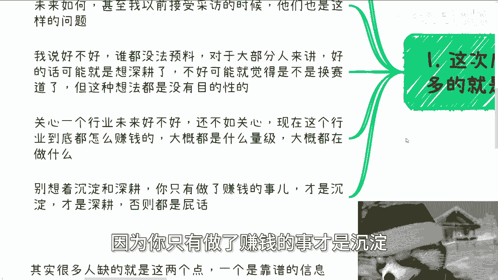
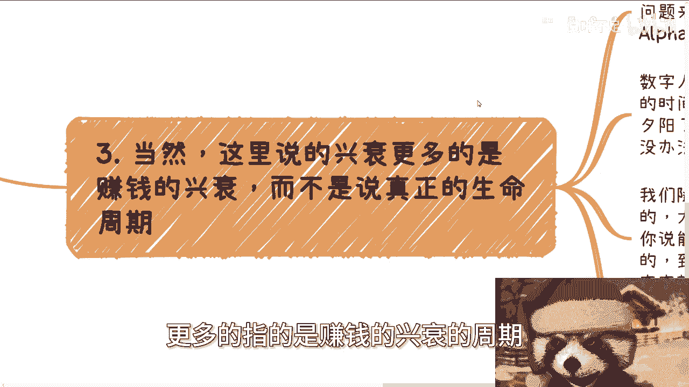

# 探索楚门的世界26：我们怎么来判断一个行业的兴衰周期 - P1 - 赏味不足 - BV1wS421o7eT

嗯好啊，大家好啊，那么我们继续啊。

今天来讲的这个充电的主题呢是楚门的世界。

26啊，就我们怎么来探索哦，我们怎么来判断一个行业的兴衰的额，这次成都活动呢，其实线下问这个问题的也蛮多，当然他们问的不是一个行业的兴衰，他们问的是一个具体行业的兴衰额，咱们从几个角度来讲。

首先行业好和不好，我们是控制不了的，那说白了也就跟我们没什么关系，有的人要说了，那行业好，那肯定机会多，这他妈就是句屁话啊，这个东西我可以把它放到那个空花艺术里面，对吧，那这么就就是句屁话啊。

我们要知道具体具体自己到底怎么赚钱呢。

那你可能机会多，也不知道自己怎么赚钱，你就在里面打工，你跟我说机会多，你多多个多个逮，对不对啊，那么就好像以前很多人问我，他说陈老师，你觉得区块链行业未来怎么样啊，甚至我以前接受采访的时候啊。

他们这个这个主持人啊也问过这样的问题。

我说好和不好呢，谁都没法预料，那对于大部分人来讲。

好的话呢可能就是想生根啊，我也理解，那不好的话呢，可能就觉得就是说是不是换个赛道啊，但这种想法呢，但我跟你讲啊，不管是你觉得好也好不好也好，这种想法其实都是没有目的性的，因为你想想看啊。

你说你今天好去深耕了，那我就再问你，你深耕了之后干嘛呢，你也不知道对吧，那同样的就是我跟你讲不好，那么你就去换赛道，那你是不是草率了一点啊，那么关心一个行业未来好不好，还不如关心什么呢。

还不如关心现在这个行业到底怎么赚钱呢，啊大概什么量级，大概都在做什么啊，你别想着他妈沉淀跟生根啊，你你你我跟你这么说，沉淀跟生根也是屁话，因为你只有做了赚钱的事才是沉淀。

才是生根，你只要不赚钱都是屁话，能明白吗啊然后我们继续来讲啊。

我们一般呢怎么判断的啊，两个点，一个呢来自于政策领导关心的方向啊，呃真正的这个政府企业内部关系的方向，另外一个呢就是看补贴跟资本啊。

是否愿意出钱啊，进行投入，呃就这两个点我跟你讲很明确的，第一个的意思就是说，要去要多去积累体制内的关系啊，包括协会，包括商会，包括协会，包括企业，包括高校里的关系，至少至少至少啊。

我觉得一个季度到两个季度一沟通啊，多了解他们对于这些方呃方向的这个态度，当然他们没有态度无所谓，你要多了解他们这个领导的态度啊，那么第二个就看补贴跟资本，那么各地方的补贴跟资本呢。

对于这种方呃这些方向的态度呢是很重要的，往往补贴跟资本是最敏感的，一旦补贴跟资本停了，这个行业本质是没有未来的，当然啊这个我说的是国内情况啊。

我海外肯定不按照这个规则走啊，那么最不要看的呢，就是我说的这个网络信息跟媒体信息，因为一来呢，网络信息的发布额跟媒体信息发布呃，背后都是有商业目的存在的啊，媒体呢可能商业目的没那么强。

但是更多的是KPI导向啊，那么二来呢这两者从本质上啊，我我我不是看不起他们啊，但是我实事求是来讲，无论是网络上的这些人还是媒体的这些人，从本质上来讲，他们什么都不懂对吧，你说去现在讲AI。

以前讲元宇宙，他们懂吗，懂个懂个屁呀，哎呦你妈也搞笑嘞，真的是说咱们从本质上来讲，就是比如说我在元宇宙里面对吧，那我是元宇宙这行业的。

那么他们算什么，他们他妈就是媒体行业对吧啊，那么三当然啊，这里说的兴衰更多的指的是赚钱的兴衰的周期。

而不是说真正的生命周期啊，你你你你你就拿AI来讲，AI现在到当下呃，比如说2024年6月份呃，AI还是媒体啊，网络上啊满天飞，但问题来了，真正赚钱的周期已经过了啊，这就是和当年阿尔法go那一波是一样的。

没有什么区别的啊，那么数字人也好，AI也罢，能赚钱的呢，基本上就是前年到去年，甚至是大前年开始。

这么一个呃这么一个时间时间段啊，包括抖音啊，电商啊，其实也都是夕阳中的夕阳了啊，因为呃但是呢就是也我也可以理解啊，就很多人其实不在行业内啊，隔行如隔山啊，但是呢我觉得有些问题你们也不用问啊。

也不用去思考，为什么，因为已经非常明显，放在这个这个这个面上的问题了啊，你比如说我们随便举几个例子，你比如说你问我啊，自媒体能不能做，我就想说大哥，你想啊自媒体什么时候开始的。

从公众号微信公众号那一刻开始，到现在多少年了，10年有了吧，10年都不止对吧，那你说能不能做呢啊10年已经我咱说不好听的，10年已经多少的钱流动掉了多少的钱，赚到了多少的人进去了，你说能不能做对吧。

你比如说包括直播带货，跨境电商也是一样的，到现在多少年了，创造了多少财富了对吧，你简单查查就知道了，这有啥可问的呢，啊，那其实本质上就是说一个行业，生命周期可能很长啊，可能很长。

但是不管这个行业的生命周期多长，但是赚钱的兴衰周期就是那么一个窗口，甚至可能比如说在他的生命周期里面，有多个窗口，就比如说阿尔法go当年有一个窗口，现在那个chat gbt出来又是一个窗口，对吧啊。

那么但是不管哪个窗口，都离不开我们说的政策的扶持跟资本的投入，他一旦没有整个赚钱的兴衰周期就没了。

就这么简单，国内就这么简单哦，所以其实核心对于所有人来讲，包括我包括其他人啊，核心就两点。

一要有可靠的信息源，二就是要能偶啊，就是其实很多人缺的也就这两点，一个呢靠谱的信息源，但这个东西呢，一般都是需要自己不停的去社交跟积累，才会有的啊，富二代除除外啊，但很多人呢其实就是懒。

而且呢他也觉得就是好像呃就就20多，所以就自暴自弃，就觉得哎呀我积累不出来对吧，你也别跟我讲这些我不知道的啊，我也没有，那自然他他妈这辈子也不会有啊，那么而且呢越没有判断能力呢。

也越容易被网上的信息所吸引啊，然后呢就左右摇摆，但是你要明白一点，左右摇摆呢其实也浪费都是自己的时间，那么第三啊就关于熬，其实呢熬是非常必要的，因为你要这么想，不管哪个行业，它的兴衰周期呃。

赚钱的这个事窗口都不会太长，能把握住的也不多啊，但是我相信聪明的人总会想明白一件事情，就是哎那没关系啊，他说按啊，陈老师，按照你这个逻辑，那额兴衰周期每次其实都差不多的，那我们这次把握不住。

我们可以把握下次啊，对不对，好你的逻辑是对的啊，但是在这当中有个问题，最大的问题不是你们把握不住，而是我们大部分人根本熬不到下一个兴衰周期，就是在这过程当中，他可能自我怀疑，他可能不坚定。

他也可能没有钱啊，熬不下去，那么往往就会出现一种什么呢，就是说换赛道啊，或者说就索性就不积累了啊，或者说就是说啊，他说我要么找个地方打工对吧等等等，那么间接的其实就等于说啊这个啧怎么说呢。

就是说可能断了自己的积累啊，或者说就是说呃就是减少了自己，未来能够在下一个窗口期赚钱的这个机会。

对吧，那么所以说啊就是说你像嗯最近沟通时候，也沟通过很多次，就说AI啊，因为AI现在就是大家关心比较多嘛，就说这个东西，我说这个东西呢，其实包括那个新能源电动车也是的，就是你们但凡往细往深了去了解。

你们就会知道它的整个周期已经过了啊，但是现在就是很多人还在往里面投呢，主要还是因为就是说呃信息的滞后，包括就是说是被这种网络上的，这种各种媒体的信息所，这怎么说呢，所所影响啊。

但是就是真正的我们说大家一方面呢，又担心试错啊，试错成本高，但是一方面呢又在做这种无用功，其实就是唉就就就就其实都是，很多人都这种循环啊，但是他自己就没有这个感知啊，而且你跟他讲吧。

他也不一定明白的过来啊，好OK那我们这个这次这个主题说到这啊，然后一样的好吧，直接规划商业规划啊，股权额，股权啊，合同啊对吧，丰润啊，分红啊，呃商业计划书啊，白皮书啊啊包括你们手上有什么牌。

你们没有什么牌啊，你们希望跟跟通过跟我的沟通啊，能够帮你们更好地梳理出来，接近于当下社会发展，或者更接近于当下整个真实情况的一些规划和，发呃和这个方向的话，那么你们可以整理好个人的背景跟问题。

然后私信我啊，我们再来走咨询啊，好啊。

