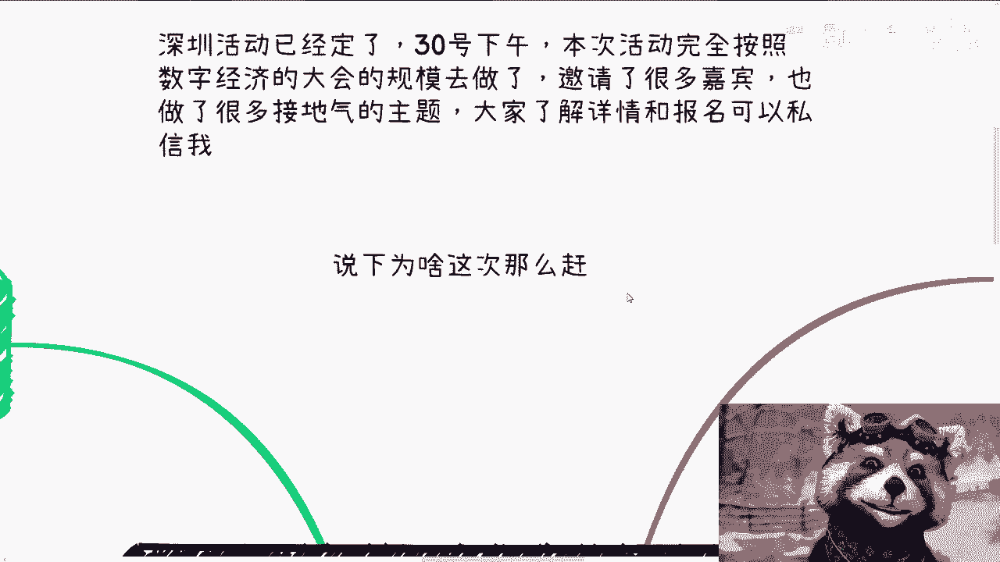
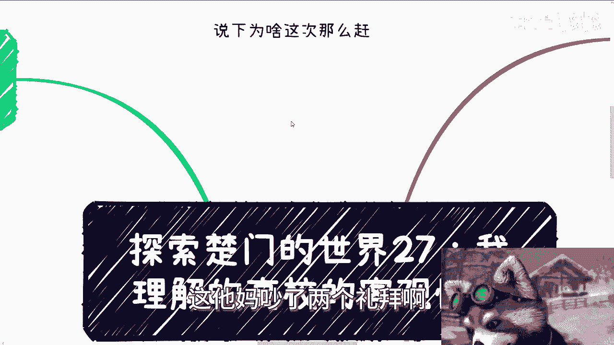
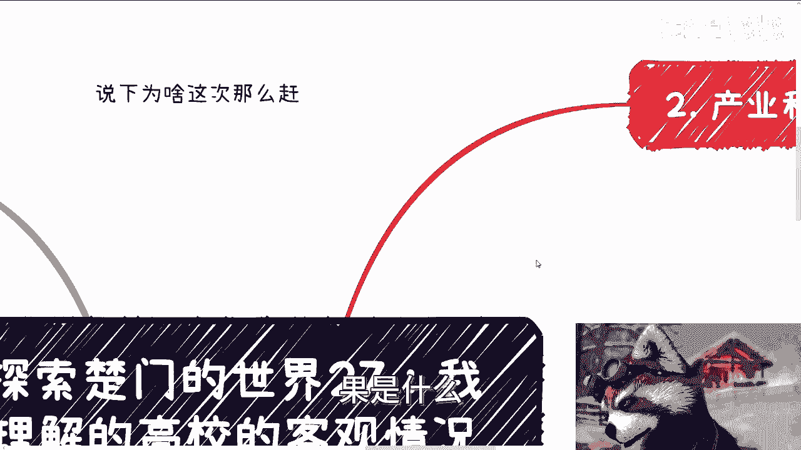
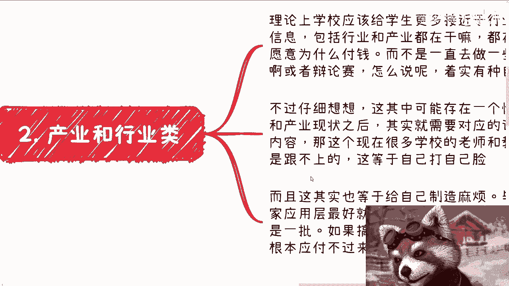
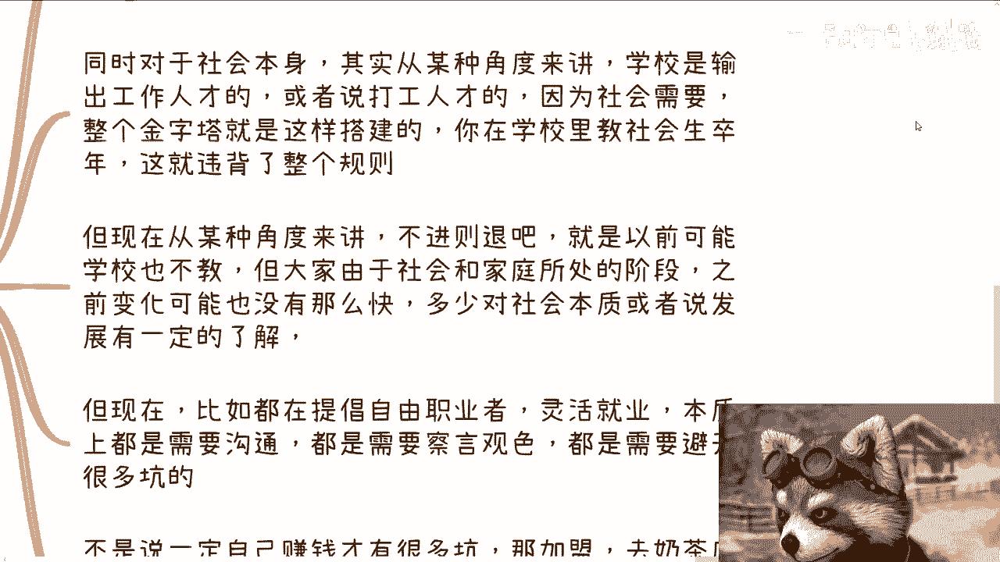
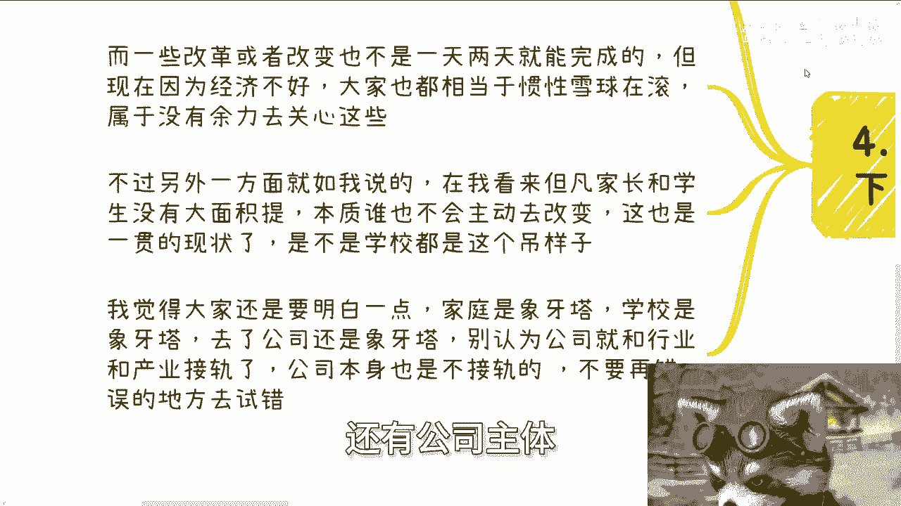
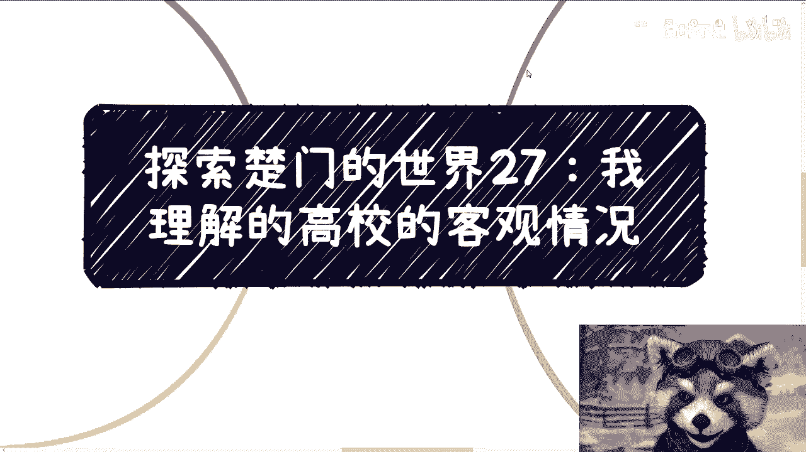

# 探索楚门的世界27：现在高校的客观情况 - P1 - 赏味不足 - BV1Dr421F7Nr

啊大家好，今天我们来讲这个探索楚门的世界。

27，卧槽他妈能讲到27，我真的我我对我自己也蛮佩服的啊。

呃今天来讲的呢是这个，我对于这个高校的这个客观情况啊，呃首先呢深圳活动已经定了么，30号下午好吧，本次活动完全按照数字经济，我以前的啊，至少就是我以前做的大会的规模去做的啊，邀请了很多嘉宾啊。

也做了很多接地气的主题啊，大家详情可以看我的动态，然后了解详情呢或者报名呢你可以私信我啊，然后呢也有人发现了啊，这个发现了这个bug啊，说我这次为什么这么改啊，我跟你们讲为什么这么改啊，就是因为他妈的。

我6月4号的时候就已经在说确定这个场地了，然后我的那个合作方给我拖一拖，拖到什么时候，拖到他妈的，上周五，那上周五我他妈都去成都了，那怎么办呢，好一拖，拖到今天我能咋办呢。

我他妈真的这他妈吵了两个礼拜啊。

真的吵了两个礼拜，他妈差点拉黑啊，首先第一啊，先从结果来讲啊，我觉得高校的核心现在脱节啊，有两个东西，然后隐就显性的脱节。

有两个隐性的脱节，有一个啊，就其实大家作为现在的年轻人啊，理论上应该比我更加更加清楚，就是一个呢是技能类的脱节，一个呢是行业跟产业类信息类的脱节，然后隐藏的这个呢，我觉得是社会层面的生存类的脱节啊。

那么技能类在我看来呢，脱节最严重的其实本质上还是互联网呃，或者说泛互联网，那为什么呢，因为毕竟发展太快了，但是别的东西其实还是怎么说呢，他他没法脱节太多，为什么，因为金融这个东西它没法创新。

就他很多创新都是皮创新，它的底层创新不了的哦，然后呢你比如说这个设计啊，土木啊这些东西，那么你也没啥好好好很多创新的对吧，那么嗯它迭代也没这么快，那么互联网呢它没办法它发展太快啊。

然后呢学学校呢可以说包括基础课程在内，其实脱节的都很多，而且近几年呢我和一些小伙伴发现了一个现象，就不一定对啊，我给大家分享一下，就是学校呢在泛互联网层面呢，应用层的教学占比会很高啊。

当然啊这个可能跟这个每一年就业率呃，或者说为了就业率啊，为了满足这个就业率这么一个目的有很大关系，但这样的话呢底层跟基础建设脱节，就会越来越严重，那我说的直白一点，就是说如果底层的基础打的不好的话。

那么在很多东西上面的，你你比如说超越美国啊对吧，或者来说就是要有要有创新啊，就很难哦，虽然应用的使用能够让学生更好的找到工作，但是底层跟基础的缺失，他会影响未来很长的发展，这就好像我本来想打一些唉。

怎么说呢，就是打鸡血啊，或者怎么样的这种这种例子，我后来想想不太好啊，不太好，就我这边就举个例子，就好像拔苗助长，就是说你短期内看似它没问题啊，但是长期其实本质上不行的，他不是说没有帮助的问题了。

这简直就是因为拔苗助长的结果是什么。

是要是要烂的哦，所以说就是你到后面就就其实很很麻烦的啊，然后第二点呢就是产业跟行业类的。

就理论上啊，我认为学校应该给学生，更加接近于行业跟产业一线的信息啊，包括就是说行业跟产业都在干什么啊，都在关注什么，都愿意为什么东西付钱啊对吧，而不是一直去做一些有的没的竞赛，或者说辩论赛，怎么说啊。

这种东西你说有没有帮助呢，有的，但是你从我角度来讲啊，我就有种自为自娱自乐的感觉，就有种就是说明明关在象牙塔里面，但是还要在象牙塔里面，不过仔细想想看啊，就是这其中其实也存在一个悖论，因为本质上。

如果真的让学生了解行业跟产业现状之后呢，其实就等于说一定会对应的调整，课程跟教学内容，因为你不调整的话，你这学生也不是呀对吧，你不调整的话，大家也会觉得这当中是有出路的，但呃那那问题是。

现在很多学校的这个老师跟教材，还有课程。

他肯定是跟不上的，那等于自己打自己脸，所以这个事也不太可能做啊，而且这其实也等于给自己制造麻烦啊，毕竟学校告诉大家，应用层最好的就是就业啊，呃包括某专业呢，这个最好就业啊，送走呃。

这个某些专业啊最好就业，那么大家肯定会跟着学校的这个说法去走嘛，你说是不是还是那句话啊，你说到底是不是对的，那你4年后7年后才见真知，那他妈4年后7年后你还记得个屁呀，对不对啊。

那么我觉得对学校来讲就是送走一批是一批啊，如果老搞得很接地气呢，必然需求会很复杂，就也很简单嘛，比如说你面临一个学校，打个比方有7万多学生，10万学生对吧，那你你你让这些学生有有有怎么说呢。

定制化的需求，那学校其实也应付不过来啊。

那么第三点就是隐性隐性的一点，这个这个改呃，这个这个诉求就是什么呢。

就是现社会生存呃，但是我仔细想了想啊，就于情于理啊，我感觉这个事啊其实对学习学校来讲啊，比较复杂，我打错了啊，对学校来讲比较复杂，也就是说我觉得这个事啊应应不应该做应该做。

但这个事貌似貌似不太适合放在线下，现在的这种学校的这种怎么说呢，就就就这种比如说十多年，20多年这种学校的这种属性哦，就或者说放到现在这种定位的学校，我觉得有点不太合适。

就是就总感觉他可能得要出来个新的机构啊，同时对于社会本身，其实从某种角度来讲啊，学校是这个输出工作人才的地方，或者说输出打工人才的地方，因为为什么，因为社会需要整个金字塔就是这样建立的对吧。

那么你在学校里面教社会生存。

哎呦这什么的输入法啊，就你在学校里面教社会生存对吧，那既然就就肯定违背了整个的规则，那么但现在从某种角度来讲吧，不进则退什么意思呢，就是说可能以前学校也不久对吧，但是大家由于社会呀对吧。

社会的这个呃变化没有现在这么快啊，那么包括就是说呃，家庭呢以前可能也更加接地气，就不像不像大家从小到大，现在接触的都是网络，可能从小以前从小到大，还是会接触一点社会面的东西呢对吧。

那么之前变化呢可能也没这么快，所以说多少呢会对社会啊，或者说对于沟通啊，对于很多东西啊，可能会有一定的这种怎么说呢，基础能力啊，但是现在呢比如说啊你说社会呢反过来了啊，他呢一直在提倡自由职业者啊。

但是自由职业者也好，包括创业也好，本质上都是需要沟通的，都是需要察言观色的，也都是需要避开很多坑的，而且这些坑远远比我们刚刚上面说的，这个打工的人才啊对吧，这个这个这个这个这个这个哎。

我刚刚说的还有什么人才啊，对工作人才啊对吧，那这里面碰到的坑要大得多了，因为你打工工作其实碰到的坑无非也就是说啊，资本家压榨你对吧，劳务合同压榨你，那你在外面卧槽，那他妈坑多了对吧，我跟你讲啊。

不是说一定你自己赚钱才有很多坑，你比如说你说我去加盟我，我去线下摆个摊儿啊，我我去弄个什么什么奶茶店，我去弄个烧烤店对吧，烧烤摊对吧，去打个兼职，卧槽我跟你讲，你但凡去做过的，这里面坑多了去了。

这里面坑远远要比你在打工层面的坑要大啊，包括合同啊，包括就是说我现在说的，我现在视频里面跟你讲的很多的，其实我觉得理论上来讲，这些东西出学校之前。

多多少少应该让学生有些知识储备，你就像很多人，现在就一直以来我吐槽的一个点是什么，就是我我最吐槽的一个点是什么，就是很多人连做法人风险在哪里都不知道，那我就觉得哈呵怎么说呢，就是就就就等着帮别人背锅啊。

就但凡有意来坑你的，一坑一个准啊啊。

那么不过现在感觉呢就有种惯性，他停不下来，就是因为为什么，因为你想嘛，一方面每年这么多应届生对吧，要毕业他要就业，那放到什么学校都有压力，而另外一方面改革或者改变对吧，就就学校的改革或改变。

他不是一天两天就能完成的，而且现在因为经济状态不好，那么大家学校也需要钱对吧，也需要一些东西，他不可能说而放弃原本的一些社会规则对吧，我现在不要了啊，我要我要去革新对吧，怎么样子。

那以他也不可能去放弃原本的这个惯性的雪球，那么属于你就算啊他有心也没这个力啊，所以说呃呃呃呃另外一方面呢，就如我说的，就在我看来啊，其实反过来说，但凡家长跟学习，学生没有大面积去提重需求。

那么本质上我觉得谁都不会主动去改变，而这也是一贯的现状啊，而且这这也不是说学校这个样子，所有地方都这个样子对吧，你包括你，我可能也这样子，就是如果我们服务于一个地方，你想嘛我们服务于一些人。

但凡对方不是大面积的对吧，提出需求或者大面积的反抗，就那那那那那我们也不会改啊对吧，所以我觉得大家呢还是要明白一点，就是家庭式象牙塔，学校是象牙塔，那去了公司呢，公司本身也是象牙塔哦。

就是说你不要觉得啊我今天工作了，好像我就与行业与产业接轨了，因为我沟通到今天还是有很多人有这个误解，有这个误会就觉得啊我去工作了，我就是与产业跟行业接轨了，并不是因为公司本身也是不接轨的。

公司本身也是象牙塔对吧，你真的要去接轨，就你真的要去在行业里面，产业里面，就是我们说这个游泳池或者这个泥潭里面，得滚一圈，你在公司里面你还是被保护着的，因为你是一个员工啊，哼你能了解啥呢。

你甚至就是就是，但凡你对整个金字塔有，一定有有一些模糊的认知，你就会明白你根本与这个行业是被隔离开的，因为你上面还有商务对吧，还有还有还有比如说市场，还有那个销售，还有公司主体，还有老板。

那跟你有啥关系啊，对吧，所以说就说不要去在错误的地方去，不停的使劲儿啊，就有人很很多很多人也问嘛，他说哎我在公司里面应该怎么去接触，我应该怎么积累，我应该怎么样子，就是还是那句话，就是说你积累的有用吗。

有用的，你学习的东西有用吗，有用的，但是你你你你上限就这么低，你知道吗，就是你如果来说单纯从打工角度来讲，你可能能做到80分，但是你单纯从了解社会角度来讲，你就算打工层面做到了80分。

你可能在了解社会层面，这个这个这个切入点去看的时候，你最多也就十分20分，但没办法，你懂吗，就这个就是我说的就是在错误的地方去使劲儿，你拼了命在那边卷卷了没有用啊，啊好吧啊行。

那么深圳这个30号的活动啊。

30号活动额报名的，大家这个私信我好吧，然后详情呢你们要知你要看的话，我把链接发给你们啊，然后另外一方面呢就是说职业规划，商业规划啊，股权期权合同分红分润啊，商业计划书白皮书啊。

包括就是说你们手上有什么牌，你们没有什么牌，你们希望通过跟我的沟通啊，通过跟我的咨询，能够让以我的视角，然后给你们一些更接近于当下社会发展，更接近于地区的一些建议或者一些规划的话。

那么你们可以整理好个人问题跟背景啊，我们再来做咨询啊，然后这是第一个，第二个呢就是说呃不要呃，就是就是非常极端的指望着说啊，我们做完咨询了，你就能赚到钱，或者我们做完咨询了，你就有质变啊。

那如果这种指望的话呢，那么你们就不要来找我了，你找别人去啊。

