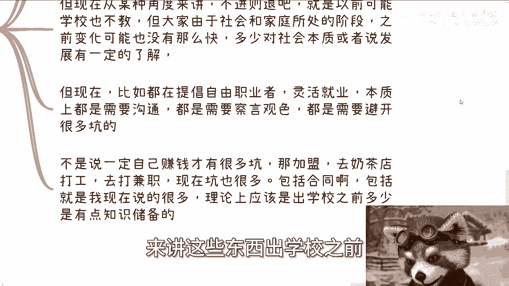

# 探索楚门的世界27-现在高校的客观情况---P1---赏味不足---BV1Dr421F7Nr_not

在本节课中，我们将探讨当前高校教育体系与真实社会需求之间存在的脱节现象。我们将从技能、行业信息和社会生存三个层面进行分析，帮助初学者理解其中的核心问题。

## 概述 📋

高校教育在多个层面与社会实际需求存在脱节。这种脱节不仅影响学生的就业竞争力，也制约了个人和社会的长远发展。本节课程将详细拆解这些脱节的具体表现及其潜在影响。

## 显性脱节：技能与行业信息

上一节我们介绍了课程的整体框架，本节中我们来看看高校教育中两个最明显的脱节领域：技能培养和行业信息传递。

### 1. 技能类脱节

技能脱节在互联网及相关领域尤为严重。由于技术迭代速度极快，学校的课程更新往往滞后于行业发展。

**核心问题**：学校教学过度侧重于应用层，而忽视了底层和基础建设的重要性。这就像**拔苗助长**，短期内看似帮助学生就业，但长期会损害创新能力和职业发展的深度。

以下是技能脱节的具体表现：
*   **课程滞后**：学校教授的泛互联网应用层知识占比过高，底层计算机科学、数学等基础课程相对薄弱。
*   **目标偏移**：教学可能更倾向于满足短期就业率指标，而非构建扎实的知识体系。
*   **发展受限**：基础不牢的学生在未来技术变革或需要深度创新的场景中会面临瓶颈。

### 2. 行业与产业信息脱节

理论上，学校应成为连接学生与行业一线的桥梁，但现实往往并非如此。

**核心悖论**：如果让学生充分了解行业现状，势必要求学校调整其课程与教学内容。然而，许多学校的师资、教材和课程体系难以快速跟上产业变化，主动揭示脱节无异于“自己打自己脸”。

以下是行业信息脱节的常见现象：
*   **信息隔离**：学生接触不到行业真实动态、企业关注焦点及愿意付费的价值点。
*   **活动偏移**：校内活动（如某些竞赛、辩论赛）可能脱离实际产业环境，成为一种“象牙塔内的自娱自乐”。
*   **就业引导**：学校可能倾向于宣传“最好就业”的专业，但四到七年后的真实就业情况却无人负责。

## 隐性脱节：社会生存能力

除了技能和知识，高校教育还存在一个更深层、更隐性的脱节：社会生存能力的培养。

上一节我们讨论了显性的知识脱节，本节我们将深入探讨这个更根本但常被忽视的问题。

**复杂性与矛盾**：于情于理，培养学生社会生存能力（如沟通、察言观色、识别风险）是必要的。但这对于当前定位的传统高校体系而言较为复杂，甚至可能违背其作为“输出标准化打工人才”的社会规则设定。

**现实挑战**：当今社会提倡自由职业与创业，但这些路径所需的生存技能和要规避的“坑”（如合同陷阱、法人风险），远比打工层面复杂和危险得多。

**惯性难以改变**：高校体系存在巨大惯性。每年面临应届生就业压力，加之教育改革非一日之功，在经济环境下行时，学校更难以放弃原有路径进行革新。除非学生及家长大规模提出明确需求，否则体系很难主动改变。

## 核心认知：无处不在的“象牙塔” 🏰

一个关键的认知误区是：许多人认为进入公司工作就等于与行业接轨。

**重要观点**：`家庭、学校、公司本质上都是“象牙塔”`。在公司里，员工通常仍被保护在特定岗位和层级中，与真实的行业生态、商业博弈、市场前端是隔离的。你的上面还有商务、市场、销售、管理层和老板。

**警示**：`在错误的地方使劲儿，拼命“内卷”，可能对提升真正的行业认知和社会生存能力收效甚微`。在打工层面做到80分，在了解真实社会层面可能只有10-20分。

## 总结与启示 💡

本节课中我们一起学习了当前高校教育存在的三类脱节：
1.  **技能脱节**：重应用、轻基础，影响长远发展潜力。
2.  **信息脱节**：学生难以获取真实、前沿的行业产业信息。
3.  **生存能力脱节**：缺乏进入社会所需的风险意识、沟通能力和商业常识。

理解这些脱节，有助于我们认清现实，主动跳出“象牙塔”思维，在正规教育之外，有意识地构建自己的技能树、信息网络和社会认知体系，为未来的个人发展打下更坚实的基础。

---

**附：活动与咨询信息**
*   **深圳活动**：定于30号下午，围绕数字经济主题，详情请私信获取。
*   **个人咨询**：提供职业规划、商业规划、股权合同等领域的咨询服务。咨询前请整理好个人问题与背景。请注意，咨询旨在提供视角和建议，无法保证直接带来经济收益或质变。