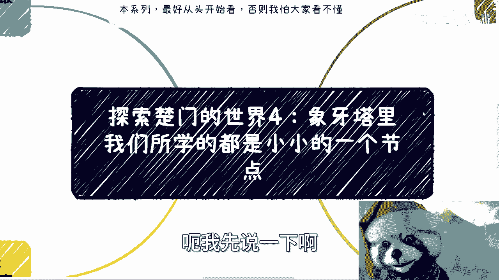
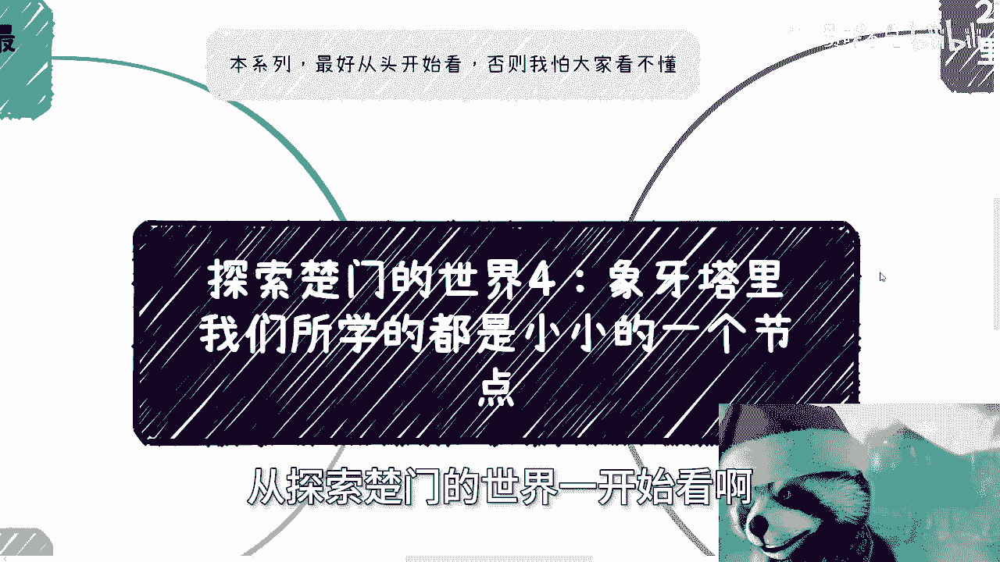
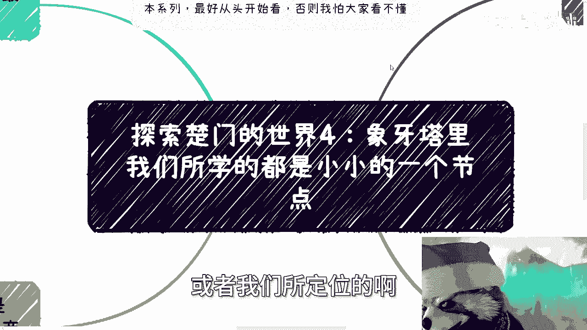
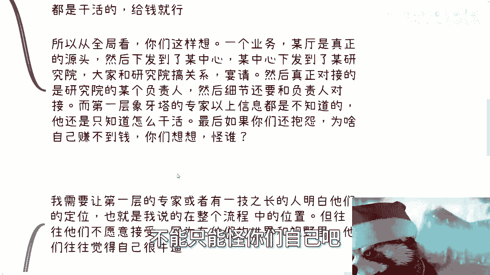
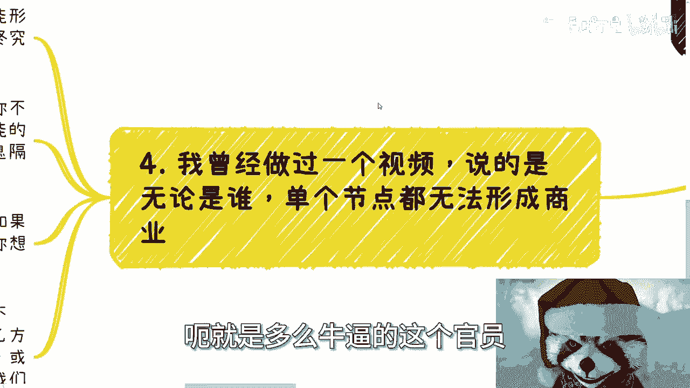
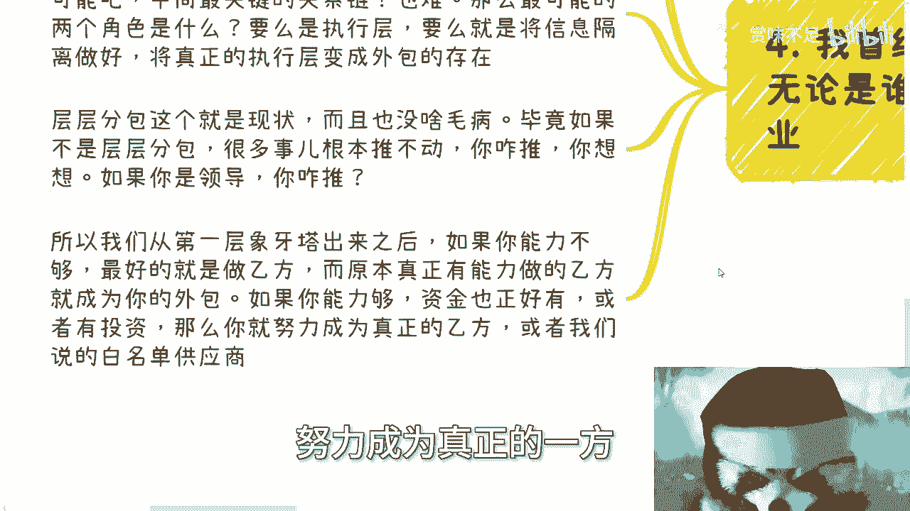
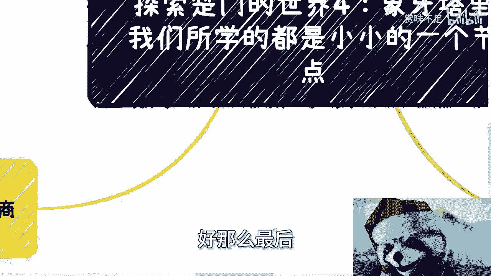
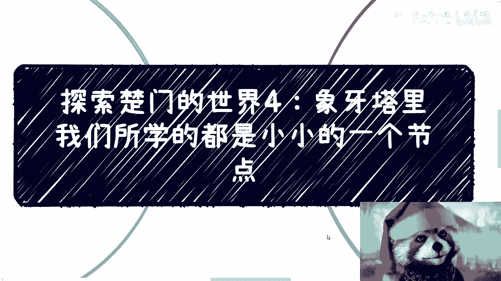

# 课程4：象牙塔里我们所学的都是小小的一个节点 🧱

在本节课中，我们将探讨“象牙塔”内外的核心差异，理解为何在象牙塔（如学校、标准化公司岗位）内所学的知识和定位，在整个商业世界中往往只是一个微小的节点。我们将分析不同角色的思维模式、信息差以及普通人在其中的定位与出路。

---

本系列视频最好从头开始观看，从《探索楚门的世界1》开始。否则可能难以理解后续内容。

## 第一层象牙塔内外的核心差异 🤔

上一节我们讨论了信息差与角色定位，本节中我们来看看象牙塔内外的具体差异。

最大的差异在于：无论你身处何种岗位，在第一层象牙塔内，你通常会花费大量时间纠结和打磨**细节**。这是因为内部环境往往是标准化和重复性的。

**公式：象牙塔内工作 ≈ 细节打磨 + 重复劳动**

此外，在象牙塔内，你通常只是任务的接收者和执行者。你的上级（导师或领导）告诉你需要做什么以及如何做好。你必须照做，因为这直接关系到你的奖金、年终奖、薪资，甚至工作去留。

## 关于“离市场近”岗位的误解 🚫

有一种观点认为，市场、运营、销售、商务等岗位离市场和行业更近，因此能更好地了解商业，甚至突破第一层象牙塔。但事实上，这几乎不可能。

以下是两个主要原因：

1.  **沟通以公司为背景**：即使你在这些岗位，与他人的沟通也极为谨慎，且始终围绕公司利益。你的个人背景并不重要，对方不会透露任何核心信息。
2.  **仍是命令执行者**：你依然只是接受命令做事。对于项目的全局、来龙去脉和决策源头（例如，为何要接待某位特定客户，整个项目如何承接），你通常一无所知，也不敢多问，因为这被视为“越权”。

所以，不要以为从事这些岗位就能突破局限，作用微乎其微。

## “专家”在象牙塔外的真实定位 🛠️

假设你是第一层象牙塔内的专家，例如在电商、开发、外贸等领域，你对业务流程、软件流程、产业上下游都一清二楚，可以独当一面。

那么，如果你有机会接触到象牙塔之外，你对“外面”的人来说，最好的定位是什么？答案是：**高级工具人**。

原因在于两者的关注点截然不同：
*   **象牙塔内**的人永远关注 **“事”** （具体的任务和细节）。
*   **象牙塔外**的人永远关注 **“人”** 和 **“事的源头”** （谁在推动，为何推动）。

对于内部专家而言，信息差在于不知道整件事的来龙去脉、源头、后续发展以及资金流转，他们只知道**自己负责的那个节点**。

而对于外部的人（指第一层象牙塔之外，而非公司之外）来说，虽然可能不清楚项目细节，但补足这些信息差并不难，因为他们需要的是“工具人”，而工具人遍地都是，花钱就能找到。

**核心困境**：象牙塔内的人想补足外部信息差难如登天，就像普通人想打破认知信息差一样困难。

## 全局业务链条与个人定位 🔗

让我们思考一个典型的业务链条：

`真正的源头（如某厅局） → 下发到某中心 → 下发到某研究院 → 对接研究院负责人 → 细节对接与执行`

如果你作为第一层象牙塔的专家（执行层），以上大部分信息你都不会知道，也没人会告诉你。你的角色就是“干活”。

因此，如果抱怨自己赚不到钱，需要明白问题根源在于**定位不对等**。在整个业务模型中，你就是一个“工具人”。工具人自然不会知晓链条上游的核心信息。

## 思维转变与适应挑战 🔄

对于能够沟通两边的人，需要时刻明白不同角色的定位。但你会发现，象牙塔内的“专家”往往不愿接受自己只是流程中的一个节点，他们常觉得自己就是全部，非常“牛逼”。

然而，问题在于，他们虽然自我感觉良好，却常常找不到关系、赚不到钱。这恰恰说明了定位与思维的错位。

**关键点**：你可以打工、兼职或经商，但如果你的**角色**和**思维**不改变，那么你无论在哪里都只是“工具人”，只是换了个地方而已。

当与象牙塔外的人沟通时，你必须时刻保持清晰的**全局思路**。无论你是否是项目主导者，你都需要是最清楚整体脉络的人。

因为，无论在象牙塔的哪一层，混子总是占大多数（遵循某种“八二原则”）。突破第一层象牙塔，不代表你就能在外部世界占有一席之地，你可能还没有自己的“雪球”或业务，但能明白这个道理已经是一大进步。

## 走出去的挑战与行动指南 🧭

当你开始从象牙塔“逆行”走出去时，会非常不适应，因为你需要面对不同的人群、思维和定位。

这时，你必须清楚**何时讨论细节，何时讨论全局**，分清事情的优先级。否则，你可能会搞砸一个本可成功的商业机会。

*   **错误示范1**：与象牙塔外的人（关注全局和源头）过度讨论细节，对方会认为你是个“执行工”。
*   **错误示范2**：与象牙塔内的人（关注细节和执行）讨论整个流程和全局，对方会认为你是个“骗子”。

让双方互相理解对方的信息差是极其困难的，因为他们缺乏对方视角的信息。

## 普通人的出路：成为“新乙方” 💡

一个重要的结论是：无论单个节点上的人多么厉害（即使是高级官员），**单个节点都无法形成商业闭环**。一个完整的商业闭环必然涉及“搞关系”和“执行”，而这两者几乎不可能由同一个人完成。

作为普通人，在商业链条中：
*   成为“甲方”（源头）几乎不可能。
*   成为核心“关系链”节点也非常困难。

那么，最有可能的两个角色是：
1.  **底层的执行层**（即“换个地方做工具人”）。
2.  **成为“新乙方”**，负责整合信息与资源，而将真正的执行层（原乙方）变为你的**外包**。

这就是“层层分包”的现状，也是许多行业项目得以推动的现实方式。

**行动指南**：
*   如果你的能力与资金有限，那么最好的定位就是努力成为那个**整合资源的“新乙方”**。
*   如果你的能力足够，并且有资金或投资支持，那么可以努力成为真正的**甲方白名单企业**或与政府直接对接的实体。

## 关于“乙方为何不与甲方直接对接”的解答 ❓

常有人问：如果执行层（原乙方）有能力，为什么不直接和甲方对接？

答案是：**不是不想，而是不能**。这就像问“我考不上清华是因为我不想吗？”一样。世界上有能力的人很多，但**知道如何与源头对接、拥有对接渠道和信息**的人很少。这不是意愿问题，而是认知与资源问题。

---

## 总结 📝

本节课我们一起学习了第一层象牙塔内外的核心差异：
1.  象牙塔内关注**细节和执行**，塔外关注**源头和全局**。
2.  塔内的“专家”在外部视角下，最佳定位往往是**高级工具人**。
3.  个人赚钱困难常源于**角色定位**与**思维模式**未能跳出执行层。
4.  沟通双方时，必须分清场合，把握讨论细节与全局的尺度。
5.  对于普通人，可行的出路是成为**整合资源的“新乙方”**，或将执行层外包。

至此，关于第一层象牙塔与外部世界的宏观对比已基本清晰。后续课程将更多聚焦于具体项目中的细节与实践。