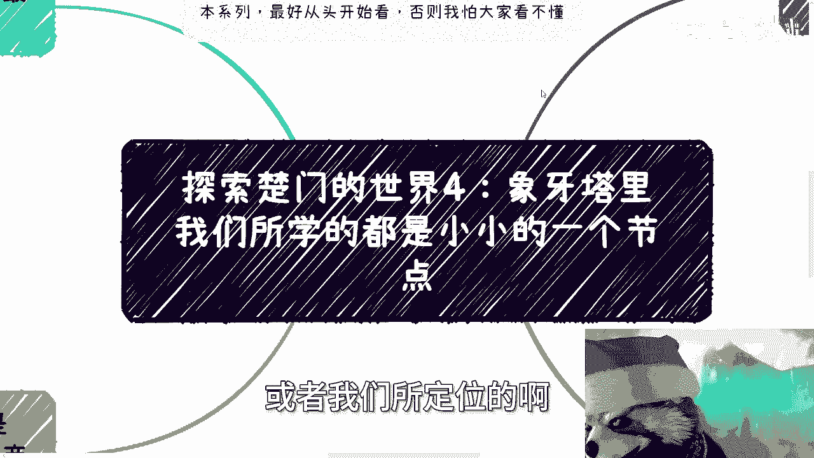
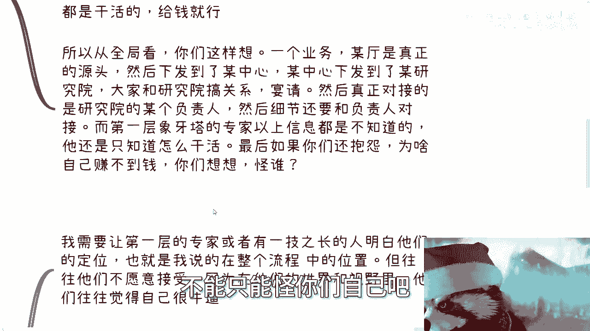
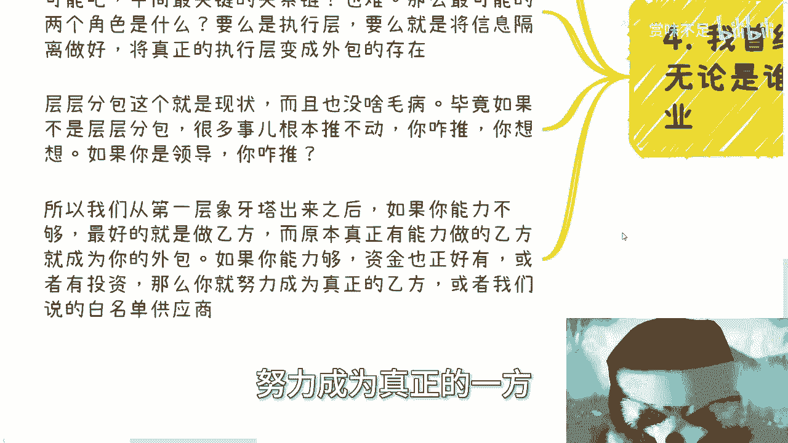
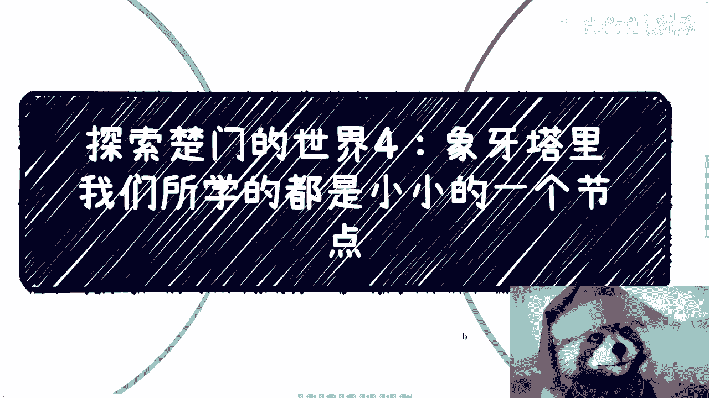

# 探索楚门的世界4：象牙塔里我们所学的都是小小的一个节点 - P1 - 赏味不足 - BV1Ux421f7wy

啊大家好啊，呃我先说一下啊。

本系列的视频啊，最好从头开始看啊，从探索楚门的世界一开始看啊。

否则我怕大家看不懂啊，那么我们本次来讲的是四啊，就是象牙塔里面我们所学的，或者我们所定位的啊。

其实是小小的一个节点，什么意思啊，听完你们就知道了嗯，第一层象牙塔外啊，这个还有一个最大的差异，这个差异是什么，就是我们可以这样理解，无论你做什么岗位，你在第一层向阳台里面更多的啊。

呃用很多时间去纠结细节，打磨细节，你们想想看啊对吧，就是这样子的，无论是你还是你跟你的小伙伴都一样的啊，因为都是标品很正常啊，或者说很多人都是重复的细节劳动，你们仔细想想是不是啊，这第一第二呢。

这就好像我们做一件事情啊，永远接收着要做这件事情，然后上面告诉我们就是你们的mentor，你们的leader告诉你们说要怎么做，怎么做好，然后我们就这么做了，因为什么，因为他给你的任务你不做好。

那就跟你们的奖金，跟你们的年终奖，跟你们的甚至跟你们的这个每个月的叫什么，就这个薪资都有关系，甚至跟你们未来有没有这份工作都有关系，对不对，好，那么当然也有这种言论啊，说啊市场运营。

销售商务等离离市场离整个行业更近啊，是不是说我们做这种岗位，就能够更好的去了解商业，或者来说他们就会觉得能突破第一层象牙塔，但我跟你讲，事实上是不可能的，为什么，主要有两个原因。

第一你全职在一家公司里面，大家沟通来沟通去，其实都是以公司为背景的，不是以你为背景的啊，你真的做商务，做市场，做销售，你去做做看你就会知道大家沟通其实都很小心，你是谁并不重要，什么叫很小心。

就是不会透露什么任何的非常核心的东西，这是第一点，第二点，无论你是什么岗位，你无非都是接受命令来做事的，那么对于全局的来龙去脉，为什么呃，比如说今天我们要去接待一个客户，接待一个区长号要去宴请。

那我就问为什么接待他，为什么是他，难道就因为他是区长吗，那他妈区长多了，对吧啊，你为什么是他，为什么不是别人，你知不知道啊，然后整个项目是怎么来的，整个项目为什么你们公司能接下来，你其实都不知道。

你敢问吗，我就问你敢问吗，你不敢问，为什么，因为你只是一个打工的，你怎么问啊，你问了哼，这叫越全越急，你试试看对吧，所以你不要以为做那些岗位就有用，没有用的，一点用都没有的好吧，然后这是第一点。

第二点我们假设啊，我们假设你是第一层向下谈里面的一个专家啊，好我们假设你在电商开发外贸啊，或者说等等别的一些领域，你是个专家，你对业务流程，你对软件流程，你对产业流程，你对上下游都很清楚。

你可以一个人当一当一个team用对吧好，那我就跟你讲，如果你有机会，我们假设啊你是一个独当一面的人，然后如果你有机会去接触到象牙塔外啊，那么你对外面的人就是就你这个人啊，对于外面来讲最好的定位是什么。

高级工具人，为什么，因为里面的人永远关注是啊，永远关注的是事，外面的人永远关注的是人，是事情的源头，这个我们在探索楚门的世界三里面，我已经很详细给你们讲清楚了对吧，大家思考问题逻辑是不一样的啊。

对里面的来讲，信息差在于不知道整件事情的来龙去脉，不知道源头在哪，不知道这件事情做完之后，后面的后续是怎么来的，他也不知道这个钱到底怎么收，他什么都不知道，他只知道当中的节点，你想想看对吧啊。

但如果你在外面的话啊，虽然可能不知道我指的这个外面，是指第一层象牙塔外面，不是说你在公司外面啊，虽然可能不知道项目的细节，或者说一些具体的东西，但是你仔细想想看，你补足这些信息差并不难啊，因为对你来讲。

你要的是工具人，工具人满地都是给钱就行，有什么不能补的，难道是象牙塔里面的人想要补足外面的信息差，这就难如登天，这就像你们现在每个人想要去打破智能信息差，就难如登天啊对吧，所以你从全局来讲。

你们要这么想一个业务啊，某比如说某一个厅，金融厅啊啊工信厅啊，是真正的源头，然后下发到某个中心，某个中心下发到某个研究院，然后大家跟研究院搞好关系，比如说找的是他们的执行院长，或者说是郑院长对吧宴请。

然后真正对接的呢，可能是研究院的某个负责人啊，然后细节呢还要跟这个负责人对啊，然后第一层象牙塔的专家以呃就是呃你会发现，如果你作为第一层象牙塔的专家，基本上以上信息你都是不会知道的，你怎么知道呢。

谁来跟你讲，这跟你什么蛋关系啊，你他你还不是只知道怎么干活对吧，最后如果你们还抱怨啊，为啥自己赚不到钱，你想想看怪谁，这是你自己想想怪谁，你怪别人吗，唉你不觉得人家所有的定位跟你不对等啊。

你是一个打工的，你是个工具人，你虽然跟跟这些上面的这些人没有什么，比如说劳务关系，但是你从整个业务模型上，你就是一个工具人啊，那你工具人你怎么会知道这些东西呢，那你怪谁，不能只能怪你们自己吧。

对不对啊，然后第三所以对于我觉得两边都沟通的来讲，你需要时时刻刻去适应，就是说你看啊，我需要让第一层的专家，或者所谓拥有一技之长的，当然对我来讲，我也不认为有谁拥有一技之长对吧，你所谓拥有机智商的人。

明白他们的定位，也就是说我我我也就是我之前说的，在整个流程上的定位啊，这整个流程的位置，但你会发现这些人往往不愿意接受，为什么，因为在他们的世界里面，在他们的视野里面，他们往往觉得自己就是全部。

自己就很牛逼，你牛逼啥，对不对，你牛逼傻，我还是那句话，你去问问你去听一下，我现在这个逻辑，你再去看看98521，什么清华北大有什么区别啊，啊无非都是第一层象牙塔，第一层象牙塔里面的角色而已啊。

但是问题到这里你会发现往往自己很牛逼，却找不到关系，却赚不到钱，为什么呢，诶那为什么呢，对不对，问题就在这里，所以就如我们之前说的，你可以打工，你也可以兼职，你也可以做商业，但是如果你的角色不变化。

你的思维不变化，那么你还是工具人吗，你在不在公司里面都是工具人，你只是换了个地方做工具人，对吧啊，那么我和下牙堂外面的人沟通时候呢，其实你就是我们自己也得是，就是非常时时刻刻的去明白啊，全局是什么样子。

你得去思考，为什么，因为你要明白啊，不管你是啊，就不管你是是不是项目主导者，你都必须是保持最清楚的那个思路的那个，因为什么，因为一样的象牙塔，不同的象牙塔之间好，里面的人永远也是八二原则。

那当然八二原则不是说真的80%，百分之百分之20啊，你要真的80%，20%倒好了，你知道吗，八二原则只是个说法哦，就是你要明白，无论你在第几层向下看，混子总归是最多的，就是混子可能终究是占9%。

15~99的，你懂吗，因为一样的呀，不是说哦你突破了第一层象牙塔，你说我就在能够能够在第一层象牙塔外面，占有一席之地，这没有因果关系的，你知道吗，你可以明白，你也可以有精力。

但是并不代表你在整个业务当中，你能够占有一席之地，你可能还没有自己的雪球，你也可能没有自己的这个这个业务，但是你已经明白了，这很很多啦，对吧好，那么所以啊当你需要走出去的时候，在就我们前两期里面说的。

你作为一个逆行者对吧，你要走出去的时候，或者刚开始走出去的时候，你会很不适应，因为你需要面对不同的人群，不同的受受众，不同的脑子，不同的定位，但是你得明白，你千万不能被他们带偏了，你懂吗。

就是什么时候该讨论细节，什么时候应该从全局讨论，哪些事情优先级高的，哪些事情先讨论哪些事情后讨论，你得清楚，否则的话你要明白啊，你搞不清楚，你就会把一个原本可能可以成功的商业搞砸，也就是说你如果跟商业。

跟象牙塔外的人去讨论细节，人家会觉得你是个，你跟象牙塔内的人去讨论一些整个流程，全局别人会觉得你是一个骗子，怎么办呢，没有办法的，你明白吧，就是两者信息差，你要让他们明白这件事情是很难的。

因为他没有这些信息，你让他怎么补足呢，对不对，我曾经做过一个视频，我说的是什么，我说无论是谁，我不管他是一个官呃，就是多么牛逼的这个官员。

还是说呃怎么什么人啊，就单个节点他都是无法形成商业的，你知道吗，就是说无论对方是谁，无论多牛逼，他单个节点都绝对不可能形成商业闭环，绝对不可能，为什么，因为一个最简单的商业闭环里面终究有关系。

终究有要去搞关系的，终究有要去执行的，搞关系跟执行的人绝对不可能是一个，我跟你讲，绝对不可能是一个绝逼，不可能是一个，我们作为普通人，你会发现在整个内容当中，甲方你是不可能了，对吧好。

那么中间关系的关系，关键的那些关系链呢，你也不可能啊，也很难，那么最有可能两个角色是什么呢，要么就是底层的执行层，就是我说的换个地方做工具人，要么就是说将信息隔离好，将真正的执行层变成外包，你想想看啊。

你想想看，就是我们说的就是说你其实就是乙方啊，那么那么你理解下来可能觉得哦，这就是个层层外包对吧，好层层分包，这个就是个现状，而且没什么毛病，为什么，因为我就这么问你们，你们想想看中国改革开放到现在。

你地方政府到各地方呃，就中央到各地方政府很多事情，我们就说各行各业啊，你要不是层层分包，我就问这件事情怎么推，我问你怎么推，我问你怎么推你，你你你告诉我对吧，你你总不能说唉，来我指定一下。

来指定这个某某某区某某某区长对吧，来做怎么了呢，你就算指定某个区长，区长能做吗，他不得往下发嘛，往下发，我就问区长，下面那个人能做吗，他做个屁啊，他不得分包吗，怎么办呢，你没办法的呀，对不对。

所以啊我们得出一个结论啊是什么，就是你如果定位你是个普通人，你从第一层象牙塔出来之后，如果你能力不够，那么最好的就是你就想办法成为乙方，而把原本真正有能力做乙方的呃，做执行的那种乙方程啊，变成你的外包。

如果你能力够，资金也正好有，或者说有投资，那么你就努力努力成为真正的一方对吧。

或者我们说企业或者政府的那种白名单好。

那么最后说到刚刚那个点的时候，永远有人会问这个问题，他说那你去做一个乙方，那为什么真正的乙方跟甲方不对接，好我回答你这个问题很简单，真正的乙方能跟甲方对接的，有没有有的，但绝对不是统全部，对不对。

你们想想看，我就这么问你们，中国能做软件的人多不多，中国能做那个建筑设计的多不多，中国中国能做所有的落地人多不多对吧，就像我们说的，第一层象牙塔里面能落地的人多不多，直线人多不多，工具人多不多多吧。

那我就问嘛，为什么赚不到钱诶，那我也奇怪了，我就问你们，那你们怎么不知道怎么跟甲方对接呢，你们知道吗，就不要去问那种问题，很多人会问他说，为什么他们不跟甲方对接，那我就问你们，你们知道吗，对不了。

一样的道理呀，他不是不想对接，是不想吗，我考不上清华，是因为我不想嘛，对不对对吧，一样的，我得到我得不到诺贝尔奖，是我不想吗，他不知道啊，不要去问那种虚的问题，你说为什么乙方跟甲方对接，我的要能对接。

能不来，这世界就是这么个组成样式啊，对吧啊行啊，呃基本上到第四期啊，我觉得你们应该已经差不多明白了，就第一层跟外面的这个核心上的区别，到底在什么地方好吧，后面我还会继续再来讲的。

但是我可能就嗯不会再这么宏观的，从两者对比，我会跟你们去说一些这个项目当中的细节啊。

行就这么着吧啊。