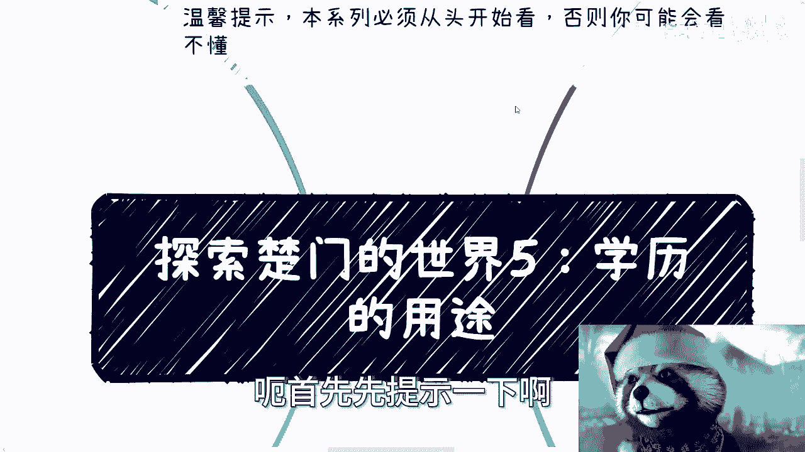
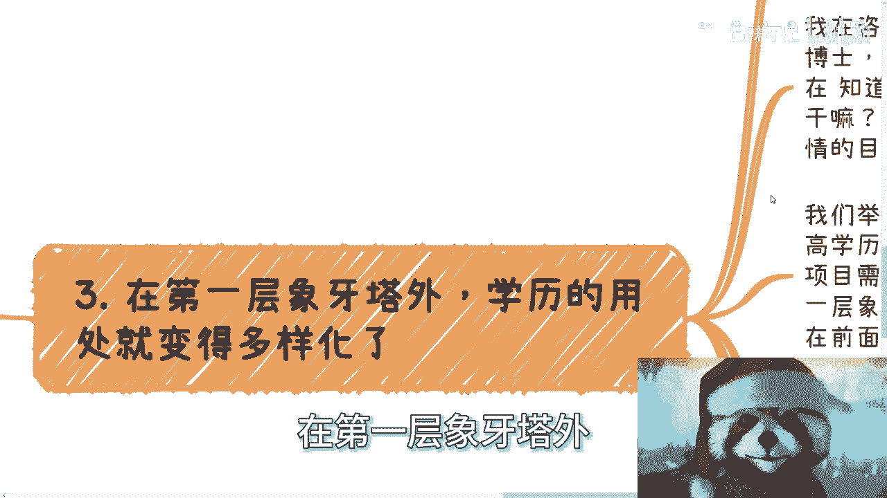
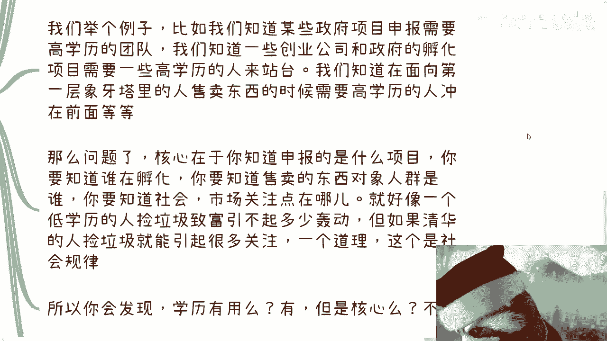
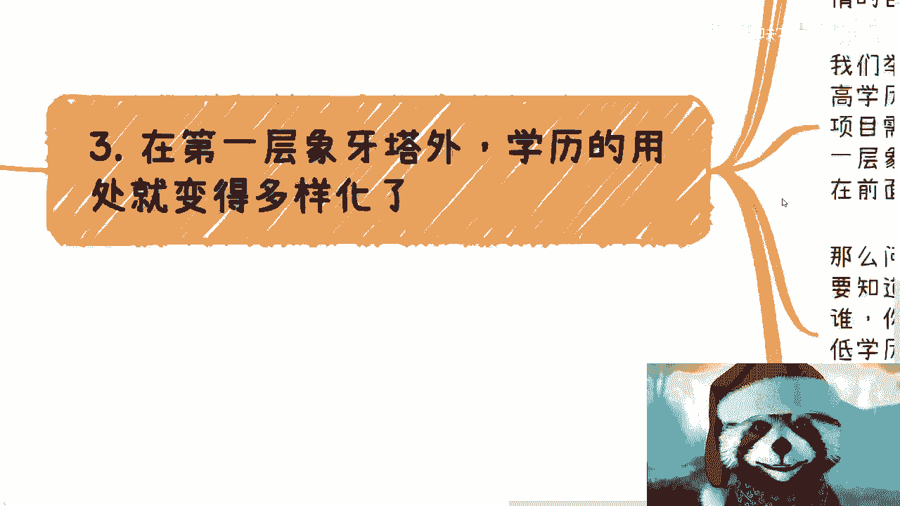

# 探索楚门的世界5：学历的用途 - P1 - 赏味不足 - BV1vH4y177bu

哈喽大家好，这个我们继续来讲第五期，第五期现在是凌晨，我想着明天可能比较忙啊，所以今天还是把这个东西给大家录了呃，首先先提示一下啊。

本系列必须从头开始看啊，否则你可能看不懂啊，那么今天来讲个，今天讲到这个内容就比较敏感吧，就关于这个学历的用途。

首先啊我们先说一个结论，就是无论在第一层象牙塔内还是外面，学历都是有其用途的啊，我并没有说他一定有用啊，我只是告诉你们他是有其用途的啊，只不过它在里面跟外面的用途的时间周期。

以及其用途本身的作用是不一样的而已，那么这里面要细分啊，我会在这期里面给你们细分清楚的，嗯在第一层相声团内，大家都比较熟悉的是什么呢，就是简单来讲就是说学历是用来找工作的对吧，很多人都是这么认为的。

好也没毛病啊，而且呢就是随着你毕业的时间越来越长，其效果是逐渐衰减的对吧，这点但凡是毕业的或者说工作过的人，其实也都知道，那么一般专业呢我们就说一般专业啊，一般专业三到5年左右的时间，学历就没啥用了啊。

这点不用大家不用去杠，也不用去反驳，就就就这个样子的嗯，那么简单来讲呢，除了求职的那一刹那啊，他其作呃就是学历是作为这个门槛的啊，这个存在你的学历呢，你的专业本身随着年龄的增长。

其实那实实事求是来讲没什么用啊，比如说你30岁，30岁的时候你去求职，你说有多少公司和面试官还会来问你，专业知识吗，不太会，我指的专业知识，是指你学校当时的那些专业知识对吧，就跟你比如说毕业一两年三呃。

两三年的时候那样，不会的啊，你可能当时读的什么专业，你可能忘得差不多了，或者说大部分人30岁时候的工作，做的事情跟你的专业也没什么太大挂钩，那么35岁到40岁左右，那就更别说了，就是无论你是什么学校。

什么专业，我们去头去尾去掉那些呃比例特别低的那种啊，或者来说比例特别小的那种，你基本上就是个标品，当然这不是说贬义词啊，就是就这么个描述啊，那么到时候你再去说你是清北，你是MIT或者什么专业。

其实没有用了啊，尤其是这个年龄段就更别无所往后了啊，当然啊你这个地方得说一点，就是你也不能怪社会，因为毕竟中国人太多了，你总归要给年轻人机会吧，就咱们就是粗暴点说，因为里面的问题肯定很多。

不仅仅是因为这个问题嘛对吧，但是就是说你要这么想，整个社会是金字塔的，你总归要给年轻人机会吧，否则呢怎么办呢，哦把老人都留在，年轻人都失业，你想想看这符不符合社会发展规律吗，对不对啊，那么第二点。

当然啊，第一层象牙塔里面大家可能还觉得啊，就除了学历是找工作以外，就觉得学历还有个用什么用呢，那就是能让别人带你做更多的业务啊，或者说创业对吧，当然公务员这个事情待会我们再来说啊，但你们细品一下。

这句话本身就是我们刚刚说的，就是说你觉得学历还有一个用，就是创业或者别人带你做业务对吧，但是这件事情本身并没有因果关系，也就是说，做商业关心的是钱，做业务看的是资源交换和商业逻辑。

如果我们就说单纯跟学历有关，那么这个世界上所有拥有同样学历的人，他基本上就拥有平等的机会，但是事实并非并不是这样子的对吧，那么有人要问了，他说学历高的人，在第一层象牙塔里面，明显就能够获得更好的资源。

你仔细想想这句话，这句话其实是反过来的，什么意思啊，就是有没有一种可能性啊，我只是跟你们讲啊，有没有一种可能性是媒体更愿意报道学历高的，同时，学历高的人里面，他能说会道其不自卑的比例比较高罢了。

而不是因为他们学历高而呃呃呃，而不是因为他们因为学历高啊，偶尔说啊可能更多的因因为学历高，能说被会到，然后因为学历高，所以不自卑，不是的，他只是因为反过来的比例更高一点，所以说我们可以得出是什么呢。

我们会得出学历高的人群里面会折腾，会包装聪明的人的比例更高啊，但本身他会不会折腾，会不会包装是不是聪明，不是因为学历高不高。

去这个这个这个得出来的，所以说大家不要主次颠倒，你明白吧，那么第三点在第一层。

象牙塔外学历的用处它就变得多样化啊，你比如说在第一层香塔外，其实学历跟其他东西，那我指的其他东西，比如说你的一些paper，你的一些学术成就对吧，包括你呃呃呃一些聘用专家证书对吧，或者其他的啊。

就是这类东西会变成了，你会使用在不同场景的一种工具啊，然后起发挥作用，如果你不会使用，那我就告诉你没有卵用啊，学历跟其他的一些成就，它更像一把钥匙，但是你需要去寻找能插的门锁，如果你找不到这个锁。

那你就单独这把钥匙有卵用，你明白吧，哦我在咨询的时候一直会问别人，我说你读一个硕士，读一个博士，然后呢你告诉我你懂不懂这个学历怎么变现，如果你现在知道你去读，你不知道，那我就问你读了什么啊。

那么因为什么，因为很简单，你今天把学历就是换成另外一个词啊，我就这么问啊，如果一个正常人，你自己都不知道，你自己做一件事情的目的是什么呢，你会去做吗，我就问你，你会去做吗，你不会，但是你读一个硕士。

跟你读一个博士，或者你读个本科，你懂吗，你懂得这张证书怎么这张文凭怎么给你变形吗，你大概率你不懂了对啊。

那么我们举个例子，比如说我们知道某些政府项目申报，是需要高学历团队的，我们知道一些创业公司和政府的孵化项目，需要一些高学历的人来站台啊，我们需要在面向第一层象牙塔里面的人售卖呃。

比如说那个那个叫什么叫知识变现，或者售卖那个卖课的时候，你需要更多的高学历的人冲在前面，给你去做背书等等等啊，那么问题来了，你你想想看我们刚刚讲的这些东西啊。

核心是在于你知道申报的是什么项目核心，你知道申报项目到底跟谁对接，核心是你要知道谁在孵化，你要知道售卖的东西的对象人群是谁，你要知道整个社会市场关注点在哪里，这就好像一个低学历的人捡垃圾致富。

引不起多少轰动，但是如果一个清华的人捡垃圾，就能引起很多的关注，这是一个道理，所以你仔细想想看我们刚刚说的逻辑，你会发现学历有用吗，有但是它是核心吗，不是对不对，是不是啊，所以说我们就问一点啊。

我们今天就问一点，在象牙塔外的商业世界里面，你们自己可以想想看啊，有任何哪个业务是因为学历，OK你就能得到的，就是我今天因为学历OK我就一定能得到，他是一个因果关系有吗，有没有哦，如果如果是真的话。

那么我跟你讲，大家就不要竞争了，因为所有高学历的人早就都财富，都都都都财富自由了。

有没啦，有文有没有嘛，对不对。

好第四点啊，当然有的人要说了，往上卷学历是必不可少的，那么就说到我们体制内，无论第一层象牙塔内还是向他外向上卷，学历都是必不可少的，对吧好，我们来仔细看一下什么叫往上卷，网上卷是什么意思。

意思是更多的高的职位，而且是体制内的，因为你如果单纯在大厂，在私企，在公司里面去卷，我觉得没什么好卷的啊，说不好听的，你就算往上卷了又如何呢，所以说更多的人说往上卷，他需要的是什么。

他想要的是社会地位和政治地位，对吧好，那么我们就说问题来了，你往上卷，如果学历是必不可少的，这句话对不对对，但是你要明白，在这句话里面，学历是一个就像你今天上牌桌，学历是一张牌，这张牌够不够不够。

而且它的比重不高啊，我们仔细想想看啊，你一个市我们就随便说一个省市区，一个市有多少网上卷的公务员，学历是最重要的嘛，对于普通人来讲，学历是一张牌，就是我刚刚说的，但是别的呢我就问你，你有关系吗。

你是亲属吗，你会察言观色吗，你会拍马屁吗，啊你懂得怎么更好的去理解领导的东西吗，你懂得如何待人处那个见人接物待人嘛对吧，你知道很多软性的东西吗，你不知道，那你今天学历再高有什么用呢，对不对。

那好那么这就好像我们很多人说出国很好，我们假设啊你出国现在很好对吧好，但是你有没有想过，比如说你去美国，比如说你去那个那个那个那个澳大利亚对吧，或者说加拿大吧，那么我们假设很好啊。

那么大家在同等学历的情况下，你有没有想过你跟别人可能都是清华的，你跟别人可能都是，比如说交大的对吧，但是人家可比你有钱，人家可以是ABCABC，我指的就是土生土长的华人对吧，你你还需要跟人家。

美国或者那个那个那个当地的那些本土人，土著去竞争，我就问你学历是什么，学历就是你众多基础牌当中的一张，但其实在宣传的时候，你会发现大家会觉得会，他会故意的让大家觉得学历好像很重要，为什么，很简单啊。

因为别的东西你觉得通过钱你能弥补吗，来弥补不了呀，你们想想看能弥补吗，不能啊，那那你们不是只能去卷学历，卷学历是什么。

从头到尾不还是一种收割吗，你们把格局放大不还是一种收割嘛，对不对，就就很多人得到的信息是什么。

是我要有这个东西，我就OK了，但真的OK吗，你无论在象牙塔内还是象牙塔外，你都不OK啊，就是你会发现这当中有两层，第一层是你得有对吧，或者说第一层是你有或者没有，第二层是你有或者没有。

以后你要懂得怎么去用它，你就算没有，如果你懂得怎么去用它，你可以让别人，比如说你今天不是清华的，你可以找清华的人来去利用它，一样能赚钱，有什么区别啊，为什么一定要去卷呢对吧，我们简单做个数学题。

今天整个社会是一个金字塔，你往上卷的人，如果我们打个比方，如果是1%，但是剩下99%的人也同样付出了金钱，付出的时间，那我就问图什么，我就问图什么拿图我们继续卷嘛，图我们相互卷吗，还是涂涂。

就是说我们就是做公益，我们就是要被淘汰，不是吧啊，我这个视频放在充电里面，我其实很不想，我是希望放在公开的里面的，但是我又觉得唉算了，没必要，为什么呢，因为他不懂的人就不懂，你跟他讲这些也没有用，好吧。

那么这次讲到下次的话，应该还会讲到其他的，我再给你列好吧，就这么着，有什么那个，商业或者职业规划啊。

