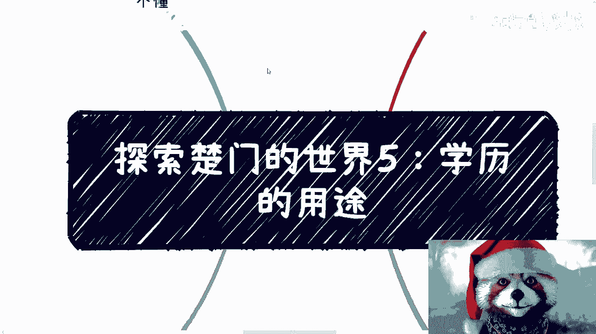

# 探索楚门的世界5-学历的用途---P1---赏味不足---BV1vH4y177bu

在本节课中，我们将深入探讨学历在不同环境下的实际用途。我们将分析学历在求职、创业、社会资源获取以及体制内发展等多个场景中的作用，并揭示其背后的逻辑与局限性。

---

## 概述

无论在第一层象牙塔内还是象牙塔外，学历都有其特定的用途。然而，其作用的时间周期和本质在不同环境中存在显著差异。本节课程将细分这些差异，帮助初学者理解学历的真实价值。

---

## 第一层象牙塔内：学历的用途

上一节我们介绍了学历在不同环境下的普遍存在性，本节中我们来看看在第一层象牙塔内，学历的主要用途。

### 1. 求职门槛

学历在求职初期作为重要的门槛存在。随着毕业时间增长，其效果逐渐衰减。

*   一般专业在毕业后三到五年左右，学历的作用基本消失。
*   三十岁后求职，面试官很少再考察学校所学的专业知识。
*   三十五岁到四十岁左右，无论出身何种学校或专业，个人基本成为标准化产品。此时强调名校背景已无实际作用。

社会需要给予年轻人机会，这是金字塔结构社会的自然规律。

### 2. 资源获取与创业

有人认为高学历有助于获取业务资源或创业。然而，这二者并无直接因果关系。

*   商业活动核心关注的是**金钱**、**资源交换**和**商业逻辑**。
*   如果学历与成功直接相关，那么所有同等学历者应拥有平等机会，但事实并非如此。

媒体更倾向于报道高学历者的成功案例。同时，高学历群体中“会折腾、会包装、聪明”的人比例更高，但这并非学历本身带来的特质。核心在于个人能力，而非学历高低。

---

## 第一层象牙塔外：学历的多样化用途

在象牙塔外的商业世界，学历的用途变得更加多样化。它与其他成就（如论文、学术成果、专业证书）一样，成为一种需要在特定场景下使用的工具。

以下是学历可能发挥作用的几种场景：

*   **政府项目申报**：某些项目需要高学历团队作为申报条件。
*   **创业与孵化**：一些创业公司或政府孵化项目需要高学历人士“站台”以提升信誉。
*   **知识付费与背书**：在向象牙塔内人群售卖课程或进行知识变现时，需要高学历者进行背书。

然而，关键在于**使用者是否懂得如何“变现”这张文凭**。学历如同一把钥匙，必须找到对应的门锁才能发挥作用。如果不知道门锁在哪，钥匙本身毫无用处。

核心在于了解**项目内容**、**对接渠道**、**目标人群**和**市场关注点**。例如，低学历者捡垃圾致富无人关注，但清华毕业生捡垃圾却能成为新闻。这说明了**关注点**和**叙事**的重要性，而非学历本身是成功核心。

在商业世界中，几乎没有哪个业务是仅凭高学历就能必然获得的。如果存在这种因果关系，所有高学历者早已实现财富自由。

---

## 向上流动与体制内发展

有人认为“往上卷”学历必不可少，这通常指获取更高的社会地位与政治地位，尤其在体制内。

学历确实是参与这场游戏的一张“牌”，但绝非唯一，且比重不高。

对于普通人而言，在体制内向上发展，除了学历，还需要考虑更多因素：
*   人际关系与家庭背景
*   察言观色与沟通能力
*   对领导意图的理解与执行力
*   待人接物的软性技能

这类似于出国发展：在同等学历的竞争中，还需要与拥有更多经济资源、文化背景更契合的对手竞争。学历只是众多基础条件之一。

宣传中刻意突出学历的重要性，是因为其他因素（如资源、背景）难以通过个人努力快速弥补，从而引导大众聚焦于可“内卷”的学历赛道。从更大格局看，这本身也是一种社会筛选与资源分配机制。

信息差在于，许多人认为“拥有学历就万事大吉”，但实际上，无论在塔内还是塔外，都并非如此。这里存在两层逻辑：
1.  **拥有与否**：这是基础条件。
2.  **如何使用**：这是关键能力。

即使个人没有高学历，如果懂得其运作逻辑，也可以整合拥有高学历的人才来创造价值。核心是理解规则并运用资源，而非盲目参与内卷。

我们做一个简单的数学题：如果社会金字塔顶端只有1%的位置，但99%的人都为此付出了巨大的时间与金钱成本，那么这种竞争的最终受益者是谁？目的又是什么？

---

## 总结

本节课我们一起学习了学历的多面性。
*   在**象牙塔内**，学历主要是**初入职场的敲门砖**，其效用随时间快速衰减。
*   在**象牙塔外**，学历是**众多工具之一**，其价值取决于使用者是否懂得在特定场景下将其“变现”。
*   在**向上流动**（尤其是体制内）过程中，学历是**必要但不充分的条件**，软技能与资源同样关键。

学历有其用途，但很少成为成功的核心因果因素。理解其工具属性，并培养将其与具体目标、资源、场景相结合的能力，比单纯追求一纸文凭更为重要。