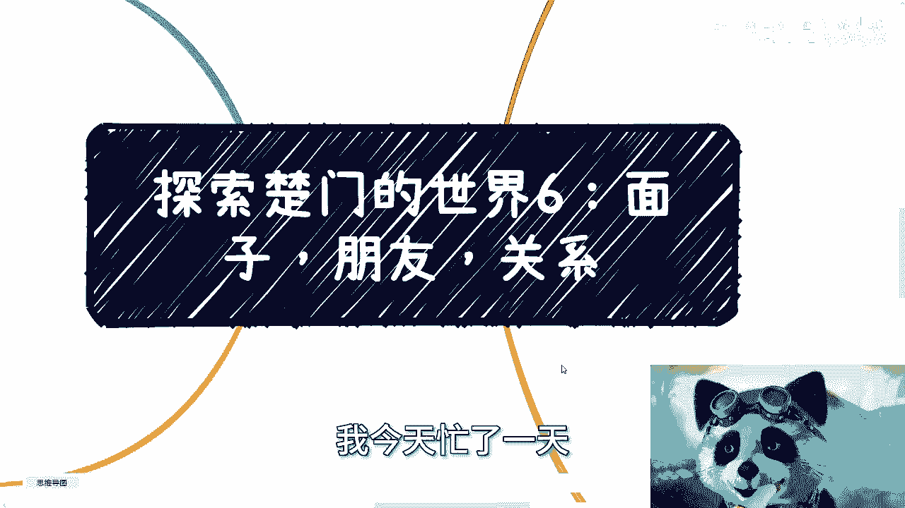
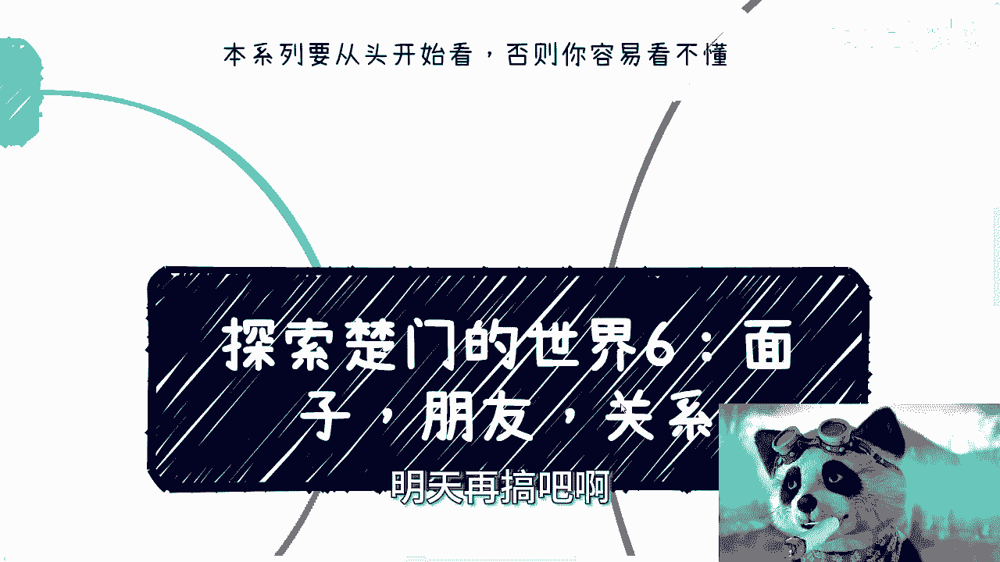
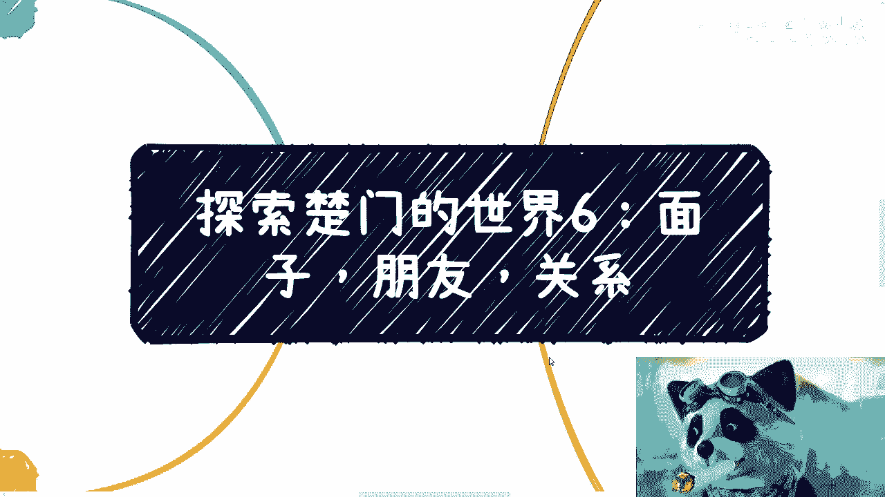
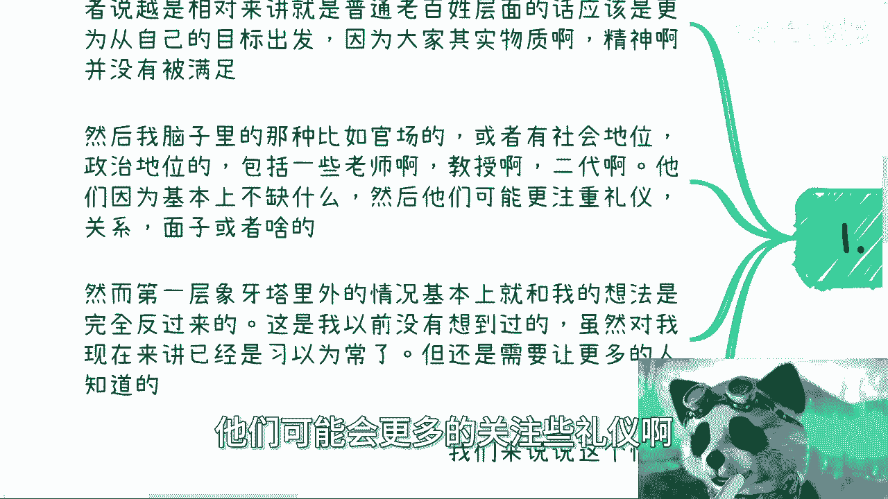
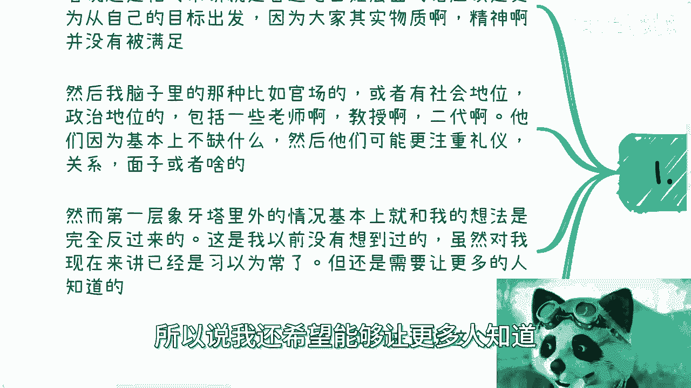
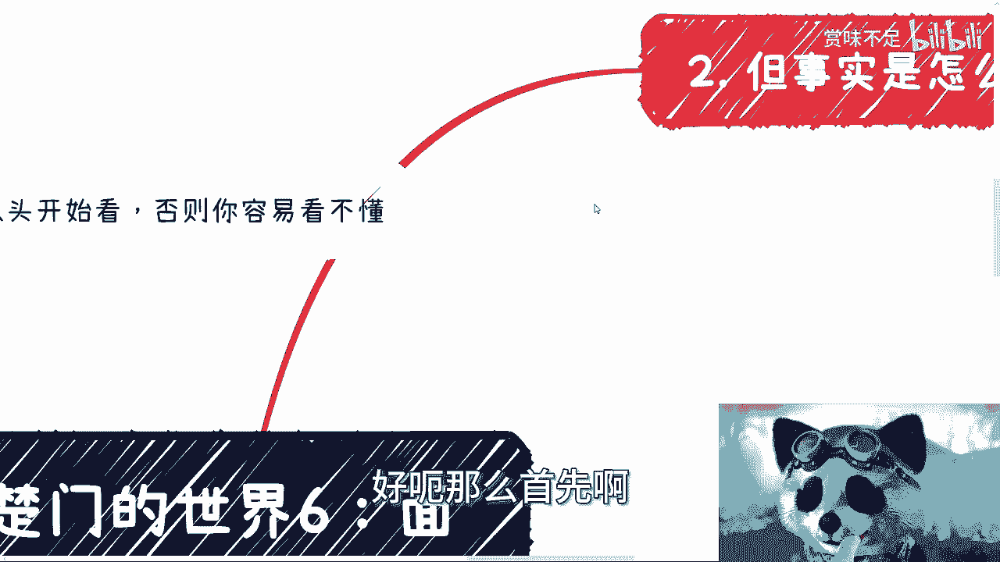
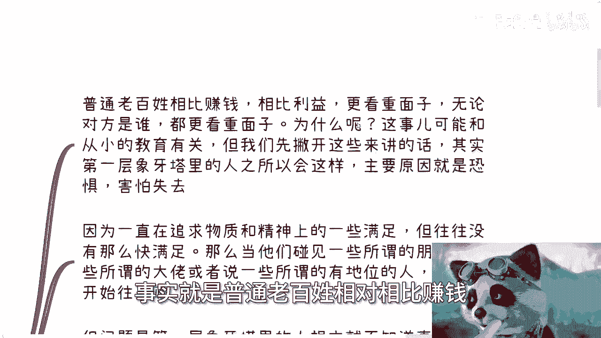
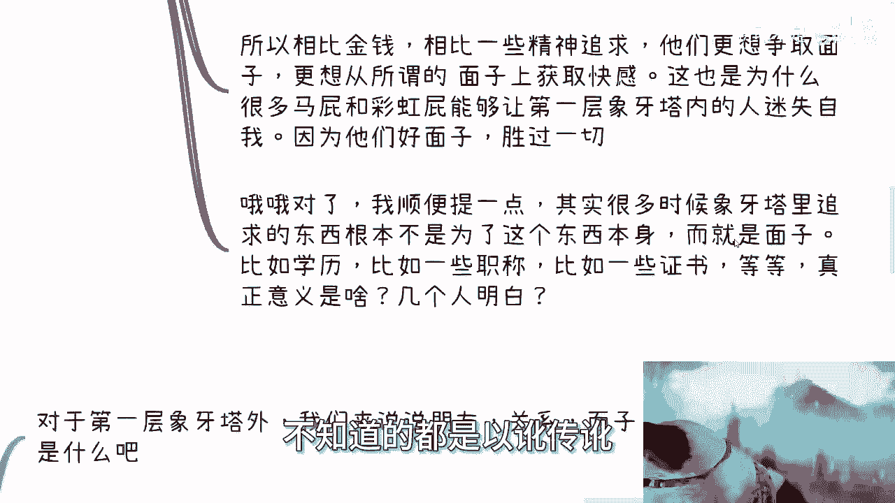
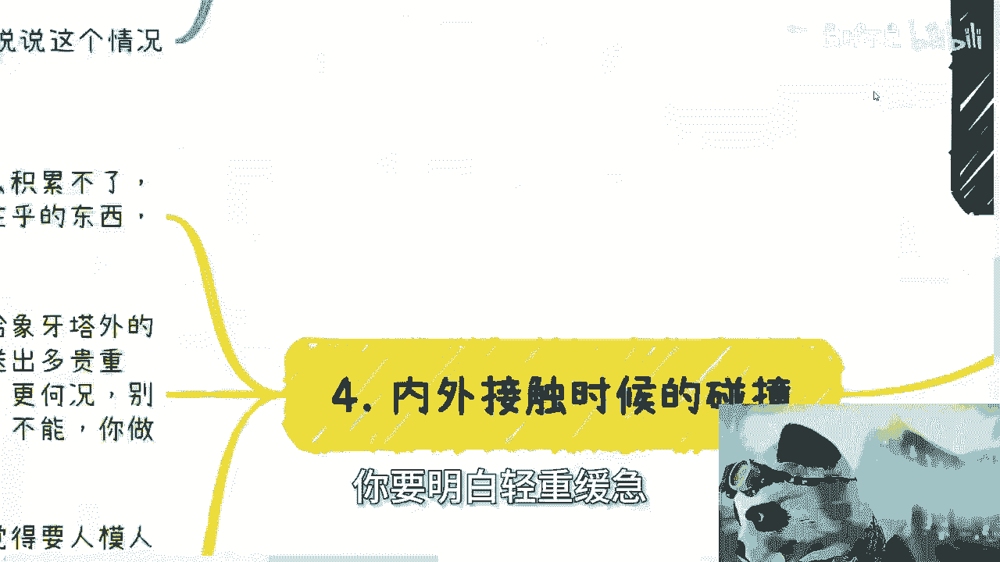
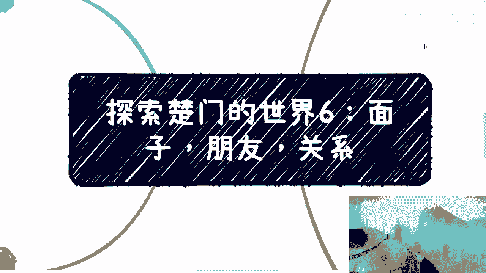

# 探索楚门的世界 06：象牙塔内外的面子、朋友和关系 - P1 🏛️🤝



在本节课中，我们将要学习“面子”、“朋友”和“关系”这三个概念在第一层象牙塔内外人群中的不同表现与本质差异。我们将通过对比分析，揭示常见的认知误区，并理解不同圈层背后的核心逻辑。



---


## 概述：一个被反转的认知


我从小到毕业，一直持有一种观点：普通老百姓更关注实际目标，而社会地位较高的人则更注重礼仪、关系和面子。

然而，现实情况与我的想法完全相反。这个事实是我以前从未想到过的。虽然我现在觉得这很正常，但换位思考后，依然觉得这种现象颇为神奇。因此，我希望让更多人了解这一现实。

上一节我们介绍了本系列的基本视角，本节中我们来看看“面子、朋友和关系”在第一层象牙塔内外的具体表现。

---



## 第一层象牙塔内：面子重于利益

首先，我们来阐述事实。



事实是，相比赚钱和实际利益，普通老百姓更看重面子。这一点可以从你们的父母或亲戚身上观察到。无论对方是谁，他们往往更在意面子。



### 核心原因：恐惧与匮乏



在我的理解中，第一层象牙塔内的人之所以如此，核心原因是**恐惧**。恐惧更深层的原因是**害怕失去**。


他们一直在追求物质和精神满足，但往往难以快速实现。当遇到所谓的“朋友”、“大佬”或有地位的人时，他们会主动贴近。

以下是他们行为背后的逻辑链：

1.  **缺乏选项**：他们将这些人视为“救命稻草”，是因为自身没有其他更好的选择或资源。
2.  **唯一筹码**：由于缺乏其他有价值的东西进行交换（象牙塔内的人极少拥有塔外人没有的稀缺资源），他们只能通过给对方面子、维护对方面子的方式来维系关系。
3.  **认知模糊**：他们并不清楚什么是真正的价值、什么是真正的“大佬”。因此容易基于模糊的感觉（如“对方有一套完整的方法论”）来判断，从而可能被表象欺骗。
4.  **害怕失去**：由于无法分辨，他们害怕失去任何一根自认为是“救命稻草”的关系，因此会极力维护面子。

**公式表达其行为逻辑：**
```
行为驱动力 = 恐惧(失去) × 认知模糊(价值)
主要表现 = 过度维护面子
```

### 面子带来的虚幻快感

因此，相比金钱和精神追求，他们更想争取面子所带来的快感。例如：“看，我今天认识了某某大佬”、“我们合作了”、“我拿到了某某聘书”。这些很多时候是虚的。

这也是为什么许多奉承和“彩虹屁”能让塔内的人迷失自我——因为他们好面子，认为这胜过一切。

### 面子的常见载体

需要指出的是，很多时候塔内人群追求的东西，其根本目的并非事物本身，而是面子。

以下是常见的面子载体：
*   **学历**：面子占据很大成分。
*   **职称**：面子占据很大成分。
*   **某些证书**：面子占据很大成分。

这些投入与真正的经济回报或实际意义往往不成正比，且很多人并不明白其真正意义，只是以讹传讹。

---

## 第一层象牙塔外：利益重于形式

接下来，我们看看第一层象牙塔外的情况。




需要明确，并非说塔外的人只看重利益、行为野蛮。相反，他们通常彬彬有礼、讲究礼尚往来。


但关键在于，**这些礼仪和形式对他们而言只是一层“皮”**。他们并不真正看重这层皮，其核心关注点是皮背后的**利益交换**。塔内人所看重的“面子”，在他们眼中可能一文不值。

### 朋友的定义与形成

对他们而言，朋友基本分为两类：

1.  **经过时间锤炼的关系**：如同学、发小。
2.  **有共同利益的战友**：从一起赚钱、有利益绑定的伙伴中，再筛选出价值观相符、相处愉快的人。

**代码描述其朋友筛选逻辑：**
```python
# 塔外人的朋友形成逻辑
def make_friends(acquaintances):
    friends = []
    for person in acquaintances:
        if has_shared_interest(person) or has_long_history(person): # 先有共同利益或长期关系
            if values_align(person) and get_along_well(person): # 再筛选价值观和相处体验
                friends.append(person)
    return friends
```
这与塔内“先凭感觉成为朋友，再看看能否合作赚钱”的逻辑是相反的。

### 关系的本质是价值交换

从宏观角度看，关系的维护如同面子一样，也是一种形式或“皮”。例如吃饭、送礼、娱乐等。

对于塔外的人：
*   **这层“皮”**：有，可以更开心；没有，也无伤大雅。
*   **关系的核心**：根本在于背后能否一起创造价值、赚钱。**能赚钱，就有关系；不能赚钱，关系就是空谈。**

因此，不要误以为参加一些活动、认识一些人就建立了有价值的关系。对塔外人而言，那可能根本不叫“关系”。

### 为何仍要做这层“皮”？


既然这层“皮”不重要，为何很多人仍会去做？原因在于现实世界的复杂性。


关系并非非黑即白。当你与塔外人仅有商业合作时，对方可能同时存在亲戚、发小、师生等更强的关系纽带。在“一起赚钱”这个基础之上，适度的礼节（这层“皮”）有助于在多重关系中维持一个相对良好的竞争或合作位置。

**核心要点：** 世界不是二极管。明白“皮”不重要，不代表完全不做，而是要理解其从属地位，明白每个人心里的真实权重。

---

## 内外碰撞：认知错位导致失败

内外接触时的碰撞是最有趣的现象。很多人做了自认为正确的事却没有成功，或别人不愿合作，根本原因在于：**你在乎的东西，别人不在乎。**

以下是几个具体例子：

*   **送礼**：给塔外的人送礼，对方真的在乎吗？你能送出多贵重、多稀缺的礼物？实际上，对方心里只关心一件事：**你能不能带来价值/赚钱？** 如果不能，送礼可能只会让对方觉得烦。
*   **外貌与称呼**：有必要打理外貌、注意称呼吗？在同层级（塔内）之间有必要，因为他们在乎。但对于塔外的人，他们见过世面，**不会以貌取人，也不会以称呼取人，只会以“能否一起赚钱”来取人**。
    *   **举例**：很多人纠结如何称呼我。我的态度是：无所谓。如果我因为一个称呼而改变对人的态度，那我的格局也太小了，也别谈赚钱了。

### 关键在于判断“对方在乎什么”


做很多事情要明白轻重缓急。一时的荣辱得失，尤其是素未谋面时的礼节细节，并非关键。



**思考逻辑：**
```
你的努力是否有效 = 你的行为 × 对方对该行为的在乎程度
```
如果你花时间在别人根本不在乎的事情上，努力就是无效的。

与其如此，不如多去了解、沟通，弄清楚对方真正在乎什么。你的肉身和地位可以在塔内，但这不妨碍你了解塔外的逻辑。了解的渠道很多，关键在于你是否主动。



**最终你会发现**：很多事情的失败，从源头就错了。如果战略方向不对，后续再多的战术努力也效果有限。

---

## 总结与行动建议

本节课中，我们一起学习了“面子、朋友和关系”在象牙塔内外的本质区别：

1.  **塔内逻辑**：因恐惧和资源匮乏，**面子重于实际利益**。行为围绕维护虚幻的关系和快感展开。
2.  **塔外逻辑**：形式为“皮”，**核心是价值交换与利益绑定**。朋友和关系建立在共同创造价值的基础之上。
3.  **内外碰撞**：失败常源于**认知错位**——用自己在乎的标准去衡量不在乎此事的对方。

**行动建议**：
*   审视自己是否过度追求“面子”而非实际价值。
*   在试图与更高圈层建立连接时，**优先思考“我能提供什么价值”**，而非“我该如何奉承或送礼”。
*   拓宽视野，主动了解不同圈层的思维模式和游戏规则，避免战略层面的根本性错误。


你的洞见大小取决于你自己。拒绝了解，则永远不见光亮；积极观察，洞口终将越来越大。