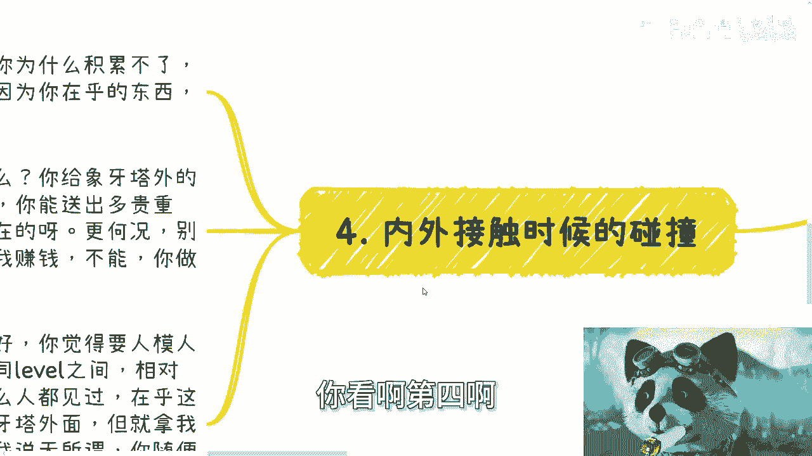
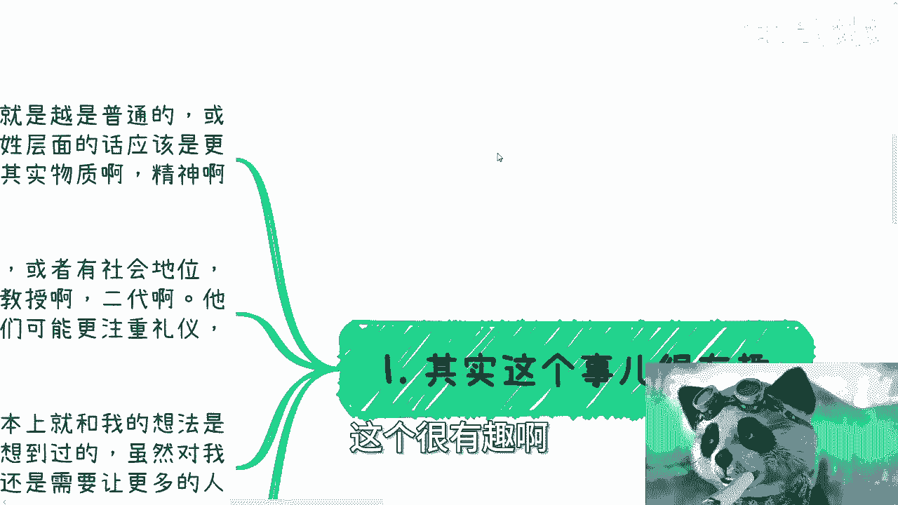
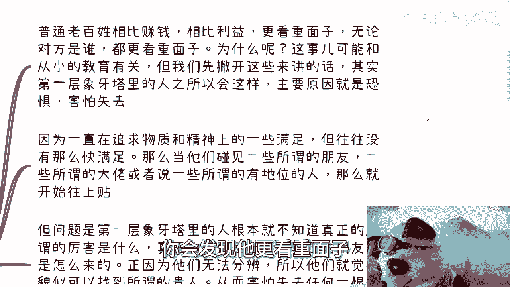
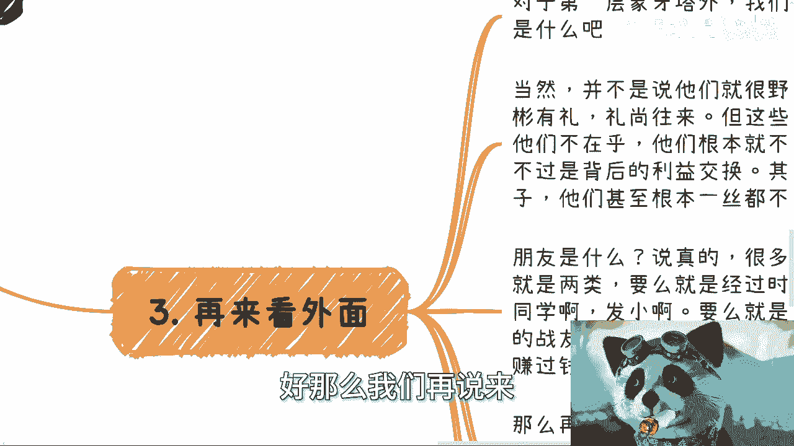
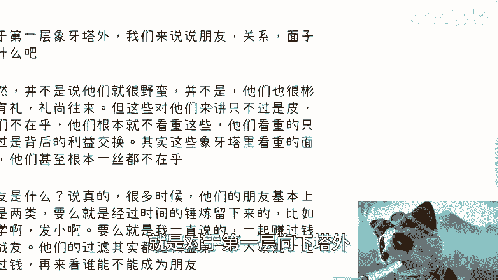
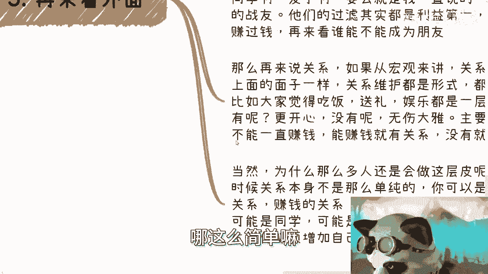
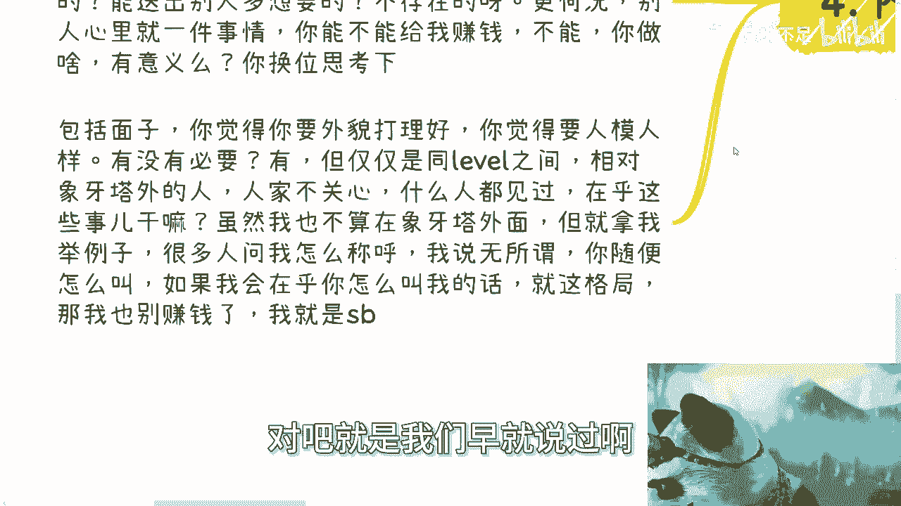
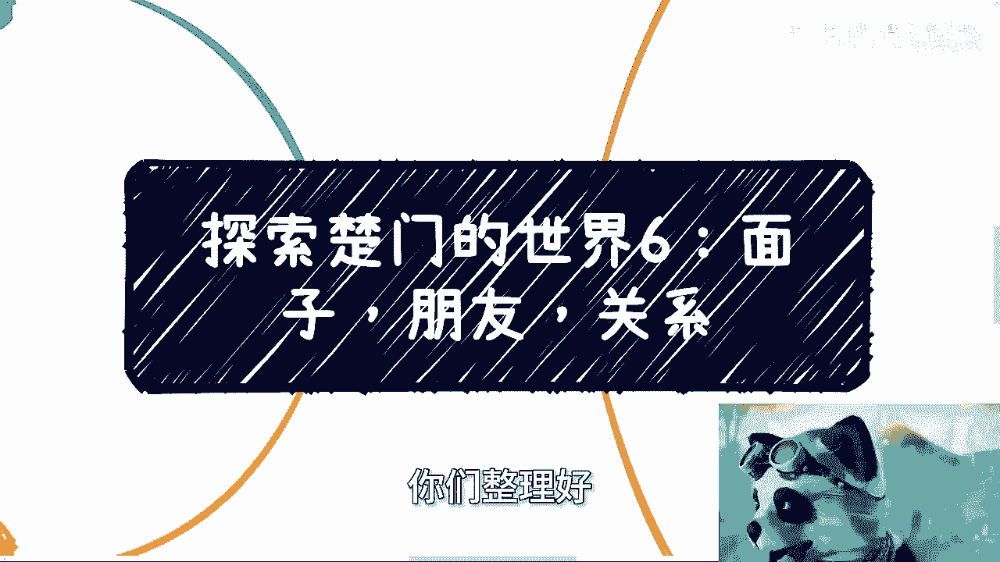

# 探索楚门的世界6：象牙塔内外的面子，朋友和关系 - P1 - 赏味不足 - BV1sS421w72H

啊今天礼拜五了，我今天忙了一天。

我靠就啊今天就只能先给大家搞一个，明天再搞吧啊啊本系列从头开始看啊。

否则你很容易看不懂啊，呃那么我们今天来讲的，继续来讲这个探索楚门的世界，呃今天来讲的这个点呢是面子朋友跟关系啊。

呃首先呢你看啊。

第四啊，就是我们会说到第一层，象牙塔内外的这个冲突啊，这个很有趣。

但是我们先从第一个开始讲，其实这个事呢我觉得很有趣是什么，就是你看啊，我从小到我毕业了，我一直都觉得啊呃一般啊，越是普通或者说越是相对呃来讲，这种普通老百姓层面，我本来其实是想讲那种。

就比如说相对穷或者怎么样，但我后来觉得跟穷没有关系，就是应该就老百姓层面啊，应该是更从自己的目标出发，因为大家大部分人呢就是物质精神啊，他其实就没有被满足嘛对吧，然后呢我脑子里面呢就是哎呀呀放大了。

我脑子里面就是那种，或者来说什么哎我这样，稍微放一下啊，或者说有社会地位或者政治地位的这种人呐，包括一些老师啊，教授啊，院长啊，二代啊对吧，我我以前是觉得他们基本上不缺什么，然后呢呃正因为他们不缺什么。

所以说他们可能会更多的关注一些礼仪啊。

关系啊，面子什么的，然而第一层象牙塔里外的情况呢，就事实上的情况，就跟我的想法是完全反过来的啊，而且我觉我我也知道，大部分人的想法其实跟我以前是一样的啊，那么这是我以前就对我来讲啊。

就是我发现其实从就这个事实情况是，我以前从来没有想到过的啊，虽然对我现在来讲呢，我觉得我已经就觉得很正常对吧，但是你换换位思考一下，你还是会觉得就是说啊，不是那么的就比较神奇啊。

所以说我还希望能够让更多人知道。

那么我们来讲讲这个情况好。

那么首先啊先说事实是什么样子的，事实就是普通老百姓相对相比赚钱。

相比利益更看重面子，这一点我觉得你们心里是清楚的，你们从你们的父母，从你们的别亲戚身上，你们就会看就会看到，就是说无论对方是谁，你会发现他更看重面子。

为什么啊，因为这事呢可能跟从小教育有关，但是我们先撇开这些东西啊，我们不来讲教育啊，呃我觉得本质上在我的理解上啊，其实第一层象牙塔里面的人之所以会这样，主要的原因是恐惧，恐惧，它更深层次的原因是什么。

是害怕，而且是害怕失去，因为一直在追求物质和精神上的一些满足，但往往没有这么快去满足，就像大家也一直在追求父母，一直在追求，但是满足了吗，没有啊，他只是温饱对吧，那么当他们碰到一些所谓的朋友啊。

一些所谓的大佬或者说一些所谓的有地位的人，那么你就会发现它会往上贴，那么它会往上贴，是为什么，是因为他会觉得是救命稻草，但是他为什么会觉得是救命稻草，是因为他没有别的选项啊，那么好。

那么这个时候就问题来了，那么如果他觉得这位大师啊，这位贵人是救命稻草，那他怎么办呢，他是不是只能通过面子，为什么，因为他没有别的东西啊，他有什么东西呢，你有什么东西是别人没有的呢，就象牙塔内的人。

有什么东西是象牙塔外的人没有的呢，极少对吧，所以说我们来讲啊，问题是第一层象牙塔里面的人，他根本就不知道，所谓真正的就是我们称之为真正的大佬，真正的厉害，真正的是什么，什么样子的，真正价值是什么。

他不知道啊，所以才会有很多人被骗了，才会有很多人觉得哎呀这个人态度很牛逼，那个人怎么样怎么样对吧，所以说呃我们在问真正的朋友怎么来的，知道吗，也不知道，他就会觉得哎我跟这个人聊得好。

就像就像就像今天这个咨询的时候，还有人，我就问他，我说那你为什么要跟对方合作，他说我觉得对方是个大佬，那我说为什么对方是个大佬呢，他说他有一套完整的方法论，我说哦他有一套完整的方法论，就是大佬了。

奇了怪了，你怎么知道他方法中是完整的呢，对吧，所以说很多观念是模糊的，都是自己编出来的啊，所以说正因为第一层象牙塔内的人，他无法分辨哦，所以说他就会觉得貌似找到了所谓的贵人，但是真的是贵人吗。

不是我们后面会讲的啊，所以说他从而害怕失去任何一根，他们认为的救命稻草啊，所以你会发现相比金钱来讲，相比一些精神追求来讲，他们更想争取的是面子，因为他更想争取的是所谓面子上所获得的快感，就比如说爱我。

你看我今天跟某某大佬认识啊，我今天跟某某某大佬合作啊，我比如说我们拿到了某些某些什么特别的东西，对吧，我拿到什么聘书，什么东西有用了，没有用的，其实都是虚的东西对吧，这也是为什么很多马屁跟彩虹屁。

能够让第一层下那象牙塔内的人去迷失自我，为什么，因为他们好面子，他们觉得这胜过一切啊，那白的胃啊，白的味，我顺便提一点呃，其实很多时候现在塔内追求的东西，根本不是为了这个东西本身，而就是面子。

比如说学历啊，我不管你们怎么想的，我也不管你们父母怎么想的，面子是单占大部分，就是这么个情况，不要自欺欺人，没什么意义的，比如说什么职称，比如说一些一些证书，其实都是面子，你说赚钱嘛。

也许有的东西赚钱能赚多少钱呢，那跟你们的投入成正比吗，对吧，那这些某些证书，某些东西真正的意义是什么呢，请问几个人明白呢，不知道的都是以讹传讹。

好那么我们再说了。

再说第三点就再来看外面外面是什么呢，就是对于第一层象牙塔外。

我们来说说呃，我们来说说朋友关系，面子是什么，当然啊并不是说啊，就是说好像啊他们只看重利益啊，然后他们就很野蛮啊，并不是因为我觉得你们可能也能看得到，就是他们是彬彬有礼的礼尚往来的对吧，但是你要明白。

也就是说这些东西对他们来讲是层皮，他并不在乎谁会在乎这些皮呢，对他们其实根本就不看重这些P，他们只看重的是背后的利益交换，其实这些象牙塔里面看重的面子，他们甚至一点都不在乎，有啥好在乎的，你们想想看。

你们所在乎的面子，对他们来讲一文不值啊，然后朋友是什么，说真的啊，很多时候他们的朋友基本上就两类，要么就是经过了时间的锤炼留下来的，比如说同学啊，发小啊，要么就是我一直说的大家一起赚过钱。

一起有利益绑定的占有，然后他们从这些战友当中再去过滤出来，价值观一样的对吧，然后大家一起能说得来的，大家能够多多少少能够开心一点的成为朋友，而不是像象牙塔那里面是反过来的。

是一开始凭感觉哎我觉得这人聊的不错，我想先成为朋友，后面看看能不能赚钱，不是这样子的好，那么我们再来说关系，那么如果从宏观角度来讲，关系的维护就如同面子是一样的，什么意思呢，就是关系的维护其实都是形式。

它都就是还是一层皮，比如说大家觉得吃饭觉得送礼，觉得娱乐啊，觉得呃呃呃呃别的一些形式啊，它其实都是一层皮，那么对于外界来讲啊，对于像他外的人来讲，这层皮有难更开心，没有难，无伤大雅哦。

主要还是背后能不能一起赚钱，有赚钱就有关系，没有赚钱就是扯淡，所以说不要觉得就是说啊，我到外面什么认识一些人，参加一些活动对吧，好像就来问我啊，陈老师，我们怎么维护关系，这他妈对你们来讲就不叫关系啊。

当然啊为什么这么多人还是会去做这层皮啊，你们因为你们会觉得，虽然我们说这层皮对他们来讲不重要，对不对，但是呢很多人还是会去做，为什么呢，因为很多时候关系本身不是那么单纯。

就是你今天比如说你跟我都是商业合作的关系，对不对，赚钱的关系，但是人家可能是亲戚关系，可能是发小关系，可能是同学关系，可能是师这个师老师关系，师生关系，那么我们肯定是没法跟这些关系相比的。

那么我们就必须在我们一起赚钱的这个，基础之上，因为你要明白啊，不是世界，不是二极管啊。

不是说我今天跟你们讲，这是层皮啊，大家不在乎你们就不做哪，这么简单吗。

对不对，但是你们要明白每个人心里面是怎么看的啊，那么就到第四点就是内外接触时候的碰撞，这件事情是最最有趣的啊，那么你有很多人会觉得哎我做了一些事情啊，我做了一些我认为的事情，为什么我没有成功。

或者为什么别人不愿意合作，但是因为很简单，你在乎的东西别人不在乎啊，对吧好，那么就像我们举个例子，比如说很多人问我送礼送啥重要，要不要送，我就问你给象牙塔外的人送礼，谁在乎他在乎个屁，对不对。

就是说你能送出多贵重的，我真的我我我实事求是来讲，我不是看不起大家啊，你能送多贵重的礼，你能送出别人多想要的东西，不存在的哦，不存在的，更何况别人心里就一件事情，你能不能给我赚钱，如果不能，你给我滚。

你换位思考一下，你换位思考一下，如果你是他，你真的在乎别人送礼吗，你只会觉得他烦，你知道吗，包括面子啊，我们就说啊，你觉得你要外貌打理好，你觉得要人模人样，有没有必要，有的啊，我不能跟你们讲，没有必要。

但是仅仅是同level之间有必要，为什么，因为同label之间他在乎这些事情，相对香港塔外的人来讲，人家不在乎啊对吧，什么意思，人家什么人没见到过，人家会以貌取人吗，不会的，人家会以你的行为取人吗。

也不会的，人家只会以你们能不能一起赚钱来取人对吧，你在乎这些事情干嘛，你就拿我来举个例子啊，虽然啊我也认为我不算在象牙塔外面的人啊，但是你就拿我来举例子，很多人就问我。

他说哎那个那个我们可能不知道你称呼，怎么称呼你啊，或者说用你呢还是用您呢对吧，还是说就叫陈老师，还叫叫叫赏味，还叫什么，我说无所谓，你叫我也可以，你随便叫，为什么，因为如果我会在乎你怎么叫我的话。

我就这点格局，那我也别赚钱了，我赚什么钱呢对吧，就是我们早就说过啊。

做很多事情你要明白轻重缓急对吧。

包括很多时候人我们都知道一句话叫什么，叫一时的荣也好，儒也好，都不是问题，你更何况这种大家素未谋面，我跟你们就是萍水相逢，你们不管礼貌也好，不礼貌也好，你们随便怎么称呼我哦，难道我会因为这个人称呼我好。

我多帮他一些啊，这个人称呼不好，我很讨厌他，卧槽我要是这点格局，那我还赚什么钱啊，你们想想看是不是对吧。

所以说其实很多时候啊，你们去就是思考问题的时候，你们一定要问问自己，就是这些问题到底重不重要，对对方重不重要，对方的格局会不会在乎这个东西，对不对，就是你不要用你的格局去去去衡量它没有用的。

你在乎的东西对方不在乎，你再怎么做也没有用啊，有什么用呢，对不对哦，所以说你与其花时间浪费在一些，别人不在乎的事情上面，还不如多了解，多聊聊，去看看到底别人在乎什么对吧，就是你今天你的肉身，你的人。

你的地位，你的这个定位可以在象牙塔内，但是并不代表你不能了解外面啊，你了解外面的方式多了去了，你可以这个窥视，那那我们就说这个洞到底有多大，取决于你啊对吧，你不动你，你你你拒绝了解，那这个洞永远没有。

你甚至连一丝光都看不到对吧，你但凡积极的去看，你早晚这个洞会越来越大，不就这么一个道理吗对吧，但是你最终会发现是什么，你最终就会发现很多事情你从源头就错了，你明白吧，你总之最终你会发现。

其实很多事情你从一开始方向就不对，战略就不对，那后面你再怎么努力，有用了，没有用的呀，好吧行，那我们今天这个内容就讲到这儿啊，嗯一样的好吧，就是商业职业啊，然后什么商业职业啊，然后什么合同啊。

然后包括你有什么idea啊，包括就是未来发展啊，或者怎么样子，然后又有细节要聊的啊，你们整理好。

