# 探索楚门的世界7-象牙塔里外看问题的重点-天差地别---P1---赏味不足---BV1gW421A7

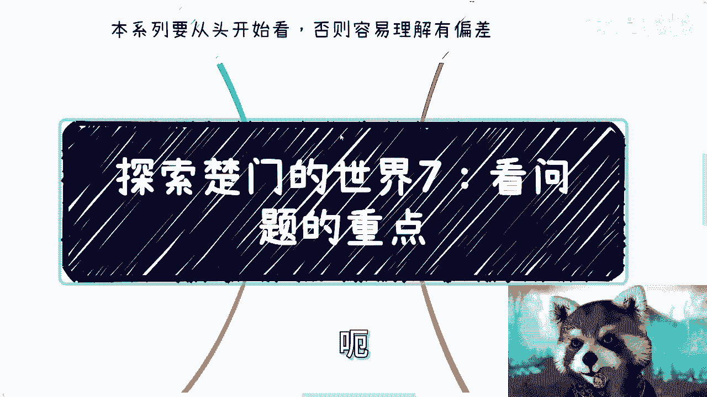

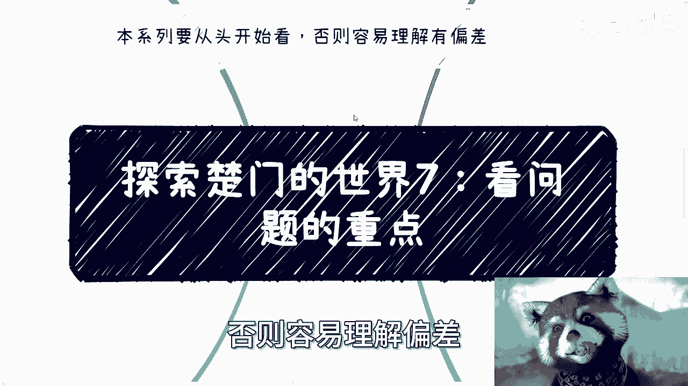

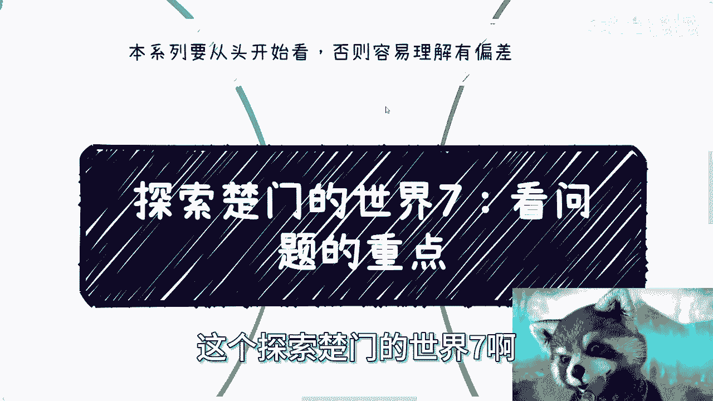

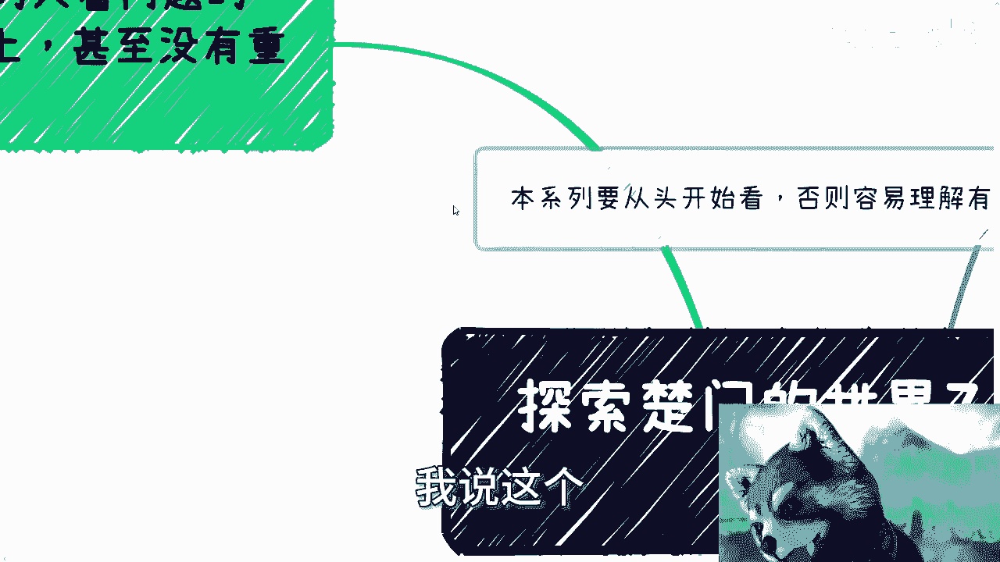

在本节课中，我们将探讨一个核心问题：为什么“象牙塔内”与“象牙塔外”的人看待问题的重点截然不同。我们将通过具体案例，分析两种思维模式的特点，并学习如何跳出细节陷阱，抓住问题的核心框架。

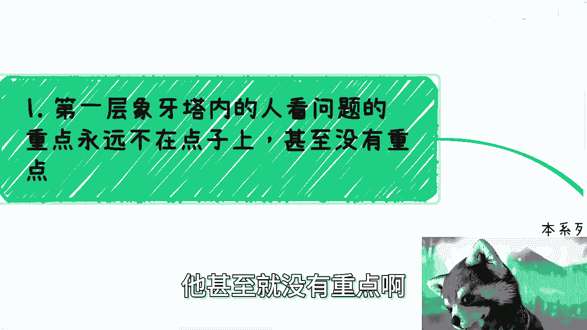

---

## 概述：两种截然不同的视角

第一层“象牙塔内”的人，其思考问题的重点往往出现偏差，甚至没有重点。这与工作年限无关，而是思维方式的问题。他们容易陷入细节，关注“怎么做”、“有没有模板”、“风险大不大”，却忽略了最根本的商业逻辑和框架。

相反，“象牙塔外”的人看问题，如同只看一个人的骨骼和框架，不关心血肉和内脏等细节。他们首要关注的是合作方、角色、合同、流量来源、付费逻辑等核心要素是否通畅。

上一节我们探讨了认知的局限性，本节中我们来看看这种局限性在具体问题分析上是如何体现的。

---

## 第一部分：象牙塔内的思维陷阱

“象牙塔内”的思维模式有几个典型特征，这些特征会导致行动停滞或方向错误。

### 1. 关注错误重点

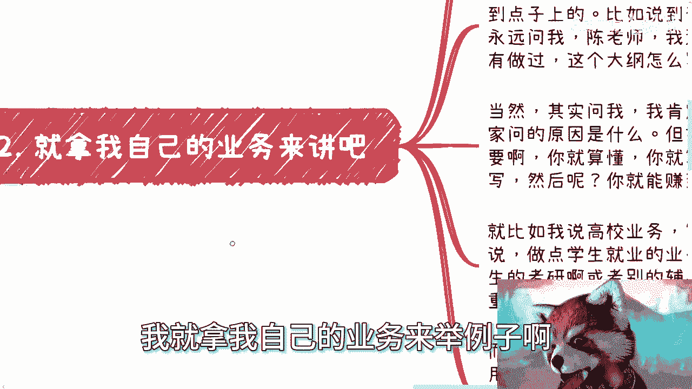

以下是常见的错误关注点示例：

*   **案例一：职业技能等级**。当建议探索“职业技能等级”方向时，塔内思维者会理解为“自己去考证书”，而非理解其核心是“组织业务，帮助他人考证并获取国家补贴”。
*   **案例二：产品与服务评估**。评估一个产品时，塔内思维者会纠结于“产品本身好不好”、“交互体验如何”。然而，在现实市场中，更重要的是分析其**营销策略**、**收费漏斗模型**和**用户触达路径**。因为市场成功往往不取决于产品“好坏”，而取决于这些商业逻辑。
*   **案例三：个人发展规划**。制定计划时，倾向于模仿他人做出宏大的“5年、10年规划”，却无法回答最实际的问题：**从0到1的具体步骤是什么？** 计划的第一步、第二步、第三步分别如何行动？

### 2. 被非核心细节阻碍

塔内思维者常因非核心问题停滞不前。

*   **过度依赖“模板”与“大纲”**：例如，开展企业内训业务时，首要问题不是“我不懂，有没有模板”，而是“客户是谁、合同怎么签、钱从哪里来”。所需的准备材料大多可通过搜索获得，而真正的重点——信息差和商业框架——是搜不到的。
*   **虚构不必要的风险**：在业务开始前，过度担忧“会不会有风险”、“会不会被抓”。在绝大多数普通业务层面，这种担忧是脱离实际且阻碍行动的。

---

## 第二部分：象牙塔外的核心思维框架

“象牙塔外”的思维模式是结果和行动导向的，它只关心决定事情成败的骨骼与框架。

### 核心原则：只看框架，不问细节

讨论任何业务或合作时，外部思维者只关心以下几个核心问题：

1.  **合作方是谁？** 有哪几方参与？
2.  **你的角色是什么？** 负责什么？
3.  **合同签了吗？** 法律框架是否确立？
4.  **流量/客户从哪里来？**
5.  **谁来付钱？付钱的逻辑通不通？**

只要这个**核心框架（骨骼）** 是通的，就可以立刻开始行动。细节问题可以在执行中不断完善。如果框架不通，讨论再多细节也无意义。

### 实践案例解析

*   **高校业务**：什么是真正的高校业务？合同甲方必须是高校。需要理清的框架是：与高校哪个部门对接？交付什么？高校为何需要？还需要引入哪些合作方（如第三方机构）？而不是先去纠结“做什么产品”（那是血肉）。
*   **合作与信任**：外部思维中，信任建立在“能否一起赚钱”和“流程是否通畅”的基础上。合作更多是渠道和分销关系，成功则继续，失败则更换，试错成本被多条业务线并行所分摊。

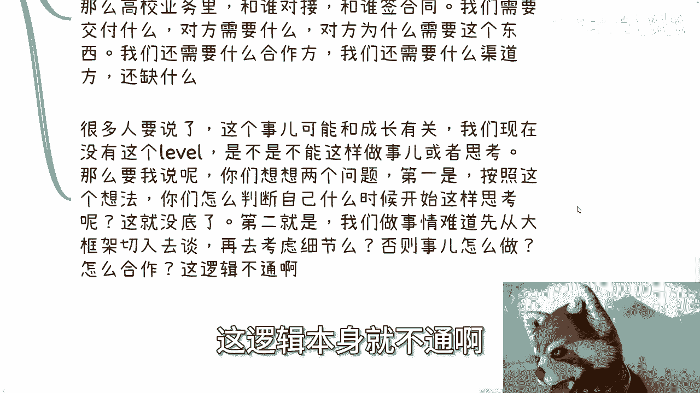

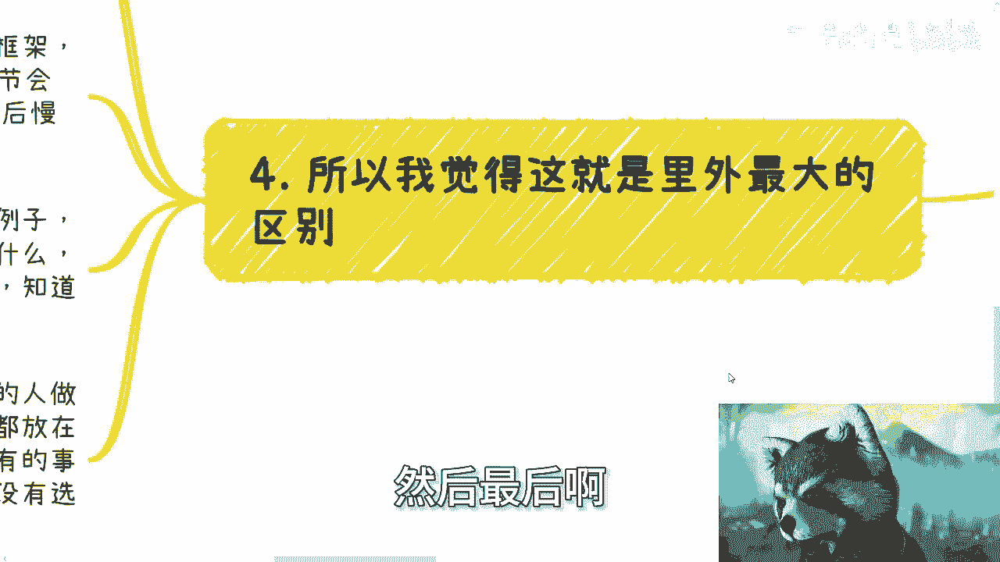

---

## 第三部分：关键差异与行动启示

两种思维模式导致了完全不同的行为与结果。

### 核心差异对比

| 特征 | 象牙塔内思维 | 象牙塔外思维 |
| :--- | :--- | :--- |
| **关注点** | 细节、方法、风险、模板 | 框架、流程、合作方、付费逻辑 |
| **行动力** | 因担忧细节而停滞不前 | 框架通就立刻行动，在行动中完善 |
| **风险观** | 夸大风险，惧怕试错 | 接受风险，通过多线并行降低单点试错成本 |
| **结果** | 抱怨、迷茫、没有选择 | 执行、调整、持续寻找机会 |

### 如何转变思维？

1.  **停止抱怨，开始提问**：每当思考一个问题时，先问自己：“这件事的核心框架（骨骼）是什么？” 强迫自己忽略所有细节，只列出上述五个核心问题。
2.  **接受“不完美起步”**：没有事情能在开始时尽善尽美。**逻辑通，就开干**。问题会在过程中暴露和解决。
3.  **并行多条线**：不要将所有希望寄托于单一路径（如学历、工作）。同时探索多个可能性，这是降低试错成本、拥有真正选择权的唯一方式。把自己逼上独木桥后再抱怨没有选择，是本末倒置。

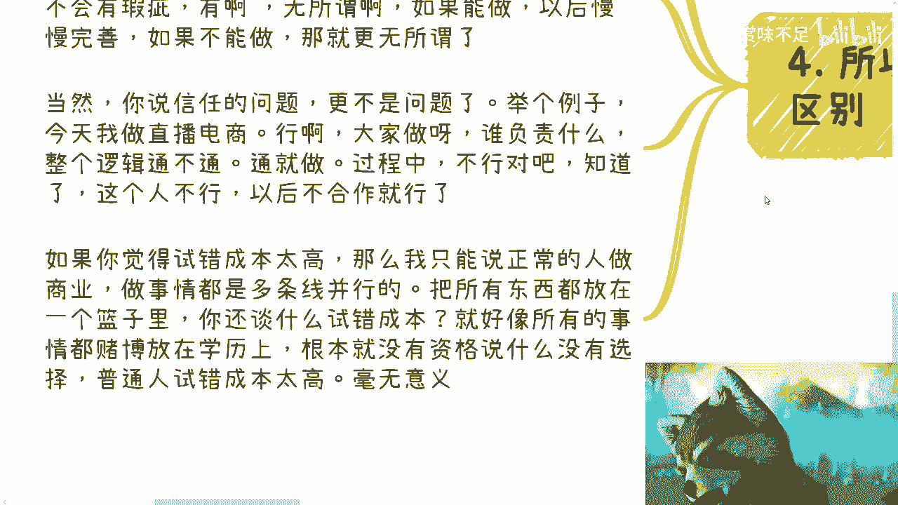

---

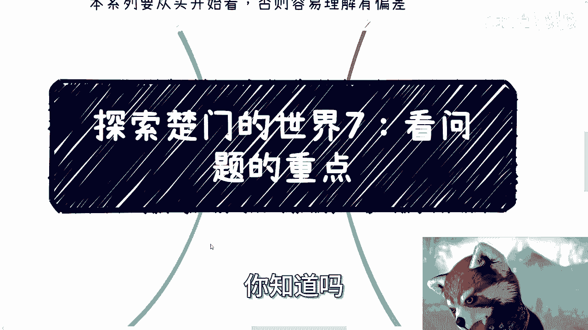

## 总结

本节课我们一起学习了“象牙塔内”与“象牙塔外”两种思维模式的根本差异。关键在于，**塔内思维困于细节（血肉），而塔外思维紧盯框架（骨骼）**。社会运行的现实是，成功者都在拼命抓住框架、快速行动、在试错中前进，而非在细节的完美主义中空想。

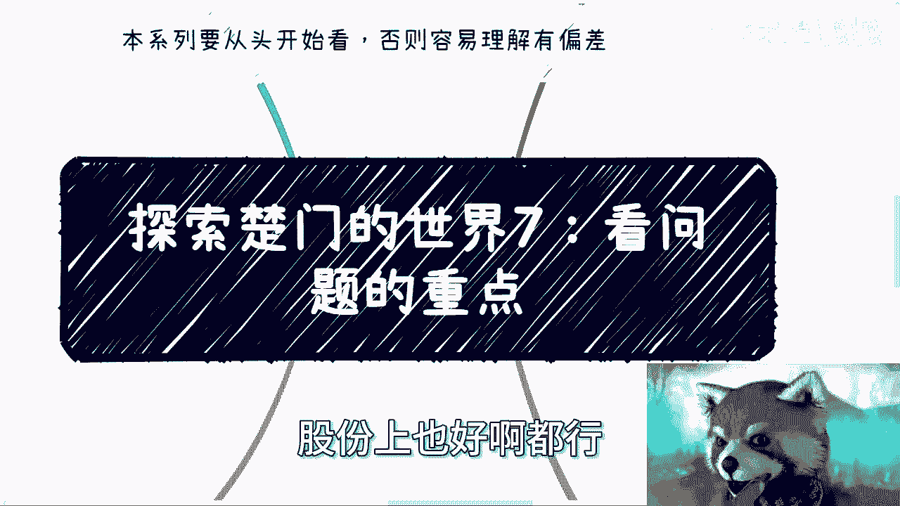

希望你能有意识地训练自己，在遇到任何问题时，首先画出它的“骨骼图”。当你能清晰地看到合作方、合同、角色、流量和金钱的流向时，你就已经站在了象牙塔之外。