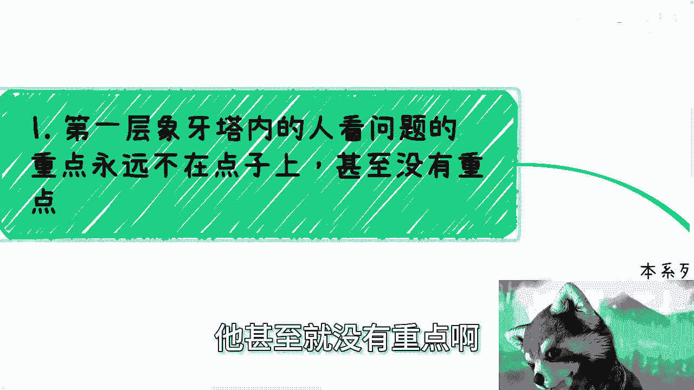
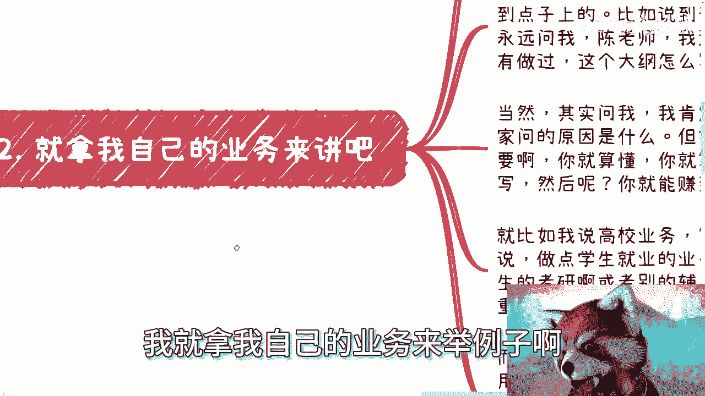
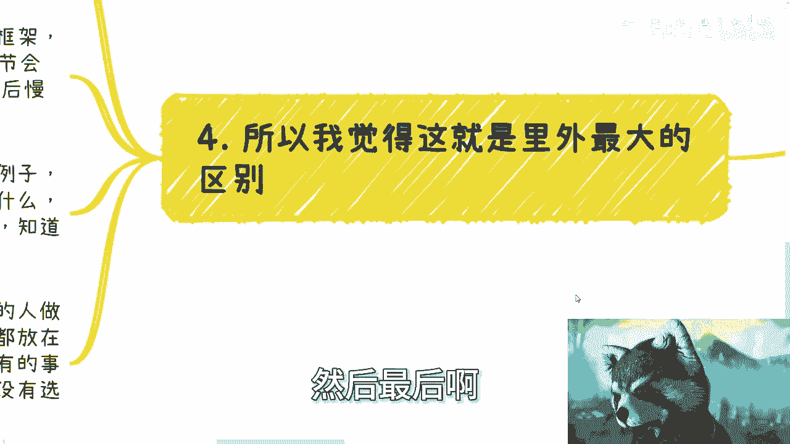
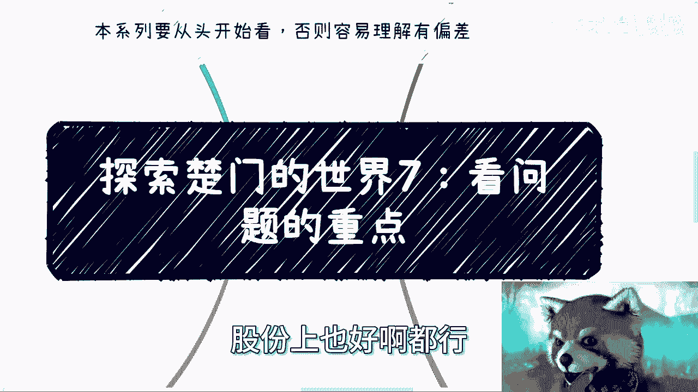

# 探索楚门的世界7：象牙塔里外看问题的重点，天差地别 - P1 - 赏味不足 - BV1gW421A7my

好啊。

首先提醒一下啊，这个本系列从头开始看啊，否则容易理解偏差。

啊那么我们继续来讲啊，这个探索楚门的世界七啊。

看问题的重点啊，顺便提一句，今天我又买一点点啊，我觉得这个因为我楼下只有一点点。

怎么办呢，呃我们讲这个东西啊，第一层象牙塔内的人看问题啊，我聊到现在啊，我就发现看问题的重点，他永远不在点子上，真的我我我真的就永远不在点子上，他甚至就没有重点啊。

这就好像我之前说啊，我我给你们讲个讲个故事啊，我之前跟有的人说职业技能等级对吧啊，然后我在充电视频里面也讲过职业技能等级，对吧啊，好然后呢你比如说有人问我啊，有什么好的方向不。

哎我说这个方向你可以试试看对吧，了解了解对吧好，我跟你讲啊，紧接着我CPU就烧干了，就是他跟我说，他说陈老师我跟着你这说的啊，我后来了解了一下，我就打算去考什么方向，什么方向，什么方向的证书。

我说大哥大哥，我叫你哥，我叫你爸爸了啊，爷爷啊，亚瑟对吧，就是我我说你去试试这个方向，我指的是你看看有什么可以利用的啊，可以参与的去做这个业务，然后去拿到国家给你的补贴，你懂吗，去帮给给别人去做。

让老百姓来考证书，你呢咳咳，在帮助大家考证书的同时，你去拿国家的补贴，卧槽我他妈不是让你去考证书，大哥对不对，我妈CPU都烧干了，我沟通了这么多人啊，我发现啊要么就是重点不对，要么就是毫无重点哦。

我可以说这就是第一层象牙塔里面的人的通病，没有办法的，这个跟工作多少年一点关系都没有，我靠我碰到过你，你说你工作10年也好，20年也好，我跟你讲没有重点，就是没有重点，这个是思考问题，是思维的问题。

思考问题方式的问题啊，你比如说你说自己做计划，他跟我说，他说看到某些大佬怎么怎么做的，然后参照他们的这个发展路径，他说我自己做一个15年的规划对吧，我说然后呢对吧，我说然后呢啊，然后我我就我。

我我其实讲的最多的一句话是什么，我说你们说的这些东西都不重要，重要的是你了解不了解市场，以及你告诉我你0~1打到底打算怎么做，你我说我又不是政府领导对吧，我也不是你，你你那个公司公司里的领导。

我也不是你，你老师对吧，就是你要你有什么跟我讲，你就说直白一点，你不要来虚的对啊，就是我我真的，我现在说的最多的一句话就是什么，就是我说你们讲的话都是虚的，你给我讲直白一点。

你就告诉我你0~1知不知道怎么做，第一步怎么讲，第二步怎么讲，第三步怎么讲，你怎么做，你计划做好了没有没有，你们说个屁，对不对哦，你自己计划都不说，不做清楚，你来问我爱创老师。

我做这个5年十年规划行不行，我他妈怎么知道你行不行，对不对啊，包括看一个产品，看一个服务也是的啊，就是就是我我们今天比如说呃一起看一个产品，一个服务做的好不好，你就李一周对吧，或者怎么样啊。

就是他真的会去看这个产品好不好，服务好不好，大哥好不好不重要，因为什么，因为中国的人民群众如果分得清好坏的话，他妈都今天抖音会火吗，快手会火吗，从头到尾会有这么多骗局吗，对吧哦。

中国老百姓平均薪资就2万8到3万2，可能吗，啊之所以这样子，为什么，是因为这是因为人民群众他不懂啊，他哪分得清好坏呀，啊对吧，你你你要分得清好坏，以前会有PDP，会有传销吗，啊会有击鼓传花吗。

不可能的呀对吧，你看一个产品，你就应该先看怎么营销，然后在它的整个的这个叫什么，我们称之为这个这个收费的漏斗模型，它是怎么做的，为什么用户会收费，怎么他又是怎么触及到这些用户的，这是你要看的呀。

啊你不是真的去看我这个人讲的怎么样哦，这个产品做得怎么样哦，这个产品交互怎么样，这他妈谁关心啊啊我跟你们说，之所以你知道吗，之所以象牙塔里面的人会关心，为什么，是因为你们在公司里面做螺丝钉。

他妈的做久了，你们觉得你们看到的是一个很宏大的东西，其实TMD没卵用啊，然后第二我就拿我自己的业务来举例子啊。

我其实每次都会跟别人介绍我的业务啊，我说我说我是做政府企业内训的对吧，我是做高校课程的，我是跟高校做产品服务交付的啊，我也曾经办过几百人到几千人的活动，对不对，好，我给你们这么讲啊。

说真的到现在大概我一只手，我他妈不要一只手，他妈三个人，我估计啊一只手数得出来的，就是问我问题，问到点子上的，其他的都不在点子上，你比如说我说到咨询，对我说这个企业内训。

政企内训第一层下面的同学他永远就问我，他说陈老师，那我没做过呀，我不懂呀啊我我也不了解这个项目啊，我也不了解这个行业，我不管你说的数字经济还是咨询这个行业，我都不了解，然后这个细节这个大纲怎么做呢对吧。

然后我去怎么讲呢，你有没有模板呢，大哥首先从我来讲，你们但凡问了我总要回答的，对不对啊，我就问题回答问题没毛病，而且我也不知道，大家问问题的这个初衷和切入点是什么，但是你真的要我说啊。

你们问的这些问题没有用，你知道吗，你有没有想过一个问题，就是你上面问的这些问题，就算你今天都解决了，然后呢然后呢这些都解决了，就能赚到钱了，能吗，不能啊，对不对啊，你就比如我说高校业务。

第一次像湘潭那个同学就会问，就会就会问我，他说做高校业务做什么呢，我就问他，我说你要做什么，他说我做点学生就业的业务，做点大学生创业的业务，做些学生考研的业务或者别的辅导，大哥啊，我每次跟他们说。

大哥你有没有你再回想一下你刚刚说的话，我说你有没有发现，你说的这些东西跟高校有关吗，啊你做的这些东西不还是去散户的吗，只不过这个散户的用户画像是学生对吧，那跟高校有什么关系呢，哎妈奇了怪了对吧。

所以我就跟他们说，我说你做什么东西不重要啊，这些东西都不重要对吧，而且我也发现了第一层象牙塔内的同学吧，他好像不太会用搜索，就是你们知道吗，就是很多问题啊，很多你们要的什么模板啊，什么大纲，什么东西。

google上bin上面都有啊，记住就是你需要的东西，而不是我们说的重点，我们说的重点是有信息差的，你们是搜不到的，但是你们要的很多的准备的东西，没有什么东西搜不到的呀，都2024年了，怎么会搜不到呢。

对吧哦，而且我觉得他们不但不搜，还会因为就是说这些不是重点的问题，从停滞不前，你们自己想想看，是不是这样子，我跟你讲啊，还有还有吗，我前两天都没回，还有什么还有问，我就说陈老师做某个业务。

你说你说他有没有风险，会不会被警察抓，我只想说你，你是觉得中国的警察闲着太蛋疼是吧，是不是每天坐在那喝茶，没事干还是怎么滴啊，还是说你已经一年赚几个亿了，哎妈木，我他妈奇了怪了，真的是好。

那么我们来看外面怎么看的，外面看问题，其实用大白话来讲，你可以这么理解，就是如果外面看问题，我们比作一个人的话，我们只看骨骼，只看框架，不看血肉，更不会看血管，内脏里面东西都不看，你知道吗。

我们只看框架，什么都不管啊，你比如说我跟很多咨询的人讨论问题，就是我直接打断他啊，我说你说的这些东西我不关心也不重要，谁关心都不重要啊，我说你就告诉我现在你合作方是谁，有几个合作方，你角色是什么合同。

签了没有，签了哪些流量从哪里来的，你负责什么东西，对方负责什么东西，谁来付钱，付钱的逻辑通了没有，别的里面细节谁关心啊，谁关心啊，啊对吧，我就我就跟你，就像我刚刚跟你说的，就像我刚刚说的这些细节。

你关心，那是为什么，那是因为，你陷入在这个象牙塔和这个叫什么牛角尖里面，你真的开干开始做了，谁关心啊，你觉得用户会关心吗，会关心的用户他妈的不是你的用户，你懂吗，就这么简单对吧，你就这么想。

今天你做个业务，跟你在那边加了微信，逼逼逼逼逼逼了半天，他一定不会付费的，就这种就这种逻辑啊，对不对，你比如说上面高效业务也是的，什么叫高效业务啊，你至少合同上的甲方是高校吧，你否则叫个P高效业务对吧。

然后你高校业务跟谁对接，跟谁签的合同，我们需要交付什么，高校为什么要这个东西，高校要了这个东西之后，它有什么用，我们需要我们还需要哪些合作方，甲乙双方够不够对吧，我们是不是还需要引入别的。

比如说三方合作还是怎么样子，你把框架理清楚吧，对吧啊，OK你跟我说，我不知道你不知道你姓李呀，你不知道你不是不理你，你现在很多人是不知道，但是他开始纠结细节问题，哎老师我们做什么产品，我们做什么业务。

这他妈有关系吗，对啦，好还有什么，还有很多人说了，这个事可能跟成长有关系啊，我们现在没有这个level，是不是不能这样做事情或思考，那我跟你们这么讲啊，第一你们想想看两个问题，第一按照你们这个说法。

那你们应该怎么判断，你告诉我你自己想想看，你怎么判断自己应该什么时候开始这样思考呢，啊你怎么判断，哎妈奇了怪了，就是你就好像来问我，就说陈老师先有鸡先有蛋啊，我就非要今天有了鸡，我才去拿蛋。

我非要有了蛋才去拿鸡，你怎么搞，那你这辈子不要拿了，对不对啊，然后第二点是什么，就是我们做事情难道不应该先从框架切吗，难道不应该先从框架上面去看，整个流程通不通吗，再去考虑细节吗。

这不是正常人做实验方式吗，对不对，你否则是怎么做，怎么合作啊，这逻辑本身就不通啊。

你们有没有想过啊，然后最后啊我觉得这就是最大的差别。

很多事情都是如此，里面的人呢做事情担心这个担心那个停滞不前，担心这个做不好，那做不好，担心这个风险那个风险，然后就没有了，我跟你讲就没有了，他不是他不是担心完就做，他担心完了就没有了啊。

外面的人我跟你讲，根本不care这些细节，就是大家碰一下框架，比如说五六个人碰下框架，大家觉得流程流程通不通对吧，就我们说的这个骨骼，整个框架通不通通就干好，OK那你可能会说你说细节。

那会不会有瑕疵呢对吧，那你说会不会出什么篓子呢，或者怎么样呢，有啊那怎么样呢，无所谓啊，为什么，因为如果能做对吧，以后慢慢完善呗，如果不能做，那他妈更无所谓了，对不了，那当然你说信任问题。

我跟你讲不是问题，为什么所有事情很简单，你拿我举例子，如果我愿意跟你们合作，那说明什么，说明那这么说吧，说明大家能够一起赚钱，你能不能赚，我不知道，你试试看哦，或者说我们的合作更多的是你们只负责渠道。

你们只负责分销，而对我来讲，我跟谁合作都一样啊，我跟你之间不会有任何的信任上的，这个这个阻碍，你要能做，OK我对你信任，你要不能做，OK我们这辈子就不会再合作了对吧，因为什么。

因为你跟我没有直接的这种这种这种，这种内容上的这种合作，就比如说我今天要去做一个东西，你如果单纯只是渠道，只是分销，那无所谓啊，为什么我又不会只指望你这个渠道，你能不能做无所谓，你能做，那最好不能做。

拉倒对了，我为什么要信任，不重要啊对吧，你包括什么，包括我做直播电商行啊，大家做谁负责什么逻辑逻辑通不通，大家大家稍微理一下，如果通过程当中对吧，如果谁不行，知道了，OK这个人不行，这个团队不行。

以后不合作了，怎么了呢，对吧好，如果啊我就说啊，你觉得陈老师你这样子做事情啊，今天如果这条路走不通，那我就浪费我的时间，我觉得试错成本太高，那我只能告诉你，那是你做事情方式不对，大哥啊。

做事情做事情都是多条线并行的，你把所有东西都放在一个篮子里面，谈什么试错成本对吧，你这就好像什么，这就好像我跟你们讲，这就好像评论区当时以前现在未来啊，很多人都会说，他说啊，我我们什么普通人没有选择啊。

普通人制作成本太高，哼，你要我说他妈的把所有风险放在堵在学历上的，把所有风险堵在工作上的，你有什么资格来他妈谈试错成本，有什么资格来谈什么，有没有选择啊，对不对，就你自己已经把自己路走窄了。

你还谈什么试错成本，还谈什么有没有选择，谈个屁，你没有资格谈对吧。

哦你说我以自己就选择在独木桥上面，然后还要不停对外对外宣称，哎呀我们没有资格哎呀哦我们我们没有选择，哎呀，普通人选择成本太高了，谁他妈造成选择太高的啦，哎莫名其妙的，这不奇了怪了吗对吧。

所以你就会发现象牙塔内的人永远都在抱怨，象牙塔外的人，人家根本不是抱怨，不抱怨，人家根本他妈没空抱怨，你知道吗。

所以我真的我是觉得很多人他没有明白，我以前说的话，就是就是我一直以来直播的时候，很多其他时候，我都我都跟大家说过一句话是什么，我说我说你们不知道，我所看到的世界都在拼了命的捞钱，没有人关心他懂不懂啊。

包括我跟他们沟通问题，他们都是说简单问一下框架上的流程，框架上的方向他就去干了，没有人来跟我讨论细节的，讨论细节的全部都是象牙塔内的人，这就很奇怪，你知道吗，当然我知道这跟你们所受到的教育。

是绝对相反的，但是我告诉你们，不好意思，社会就是这么发展的好吧，OK啊行，那就这么着吧，有啥你们整理好问题，我们再走咨询好吧，商业上，商业上也好啊，职业上也好对吧，融资上也好，股份上也好啊。

