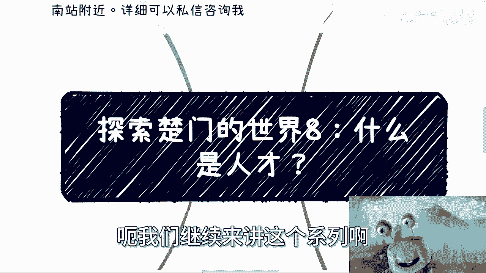
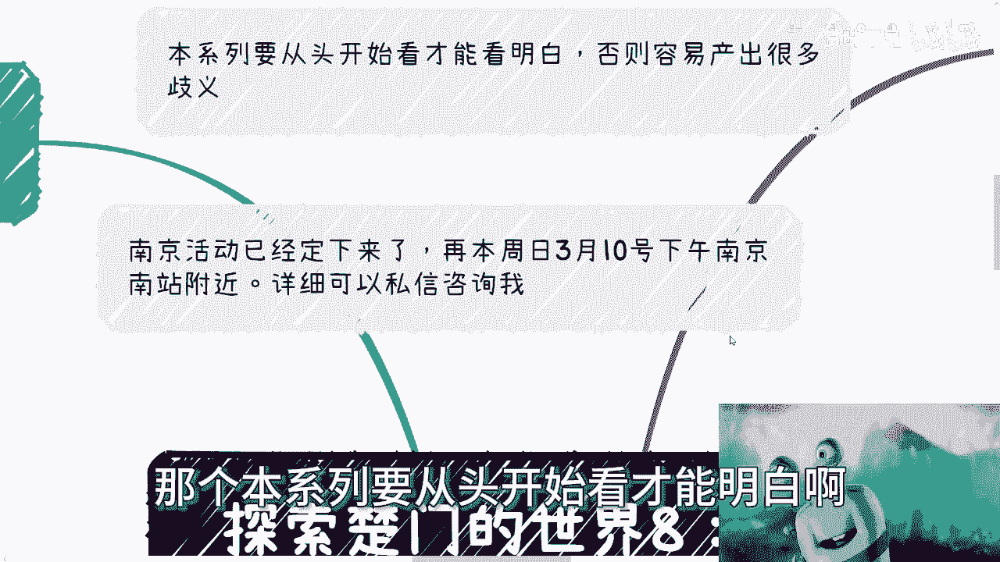
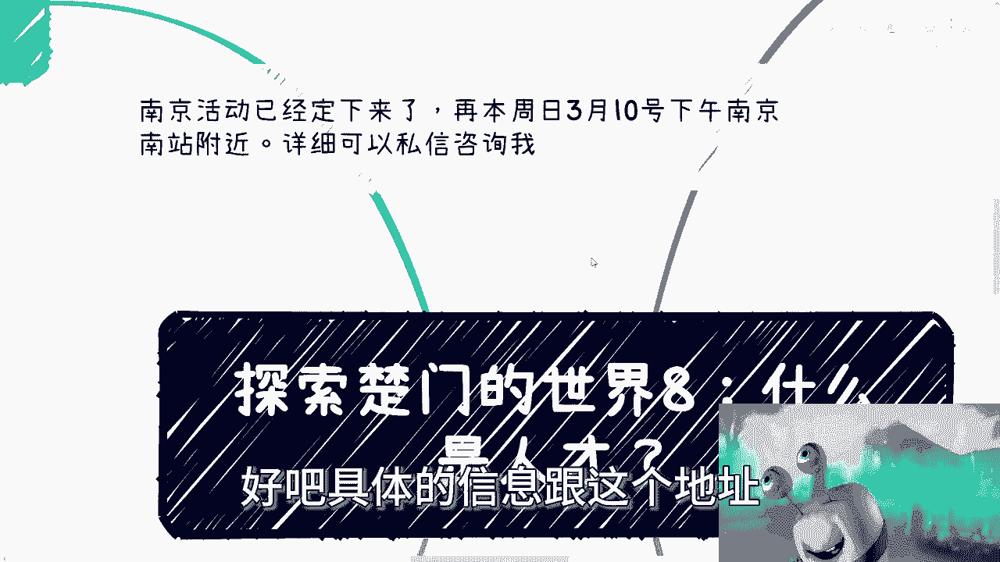
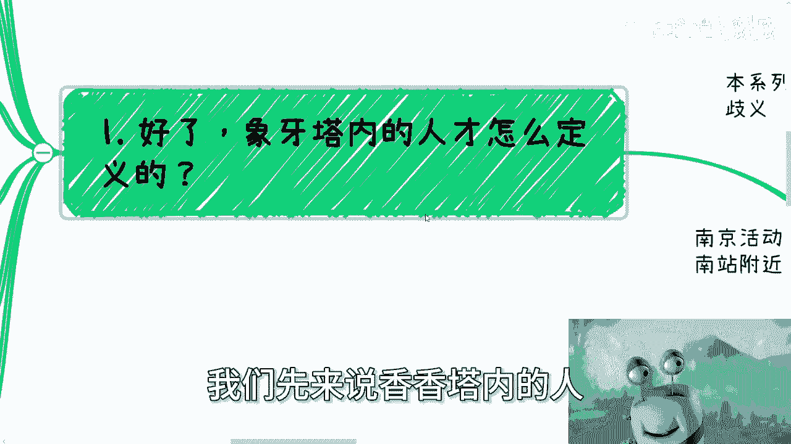
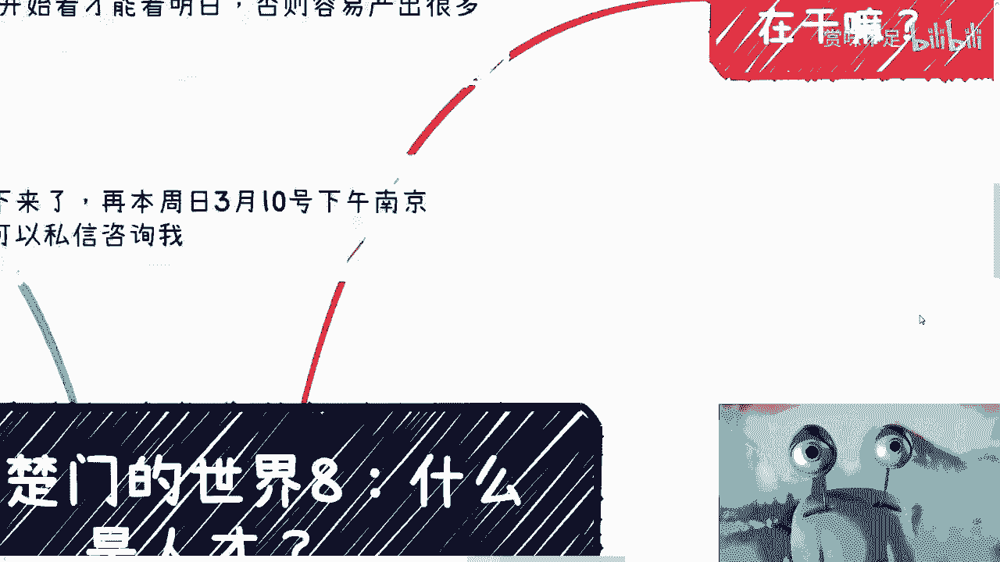
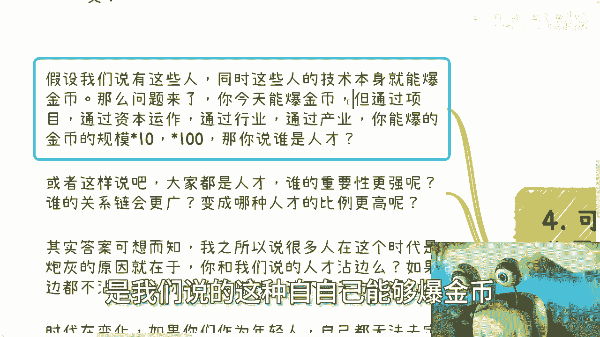
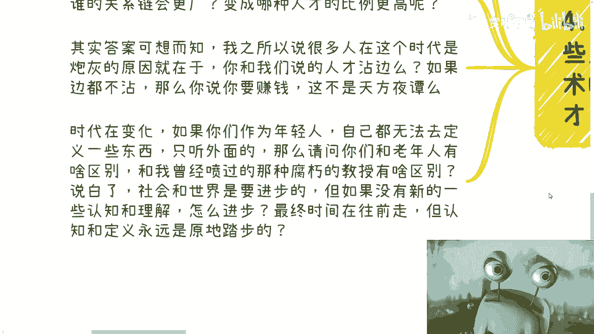
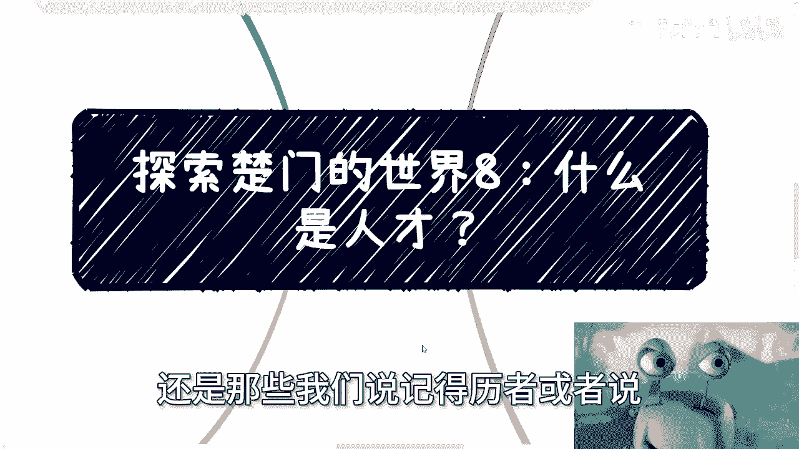
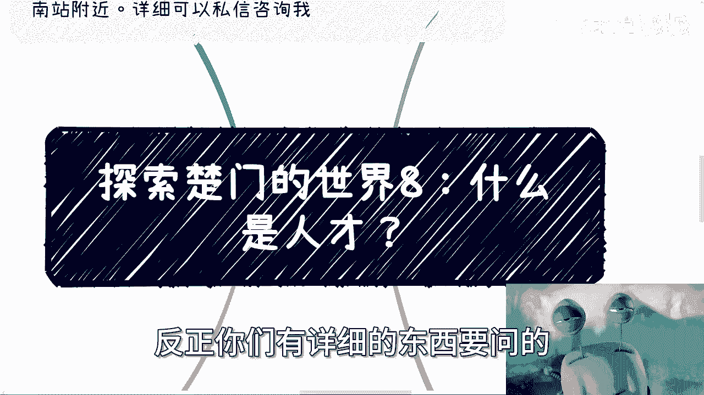

# 探索楚门的世界8：什么是人才？ - P1 - 赏味不足 - BV1gU411F7Q4

好大家好啊，嗯嗯我们继续来讲这个系列。

啊，啊呃，首先啊那个本系列要从头开始看才能明白啊。

否则容易出很多歧义，其次呢南京活动已经定下来了，在本周的周日3月10号下午好吧，南京南站附近好吧，具体的信息跟这个地址可以私信在问我啊。

那么本次呢我们来讲的是探索楚门的世界八啊，那这个问题很简单啊，什么是人才，首先啊你们先想想看，我给你们两秒钟想想看什么是人才。

反正我们都不是人才是吧啊，首先啊我们先来说象牙塔内的人是怎么定义的。

一般我觉得现在塔内的这些人才，无非就是家长口中的别人家的孩子啊，读书好，出身好，教育好环境好，学校好学历好，工作好对吧啊，什么都好啊，然后呢能去什么工，然后学生之间呢就觉得啊，我们能去什么公司实习啊。

能做什么项目，能写什么paper对吧，没毛病啊，没毛病，大家都包括那个，之前我在那个说那个学校跟学历的那一期，也是的，就一大群人跑过来跟我说，哎我到好的学校去怎么样怎么样，对吧啊。

我能得到什么什么什么对吧，你得到个屁啊，你能得到啊，那么从两个角度来讲啊，首先从上一代人的角度来讲呢，这些没有错啊，没有错啊，你们不能说你们父母的认知有问题啊，那么象牙塔内的人呢，呃呃老首先这么说啊。

象牙塔内的人才呢其实可以赚到很多的钱，只不过啊这个是在上一代人的这个时代而已啊，你放到现在是不可能了啊，你说以前能不能，你说以前稳不稳定，我都认可的对吧，没问题的啊。

呃那么政府定义的人才呢其实也是一样的，就我们可以从政府的各种文件里面看到，对人才的定义啊，你们可以去翻翻，如果有空的话，怎么说呢，啊这些政策的作用其实都是跟钱有关的，比如说啊呃多少有哪些学历。

给哪些补贴对吧，然后有哪些人什么创业，或者怎么样给予更多的东西啊，所以呢正因为跟钱有关，所以才只能标准化啊，比如说他还是只能跟你说啊，拥有什么学历，什么职称证书等等等啊，好那么问题来了。

我们来看这个核心的问题，好问题来了，我们先不说这个对和错啊，假设这些定义都是OK的啊，那么我们说人才，人才，人才的作用是什么，为什么能被称之为人才，你总不可能说啊，别人定义你是人才，你就是人才吧。

对不对，你活在这个世界上，你活在人类的这个社会当中，你得有贡献才叫人才吧啊好，那么从宏观角度来讲，我觉得人才是两类，一类是能够推动行业发展，从而推动经济发展啊，它更像一种创新，我们说卡脖子的。

那当然不仅仅大家说的什么芯片这种东西啊，各个地方其实都有能够推动经济发展的地方啊，而且卡脖子我指的也不是我们指的，也不是说啊卡中国美国对吧，或者卡哪边的，就各种各样的一些小突破，其实也行哦。

也就是说他通过一些自己的这种小创新啊，能够推动经济发展，记住啊，推动经济发展啊，好那么另外一类就是本身就能爆金币的啊，他们的本身这个人他就能报金币啊，那么本身就能赚到钱，从而能够被动地去推动经济流通。

那么我觉得这就是两点，当然你跟我说，你说陈老师，你讲你讲这个人才定义啊，我到现在花了三分半对吧，人才定义，为什么这个当中跟学历跟能力跟技术没有关系，那我就问嘛，你活在人类社会，美国中国也好。

整个世界各个国家也好，你最脱离不了的是什么，不是政治啊，最脱离不了是什么，就是经济没了，大家其实你说这个这个各种各样的，这个问题也好，怎么也好，他最后都会反映在经济上面，你不谈经济，你不谈包金币。

你谈什么，你告诉我谈什么啊，谈什么有用吗，没有用的呀，就你要明白所有的所有的所有的核心东西，最后都是反映在经济上面，因为人类社会的本质就是这样子啊，好那么问题来了啊，我们所说的人才啊。

我指的是我们所说的人才，你这属于哪一类啊，你自己想想看啊。

好那么我们第二点啊，这个时代这些人才都在干什么，你看这个人才会打引号对吧，都在干嘛啊，呃我跟你讲，别说了，能干什么呢，无非就在007996，他还能干嘛呢，他能干嘛，我就问对吧，有很多人就跟我说。

哎我清华北大出来，我怎么样，我就问他，你能干嘛，你会干嘛，哎搞笑嘞，你不要跟我说哪里出来的，我who who care你哪里出来的对吧，那因为时代变了，技术技术创新有没有有的，但是越来越少啊。

爆金币的有没有也有，但同样越来越越来越少，那问题来了，人才越来越多，你会发现人才越来越多，牛逼啊啊那么简单的道理都懂啊，就比如说一个东西多了之后，自然就不值钱了啊，我们先来说一个问题啊。

我们以前呢一直问别人，你觉得金融是什么，金融的本质是什么，那金融本质是什么，流通对吧，你要流通，那当然你说你说M1M2啊，包括其他各种东西的这些调控没毛病啊，但是这个就跟跟我们可能没什么关系啊。

那么而且不就跟我们没关系吧，就是我们控我们是不可能左右这个东西的对吧，那么你说呃流通流通这个东西呢，跟财富聚集本质没有因果关系啊，也就是说流通本身它就金融这个东西啊，呃你本身流通才会产生更大的价值。

你不流通就是毫无价值的，你不管你有多少钱都一样，所以说所谓的人才，现在所谓的人才都在打工，拿着自己的好的学历，好的叉叉，好的证书，开始打工，开始996开始007啊，我们说啊做任何一件事情都需要产出价值。

那你我们来看看他们到底产出什么价值啊，首先他们增加了经济流通，对不对对的，也就是说他们的工资，他们的社保，但这个流通并非是他们造成的，而是因为他们入职了，他们现在所在的那些啊。

叉叉公司的这个萝卜坑造成的，其次呢就是我们说的啊，他们为了企业打倒别的竞争对手出了力，他们为了所谓的企业的恶出纣为虐，当然你也可以认为是企业的善也可以啊，这个早死早超生也行啊，随便无所谓啊。

还有呢没有呢，那还有那句话，我们不说对和错啊，我们只说客观的事实，他们还为市场的卷增添了一份力量，他们为底层，从同样level的人的人群制造了很多的焦虑，那很多人觉得哎跟我没什么关系，我只是录个职。

我怎么就制造焦虑呢，我跟你讲，造我早就说过了，造成今天这个局面，没有一个人是无辜的啊，但凡你们去卷这方面的东西，你们就是里面的一片雪花，没有人是无辜的啊，你们都为之，现代现在的就是所有人这份焦虑。

付出了一份努力啊，然后呢，他们还在拼命的把独木桥上的人往下去取啊，推下去，那当然你今天如果很多人站在独木桥上面，你让他推下去，他可能不敢，但是像这种就是呃有一个萝卜，一个萝卜一个坑的啊。

这个我进去有一个人就那没有了啊，一个人就是说失去了这份工作机会，失去了可能对他造成很多影响，很大影响这种蝴蝶效应，那这些人是不会放在心上的，然后他还会标榜标榜哦，我很有良心，我他妈的很怎么样怎么样。

有个屁啊，还有啥没了，剩下的我觉得就是只剩下家庭，然后被你说被社会上其他人收割的事啊，我觉得这个就不说了，这要说他妈就没底了是吧啊，然后第三啊，象牙塔外的人才是什么，我跟你讲啊，首先这个也没有定义。

而且也没人敢定义，怎么敢定义，他连象牙塔都不敢定义，他们还得定义人才啊，我粗浅用我的认知来给你们定一下啊，首先我觉得第一大那个点是什么，就是大局观，他得通过自己的了解成呃观察学习，了解到每个领域。

每个行业不同的客户的情况，也就是说他得明白，无论我们做什么，哪怕我很无知，比如说你们让我跟我说，你说说我们去做一个你完全不懂的业务，行不行啊，我会承认我很无知，因为什么，因为我虽然没有这个领域的知识。

但是我会有别的领域的知识，我横平移过去，我就很清楚任何一个领域水都是很深的，我不可能非常就像很多人一样说哎呀，我就觉得这个东西很很简单对吧，这个东西哎呀好很容易爆，金币不存在的，我跟你讲不存在的哦。

好那么你哪怕只了解1%，你的心里得明白，你的无知跟外面大概还有多大的空间，你得明白外面还有九99%，而不是说你就是呃呃了解了一部分，哪怕500%分之十，你就开始洋洋得意对吧，那我告诉你，塞尔塔外。

你没有一个人是省油的灯，他但凡不是从象牙塔内去窥视外面，那么大家谁能竞争得过谁，这都说不清楚的，所以说你客观的认知才是最重要的，客观的评价整个环境，客观的评价自己才是最重要的哦，不要觉得自己好像很牛逼。

也不要觉得别人很牛逼，没有意义的啊，其次就是格局要打，这是第二点啊，也就是说你懂得什么时候要什么啊，懂得什么时候这要什么，比如说知道在什么场合说什么样的话，这里的格局呃，当然我这边说的格局大啊。

并不是说呃，可能大家所一直听到什么油腔滑调啊，或者说磨平棱角啊，没有用的，这些都是象牙塔内的人所PUA你们的话术，真正的格局在于什么，真正的格局在于，知道怎么将一个原本10万块钱的生意。

要么就是直接做到20万甚至更多，要么就是在完成10万的同时，能够更长线的发展，更长的铺垫，也就是说他能明白今天10万块钱这个摊摊子啊，打个比方，这个摊子是啊，这个2×2这么打啊，但是在他的格局观里面。

他们明他知道我现在可能只能做2×2，但是我知道当我未来好好做的时候，或者我往某个方向做的时候，我能做到4×45乘五，20×20，这个就是他的格局啊，那么还有一点就是什么呢，最重要的就是懂得怎么赚钱。

懂懂得怎么报金币，基于以上两者啊，要懂得怎么样暴金币，为什么啊，因为你会发现上一点他要懂的是，就是他得有认知，有格局的，明白如何才能报更多的精品，但是啊在在所有的合作当中，商业思维清晰。

他是能够明白一个项目当中，核心的关键点是什么，就像我前面几期跟你们讲的，有的没的不要去关心你们，关心那些东西都没有用啊，呃从而不至于浪费自己的时间或团队时间，或者来说合作方的时间，这一点是很重要的。

因为你的察言观色，你的言行举止，是能是很容易让对方来判断你这个人呐，哦你但凡就不是说今天跟别人合作，讲出来一些有的没的对吧，让别人觉得，你的关注点根本就不在重点上面，还他妈怎么合作对吧好。

那么最后呢可能大家就要说了，可能还有一点就是关于灰色地带的问题，也就是说你说爆金币，那这个爆金币合不合规呢，对吧好，我跟你讲这事怎么说呢，我告诉你，但凡你懂得怎么报金币了，不同的场景，不同的环境。

不同的上下文，灰色这两个字或者灰色地带，这件事情本身它就是有不同定义的，你不要以为灰色地带是一个固定的一个地带，不存在的哦，我只能告诉你，别的任何东西都有可能出现灰色地带，你管它呢，如果来说你跟我说。

你说陈老师，我连红线都不都不知道，是啥都摸不清楚。

那我告诉你，那就是你自己的问题，那还说啥呢，对不对啊，那么第四点啊，可能很多人要问了，那么如果我们说啊，这个世界上真的有些人有屠龙之技，真的有卡脖子的技术，难道不是走到哪都是人才吗，好我们来看啊。

假设我们说的这些人，同时这些人的技术本身就能爆金币，我们假设这样子啊，呃这技术非常牛逼啊，就是谁碰到谁都能爆金币啊，那么问题来了，你今天能报金币，但是通过项目，通过资本运作，通过行业的运作。

通过产业的结合，你能报的精密的规模，规模可能省10×100乘1000，那我就问谁是人才，你觉得是掌握这个技术人是人才，还是能帮他翻100倍，1万倍的是人才，或者我这么说，大家也许都是人才。

那我就问你们谁的重要性更强，谁的谁的关系关系链更广，以及你们觉得我们这种人啊，我们这种普通人变成哪种人才的比例更高，你们自己想想看，用你的膝盖就能想得出来，对不对对吧，所以说答案可想而知。

我之所以说很多人在这个时代是炮灰的，原因在于哪里，在于你们大部分人走的人才是我们说的什么呢，是我们说的这种自自己能够报金币。

通过技术能爆金币的，但是我就问他，通过自己能爆金币的这种比例是他妈多少啊，这概率是多少啊，所有人在往这根线上面去走独木桥，这他妈可能的啦，对不对啊，然后呢第二点是什么。

就是你说我们现在说的这些人才本硕博对吧，你跟我，我们刚刚所评价的这个，这个这个象牙塔外的这些人才沾边吗，你想想沾边吗，我都不说你属于哪一类了，我就说你沾边吗，你如果连边都不沾，然后你就跟我说。

老师我要赚钱，这他妈不是天方夜谭吗，啊对吧，你时代在变化，你要想想看，如果你们作为年轻人，你们都无法去定义一些东西，或者说无法去看清楚一些东西，只听外面的，那么请问你们跟那些老年人有什么区别。

跟我曾经毕业的时候碰过那些腐朽的教授，有他妈什么区别啊，除了你们除了年纪，除了皮囊不一样，别的有什么不一样，说白了，我觉得社会跟世界是要进步的，但如果没有一些新的认知，从年轻人的角度，没有一些新的认知。

新的理解我他妈怎么进步，唉我奇了怪了对吧。

你就会发现最终时间再往前走，但是认知和定义永远在原地踏步，或者我们再退1万步来讲，真正爆金币赚到钱的，还是那些我们说既得利益者。

或者说哎呀，或者说可能没有你们这么有良心的人对吧，或者说没有没有像大家这么守得住底线，或者新一代的年轻人，但是你们要想啊，如果新一代的年轻人没有办法在这里面赚到钱，没有办法在这里面爆金币。

没有办法在这里面掌握世界的规则。

那这个往前怎么会进步呢，永远是腐朽的，谁来改变啊，通过我做视频改变吗，这他妈真的叫什么叫赛博朋克啊，对吧啊，你们仔细想想看什么叫人才，以及你们定的人才，父母定的人才是什么，有用吗啊行就这么着吧啊。

那个南京活动要报名的，反正你们私信我，然后呃职业商业对吧，然后规划包括什么融资啊，股权啊对吧，合同啊，加各个东西，反正你们有详细的东西要问的。

