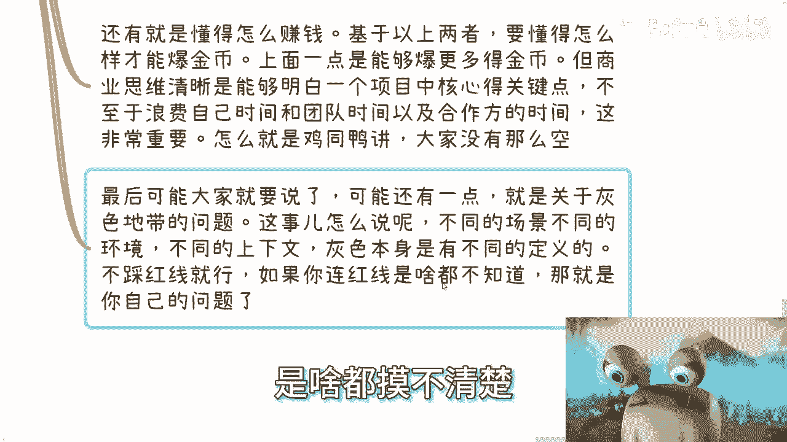

# 探索楚门的世界8-什么是人才----P1---赏味不足---BV1gU411F7Q4

在本节课中，我们将探讨“人才”这一概念。我们将分析不同视角下对人才的定义，并思考在当今社会环境中，什么样的人才能真正创造价值、推动发展。

---

## 概述

“人才”是一个被广泛使用但定义模糊的词汇。本节课将从象牙塔内、政府政策以及社会宏观价值等多个角度，剖析“人才”的真实含义。我们将看到，传统的定义标准正在失效，而新时代对人才的要求已发生根本性转变。

---

## 1. 传统视角下的人才定义

上一节我们开启了关于“人才”的讨论，本节中我们来看看社会上常见的几种人才定义。

首先，需要明确的是，本系列内容具有连贯性，建议从头开始观看以避免理解上的歧义。

### 象牙塔内的人才观
在校园和家庭环境中，人才通常被定义为：
*   成绩优异、出身良好、教育环境优越的“别人家的孩子”。
*   拥有高学历、名校背景和体面工作的人。
*   学生之间则倾向于认为，能去知名公司实习、参与重要项目或发表高水平论文的人是人才。

这些认知源于上一代人的经验，在其所处的时代背景下，遵循这条路径确实可能获得稳定且丰厚的回报。然而，时代已经改变。

### 政府政策中的人才定义
政府的各类人才政策通常与经济效益直接挂钩，因此其定义必须标准化、可量化。

以下是政策中常见的人才认定标准：
*   **学历要求**：如博士、硕士等。
*   **职称与证书**：拥有特定领域的职业资格认证。
*   **贡献与奖励**：例如获得重大科技奖项、成功创业等。

符合这些标准的人才可以获得相应的补贴、税收优惠或政策支持。其核心逻辑在于：**人才 ≈ 能带来经济效益的标准化标签**。

---

## 2. 人才的核心价值：经济贡献

无论定义如何变化，一个根本性问题在于：人才为何有价值？其核心作用是什么？

一个人被称为“人才”，不能仅仅因为被贴上标签，而必须对社会有实际贡献。从宏观角度看，人才的贡献主要体现在经济层面，因为人类社会的运转最终都反映在经济活动上。

人才的核心价值可分为两类：
1.  **推动型人才**：通过创新（无论是重大技术突破还是微小改进）推动某个行业发展，从而促进整体经济增长。公式可简化为：**创新 → 产业进步 → 经济发展**。
2.  **产出型人才**：自身具备“爆金币”（即创造直接经济收益）的能力。他们通过赚钱和消费，被动地推动经济流通。公式可简化为：**个人盈利能力 → 财富创造与流通 → 经济活力**。

思考一下，你身边或你理想中的人才，属于以上哪一类？

---

## 3. 当下“人才”的困境

那么，在当今时代，那些拥有高学历、好背景的“人才”们在做什么呢？

现实情况是，许多人陷入了“内卷”的循环。他们进入企业，成为“萝卜坑”中的一个，从事着996甚至007的工作。

我们来客观分析一下这类“人才”的产出：
*   **增加经济流通**：他们通过工资和社保消费，促进了经济循环。但这主要是其职位带来的，而非个人独特价值所致。
*   **参与企业竞争**：为企业战胜竞争对手或“为虎作伥”出力。
*   **加剧市场内卷**：他们的加入加剧了同层级岗位的竞争，间接制造了同辈焦虑。可以说，当前就业市场的激烈竞争，每一位参与“内卷”的个体都负有一份责任。
*   **挤压他人空间**：一个岗位的获得，往往意味着另一个人的出局，这种“零和博弈”效应常被忽视。

除此之外，他们可能还要面对家庭压力与社会上的各种收割。这引发了一个更深层的问题：如果传统路径培养出的“人才”主要在做这些事情，那这条路径本身还值得推崇吗？

---

## 4. 象牙塔外的人才特质

接下来，我们跳出传统框架，看看在真实商业社会中，哪些特质更为重要。请注意，这并非权威定义，而是一种基于观察的总结。

象牙塔外的人才通常具备以下关键特质：

**1. 客观的认知与大局观**
*   他们清楚自己的无知，并了解未知领域的广阔。即使只懂一个领域的1%，也明白剩下的99%意味着什么。
*   他们不会因略知皮毛而自满，深知山外有山。客观评估环境和自身是首要能力。

**2. 长远的格局**
*   懂得取舍，知道在什么场合该争取什么、放弃什么。
*   格局不在于“油滑”或“磨平棱角”，而在于能看见未来的发展空间。例如，能将一个当前价值10万的生意，规划出未来做到100万甚至1000万的路径和蓝图。

**3. 清晰的商业思维与赚钱能力**
*   基于以上两点，他们懂得如何将认知和格局转化为实际收益（“爆金币”）。
*   在合作中能迅速抓住核心关键点，避免在无关紧要的细节上浪费自己及合作伙伴的时间。他们的言行举止会传递出“靠谱”和“专业”的信号。

**关于“灰色地带”**
赚钱必然涉及规则。所谓“灰色地带”的定义并非固定不变，它随场景、环境和上下文而变化。核心在于，你必须清楚行业的“红线”在哪里。如果连红线都摸不清，那问题在于自身认知不足，而非环境复杂。

---

## 5. 技术天才与商业人才的对比

有人会问：那些拥有“屠龙之技”、掌握卡脖子核心技术的人，难道不是走到哪里都是人才吗？

我们假设存在这样一种人：他拥有一项能“爆金币”的顶尖技术。

那么，关键问题来了：
*   **A**：掌握这项技术的人。
*   **B**：能通过项目运作、资本整合、产业结合，将这项技术产生的价值放大100倍、10000倍的人。

请问，谁更重要？谁的关系网络更广？作为普通人，成为A或成为B，哪一种概率更高？

答案显而易见。当前社会的问题是，太多人挤在“成为技术型人才A”这根独木桥上，而这条路成功的概率极低。然而，我们的教育体系和社会观念，仍在鼓励年轻人朝这个方向努力。

---

## 6. 反思与总结

本节课我们一起学习了关于“人才”的多维度思考。

最后，让我们进行深刻反思：当下定义的“人才”（如高学历者），与我们之前描述的象牙塔外人才特质，有多少重合之处？如果基本不沾边，却幻想以此获得巨大成功，这无异于天方夜谭。

时代在变化，如果年轻人无法建立新的认知、重新定义价值，而只是盲目遵循旧有标准，那么与过去的“腐朽”观念又有何本质区别？社会进步需要新的理解和新的规则制定者。

真正的危机在于，如果最有活力、最该掌握未来规则的年轻人，无法在新体系中赚到钱、获得成功，那么社会将陷入停滞，由既得利益者永久把持。这，或许才是真正的“赛博朋克”现实。

**总结一下**：
*   传统以学历、出身定义的人才观已不适应新时代。
*   人才的核心价值在于经济贡献：要么推动发展，要么直接创造财富。
*   当前许多“人才”陷入内卷，价值产出有限。
*   新时代需要的是具备**客观认知**、**长远格局**和**清晰商业思维**的人才。
*   相比单纯的技术持有者，能放大技术价值的商业整合者往往更重要。
*   社会进步依赖于年轻人建立新认知、定义新规则的能力。

重新思考“什么是人才”，不仅是个人规划的需要，也关乎社会能否向前发展。