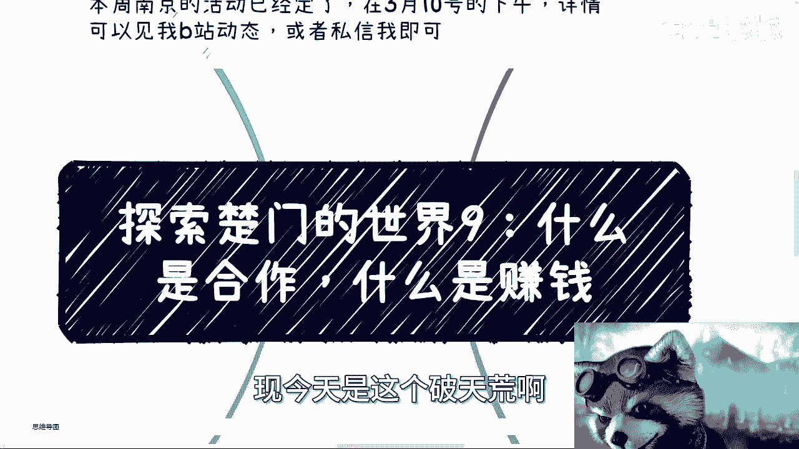
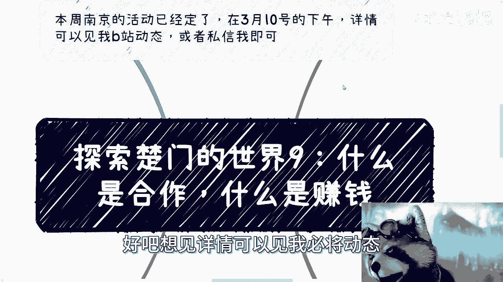
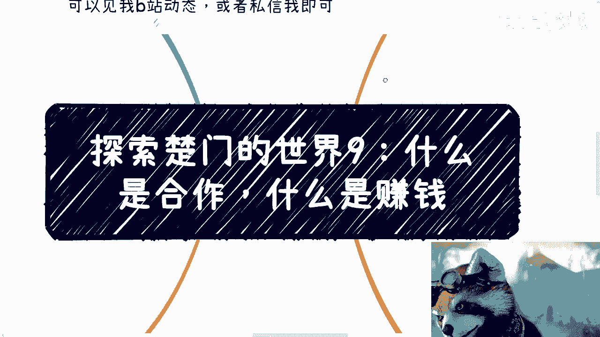
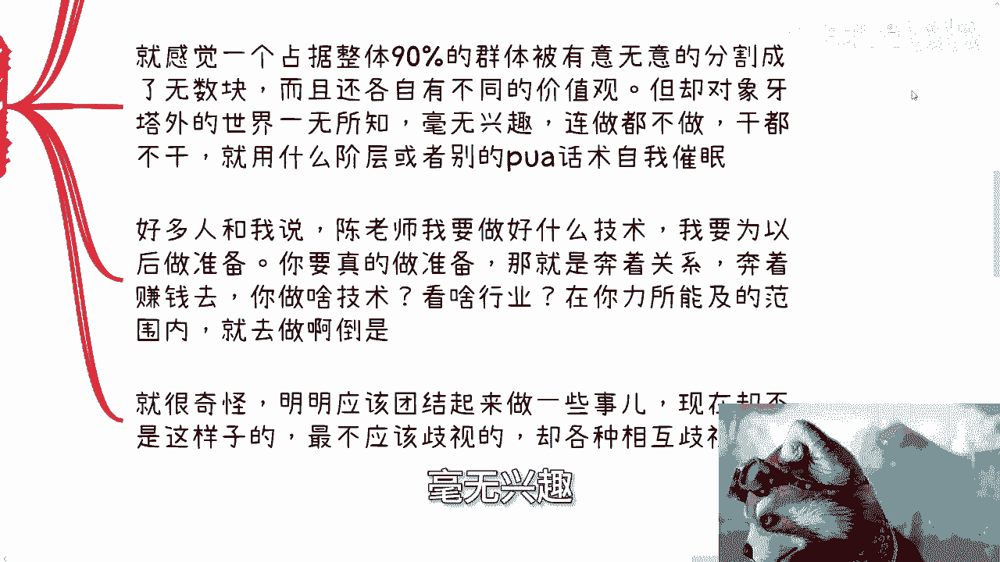
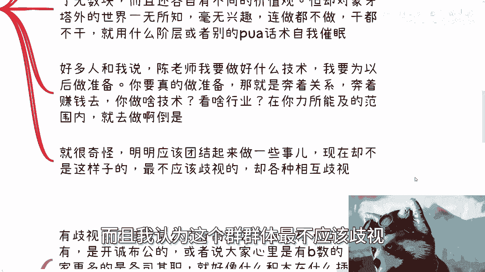
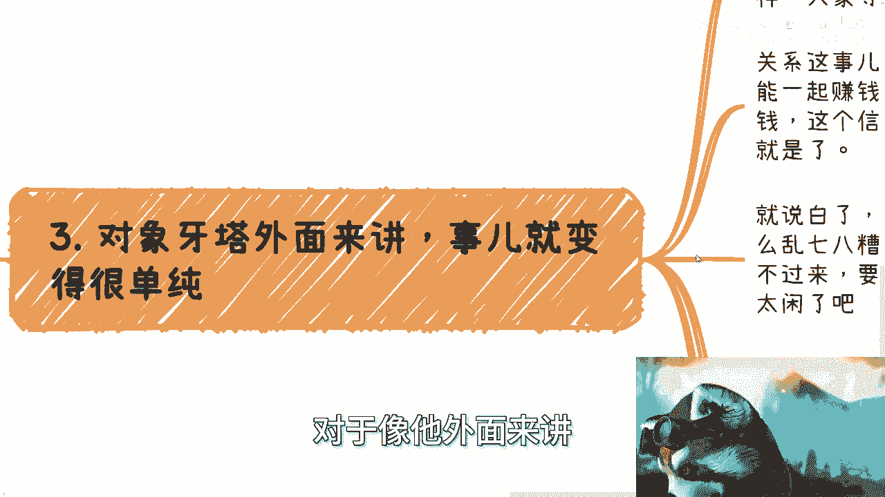
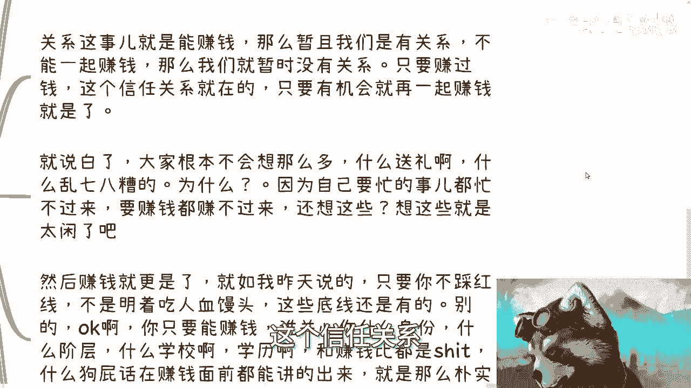

# 探索楚门的世界9-象牙塔内外的合作和赚钱的区别---P1---赏味不足---BV1aw4m1Z7hD

在本节课中，我们将探讨“象牙塔”内外两种截然不同的思维模式，核心聚焦于“合作”与“赚钱”这两个概念的本质区别。我们将分析为何许多人在行动前会自我设限，以及如何以更直接、高效的方式达成目标。

---

上一节我们讨论了外部世界的复杂性，本节中我们来看看，为何从“象牙塔”内到外的视角转换如此困难。核心问题在于，许多人会为自己凭空制造障碍。

**合作**的本质非常简单。它可以用一个公式来描述：
**合作 = 明确分工 + 利益分配**
具体来说，就是厘清“我做什么，你做什么，如何分钱，周期多长”。直接谈这些即可。

然而，象牙塔内的思维往往不直接。例如，在寻求合作时，人们常陷入自我怀疑：“我学历不行”、“我经验不足”。这些自我设限的“坎”并非外界强加，而是自己添加的。关键在于，你的价值在于能否解决问题、创造收益，而非这些附加条件。

---

理解了合作的直接性后，我们再来看看**赚钱**的逻辑。赚钱的行动指南同样直接：
**行动 = 识别机会 + 执行验证**
你需要做的是：判断一个领域（如AIGC、数据资产化）是否有机会，评估个人或小团队能否切入，若无硬伤，便立刻行动。赚钱的核心是投入产出比，而非预先掌握全部技术或知识。

许多人倾向于用“不是所有事都为了钱”、“需要为未来做技术储备”等理由进行自我说服。但真正的准备，是建立能带来收益的**关系**和**赚钱能力**。在积累足够财富之前，空谈超越金钱的价值并无实际意义。

---

以下是象牙塔内外思维模式的主要对比，这揭示了问题核心：

*   **看待门槛**：塔内思维热衷于添加无关的门槛（如学历、出身）；塔外思维则关注核心能力与产出。
*   **看待关系**：塔内同一群体常相互歧视、分割；塔外关系基于**能否共同赚钱**来建立和维护。
*   **行动导向**：塔内纠结于“准备”和“铺垫”；塔外直奔目标，在行动中学习和调整。

---

那么，为何本应团结的群体内部却充满隔阂？理论上，面临相似困境（如求职、抗风险）的群体更应协作。但现实常是相互攻击、划分三六九等。这种内部消耗使得群体被分割，并对外部真实世界失去兴趣和行动力，转而用内部阶层话术自我催眠。

相比之下，象牙塔外的世界虽然也存在阶层与差异，但运作方式更为清晰。大家“心里有数”，各司其职，如同积木插入对应的插槽。关系围绕**合作**与**赚钱**展开：能一起赚钱，就有关系；暂时不能，则关系淡去。无人有暇进行无谓的“维护”，因为精力都聚焦于创造价值。

关于赚钱的伦理，有一条清晰的红线：**不吃人血馒头**（例如，利用他人惨剧炒作或落井下石）。除此之外，在创造价值、获取收益的过程中，身份、阶级、学历等都变得不再重要。

---

本节课中我们一起学习了象牙塔内外关于合作与赚钱的核心差异。关键在于认识到，许多障碍源于自我设限，真正的路径在于目标明确、行动果断。

因此，最终的建议非常简洁：
1.  **立刻去做**。
2.  **明确你的核心目的**，并直奔主题，不要绕圈子。

思维惯性的改变需要时间与实践，仅靠理论难以突破。最好的学习方式是接触具体案例并在现实中行动。希望本课能为你提供一个更清晰、更直接的行动视角。