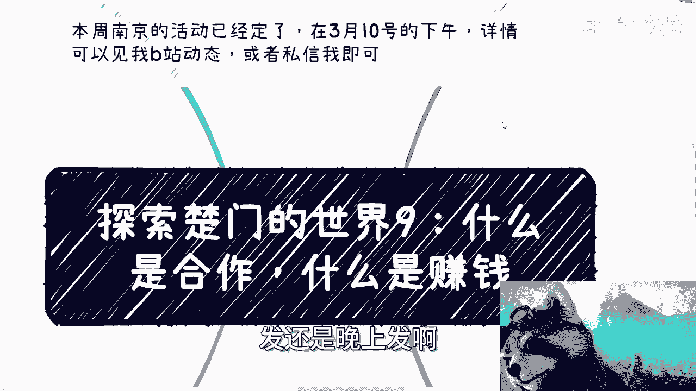
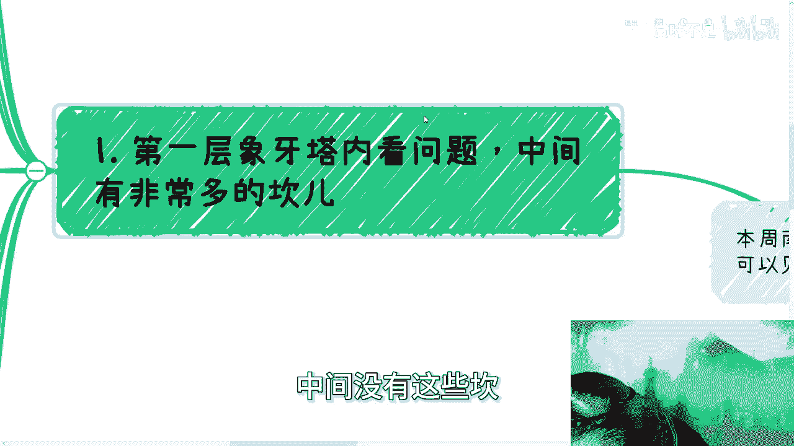
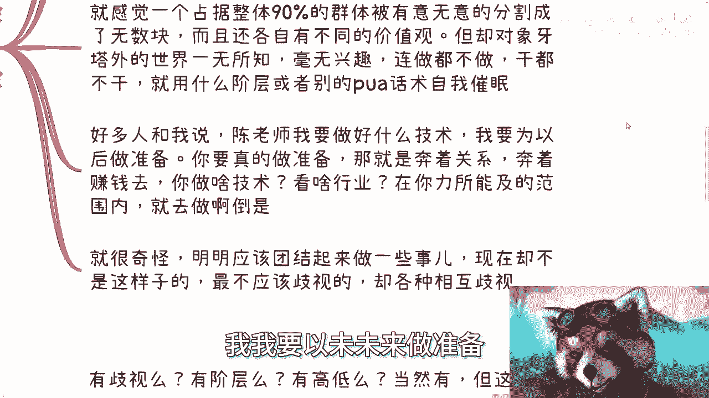
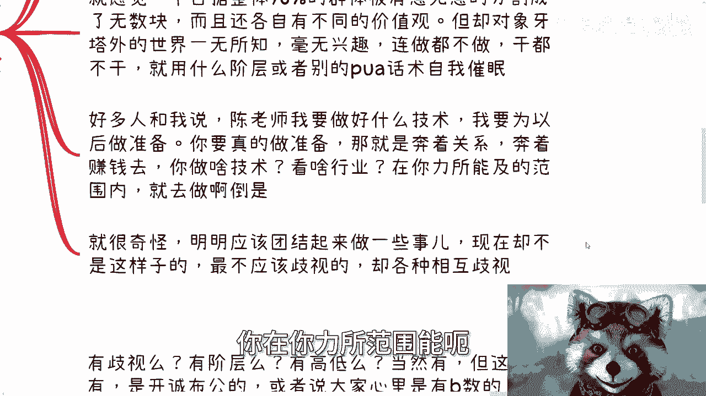
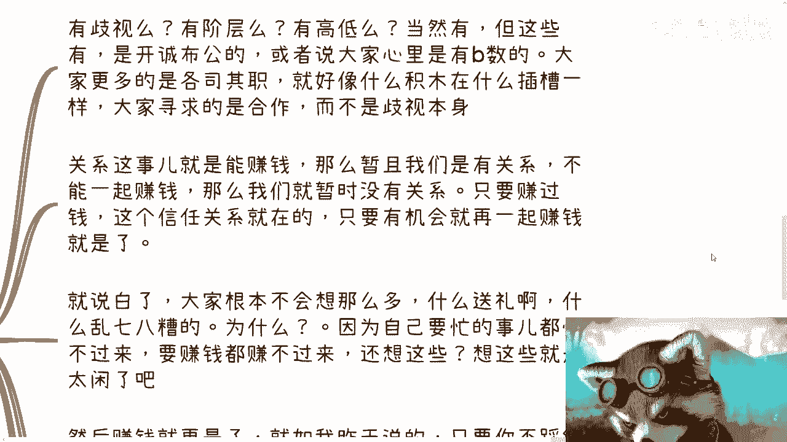
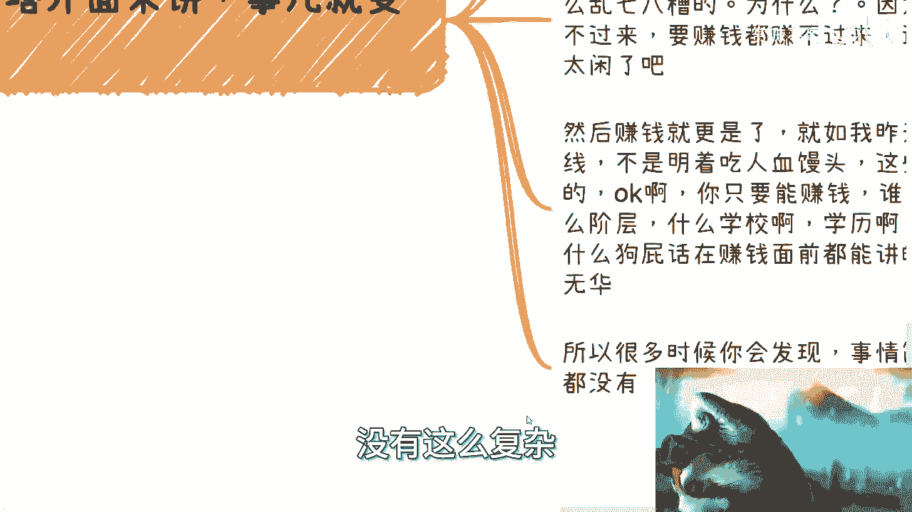
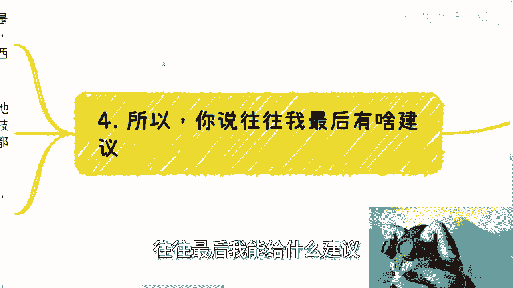
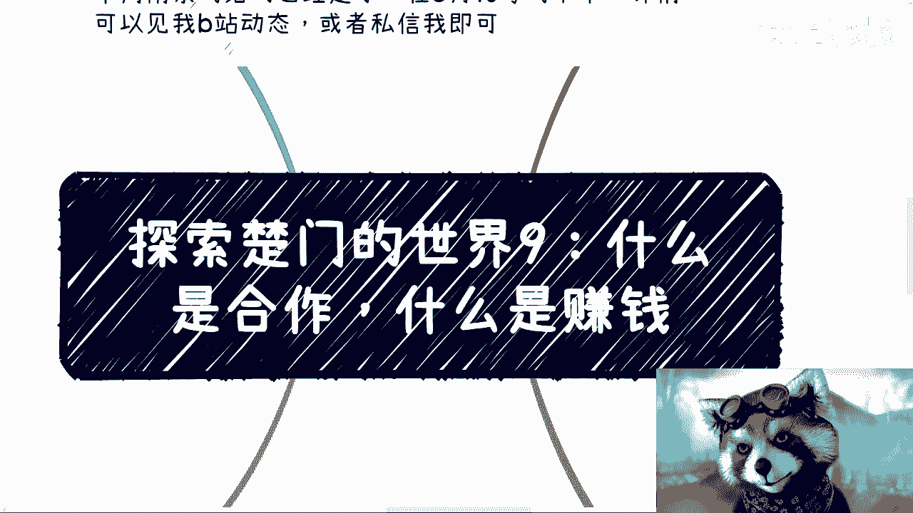

# 探索楚门的世界9：象牙塔内外的合作和赚钱的区别 - P1 - 赏味不足 - BV1aw4m1Z7hD

好大家好，今天是这个破天荒啊。

早上有空，我就早上来给大家搞一下啊，发还是往上发啊。

呃本周南京的活动就定了3月10号下午好吧，详见详情可以见我B站动态。

或者来说私信我报名啊都可以，那么本期呢继续来讲探索楚门的世界酒啊。

什么是合作，什么是赚钱，嗯那你首先啊我觉得事情很简单啊。

第一层象牙塔的看问题啊，你会发现中间有非常多的坎儿啊，但是呢我先给你们个结论，我告诉你们中间这些坎都是你们加上去的，你知道吗，就是就是我聊起来这么多人，我就明白了，就中间的坎都是你们自己加上去的。

就是我不停的在告诉你们中间没有这些坎。

然后你们还降薪降一，我就嗯啊嗯啊对吧啊好，那当然啊，我觉得就是说这些坎儿呢，其实就像我刚刚说的，是到底自己设置呢，还是别人PUA的呢，我也不知道啊，但的确，我到现在非常的清楚地感受到了。

第一层象牙塔内做事情了，他很喜欢给自己制造麻烦，就是你们看问题非常的，就是他们看问题非常不直接，你比如说合作，你合作什么意思，比如说你找成了，你找我对吧，你说陈老师我们合作。

那你就怎么合作就直接谈呢对吧，就我以前说的很清楚，我做什么，你做什么，你分多少钱，我分多少钱，怎么分，大概什么周期谈呢对吧，你不要就是说跟我聊着聊着，爱楚老师，你我觉得我好像不太行，哎我好像学历不太行。

哎我好像经历不太行，哎呀我什么东西不太行，那不要做，对不对，你做个屁呀对吧，做个B对不对啊对吧，就是你你为什么呢，你想想看，你今天跟我谈，我倒无所谓，你跟别人谈，你这个样子怎么谈啊啊。

你就好像很多人觉得，比如说貌似做啥他都要去什么好的学校，去民企诶，我就问了，你去了好的学校，民企之后，你脑子你身体是他妈换掉了还是怎么滴，还他妈重新投胎了，还说怎么了对吧，就是说你去了之后。

对商业对象牙塔外的世界还是一无所知，有什么区别呢，就是所有的路径过程当中，我们不但要加呃，就我们不但是加了非常多的，这种莫名其妙的门槛，还加了各种各样的条件，没有这些东西你知道吗对吧。

然后包括有很多人跟我说，哎呀到社会上看学历，看你个蛋啊，看怎么他到哪看，你告诉我到哪看，对不对啊，你比如说赚钱，那你就去转呐，你别说陈老师，你觉得这个行业怎么样，哎陈老师，你觉得这个技术怎么样。

那你倒是去做啊，对不对，你无论在什么地方，你什么东西能赚钱，我说不好听的，你但凡比如说实体行业，你今天摆个摊也能赚啊对吧，我不是说鼓励大家去，我只是说你们做一件事情，你得看着什么事情赚钱去，对不对。

你说我看什么行业，我看什么技术，你行业跟技术能给你赚钱吗，不能呀对吧，你比如说你说现在大家都知道啊，AIGC对吧，人工智能啊，然后可能什么我跟你们说的那个数据资产化啊。

那个那个对数据资产上数据的资产对吧等等等，那也都知道，那你去做啊，没有什么东西不能不会做的，我已经跟你讲了，我说这个东西做书商合作方啊，去去去讲一些这个数字资产化的东西，有什么不能讲的呢。

你要但凡你不懂的，现在这社会上能有几个人懂啊，啊你是你就只看投入产出比就结束了对吧，然后你就看这些东西是不是个人能切的，比如说你以人的方式，或者个人的初创企业能不能切，有没有硬伤，没有的话。

那没有问题了，你就奔着赚钱去啊，结束了呀是吧，然后他们还喜欢用什么，就是说不是任何事情都只看钱啊等等等，我们要看感情好，你来PUA自己，我曾经就说过了，你可以这么认为，前提是你得先积累了足够多的财富。

否则你有什么资格说这句话啊，第二啊，我跟你讲很奇怪，我们就来说这个骑士明明最不应该歧视的群体，他妈的反而在群，反而在相互歧视。

你说啊现在场内的人大家其实是一个level的，也是面对同样的问题，就是大部分人看嘛找工作赚钱对吧，那个抗风险是吧，就各种各样的，那大家不是面临同样的问题呢，那为什么大家不能齐心协力呢，我不明白呀，是吧。

理论上大家应该齐心协力合作去赚钱，去真正的更好的活在社会上，如果来说大家不能齐心齐心协力，那我只能认为这是人类的本性啊，现在呢相互攻击，相互举报，相互歧视，明明你都是同一个群体，很相似的群体。

在什么关系上还要搞他妈的这个关系，那个关系还要搞三教九流，这个看不起那个看不起有有什么意义吗，搞不懂啊，对不对，有什么意义，你你什么都会说的啊，你是老百姓，我也是老百姓呢。

啊你非要在他身上找到一些快快感，你非要在他身上找到一些优越感，有什么有什么意思呢，啊你就感觉一个占据了90%的群体，被有意无意的分割成了无数块，而且还各自有不同的价值观啊，但是呢虽然有不同的价值观。

虽然相互伤害，但却象牙塔外的世界毫无兴趣啊。

连做都不想做，干也不想干啊，然后内部用什么阶层，或者用别的PUA话术自我催眠，这就是现在也不是，现在肯定一直以来都这样子啊，然后好多人跟我说，陈老师，我要做好什么技术，我我要以为未来做准备。

你要真的做准备，你就奔着关系，奔着赚钱去，就这两件事情对你有准备的，别的有什么准备吗，啊我就问有什么准备吗，你跟我说做什么技术，做小红书，做自媒体做什么准备啊，是不是，这就好像那说的就不好听了对吧。

这就好像你在外面卖，你非要不承认你在卖，你何必呢，你奔着关系去奔着赚钱去不好吗，你在你力所范围，能力所能及范围里面。

你就去做啊对吧，你从我的三观来讲，我从来没有说看得起什么东西，看不起什么东西，我都看得起，但我觉得你你做什么东西你得认啊对吧，你不要装了，那就很奇怪啊，明明应该团结在一起的事情了。

现在却不是这个样子的啊，而且我认为这个群体最不应该歧视。

却相互歧视啊，然后你看啊，对于圣塔外面来讲。

事情就变得很单纯哦，我们就这么说啊，你说有歧视吗，有的有阶层吗，有的有高低吗，有的当然有，但是开诚布公了啊，或者说大家心里有B数啊对吧，你就比如说我给你举个例子，比如说我今天去找政府谈判啊。

去找政府谈谈业务，我知道我就是个，我就是个工具人，我不会跑过去越级的，我说他妈的不行，你们给我干活，你们他妈给我打工，我不会的呀对吧，那他们也是一样的，他们可能会觉得陈老师就是个工具人对吧，邱老师。

的就是就是那个人民群众，你也没有什么设呃，那个阶级地位对吧，没有问题，我也认得呀，但是同样的呀，你们做什么，我做什么，大家各司其职有什么不好呢，这就像什么积木插在什么插插槽上面，没有事。

就是你说非要说有没有歧视，有的你非要说有没有阶层，有的但不重要啊。

它不会影响合作啊对吧，大家寻求的是合作。

不是寻求优越感，你们明白吧啊，然后关系的这个事就是能赚钱，如果能赚钱，那么赚钱我们有关系，如果不能一起赚钱赚钱，那么我们现在暂时就没有关系，只要只要赚回钱，好让我喝口水，你只要赚钱。

这个信任关系就在对吧。

只要有机会，那就一直在赚钱就是了，当中没有这么多，哎我要维护了，我要干嘛了对吧，就说白了，就说白了大家根本不会想这么多啊，然后什么送礼啊，什么乱七八糟的，为什么对吧，那因为自己要忙，那你想想为什么。

因为自己要忙都忙不过来，要赚钱都赚不过来，谁他妈想这些，你想这些就是太闲，我跟你说，然后赚钱就更深了，你就说如果昨天说的，不是明着吃人血馒头是吧，你比如说今天啊有个有个什么事情啊，明明是非常惨人间惨剧。

对天灾人祸啊，然后怎么样子，你非要去拿它做热点，那这就叫人血馒头对吧，有的人可能现在在低谷，你还要上去踩一脚，叫落井下石，这也叫吃人血馒头，不吃人血馒头，我觉得他妈的这些别的有什么问题呢。

对吧别的我就OK啊，你只要能赚钱，谁关心你什么身份，什么阶级，什么学校，什么学历啊，啊你们自己想想看，跟赚钱比，这些是什么狗屁，这些话在赚钱面前都能讲的出来，你明白吧，就是这么朴实无华，对不对。

所以很多时候你会发现事情简单点蛮好的，没有这么复杂。

复杂，都是我们自己想出来的，所以啊你你你说往往最后我能给什么建议。

我能给的建议就是一去做，二了解清楚你的目的是什么，直奔墓地区，不要绕圈子，结束了，你自己想想看是吧，所有的人做事情都喜欢当初热爱什么歌字，我说哎我要铺垫对吧，我要干嘛，我还是那句话，我们不是什么伟人。

我们不是什么科学家，你做事情就是赚钱，你要什么铺垫，我不明白你要什么铺垫，你今天所有的准备都是奔着赚钱去的，如果你今天你今天所谓的准备是铺垫，这个铺垫不能给你奔着赚钱去，跟你的赚钱目标没有因果关系。

那你铺个屁垫对吧，但是其实我也知道我说了没有用，他很多人听不进去，他也听不懂，就他们的思维惯性已经是如此了，动不动就要觉得啊我要学习技术，学习一些手艺，然后开始纠结细节问题，然后呢搜，是吧。

很多时候很多事情我跟你讲，不做不接触，永远不会明白，就像你站在这个现在这个位置，你通过一个很小的一个地方去窥视外面，你只会认为那些是真的，怎么办呢对吧，人从以前通过教育，通过9年制义务教育。

通过高等教育，到你们现在20多岁形成，你们现在这个三观花了很久，但是同样的要从你们现在这个认知，从你们在一根独木桥上面放到更大的世界里面，这也是需要一个很大很长的一个过程，没有办法的啊，还是那句话。

这个东西不是通过看视频，不是通过看，我跟你们讲究有用的没有用的，我跟你们只能是理论上的沟通，除非你们有具体的case，那我可以去case by case的给你们来讲，但但凡没有具体的case。

这就很困难，因为哪怕我给你们举举例子，你们也不知道啊，这就像我跟你们说，很多时候你们现在看书没有用，你知道吗，因为你现在看到很多东西，就像我跟很多人就说，我视频可能只能讲到此为止。

但是能有多少人能明白我背后想表达的意思，有几个人，没法往下讲，你再往下讲就被举报了吧，好好就这么着啊，然后那个那个南京活动报名的，反正继续报名好吧，然后其他有什么要咨询的，你们就整理好好吧。

