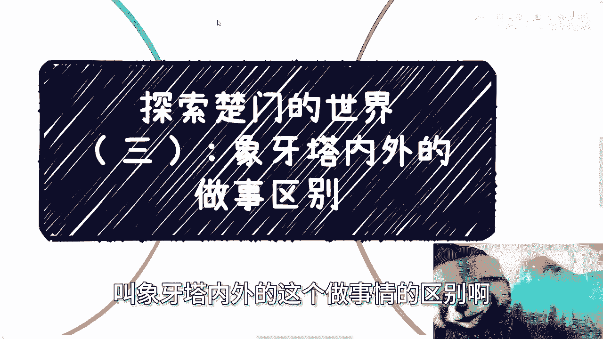

# 探索楚门的世界（三）：象牙塔内外的做事情的差别 - P1 - 赏味不足 - BV1Dm411f7RA

哈喽大家好啊，今天我们继续来讲这个专题啊，呃今天这个专题的内容呢，叫象牙塔内外的这个做事情的区别啊。

呃就如之前说的啊。

我们在我们来看一下啊，我们在第一层象牙塔里面是怎么做事的，首先啊你们看啊，就像之前两期对吧，我相信有的小伙伴呢他可能明白啊，有的呢可能还不太明白啊，就说就比较抽象嘛对吧，或者怎么样啊，那没关系。

我们继续来讲嘛，就是呃我们在第一层象牙塔内，其实我们关注的是什么，关注的是怎么做事啊，怎么去做好一件事情，然后怎么寻求一技之长，然后选择什么专业，选什么学校，那你会发现为什么我们要寻求这些东西。

是因为怎么做事，怎么做好事情，或者寻求一些东西，我们的目标不是为了赚钱，也不是为了去做点事情，而是为了更好的执行对吧，这就好像我们说啊，你今天做开发对吧，做做呃，做销售。

做别的就是你其实说白了就是为了做好工具啊，做好一个工具人，所以我们的关注点会在这些地方，但是同样的，如果我们得到的明确的信息，比如说从小跟你讲，你就要去做工具人，那么我们并不能说所有人都会拒绝。

总有人会接受，但是接受的人不会像现在这么多对吧，那么你就会发现所有的这个流程，我们也是有一套标准的流程，而生产出来的这么一个标品啊，也就是说每个人的这个固定流程都一样的啊，我我们现在不管说你是什么学历。

也不管你是什么学校，你到社会之后，你其实都是一套标准流程出来的啊，那么这个时候标品与标品，标品与标品之间肯定是需要有个369的划分，那么这就是我们所谓的学历啊，所谓的这个其他的一些，比如说学术啊，对吧。

包括你的所谓的成就，但是正如我们所说的，我们的这些东西的标准，它仅仅是在第一层象牙塔里面，为了让标品产生不同的，这个这个这个区别的这么一个作用，当你到了这个象牙塔，在社会当中或者出了这个象牙塔之后。

没有用啊，没有用，或者说它的用处微乎其微，那么这个时候我们说啊，这个时候的由于信息差，无论我们是个体做，还是说是公司的这个企业化运作，其实就是先关注我们上面说的，就是做什么怎么做，做了之后怎么样啊。

得到什么这些东西我们都不知道对吧，你仔细想想看啊，我不管你现在是什么学历，什么学校，我也不管你做的什么事情，我就问你，你做的时候能得到什么，你想过没有，如果你的答案是得到的只是一份月薪对吧。

那么我就这么说，你做什么都一样对吧，但是如果你说哎我不是仅仅得到运行，我还得到一些别的东西，那么我就问你确不确定你得到什么，以及你能不能评估出来，你得到这些东西的这个周期是多少对吧，那如果说我们不知道。

那么也就是说因为我们对全局没有一个认知，更了解，但是事实来讲啊，无论是打工还是自己去干，在我们去你你们想想看啊，在我们去做一件事情之前，这个世界上其实已经无数人做过了，你们也好，我也好，所有人也好。

其实我们都是在重复造轮子，对不对，而重复造轮子的目的是什么，是为了能够在市场上分一杯羹，其实这个我觉得没什么问题，因为造轮子这件事情最终看谁造的轮子好哦，那么看谁造的轮子好。

那么这相对来讲还算是一个良性的竞争，但是你们想想看啊，既然大家都在造轮子，那为什么我们一定会去造轮子，我们能不能造点别的东西呢对吧，那么简单来讲啊，第一层上讲堂里的人做事情，其实就是两眼一抹黑。

就说的直白一点，就是纯靠运气，纯靠搏概率啊，那么简单来讲就是说你们会发现不，为什么大家会关注这个学校，为什么会关注很多东西，简单来讲就是说第一层象牙塔里面的人，他用的是所谓的方向啊。

跟专业和所谓的产业和所谓的领域去套事情，就是说哎你说哎比如说大家现在说啊。

AI很好对吧，或者前一段时间说元宇宙很好或者怎么样，就是你会发现所有人都在讲方向，但是没有任何实际的东西，这就是第一层象牙塔里面的人做事情的方式啊，那么这也是为什么我一直说。

大家在赌博的原因啊，这是第一点，第二点啊，我们说突破第一层象牙塔之后啊。

做事情的方式，第一层象牙塔里面的人啊，呃是用方向跟专业来做赌博，博运气，这种情况下，其实也是我一直说的，我一开始就来讲，就是说其业务运作逻辑啊，商业运作逻辑都是不完整的。

那么自然你说他成功的概率就非常低，那么第一层象牙塔无Y，当然啊第一层下塔Y在外面还有别的象牙塔，这个是我们说的事，那么第一层下塔外面的这个人，做事情是反过来的，也就是说他们并不是用方向跟专业去套啊。

去选择，而是用模式跟流程去套事情啊，或者说就是用以前的规律去做事情，然后反过来再去找专业和相关方向的人，那么从这个流程上来看，你们就能明白相关专业和方向上的人，他其实就是工具人，那么其实你会发现。

无论客户是谁，不管是C端，企业端，政府端看似流量是不稳定的，看似项目不稳定的，但是你只要将基数放大，它自然就稳定了，我们打个比方，比如说今天你做用户端的东西，你直接去做流量肯定是不稳定的对吧。

如果你今天接到了某个省市区的政府的单子，你会发现也不稳定，因为它只有单个省市区，你不知道明年能不稳不稳定，比如说你今天接到了一个客户的啊，接到了一个企业的一个单子，那么你也并不知道这个企业明年单子。

是不是你的，也就是说你单纯看一个问题的时候，你并不知道这件事情稳不稳定啊，或者说你得出的结论是不稳定啊，但是你有多个合作方之后，每个合作方都有具体的数据和转化率，也有对应的，就是说啊就是今年合作。

明年不合作的这种这种不合作率，那么当你有多个不稳定的渠道，它自然而然就能通过量变，产生一个趋于稳定的结果，而这个区域稳定的结果，至于你想想看啊，这个趋于稳定的结果，至于你是做农产品，做零售。

还要做知识付费，还要做元宇宙，还做AI，这根本就不重要，因为只要你的客户群体画像是精准的，只要你的合作流程，就是我们说哎，你到底是从哪个地方得到单子对吧，这个单子到底谁来合作的，只要你的关系链是对的。

那么你只要找到对应的内容，也就是说找到对应的工具人去做，你就能赚钱啊，没有什么，就是说啊这个东西怎么样怎么样不存在的啊，那么第三大家说关系关系关系是走出来的啊，你想想看，所谓分久必合，合久必分。

其实关系这东西是每天跑出来的，不存在说你说唉这个人天生有关系，这个人天生没关系，天生有关系的，也有可能后天没关系，有可能后天关系破裂，谁知道呢对吧，我们不要去想这件事情，我们要想的是象牙塔外的人。

做事情其实就在不停地寻求新的关系，新的合作，然后将这个新的合作，只要能赚到钱的，将其合作模式固定下来啊，然后不停的往这个模式里面去套，不同的内容而已，你们仔细想想看。

这两者做实验的方式天壤之别，你比如说今天外面找到一个新的关系，钱的话，我们随便打个比方，合作的话是通过一个项目招投标，或者说有一个中间商，有个中间人啊，有个中间人，那么执行的话呢是找第一层。

下阳台里面的一些工具人或者大学生兼职啊，或者怎么样，然后我们就能够得到大概整体的费用是X啊，成本是Y啊，那么我们能知道利润简单，我们先简单来判断就是利润就是X减Y对吧好，那么接下来当你这条路走通之后啊。

那么你就能将将这个流程抽象出来啊，项目呢是可以通过招投标或者关系链拿到的，执行层的话找别人对吧，那么你到底拿什么钱，别人到底拿什么钱，大概能拿到多少等等等，那么你就很清楚了。

那么接下来到底你说在这个流程里面，做的是大数据还是云计算，做的是医疗，还是说AI还是元宇宙，这些东西并不重要啊，重要的是上面你能否总结出来这套模式，以及你知道这套模式之后，你就可以CTRLCCTRLV。

所以说你们会发现第一层象牙塔外的人，做事情的逻辑逻辑啊，其实是全局逻辑，而不是说啊我们就说啊我们会一个什么代码啊，我们会一个什么东西，从单点出发，没有用的啊，没有用的，然后最后说的是什么呢，就是方向。

方向比努力更重要，但是你想想看这句话都他妈的知道，但是问题是在于你比如说啊。

呃问题是在于这个方向是什么，对吧，你记住我前面几期几期说的啊，第一层象牙塔里面很多东西，不管是业务还是知识变现，还是一些所谓的真理，它本质上都是在第一层象牙塔里面原地踏步，他没有突破过。

那么你说刚刚我们说的这句话，对不对对，但是问题是方向是什么，从来没有人讲过对吧，方向是什么呢，你说方向对方向是什么呢，难道我们选择一个热点方向就对啦对吧，是说我们的专业呢，还是说我们的行业呢。

还是我们的领域呢，还是说我们的产业呢其实都不是是啊，所以就如这几期一直说的，夏尔塔虽然不止一个啊，还有很多层，但是信息差其实很大，人想不出自己不知道的东西，而你们所谓的书。

视频文字所能传达的信息是有限的啊，也就是说除非有一个完整的项目，能让你们进去那个呃亲身体验，身临其境对吧，完全的体会你才能明白，但是怎么可能呢对吧，怎么可能呢，比如说今天你参加了一个私董会。

这也是模拟出来的，这怎么可能让你有真正的项目呢对吧，所以说很多的东西你只能去实践，然后复盘，然后沟通，然后讨论，你才能得到所谓的可能性比较大的。

正确的做事方式，所以我们说方向比努力更重要，这个方向更多的指的是什么，你们想想看。

就如我们今天说的更多的是什么，是你要明白象牙塔外面做事情的规则，做事情的规律，不要太把自己当个人啊，不要把自己看得太重要，我们不可能创造什么东西，而且你要这么想，就算你有天赋，你能够创造一些新的东西。

你也是要将现有的东西吃透了，你才有可能知道怎么去创新，而不是什么都不知道，你说我我在向阳第一层象牙塔里面，我就能做创新了，不好意思，不可能的，对不对啊，行好吧，就这么着呃，我希望通过这一期。

通过前面三期吧对吧，就大家至少对这个东西，因为我我我我就算画个图出来也没用啊，我也不知道怎么画对吧，就是就是大家我希望通过这几期你们能明白哦，就是说很多东西不是说什么跨越阶层，不跨越阶层这么容易的。

没这么简单。

好吧行，那就这么着，反正大家有什么商业上或者呃职业上啊，或者说就是呃合同啊，呃呃呃呃呃呃呃那个叫什么商业计划书啊对吧，或者说其他的一些商业合作啊等等等啊，有什么不清楚的，反正也可以再整理好。

