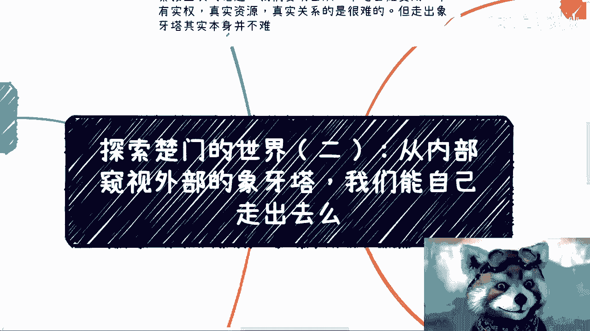
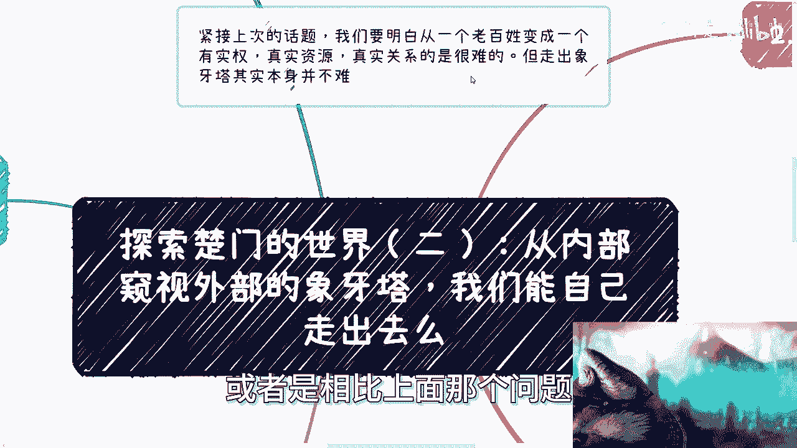
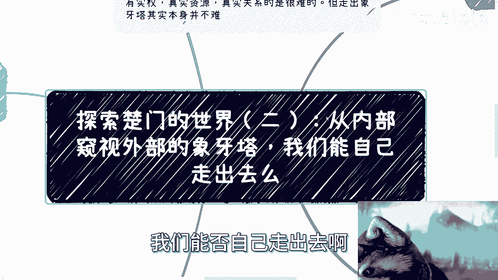
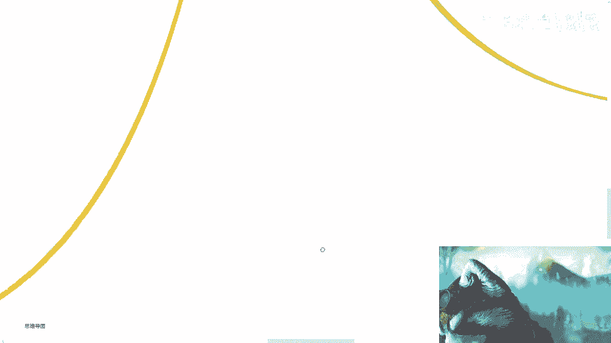
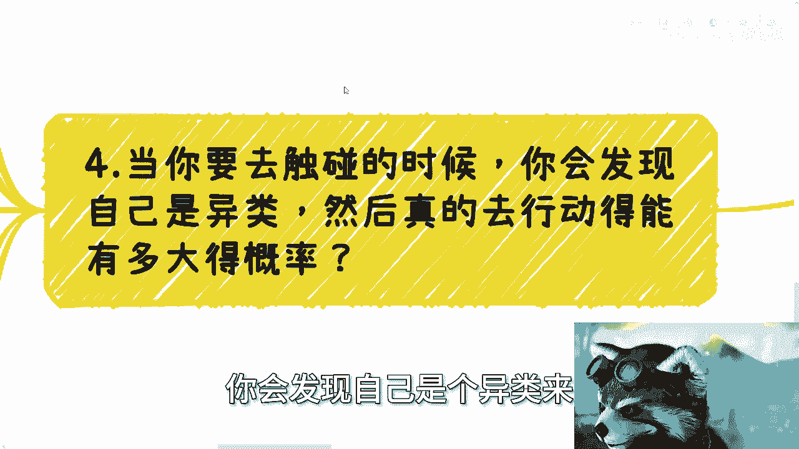
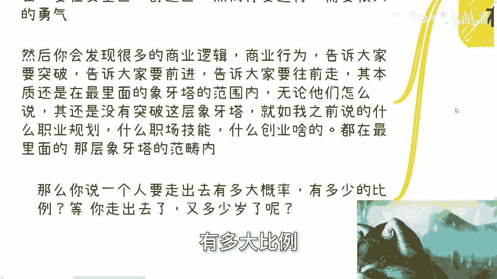
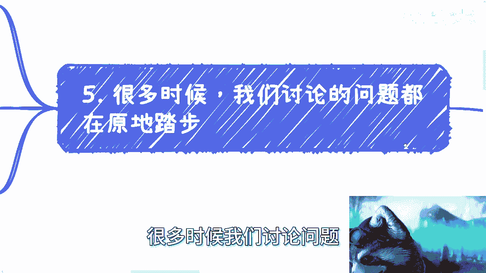

# 探索楚门的世界（二）：我们能自己走出去么？ - P1 - 赏味不足 - BV1mx4y1y7hC

啊大家好啊，紧接上次的这个话题，啊啊。

我们要明白啊，从一个老百姓变成一个有实权，真正资源的真实关系的很难啊，但是你要说走出象牙塔，或者走出若干层象牙塔本身并不难啊，或者说相比上面那个问题并不难啊。

那么今天来讲呢，我还是要加一下这个标题啊，就是从这个也是前两次那个评论呃，小伙伴说的说，从内部窥视外部的这个象牙塔，我们能否自己走出去啊。

我们从内部窥视外面的象牙塔。

你们窥视到了什么样子，你什么你们窥视出来的结果是什么，你们想想看啊，按照我们上次定义的，我们从内部的象牙塔窥视社会，窥视整个社会的商业，这层象牙塔的时候，我们得到了什么，很简单，这就是我们的信息来源。

我们的信息来源网络，老师家庭朋友父母，咳咳对吧，而就2024年，只要是个人啊，只要是个人不是只要是个人啊，对吧啊，这个大部分我们接触到的人，往往来源信息的来源也是网络，那么也就是说。

大部分我们总结下来就是信息都来自于网络，但是网络是个什么东西，网络的本质就是幸存者偏差啊，那么当我们从内部窥视的时候，发现你就两个结果是什么，成功或者违法，你们仔细想想看，你们从内部窥视外面的时候。

就这两个结果没了，不是说你们的结果是你们看到外面的结果对吧，就是说我们是看不到失败的，我们也是看不到其他的中间状态的，你们仔细想想看，但我相信只要有脑子的人啊，一定会明白，就是任何一件事情。

一个领域不可能只有违法或者来说极大的成功，这两个结果可能吗，这不符合这个地球的发展规律，所以当我们窥视的时候，我们得到了两个心理上的幻想，一个是成功的呀，一个是成功的样子，一个是法律的威慑。

但是你会发现，虽然你得到了成功的样子跟法律的威慑，但是你依然不知道成功到底是什么，法律到底是什么，你不晓得你是模糊的，你只知道威慑对吧，那么带你们仔细想想看啊，虽然整个社会都是开放的。

虽然整个社会都是开放的，但由于每个人一路走过来的经历，就是我说的9年制义务教育加高等教育，再加父母社会啊，身边的这个这个朋友等等等等等啊，以往所有的经历你们都是局限的，所以出现了一个对于成功跟法律的。

认知的偏差啊，那么我们来看第二点能不能走出去，我跟你讲，这要看天赋，因为首先你需要对一切都抱有质疑，以及要多问为什么，而且你千万不能自负，你要不停的去保持空杯，放空自己，接受一切一切的信息。

你不要了解一定的东西之后，你就会发现卧槽他妈的在座都是啊，我老牛逼了对吧，怎么样怎么样没有用的，因为你要明白象牙塔不止一层，而且象牙塔也不止两三层，你外面真有外面没有用的，记住这里的象牙塔并不是说啊。

并不是单纯的说啊，我们说打工或者企业，或者说啊在在鞋里工作啊，更多更多的是指一种工作状态，就是说一种环境的氛围，一种你的心态和对于事情的认知啊，一旦这从象牙塔你能突破，其实我跟你讲。

你在哪你都能看得更多，更远都一样的啊，不是说你状态怎诶，不是说你现在就物理状态怎么样，你说我在打工没有关系，你在打工，但凡你的认知跟你的心态，能够突破这层向阳台也行啊，但是有一点我得补充啊。

就是你想是没有用的，你要通过实践，只有实践，没有别的方法哦，你说我花钱去买门课不可能的，小的别想100万1000万都没用，还是那句话，你跟巴菲特吃顿饭怎么了呢，你能改变吗，屁对啊，那么实事求是来讲。

自己打破的难度呢可以说极高极高极高啊，因为人都是俗人啊，大家都免不了，那么大部分人是被网络驯化的，比如说经常看小红书，就觉得可能都是有钱人，都是名媛，都是高富帅，你去了大厂就都是年薪百万。

抖音貌似都是土味，视频不屑一顾等等等等等对吧，其实每个平台都一样，我就不一一举例子，但是你们想想看，这些是真相吗，这些就是幸存者偏差啊，那么就如我之前说的，这些对我们来讲都是窥视。

而且我们窥视的方法还不对，也就是说这是冰山一角中的冰山一角，而且甚至是故意营造出来的信息差，你自己想想看，吸引了这些东西对你有多大帮助啊，信这些东西，我跟你讲性质，这些东西还不如他妈，我们去买彩票是吧。

认知决定认知，经历决定认知，什么意思，你先说家庭，我觉得啊别去说父母，我们大部分人应该现在都是成年人，你别去说什么家庭教育或者父母，你要这么想，社会变化这么快，现在很多20多岁，30多岁的人都跟不上。

指望家长跟得上啊，你要我说等到你你到你爸妈那个年纪的时候，还不如你爸妈呢是吧啊，那当然我也希望你们能比他们强是吧，那么利他的人比较少，而且现在利他没有用，因为人的一生多少都会经历，你要为别人好。

别人都不认为你对他好有什么用呢，甚至认为你在害他，何必呢，对吧啊，那么你们的老师，你们的朋友往往也都是在同一个象牙塔内，你们想想看，仔细想想看，什么教授，什么老师大部分都在同一个象牙塔内。

他们大多数跟你们一样都在窥视，只不过大家窥视的范围不一样，那有的只是亏，是有的可能经历过，但为什么他们不告诉你们，为什么不不不去打破这层已经拥有的信息差，其实这事你们这样理解，为什么不说。

因为不符合主流社会价值观啊，怎么说我就问你怎么说啊，我现在说无所谓，我没有立足点啊对吧，我没有站队啊，我甚至不属于任何一个队，你老是跟你们说怎么说啊，外面有更大的事件哦，你们在窥视哦，这里有象牙塔。

大家要去探索结果是什么，结果就他妈是被投诉有意味了，对吧，因为每个人都是受束缚的，你怎么办呢，每个人都是要吃饭的，你能怎么办呢，我们可以平时吐槽吐槽对吧，去说啊，这个老师不行对吧，就像我之前说的。

他妈的，那怎么教授不跟你们讲呢，对吧，怎么样，他不讲，你要你要去理解，你要去想为什么他不讲，但是你千万不要觉得他妈的他不讲是对的，你明白吧，这就是扭曲的价值观了啊，我跟你讲，你别笑啊，社会就是如此。

你像我们以前在公司里面，有一些外企来的管理者，就外企来的高管啊，其实人家价值观很不同啊，然后人家来了就跟就跟所有人都说，做完可以回家，不要996，不要零七好了，我跟你讲，第二天就他妈被举报。

有很多人就要想了，妈的这他妈都能被举报对的，为什么不符合主流，就不符合主流价值观啊，啊你们难道不知道吗，主流价值观，主流的公司内的价值观，不是就要压榨压榨你们吗，啊主流价值观是跟你们说啊。

晚上早点走是吗，举报的理由叫什么，叫做不懂得团队合作，挑拨离间，哼你能说啥，我就问你，你能说啥。

第四点当你要去触碰的时候，就是我就说当你要去触碰第一层塔边界的时候，你会发现自己是个异类来。

然后真的去行动能有多大的概率啊，十你就你就这么想吧，其实你会发现屏障有没有有窥视之后，无论你通过自己的方式还是互联网方式，窥视以后带来的其实情绪只有一个什么，恐惧没了，就一个无论外面是多大的成功。

也无论外面多大的触犯法律，结果就一个恐惧未知的恐惧，所有的恐惧不知道这东西的恐惧，咳咳咳，包括所有人告诉你不行的恐惧，因为无论成功还是违反，他都太过成功啊，他都太过成功，相对象牙塔里的人讲来讲。

也都太过遥远，但是你说远不远吧，不远远的是信息差，你说能有多远，啊当然很多人说普通人，其实我就这么说，阶层有没有区分有的，但是普通人里面也有区分啊，你不你在不同的象牙塔的这些层级里面，大家都是普通人啊。

但如果你要走出去，你就这么想，你要先克服这种恐惧，然后你还要逆行，因为你要走出去，大家都会劝你哎呀不要出去，你不行，要在安全区舒适区，然后你要逆行，我就问你这他妈要多大勇气，而且这不单单是勇气的问题。

你要有多大多强的执行力，你们想想，感觉就讲到现在，这些东西是他妈的什么知识付费，什么东西能解决吗，解决个屁啊啊，然后你会发现很多的商业逻辑，商业行为，我就这么告诉大家，这些商业课程都要告诉你们要去突破。

告诉你们要去前进，告诉大家去往前走，但你会发现这些往前走和往前进，其本质还是在最里面的山下草的范围里面，有什么区别，50步笑百步，无论他们怎么说，其实没有突破自身这层象牙塔有什么用啊。

啊就是我之前说的什么职业规划，职业技能，什么创业，什么东西都他妈是在最里面那层象牙塔里面，再去折腾，他没有突破，是吧，那么你说在这么一个大环境里面，你一个人走出去有多大概率。

你自己想想有多大概率有多大比例。

更何况就退1万步来讲，等你走出去了，你又多少岁了呢，啊你多大年纪了呢，对吧，最后很多时候我们讨论问题其实都在原地踏步。

什么意思，就如同很多人要说的什么好，学校资源好，然后呢我就问能给我们赚钱吗，能给我们带来什么，你工作再好能怎么样呢，你还是在下面的象牙塔，你要愿意，那是你的事，至少我追求不是这样子对吧。

至少大家有若干些人追求不是这样子的，那么最下面的象牙塔这样的人很多，其实什么都没有了解过，什么都没有追求过，然后就不停的PUA自己说好的学校资源好，大厂薪资高，好的导师就很好。

那请问这些东西跟你有什么关系呢，等你35岁能给你绑定吗，能给你赚钱吗，最终不还是象牙塔最底层，象牙塔里面的这块电池吗，用用完被扔吗，有什么区别呢，助纣为虐，是吧，所谓好和不好没有什么意义。

这些东西都是在一个层级里面，你就如同你问我30分和40分有什么区别，那不好意思，都不及格有什么区别，我不想来跟你讨论，30分和40分有什么区别对吧，我还是那句话啊，很多人跟我说。

老师我们生活很艰难啊，我我我就想20万变成30万没问题啊，我不认为这有这里面有对跟不对的，只是我想说这跟我没有关系，你要你的，你的追求就是20万追到30万，难道你去啊，我不管你被谁去割，随便你去被割。

无所谓啊，不要来跟我争，没有什么跟我争的，你明白这个意思吧，不要来跟我争，我没有这个追求，而且我告诉你，就算我现在穷的叮当响，我今天就算在他妈的桥洞里面乞讨，我也不是这个追求啊，还是这句话。

人当下怎么活是当下的事情，你有什么追求是你追求的事情啊，你不要来跟我说，哎呀，我企图用现状啊，来来来来掩盖你这种这个怎么赚，大部分人躺平的追求对吧，没有什么好掩盖的，直白一点好吧，你们如果看完了一跟二。

你们应该多多少少，应该能明白这个象牙塔的大概样子，那你们再会先思考一下，思考一下行好吧，然后有什么那个杭州报名的，继续报名，然后有什么找我咨询的，反正你们再整理好吧。

