# 接下来很多年C端散户的痛点 - P1 - 赏味不足 - BV1vC4y167C7

啊大家好啊，今天礼拜一诶。

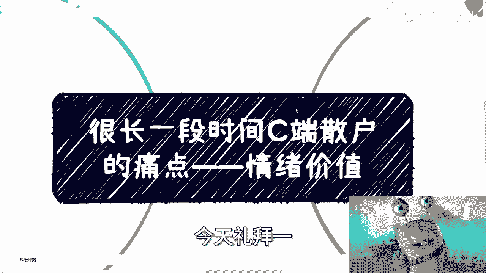

今天礼拜二啊，礼拜一啊，哼我已经傻了呃。

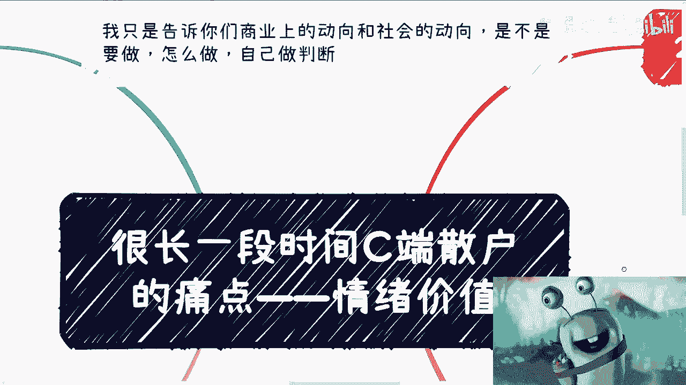

首先啊我想我只想先跟你们讲啊，商商业上的这个动向跟社会的动向啊，是不是说一定要这么做或者怎么做，你们自己做判断啊，不要到最后说啊。

陈老师说了这个内容啊，我们就要这么做啊，没有啊，呃那么今天我们要讲的是很长一段时间啊，在接下来甚至很多年里面啊，C端散户的唯一的痛点啊。

我觉得是唯一的痛点是什么，情绪价值没了啊。

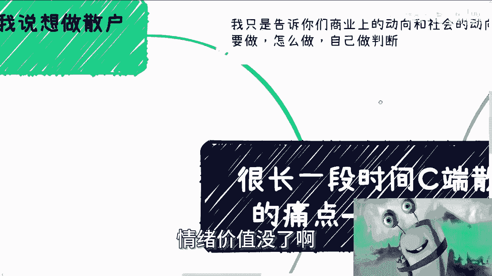

啊这就好像很多人跟我说想做散户的生意，比如说啊有的人跟我说，我想做自媒体，做私董会说做卖货的。

你说能不能赚钱，能，但是他不能让你异军突起对吧，他不能让你就是就是立马就感受，感受到或者抓住这么一个痛点，抓住这么多红利，不可能啊，那么当然人要做事情，一般都会想到自己会什么，然后再去想别人要什么。

而且往往呢他最后去想的时候，他根本就不知道别人要什么，然而现在这个市场以及接下来的这么多年啊，我跟你们讲，你们会什么，用户要什么都不重要，因为当你展示你的才艺的时候，大众是只有余力的时候才会去看的。

当你去卖一些东西的时候，大众也是只有余力的时候才会去买的，当然就像我们刚刚说的，不是说他不会买，但是他会大大降低他买的比例对吧，但是现在什么情况，现在往后你们自己去看，24年往后，大众没有余力。

非常的焦虑，每天活在焦虑当中，而且这些焦虑根本不需要，像以前罗振宇他们那样去贩卖焦虑，不需要为什么，因为现在世界就很焦虑，真实的存在就很焦虑，那边坦克咳咳，开过来开过去对吧，这边大家经济情况不好。

他世界就很焦虑，有的网络有的是真实存在的，有的是网络渲染起来的，但这些都不重要，重要的是结果都是一样的对吧，那么我们说散户要什么其实也不重要，因为大部分的散户他一方面没有太多的认识。

另外一方面他根本就不知道自己要什么，连他自己都不知道自己要什么，我们怎么会知道呢。

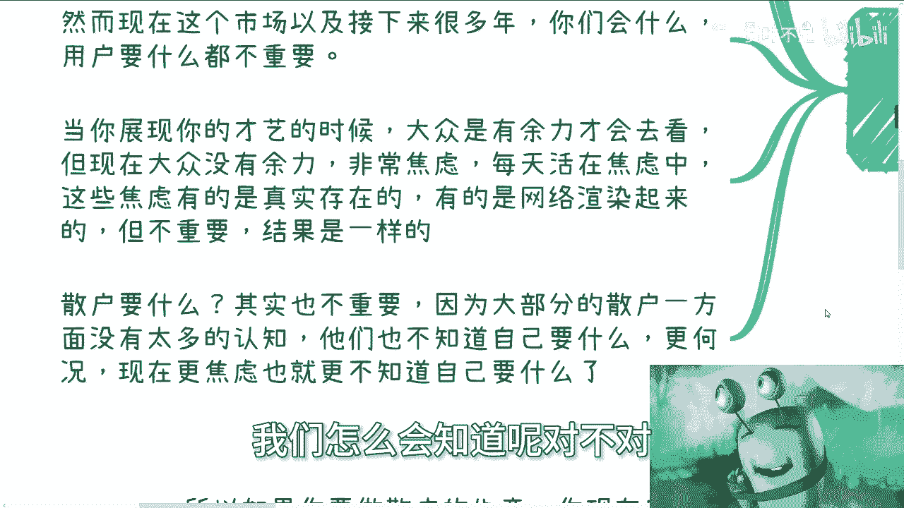

对不对，所以哦那么核心点就是什么，就是他要的只是情绪价值哦。

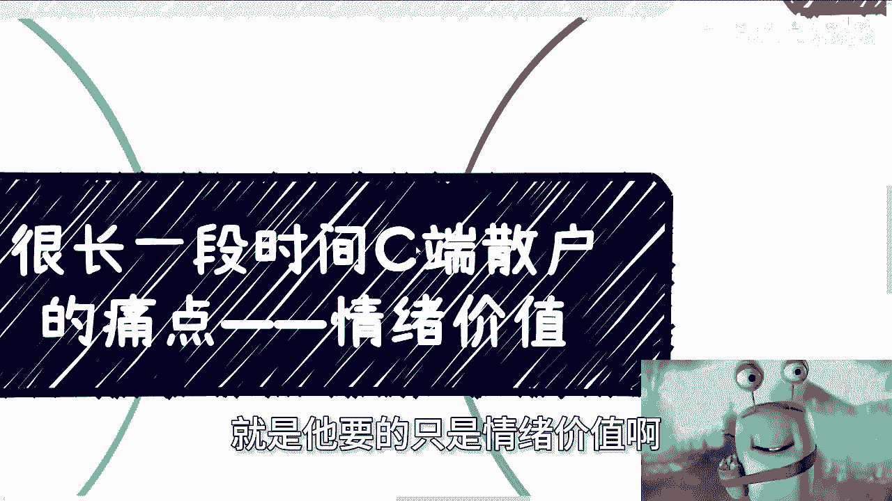

也就是说说的再俗气一点，就是他要的就是一些虚的东西。

任何实的东西都没有用，因为他不知道他要什么。

对吧啊，好，那么第二点，长期的红利情绪价值这事，最近我跟我朋友很多朋友讨论过，其实，你们就这么想啊，我们把所有人按照127来分一乘，他非常的理性啊，他们觉得我是知道问题出在什么地方。

我也知道我要改什么东西，我也知道未来方向是什么，他们能够理性的判断，这就好像那些找我咨询的人，目的性很明确，甚至能想清楚怎么利用我，我也很开心，因为大家能赚钱，这个是其中一层一层。

当然这个我只是这么一个比例啊，我只是这么个比喻啊，没有说真的占一成啊，啊这种人肯定占不了一成啊，0。1乘了不起啊，那么两成的人是什么呢，就是需要呃，他需要什么，他可能不清楚啊。

但是他可能还能分得清楚真实和虚假，他也还是想脚踏实地的去做点什么的啊，这就好像咨询我的那些人当中，他们能列出问题，但比较宏观啊，很不具体，也不是说非常直接啊，需要我通过他们的这些背景。

去理清楚目标跟方向啊，那么七成的人是什么，七成人就是根本就不知道什么啊，就七成人是根本什么都不知道啊，什么都没有认知，而且他们也没有所谓的是非观啊。

对他们来讲，非黑即白即白，世界就是零和一啊，好就是只有好和坏，那么实际上也是非常成功的，就说白了他们的认知，他们的朋友圈，他们所看到的就是全部的世界，别人说什么，他们都不信，也不是都不信嘛。

就是别人说什么，他们都觉得啊，就是就是姑且就这样子，他们认为他们所看到的世界就这样子，但是呢当别人跟他去讲一些，比如说要赚钱啊对吧，要要要忽悠他们的东西的时候。

哎说啥信啥啊，那么所以说然而不同的人呢。

他的情绪价值是不同的，那么那一成的人他是非常理智的，要什么别人说什么啊，别人说的对不对啊，他自己有判断力，而且这种人比较难忽悠对吧。

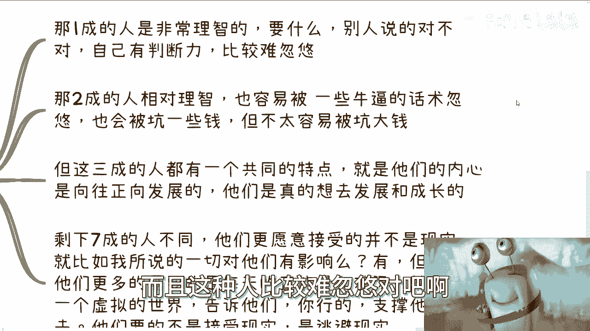

那么二成的人呢相对比较理智，但容易被一些包装好对吧，并且牛逼的晃数所忽悠，也会被被坑一些钱，但是它不容易不容易被坑大钱啊，但是这三成的人他都有个共同的特点，就是他们的内心向往啊。

它是比较向往正向方啊发展的，也就是说他们是真的想要去发展和成长的，至少就是说不管他们这个表现当中怎么样，也不管他们的到底是最终被骗还是没被骗啊，就是他们至少是内心是想发展和成长的。

但是剩下七成的人他不一样啊，他们更愿意接受的它并不是事实，就比如我们说，我们就打比方说啊，就打比方说我说的这些视频啊，无论我说的对和错，也无论我是不是真的就是说打中他们的痛点，或者说真的是为他们着想。

没有用啊，你说有没有有有但不大啊，说白了就没有用，他们更多的需要的是什么，每天的正能量跟鸡汤，就是需要网络，需要大众，需要某些什么，看上去很牛逼的人啊，来认可自己，然后告诉他们，OK啊，你行的啊。

支撑他们活下去，他们要的其实不是接受现实，接受现实没有用，因为接受现实太残酷了。

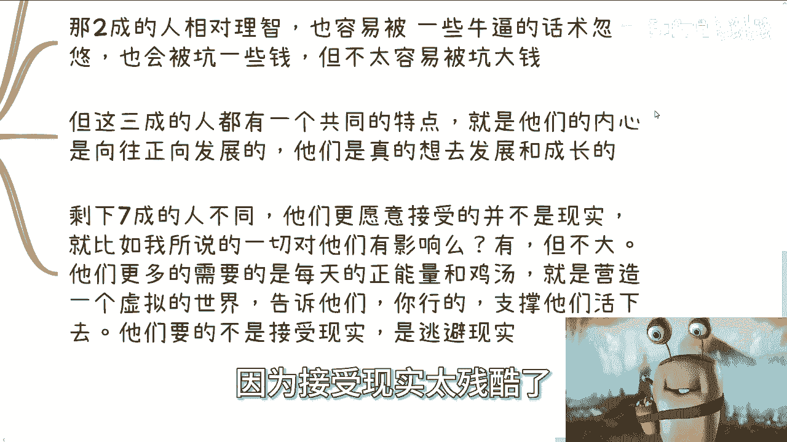

他们要的是逃避现实对吧，你就像前两天我昨天朋友圈发的那个什么呃，有些参加过活动的，不是也看到了嘛对吧，就说那个三亚那个那个敲木鱼对吧，然后然后那个叫什么身心灵，一个小时3980。

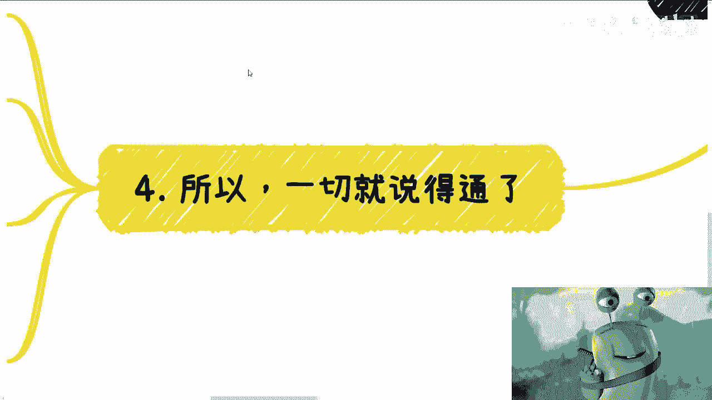

为什么，因为他们不要现实啊，他们要的是逃避，而且更何况很多时候你知道吗。

很多时候他们想抱团逃避，我跟你们讲，其实没什么好疑惑的，也没什么好好那个惊讶的，因为人性就这样子。

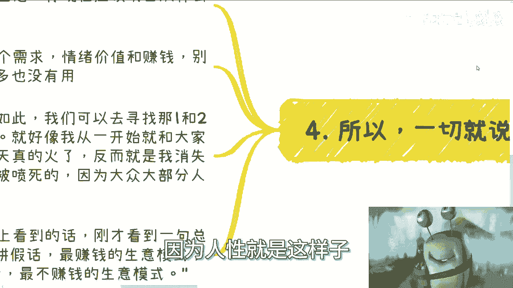

对不对，人性就是这样子，大部分的人他就是要当鸵鸟呀对吧，为什么以前一直说爱叫不醒装睡的人对吧，为什么说皇帝的心意，那不是一个道理吗，对不对，因为人性本来就这样子，你能怎么办呢，啊，你难道指望说。

100个人里面有98个人是非常清醒的，卧槽那世界就不是这样子，对不对啊，所以啊你要做散户的生意。

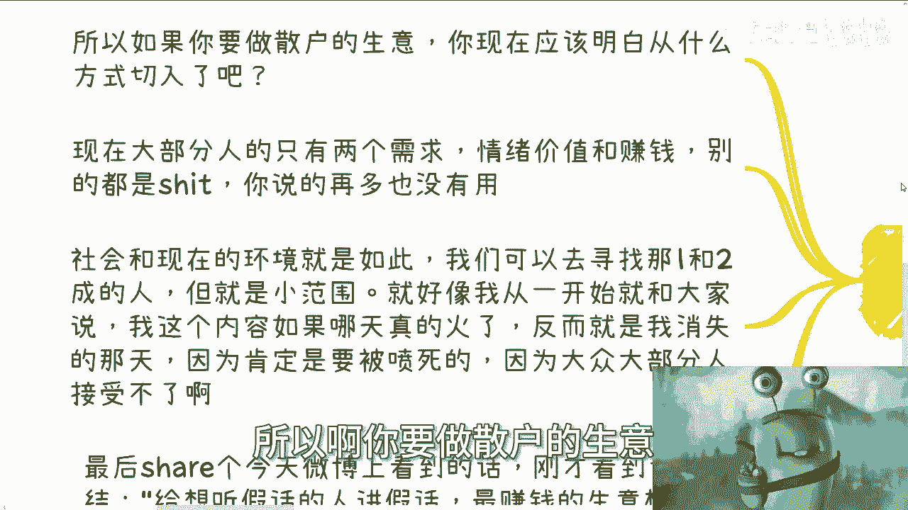

你现在就该明白什么方式切入啊，现在大部分人他只有两个需求，要么情绪价值，你能安抚我，要么就是赚钱啊，别跟我逼逼啊，别的都是，对你说再多也没有用，为什么，因为社会跟现在的环境就是如此，而且越来越恶劣。

我们与其要去寻找那一根二乘的人对吧，那你不如去寻找寻找大批量的人，对不对，当然你要做一和二成的人的生意也行对吧，你就好像我一开始我最早的时候，我就跟大家说过，我所表达的所有的内容，如果哪天真的火了。

不要你们不要老说我百搭百搭的对吧，卧槽我跟你讲，你不要百大了，你哪天要是我估计啊，哪天我粉丝量能到50万，我跟你讲反而肯定就是消失的那天，为什么，因为这些内容它只能小众啊，他只能真实啊。

但真实的人是少数啊，你最终只会被喷死啊，因为大众大部分人接受不了的呀，这就是现实呀，哦大众要是大部分人能接受得了，那世界就不会这样，这就是个悖论，你知道吗啊所以说啊我最后在希尔一个。

今天早上我起来看到微博上啊一句话，他说什么叫做想给想听假话的人，说假话是最赚钱的声音模式，给想听真话的人说真话是最不赚钱的生意模式，对不对，你们仔细品一下，哎呀没有办法的，你知道吗。

因为那些听假话的那些人，他愿意付钱，他愿意掏钱，他甚至愿意贷款对吧，因为他觉得身心身心心灵上得到了安慰，但愿意听真话，那些人呢他的确愿意听真话，但是真话愿意听真话，那些人他往往比较聪明。

你觉得他愿意花多少钱呢，对不对，不是我说大家不愿意花这个钱，而是我觉得大家可能很理智，你说对吧啊，我也许能从你们身上赚到钱，但是我怎么能跟那些什么动不动什么几万块钱，几万块钱的人去比呢，对吧。

我就说直白一点，我今天真的就算给你们弄了一个，价值几万块钱的东西，你们也是不会付的，为什么，因为你们是一个理智的人，因为真正付那种大钱的，要的是冲动消费，你真的靠理智消费，我说实话很难很难的啊。

非常的难，这就是真话对吧，怎么办呢，没有办法的啊，哎呀行啊，就这么着吧好吧，反正大家有什么详细的需求。

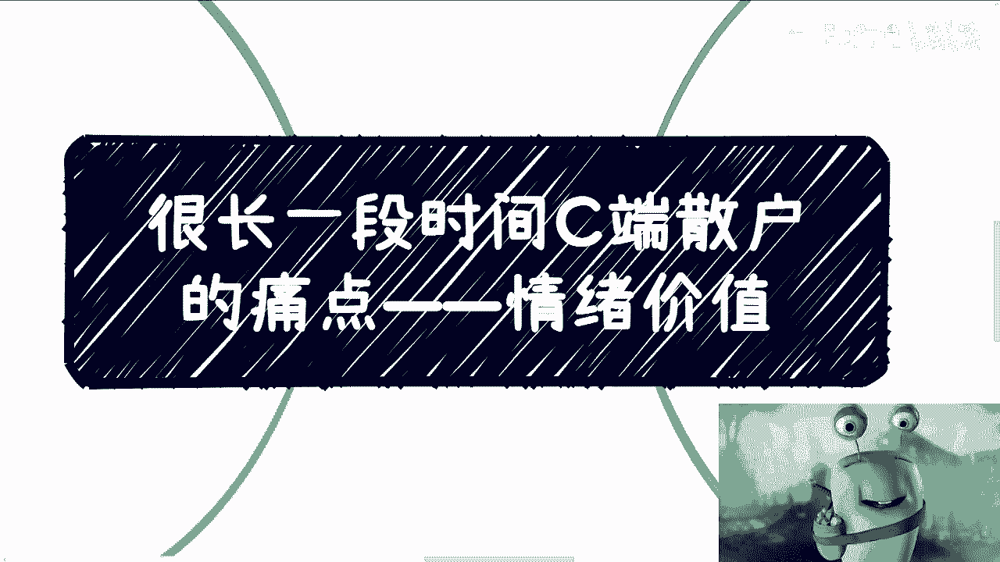