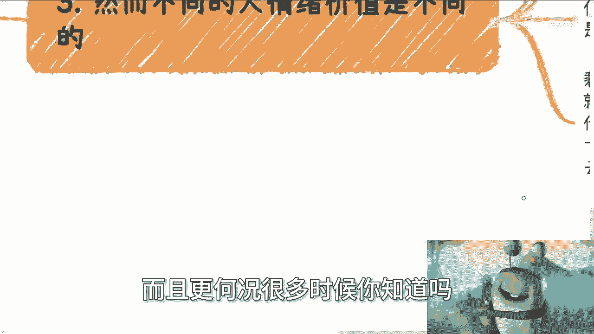

# 课程一：未来多年C端散户的核心痛点分析 🎯

在本节课中，我们将要学习未来很长一段时间内，面向C端（消费者端）散户市场的核心商业逻辑变化。核心观点是：散户的核心痛点已从追求实用价值，转变为对**情绪价值**的强烈需求。

## 市场环境的变化

上一节我们概述了核心观点，本节中我们来看看当前及未来的市场环境为何会催生这种变化。

许多人考虑做面向散户的生意，例如自媒体、私董会或卖货。这些生意能赚钱，但难以让人异军突起或抓住巨大红利。

人们做事通常会先想自己会什么，再想别人要什么。然而，他们往往最终也不知道别人真正要什么。

现在以及未来的市场情况是：你会什么、用户要什么都不再是最重要的。因为当你展示才艺时，大众只有在有余力时才会观看。当你销售产品时，大众也只有在有余力时才会购买。这不是说他们完全不买，但购买的比例会大大降低。

从2024年往后看，大众没有余力。他们非常焦虑，每天活在焦虑中。这种焦虑不需要像以前那样被刻意贩卖，因为世界本身就很焦虑。无论是真实存在的经济问题、国际局势，还是网络渲染的氛围，结果都一样：大众处于高度焦虑状态。

## 散户的真实需求

了解了环境背景后，我们进一步探讨散户的真实需求是什么。

散户要什么其实也不重要。因为大部分散户一方面没有太多深刻认识，另一方面根本不知道自己真正要什么。连他们自己都不知道，我们又如何能知道呢？

因此，核心点在于：他们需要的只是**情绪价值**。说得再俗气一点，他们要的是一些“虚”的东西。任何“实”的东西都没有用，因为他们不知道自己具体要什么。

## 用户分层与情绪价值差异

既然情绪价值是关键，那么不同人群的需求有何不同？以下是基于一个比喻性的“127”模型进行的用户分层分析。

*   **一成用户（约10%）**：非常理性。他们清楚问题所在，知道要改进什么，明确未来方向。他们能理性判断，目的性明确。这类人比例可能更低，例如0.1%。
*   **两成用户（约20%）**：相对理智。他们可能不清楚具体需求，但能分辨真实与虚假，仍想脚踏实地做事。他们能列出问题，但比较宏观，需要他人帮助理清目标和方向。
*   **七成用户（约70%）**：缺乏认知。他们对世界没有清晰的认知，也没有稳定的是非观。他们的世界非黑即白，认知局限于自己的朋友圈和所见范围。他们容易轻信那些承诺赚钱或提供简单解决方案的言论。

然而，不同人群需要的情绪价值是不同的。

*   那一成理性用户，他们自有判断力，难以被忽悠。
*   那两成相对理智的用户，容易被包装精良的言论所忽悠，可能会损失一些钱，但不易损失大钱。

这三成用户有一个共同特点：内心向往正向发展，真心想要成长和进步。

但剩下七成用户不一样。他们更愿意接受的不是事实。例如，无论视频内容对错、是否真正击中痛点或为他们着想，对他们作用不大。他们更需要的是每天的正能量和鸡汤。他们需要网络、大众或看似厉害的人来认可自己，告诉自己“你行的”，以此获得支撑活下去的动力。

他们要的不是接受现实，因为现实太残酷。他们要的是**逃避现实**。

就像近期出现的一些活动（如高价“身心灵”课程），其本质是提供了逃避现实的出口。很多时候，他们还想抱团逃避。这并不奇怪，因为人性如此。大部分人会选择当“鸵鸟”。这就是为什么说“你永远叫不醒一个装睡的人”。

## 商业切入点的选择

分析了用户分层后，我们来看看这对商业选择意味着什么。

如果你要做散户的生意，现在就该明白从什么方式切入。现在大部分人只有两个核心需求：
1.  **情绪价值**：你能安抚我。
2.  **赚钱**：别跟我说别的，直接告诉我怎么赚钱。

说再多其他内容也没有用，因为社会和环境就是如此，且可能越来越严峻。

与其费力寻找那一成或两成的理性用户，不如面向那七成的大批量用户。当然，做理性用户的生意也可以。但必须认识到，真实、理性的内容只能吸引小众群体。如果这类内容变得大众化，反而可能因为不被大众接受而遭到排斥。这是一个悖论。

最后分享一个观察：**“给想听假话的人说假话，是最赚钱的商业模式；给想听真话的人说真话，是最不赚钱的商业模式。”**

那些想听假话的人愿意付钱，甚至愿意贷款，因为他们觉得心灵得到了安慰。而那些愿意听真话的人，虽然理智，但往往不会为“真话”本身支付高昂费用。真正的冲动消费和大额支付，很难建立在完全理智的基础上。

## 总结

本节课中我们一起学习了未来面向C端散户市场的核心逻辑。关键结论是：在普遍焦虑的环境下，散户的核心痛点已转变为对**情绪价值**的渴求，尤其是对逃避现实、寻求安慰和认可的需求。用户可大致分为追求成长的少数理性群体，和需要情绪支撑的多数群体。商业上，针对后者提供情绪价值，是未来多年可能持续存在的切入点。理解这一点，是思考相关商业策略的基础。