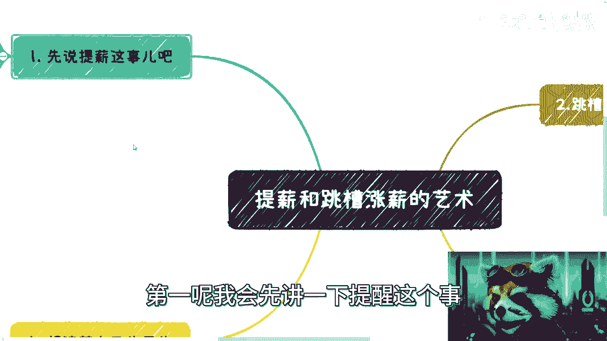
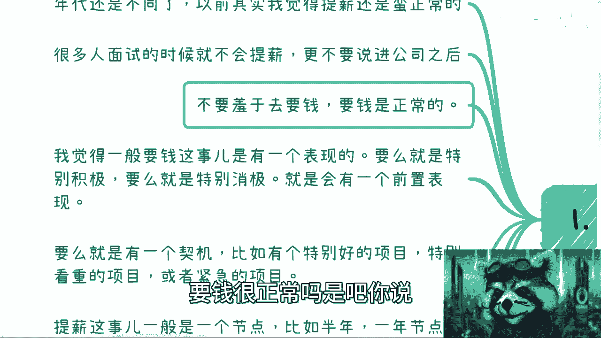
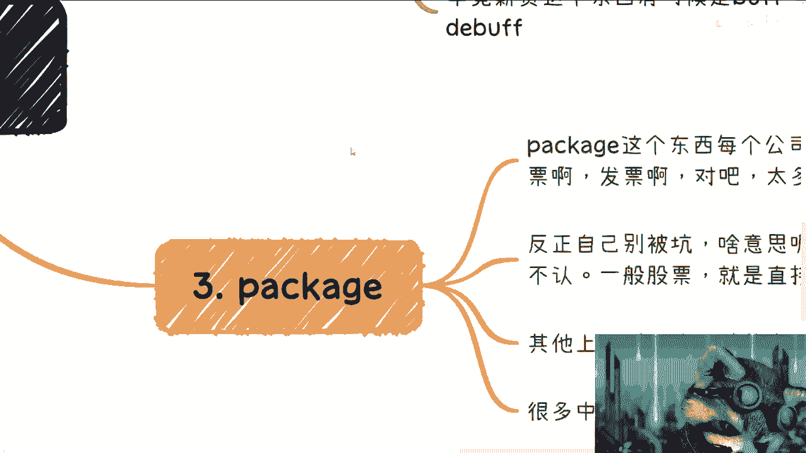
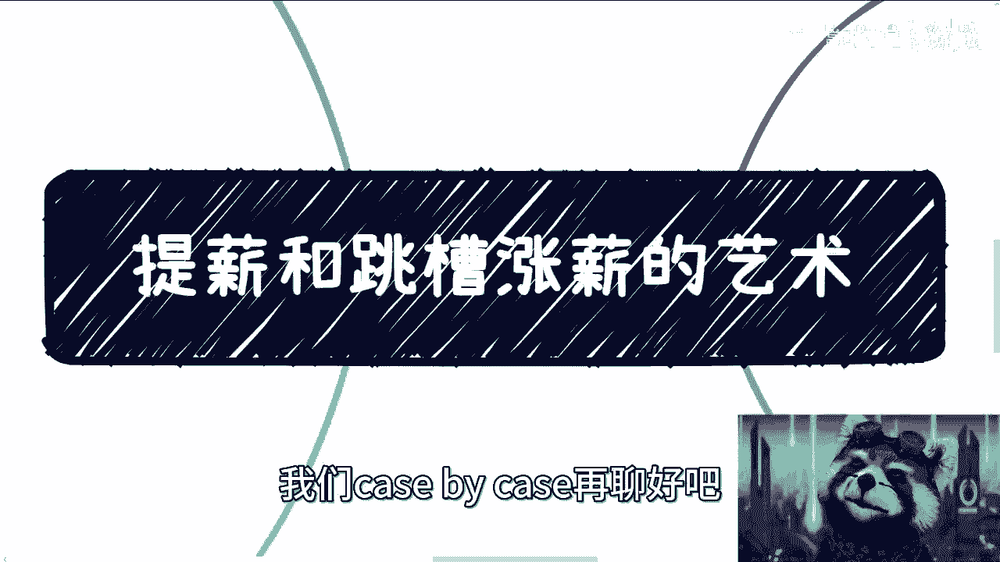

# 提加薪和跳槽涨薪的艺术 - P1 - 赏味不足 - BV1gV4y1k7eH

哈喽各位小伙伴大家好，今天今天礼拜几礼拜礼拜三啊。

就前两天有小伙伴提了这个问题啊，我觉得蛮好的对吧，这个请大家用各种神奇的这种场景问题来投喂，我是吧，哈哈哈哈啊，然后也希望大家在看这个视频的时候，悄悄的看是吧，不要不要让你们的领导看到哈哈，你要笑死。

唉那个是这样子的啊，当时呢其实这个问题的小伙伴呢是这么个意思，他说啊这个这个驴老师你觉得提升啊，就是说自己去提这个薪资涨幅啊，啊然后呢跟跳槽的这个涨薪啊，这件事情怎么个抉择法啊。

然后呢这个在不同的这个方向上有什么区别啊，然后呢我就大概整理了一下啊。

我们我先给大家看一下啊，第一呢我会先讲一下提升这个事。

第二呢我会跟你们说一下跳槽这个事儿啊，然后第四呢我会跟你们说一下这个package对吧。

就整个这个这个薪资，因为薪资结构很复杂的是吧，第四呢就是我觉得这个目的啊。

然后我一个来说是吧，我跟你讲啊。

驴老师真的牛逼啊，这个这个毕竟以前是打工人是吧，哈哈哈哈啊，那个首先先说提升啊，这个我跟你们讲，我是觉得年代还是不同的啊，以前呢我觉得提升还是蛮正常的啊，这个现在呢我感觉怎么说呢。

可能那种这当然现在提醒也正常，那现在呢就感觉就是说大家可能哎呀，这不是很放得开，你知道吗，所以我一直很蛮喜欢那种放得开的人啊，这是第一个，第二个呢就是我跟你们讲啊，很多人面试的时候呢就不会提醒啊。

更不要说进公司之后呢，就是嗯其实我说实话我碰到这种人蛮多的，就是他会觉得呢这个一呢是自己不够自信，二呢可能自己也不知道怎么表达啊，三呢就感觉就是说哎呀我有点怕是吧，就是我妈提出来这个薪资。

人家问你多少钱啊对吧，你说我年薪50万啊，那有种什么感觉呢，就是那种可能我不提了，我还能拿到这个工作，我提了吧，对方是不是就感觉不要我了，是吧啊这种感觉，然后这种呢我其实在商业合作上也碰到过很多。

你知道吗，就是那种就是说就商业合作上面也是一样的，就比如说人家说哎这个陈老师我们合作对吧，那你看看多少钱对吧，就这种时候是这样子的，你得去提，我以前其实在之前视频里面有讲过的，就是你得去提。

因为你干嘛不提，你会让别人觉得你很不自信，而且我跟你讲就最最的，千万不要说一句话叫什么就说啊，我都可以的，你定那我都可以给你定，那那那可以啊，那那我订一块钱，你要不要说不来就嗨呀，就是我跟你讲啊。

你如果是乙方对吧，对方是甲方，你不要把皮球踢给甲方去，你知道吧，你把皮球踢给甲方，那他妈的你还怎么弄，你告诉我是吧，那甲方就问你一块钱，你做不做嘛，你要你又说不做，那他妈你不是让我提了吗，对不对啊。

然后这是敌人啊，还有呢就是说不要羞于去谈钱对吧，要钱很正常嘛是吧，你说我付出了劳动。

我签那个全职全职的合同，他妈我要钱不行吗，然后我也真莫名其妙来了，你说是吧，然后呢我觉得一般呢要钱这个事儿呢，你其实是有个表现的啊，比如说啊就有的人呢他会在要钱之前呢，这个表现特别积极。

哎有的人呢就表现特别消极对吧，反正就是要么就是你看啊，我表现蛮好的对吧，我想跟跟hr跟老板提加薪了对吧，要么就是他妈的这工作我不做了对吧，你爱谁加班谁加班是吧，那我接下来就几题不提了，老子就走了是吧。

那那那那无非就这两种情况，一般呢都会有一种前置表现啊，然后还有呢就是那种嗯这什么东西啊，去他妈的，然后呢还有什么呢，就是那个要么就是有这种契机啊。

契机就是说啊，你看啊这个呃比如比较比较特别好的项目对吧，或者特别看重的项目，或者是一个什么什么紧急项目，这种东西做完呢，一般来讲都比较顺理成章的啊，你可以加薪啊，或者你有一些奖金啊对吧。

或者你你就promote是吧啊，然后呢我觉得提加薪这个事呢一般是一个节点，就比如说半年啊，一年啊对吧，一般叫什么叫叫叫叫叫叫哎呀，我也忘了，反正就是就是就是基本上就是就是就是审核啊，对吧。

这个晋升啊那个时间啊，然后呢总结来讲呢，我觉得是这样子的，小公司虽然小，但讲究扁平化对吧，那我觉得就算你该提就提，不要去羞涩，没什么好，也不要绕圈子，就直截了当开门见山，你知道吧。

然后还有呢就是大公司呢，我觉得一般hr d啊也都是会有点逼数的，否则这hr d也别做了啊，我有一说一就还是有点逼数的，但是呢你指望别人也没用啊，就是我觉得就总结来讲，就是无论在哪对吧。

大公司小公司都可以啊，你该题题有什么啦，对不啦啊，一点都不用去想了，你该题题，当然你就说一定是在一个范围内的法制内啊，你别太过分是吧啊，那我觉得就没问题，那这个是这个提升的问题啊。

嗯跳槽这边呢我是这么想的啊，第一呢就是说跳槽涨薪这个事儿啊，天经地义好，很正常，一般呢对方会有个幅度啊，但是这样看这个公司不同，那小公司呢可能没这么多条条框框啊，但是呢有的公司是有死线的，什么叫死线呢。

就是公司从集团层面啊，它的规则规章制度就是这个样子啊，就比如说啊这个某某某级别对吧，他进来了，我不管他薪资多少，反正最多只能10%啊，15%啊，这人再牛逼也没用，反正就这个样子啊。

你这个是不能打破我们公司规定的，有的啊点名我就不点了对吧，反正知道的就知道，那有的呢就是这样子的，而且呢就是说嗯说实话从大公司角度来讲呢，也也也不算少啊，也不算少啊啊这是第一个。

第二个呢就是说跳槽一般呢都是谈package涨薪的，也就是说你会告诉对方我的总包对吧，是多少多少钱，然后呢我要涨多少多少钱，但是啊，但是啊这个东西我后面在派克就会写到的，就是但是啊就是这个涨薪呢。

也要看公司认不认啊，什么意思呢，就是说你认为的package跟他认为的package。

可能不是一个package啊，这个事情呢我们后面再来说啊，那跳槽这个事呢，我觉得钱是一方面啊，我觉得更看重的，得要是你的技能跟业务的持续性，包括你的啊积累方向啊，包括你的项目经验啊。

我觉得这些呢可能会比较重要，呃，为什么呢，因为咱这么说吧，就是如果你是一个有职业规划的人，那么你可能会觉得我希望的是说啊，在公司的层面上面啊，包括管理啊对吧，包括这个这个这个这个这个这个受众人数啊。

就是你的服务人数啊对吧，包括就是说你的眼界啊等各个方面，虽然我们说啊和商业层面无法相提并论，但是在公司层面，它依然还是有一定的价值，是不是，那我觉得这个是一方面，那第二方面呢就是说在公司选择上面。

他肯定还是有差别的，这就好像你今天我不管你是做技术还是做销售，还是做别的一些岗位，你在一家小公司，跟你在一个比如说日活几个亿的产品线当中，那肯定是不一样的，对不对，那这个里面呢我觉得就是说你要看重的是。

你在这公司里面，到底是说唉我能够更好地学到这家公司的流程，还是说我能学到这家公司的管理，还是说我能学到这家公司的做事方式，还是说我能学习到这家公司在整个业务当中，比如说大家B优势怎么划分的对吧。

就业务线怎么划分的，团队管理，虚线管理，实现管理怎么管理的，对不对，那你得有自己的想法，你说我跟你讲最不不足，最不建议的就是说你去跳槽，你说哎呦不行，我就只看package的吧，我只看钱，那不行啊。

那不行，那真不行啊，就是说就是说在这个事情当中，不管什么方向啊，就是你都要考虑到各个方面东西，那虽然啊我之前的的确出国，一期视频就告诉大家对吧，就只要搞钱啊，没毛病，但是还是那句话，就是搞钱是搞钱。

搞钱你得有脑子的搞，你知道吗，这不是无脑的去搞，你知道吗啊然后他妈的还有人在我下面评论，你知道吧，说什么说啊，这个搞钱level太低了啊，这个叫什么level高的叫利益分配，利益分配什么东西啊。

啊连搞钱都搞不到，还他妈利益分配呢，唉真的先做好太监，你知道吗，嗯好吧啊，然后那个，还有什么呢啊毕竟薪资这个东西呢，我跟你讲啊，薪资这个东西真的他有时候呢是个Buff，有时候是个底Buff。

为什么是这样子的，就是有些时候薪资这个东西呢，可能会卡住你的某些晋升也好，或者也可能会卡住你的跳槽，有可能的啊，这个就是相当于什么呢，就是说就说嗯可能你的发展啊，当中有了一些这个这个这个不可预见的情况。

比如说你的薪资过高或你的薪资过低啊，都有可能出现这种情况。

所以说呢其实啊就是我们说回到主题，这个嘛就是你提升也好，跳槽涨薪也好啊。

未必一定是个好事情啊，一定是未必一定是个好事情，一定要记住。

好我们来看package page，这边是这样子的啊，page这个东西呢每个公司都很复杂对吧，销售啊，股票发票啊对吧，就是太多了啊，懂得都懂啊，这个我就不方便多说了，说多了这个视频又没了是吧。

这第一个第二个呢就是说反正呢我跟你讲，自己别被坑，什么意思呢，就是说很多时候package这个东西啊，因为很多人不懂啊，那个hr1忽悠对吧，企业一忽悠啊，就是说好OK没问题好嗯，就这么着了对吧好。

那这个时候呢，你就会发现你的package里面有有可能啊，除了那个base salary以外，有可能会有一些其他人啊，就是这个浮动比较大的啊，那么一般来讲呢你看啊就是这种股票，比如说分4年归属啊对吧。

每年25%啊对吧，然后呢这种直接兑换的呢，我跟你说，对方都是认的啊，这没毛病，但是只要你有上下浮动的，并且有些不可告人的操作的，那么这种都补人啊，这种都不会认的啊，就这么给你讲啊，啊不会认的。

而且呢很多公司呢它其实是要看流水的，你明白吧，就是什么叫流水啊，就是来自于你这家公司，或者来自于你这家公司，委托的第三方发行公司啊，所给出来的每个月的收入啊，每个月的收入好，那么在这个地方啊。

那么一旦你有一些浮动的东西啊，那么这个东西对面hr一定会问你，或者对面的这个这个这个管理者一定会问你啊，那么到那个时候呢，你可能就是很难去解释这件事情，因为其实对于对方来讲，你说什么不重要。

对方只知道一点啊，这个对于动态的那动态意味着什么，意味着你可以日零啊啊，who care啊，是不是啊，那么这个是三啊。

四四呢，我觉得就是说你得想清楚自己的目的，什么意思呢，就是说薪资这个事情呢，有时候并不是说真的拿钱，我给你举个例子啊，就比如说啊我们打个比方啊，你对自己有非常这个这个好的职业规划。

然后呢你去了一家公司啊，你去家公司目的是什么呢，我不是为了拿拿多少钱对吧，你说我就拿多少时间钱，你说我进去什么要稳定拿10年五年对吧，20年不是的啊，你过去呢就是为了提升你的base salary。

我跟你讲，这个时候有这个东西有时候很重要的，因为这个事情就像什么呢，就是你要提升你的单价，往往是人就是往高处走对吧，你不可能说啊，你这个呃这个这个这个网A那个跳槽也好，聊天也好，你慢慢慢慢说啊。

领导给你降薪，那肯定不合适，对不对，但是呢你通过跳槽，通过领导啊，通过你自己提升，你要去把你的base salary提升上去，其实是蛮难哦，其实是蛮难的，那最好的是什么呢，就是你在某一个时间对吧。

就是说就是说一次性一下子哎，他有一个比较高的涨幅，那这种时候呢就说就就说实话，这种时候就看你的谈判技巧了，你知道吧，因为你的技能很多东西，我相信对方肯定是认可的，但是这个薪资很多时候。

他不是完全跟你的技能强绑定的，他更多的就是说实话他有种冲动消费的感觉，你知道吗，就是我今天给你定了个白色SI，没问题啊，大家都觉得他们真的蛮好的，很上头的嗯，很好很好很好对吧。

那也有可能过了两个月领导就后悔了对吧，那个公司就反悔了，也是有可能的，那当然就是说这个事呢，对公司来讲，他可能并并不是什么大事，但是啊他也不可能来找你说，哎我们来降降薪是吧，或者怎么样，但是你要这么想。

这个事儿对你来讲，你就占了这个便宜，为什么，因为当你下次跳槽的时候，你就在这个杯子在这上面对吧，会有一个很好的这个叫什么，就站在巨人肩膀上再去加薪，对不对好，那这第一个。

第二个呢就是有时候呢你如果想长期做对吧，你的目的是说唉我想学习，那么你甚至可以降你的月薪，但是整个package持平对吧，其实也有的就是很多人从小公司到大公司对吧，那大公司说哎我不可能给你这么高月薪的。

但是我的package可能比你一年来了高，对不对啊，那么你要这么想，你的目标是去学习他的流程，学习他的这个为人处事对吧，学习里面的这个业务与业务之间的合作，学习他的这个跨部门之间的合作对吧等等等。

那这个是我觉得你也是可以去考虑的，因为毕竟很多东西钱花钱不一定买得到是吧啊，那么同样的我觉得大家呢得要去想明白，就是短期要什么，长期要什么对吧，因为你但凡一直定位在打工的样子呢，我觉得就很简单。

我就是搞钱吧，别来跟我说有的没的，我就搞钱，但是你要为了这个搞，就是你要为了搞到更多的钱，你得包装自己啊对吧，得强大自己要填，让自己武装起来了，那这个时候就是说你的，你比如说跳槽的这个企业啊对吧。

公公司背景啊，你的基本工资啊对吧，你的package啊其实都是你的武装背景啊对吧，那这些东西其实都是要你积累过来的，你不是说啊，我每次跳槽就随便调对吧，我每次这个找工作随便找啊，是那那你回头可能一看。

我靠人家hr1看啊，这个人跳槽乱跳的是吧，毫无职业规划吗，垃圾是吧，那那那你还怎么弄，是不是啊，所以我觉得这本来就是你得想好，先把自己定位好对吧，你比如像我，你说我已经完全不在乎我的这个职业规划对吧。

我只关心商业，我只关心搞钱，那我就无所谓了，我随便去哪对吧，我甚至现在不也不去，是不是靠外面下雨，怎么下这么大，要被淹没了是吧，然后呢其实你看啊，就是很多时候呢，我相信很多人会觉得这个提升啊提了心啊。

是不是会让觉得呃别人觉得自己很强势，或者呢可能怕啊，好像破坏了你跟hr或者你跟领导之间的关系啊，但是呢其实我跟你说，你但凡会多虑的啊，就是你会觉得哎呀我不好意思提哎，我提了，我怕对方有什么想法啊对吧。

怎么样怎么样啊，我跟你讲，你但凡就这么想来了，就说明你就不合适不合适去提了，你知道吗，因为你就是很多虑，你就会内耗，你就不合适去提，就是就是你知道吗，就是就是很多时候就是简单明了，开门见山。

不要扭扭捏捏，越扭扭捏捏会让对方越多疑，因为你并不知道对方是怎么样的人啊，对你更不要指望对方能明白你是怎么样的人啊，你说对不对啊，所以说我跟你讲这个事就这样子的，就我为什么一直跟你们说要断舍离。

断舍离要果断，就是因为很多事情是什么呢，就是能成就成不能成拉倒又不是缺谁，地球不转，不能成就下一个怎么了，不这个不能成，还他妈代表我一辈子不能成吗对吧，要的就是短平快他妈的快速试错。

立立马投入到下一个事情当中，而不是在这边哦，我想东我想西啊，我内号A哦，我那号币，然后过了几个月好再回头去看哦，我什么都没做，何必呢，是不是，诶为什么我吐舌头，这个小熊猫不吐舌头，哎呀不行。

就做的不好对吧。

那所以呢就是呃祝大家早日财富自由是吧，哎那对，那那到最后我们来说就是我跟你讲。

我觉得啊就是虽然这个问题。

它是一个打工层面的问题，但是啊你放到商业化其实也是一样的，你要跟甲方爸爸提要求对吧，你得给甲方爸爸提需求，你也得给甲方爸爸报价对吧。

怎么样子，那很多东西就是有理有据，你知道吗，我就这么招待。

而且很多时候对吧，商业的报价，他本来就是有一定的讨价还价的余地的对吧，大家都是字懂得都懂对吧，就把余量提提升好，大家就是报一个价，心里有个底价对吧，然后你还价好了，你只要不超过我的底价，我都可以接受。

对不对，但是不管怎么样，你就要果断，因为你的不果断就会让别人觉得你不行啊，你就是不行，你行也不行啊对吧。

就就这个样子啊，所以我觉得呢就是不要内耗啊。

就是很多时候很多时候事情很简单，就别想那么多，好吧，呃行吧，就这么着吧，然后那个有什么问题你们可以提可以提，我觉得公司能讲的我就讲好吧，然后有关于职业规划或者别的东西，反正那个也可以私信我们。

可是白case再聊好吧。

