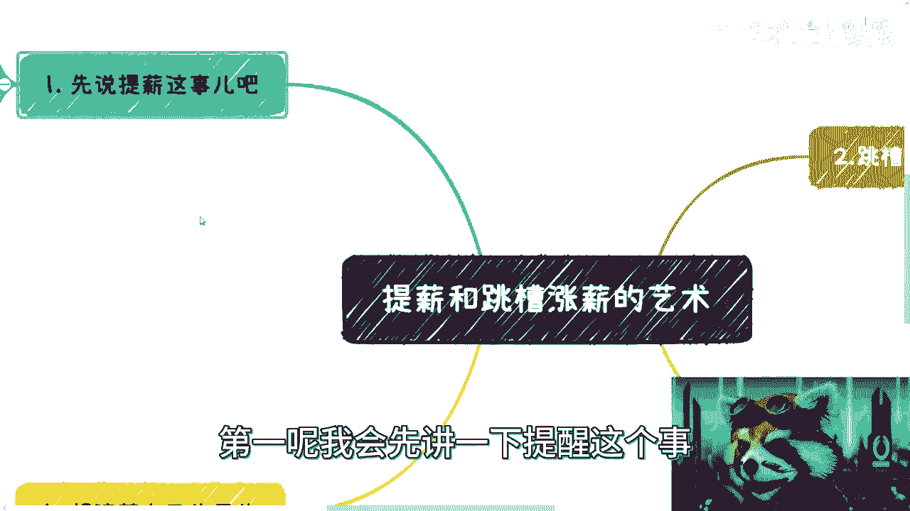
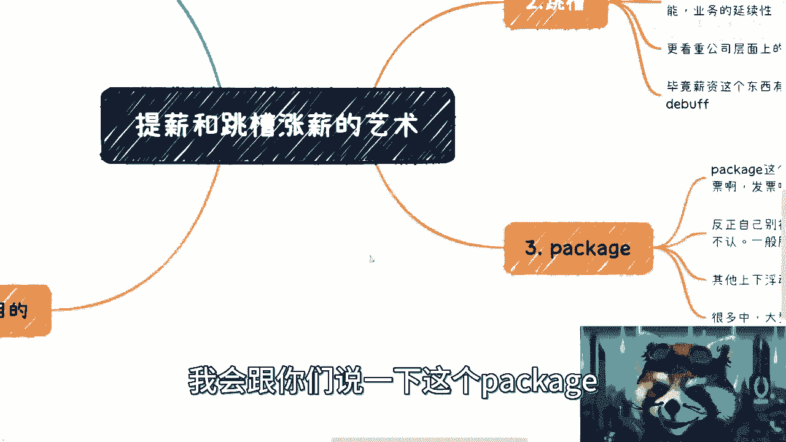
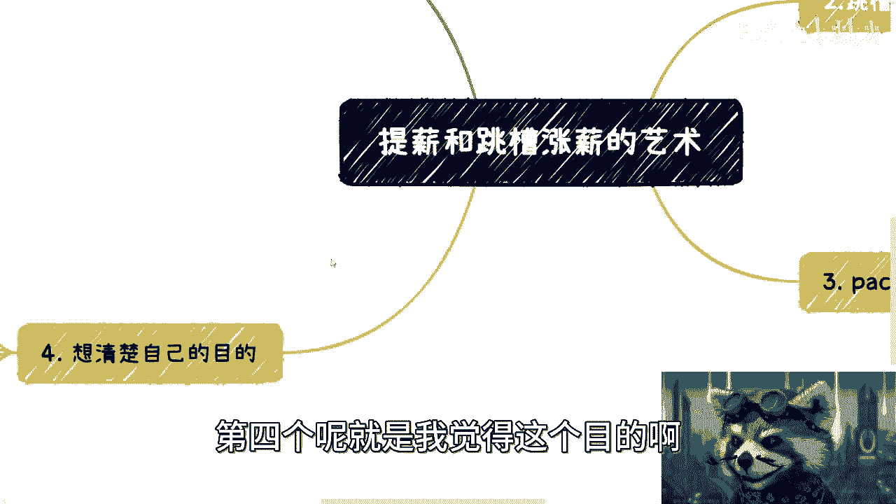
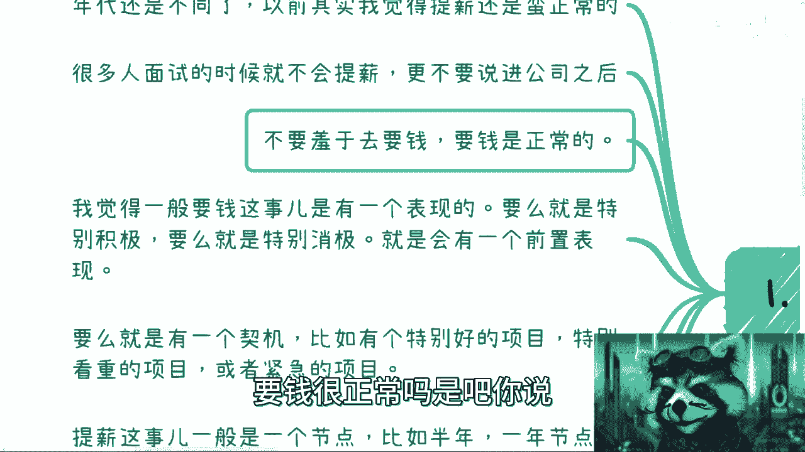
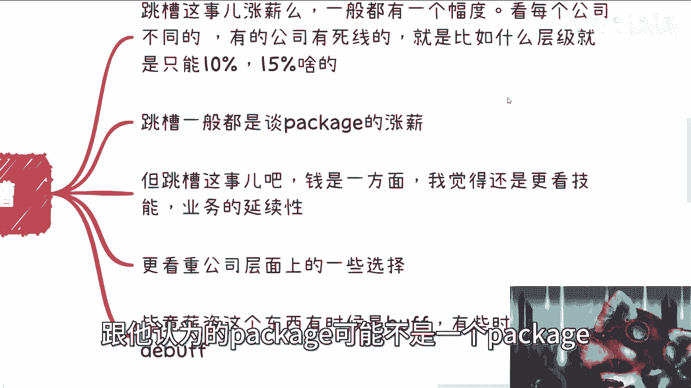
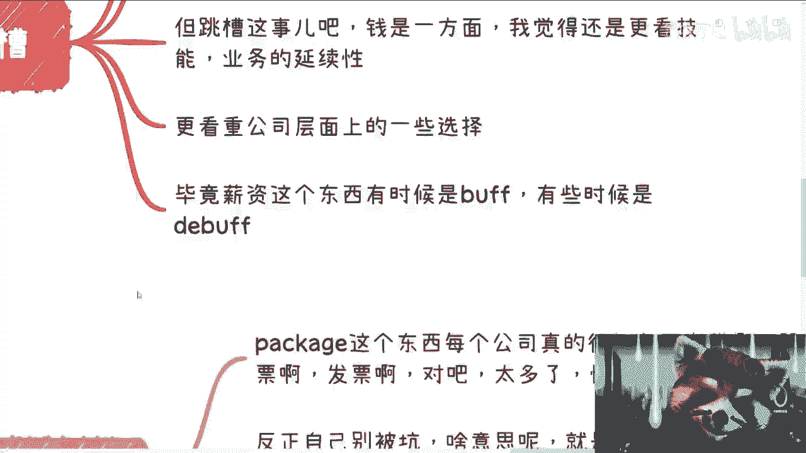
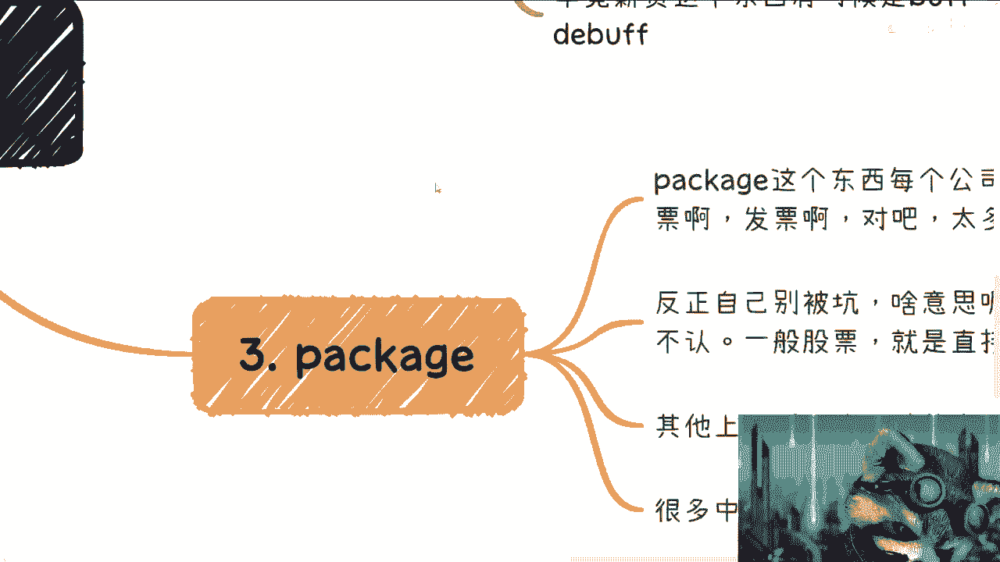
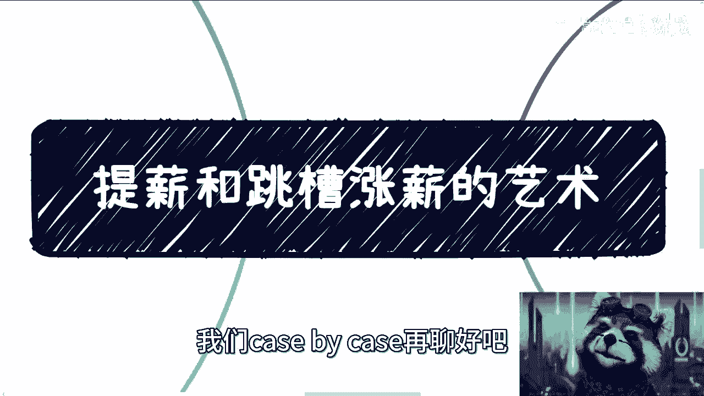

# 职场薪资谈判的艺术 - 第1课 💰

在本节课中，我们将要学习关于提加薪和跳槽涨薪的核心策略与注意事项。我们将从提加薪、跳槽涨薪、薪资结构（Package）以及谈判目的四个方面进行系统性的梳理，帮助你建立清晰的认知和实用的方法。

---

## 一、关于提加薪 📈

上一节我们介绍了课程的整体框架，本节中我们来看看如何向现任公司提出加薪请求。

首先，提加薪是一种正常且合理的职场行为。无论公司规模大小，员工都有权为自己的劳动价值争取合理的回报。关键在于自信、直接地表达诉求，避免犹豫和绕圈子。

以下是提加薪时需要注意的几个要点：

1.  **建立自信**：不要羞于谈钱。付出劳动并获得相应报酬是天经地义的。
2.  **选择时机**：提加薪通常有合适的节点，例如：
    *   年度或半年度绩效评估时。
    *   成功完成一个重要或紧急项目后。
    *   获得晋升机会时。
3.  **表现前置**：在提加薪前，通常会有两种前置表现：
    *   积极表现，展示自己的价值。
    *   消极怠工，暗示去意。
4.  **沟通方式**：开门见山，直截了当。无论是扁平化的小公司还是制度森严的大公司，清晰的沟通都比委婉的暗示更有效。

**核心公式**：`成功提加薪 = 自信 + 合适时机 + 清晰沟通`

---

## 二、关于跳槽涨薪 🚀

上一节我们探讨了内部提加薪，本节中我们来看看通过跳槽实现涨薪的路径。

跳槽是获得薪资显著提升的常见途径。这通常意味着与新的雇主谈判一个更高的整体薪酬包（Package）。然而，跳槽不能只看重薪资数字，还需要综合考虑职业发展的连续性。

以下是跳槽涨薪时需要关注的几个方面：

1.  **涨幅限制**：许多公司，尤其大集团，对薪资涨幅有硬性规定（即“死线”），例如最多只能提升10%-15%。这是你需要提前了解的规则。
2.  **谈判基础**：跳槽谈判通常是基于**总包（Total Package）** 进行的。你需要明确告知对方你目前的整体收入，并提出期望的涨幅。
3.  **关注长期价值**：除了薪资，更应看重新平台能带来的成长：
    *   **技能与业务持续性**：新工作是否有利于你现有技能的深化和扩展？
    *   **平台与视野**：大公司的流程、管理方法、业务规模是否能提升你的眼界和经验？
    *   **职业规划**：这次跳槽是否符合你长远的职业发展路径？
4.  **薪资的双刃剑**：过高的薪资有时反而会成为未来晋升或再次跳槽的阻碍，需要谨慎评估。

**核心概念**：`跳槽决策 = 薪资涨幅 + 平台价值 + 职业规划契合度`

---

## 三、理解薪资结构（Package）🧩

上一节我们分析了跳槽的考量因素，本节中我们来拆解薪资包（Package）的复杂构成。

Package不仅仅是月薪，它包含多种薪酬成分，理解其构成对谈判至关重要。不同公司对Package的认定标准可能不同，务必清晰界定。

以下是关于Package需要了解的关键点：

1.  **常见构成**：Package可能包含基本工资（Base Salary）、奖金、股票/期权、各类补贴等。结构非常复杂。
2.  **稳定性差异**：
    *   **固定部分**：如基本工资，对方公司普遍认可。
    *   **浮动部分**：如绩效奖金、需分期归属的股票，新公司可能不予认可或大打折扣。对方更看重银行流水能体现的稳定收入。
3.  **谈判要点**：在谈判时，必须明确双方对Package计算口径的理解是否一致。避免入职后发现实际收入与预期不符。

**核心提示**：`谈判时，务必明确“你的Package”和“对方认可的Package”是否是同一个概念。`

---

## 四、明确你的根本目的 🎯

上一节我们剖析了薪资包的细节，本节中我们回归本质：思考你进行薪资谈判的根本目的。

加薪或跳槽不仅是数字游戏，更是实现职业目标的手段。你的目的决定了你的谈判策略和选择标准。

以下是两种常见的目的导向：

1.  **提升市场价值**：
    *   **目的**：短期内大幅提升基本工资（Base Salary），为下一次跳槽或晋升建立更高的薪资基准。
    *   **策略**：将谈判重点放在提升Base Salary上，利用好每一次关键的跳槽或晋升机会，实现“阶梯式跃升”。
2.  **投资未来成长**：
    *   **目的**：进入更优秀的平台，学习先进的流程、管理或业务经验。
    *   **策略**：可以接受基本工资持平甚至略有下降，以换取更优质的Package（如股票）和不可多得的学习机会。这属于为长期职业发展进行投资。

**核心思路**：`想清楚你的短期目标（如搞钱）和长期目标（如成长），并据此制定谈判策略。你的薪资、公司背景都是你职业履历的“武装”。`

---

## 五、核心心态与总结 ✨

在本节课中，我们一起学习了提加薪和跳槽涨薪的四个核心维度。

最后，无论采取哪种方式，都需要保持正确的心态：
*   **果断直接**：谈判时不要扭捏，清晰表达诉求。犹豫和内耗会让对方怀疑你的能力和决心。
*   **拒绝内耗**：能成则成，不能则果断寻找下一个机会。快速试错，迅速调整，比长期纠结更有价值。
*   **商业思维**：薪资谈判的本质是商业谈判。要有理有据，设定好底价和预期，保留合理的讨价还价空间。

**总结**：薪资谈判是一门结合了自我认知、市场洞察和沟通技巧的艺术。关键在于**自信、准备充分、目标明确**。希望本教程能帮助你在职场中更从容地争取应得的回报，一步步实现自己的职业与财富目标。