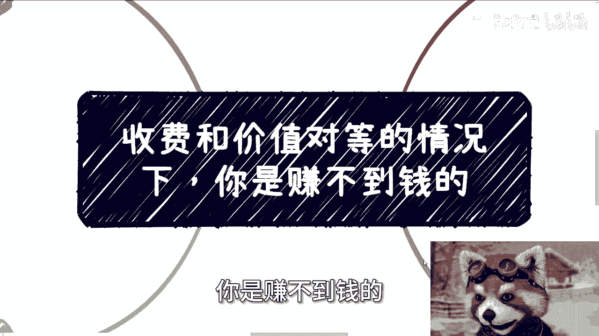
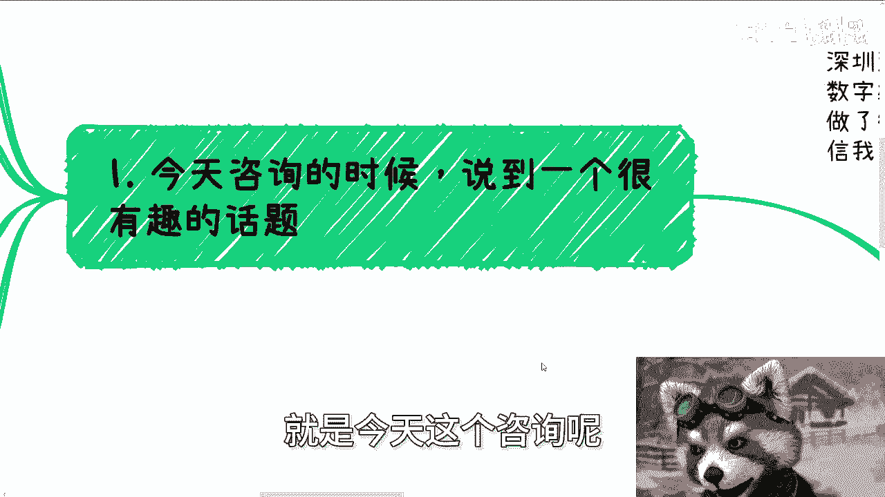

# 收费和价值对等的情况下-你是赚不到钱的---P1---赏味不足---BV1Nx4y187sh_not

在本节课中，我们将要学习一个核心的商业认知：为什么在收费与价值完全对等的情况下，你几乎无法赚到钱。我们将通过分析C端（消费者）和B端（企业/组织）市场的逻辑，揭示盈利背后的真正驱动力。

---

上一节我们介绍了课程的主题，本节中我们来看看赚钱的基本逻辑。

如果你准备了一个产品或服务，定价为1000元，而你提供的价值或产品成本在900至950元之间。当你的用户有能力准确评估该产品或服务的价值时，你便难以盈利。

**公式：利润 = 定价 - 成本**

一旦你试图提高定价以获取更大利润，了解真实价值的用户就不会购买，因为他们清楚成本空间。反之，如果你不提价，利润空间微薄，本质上只能赚取辛苦钱。

---

基于以上逻辑，我们可以得出一个重要结论。

结论是：假设你的产品盈利了，那么只有大约5%的受众能真正理解并赞赏你提供的价值。然而，让你赚到钱的并不是这5%的“聪明人”。

以下是剩余95%的受众付费的主要原因：
*   **冲动消费**：非理性的购买决策。
*   **情绪价值**：你的产品或服务满足了他们的情感需求，而非实用价值。

关键在于，这95%的受众并不真正关心或无法准确判断你提供的核心价值是什么。因此，盈利的前提是**定价与成本之间存在利差**，而这部分利差往往源于受众的认知不足或情绪驱动。

---

上一节我们讨论了C端市场，本节中我们来看看面向企业或组织（大B端）的情况是否类似。

对于政府、企业、资本方等组织端客户，让你赚到钱同样需要满足多个条件。

以下是必须共同满足的几个核心原因：
1.  **关系基础**：你们之前认识或有过接触。
2.  **安全记录**：你们有过合作历史，你被视为可靠、无风险的合作伙伴。
3.  **存在利差**：你提供的服务成本与他们支付的报酬之间存在利润空间，这与C端逻辑一致。
4.  **满足上层需求**：这是最重要的一点。你的资源、服务或产品，能够被他们用来包装，以满足其领导要求或政治需求。

请注意，这与你的个人优秀程度、学历、证书等通常被认为重要的因素**没有直接关系**。如果对方以这些为借口拒绝，那通常只是托词。

---

综合C端和B端的分析，我们现在可以总结出盈利的本质。

所以我们可以得出这样的结论：**如果你能赚到钱，本质上是因为你的受众认知存在局限，使得定价能高于价值，或者因为你成功满足了他们的非理性需求（如情绪价值）**。

因此，盈利的关键往往不在于产品打磨得多么极致。产品打磨得好，可能只会赢得那5%的“知音”。而真正带来大规模利润的，必须依赖**营销**——即如何影响那95%的受众的认知和决策。

这并不是说打磨产品不重要，而是从“赚取可观利润”这个**结果**和**规模**的角度看，营销的权重远大于产品打磨。因为市场结果是由广大受众决定的，而非由产品开发者单方面定义。

以iPhone为例，业内能看懂其技术变革（看门道）的人是少数。而推动其巨大销量的，更多是广大受众的跟风、追求品牌价值（装逼）等非理性因素。这正是市场的普遍现状。

---

本节课中我们一起学习了商业盈利的一个核心悖论：**价值与价格完全对等则难以盈利**。我们分析了盈利依赖于定价与成本之间的利差，而这利差往往源于目标受众的认知差异或情绪需求。无论是C端还是B端，真正带来利润的通常不是最懂你价值的少数人，而是为情绪、关系或上层需求买单的多数人。理解这一点，有助于我们更现实地看待商业、营销与产品之间的关系。