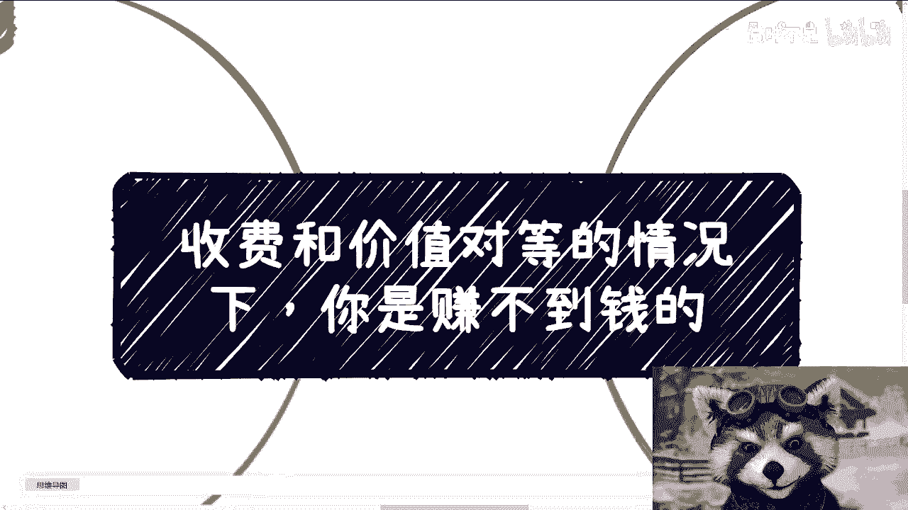
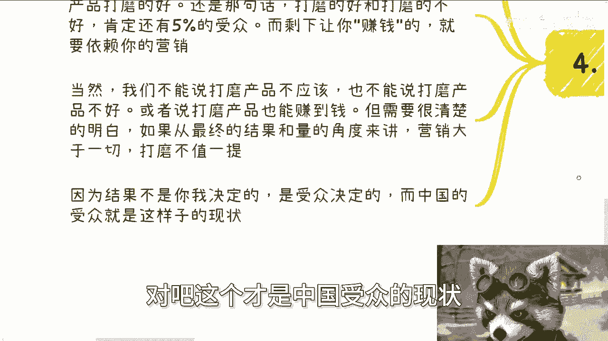
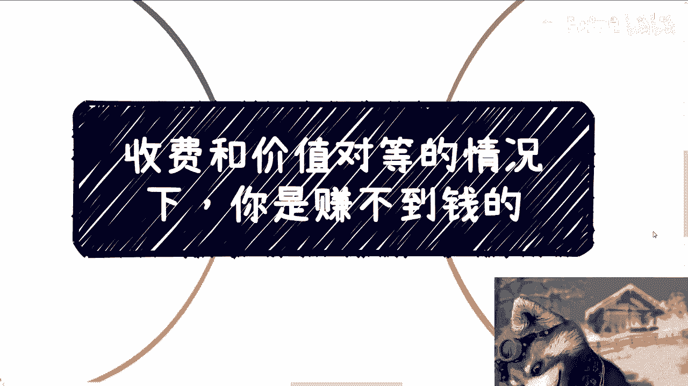

# 收费和价值对等的情况下，你是赚不到钱的 - P1 - 赏味不足 - BV1Nx4y187sh

好啊，今天这个主题呢跟刚刚那个视频呢，是强联动的啊，今天这个主题呢叫做收费跟价值对等情况下，你是赚不到钱的啊。

那么首先深圳活动已经定了30号下午啊，本月30号下午，那么本次活动完全按照数字经济大会的规模，去做了啊，我邀请了很多嘉宾啊，也做了很多接地气的主题。

大家了解详情和报名可以私信我啊，那么首先呢，就如我们这个那个免费视频上面说的啊，就今天这个咨询呢说到一个很有趣的话题。

就是说赚聪明人的钱对吧，那么我们来分析一下这个赚钱的逻辑啊，就是说，如果你今天准备了一个产品或者一个服务，你卖1000块，你提供的可能是900或者950的服务，或者来说成本是900~950的一个产品。

那么如果啊你的用户有能力明白，你这个产品是多少价值，或者是他有分辨能力的话，那么代表着你根本赚不到钱，为什么，因为你一旦提价了，你想让这个当中有比较大的利差，那么对方就不可能买。

因为他大概知道你这个东西的成本空间是多少，对吧，那么问题来了，那如果你不提价，你没有利润空间，你本质上就赚不到钱，你就是辛苦钱对吧，那么我们说就今天啊这个这个结论，因为这边我就省略。

因为在那个免费视频里面，我们已经说了蛮多了嘛对吧，我们就就匆匆省略一点啊，就是说你就能得出个结论，什么结论呢，结论就是说如果你要做一个产品跟服务，你赚钱了，假设F你赚钱了，其中5%的人可能能明白。

你这个产品和服务带来的真正价值，他们对你一定是赞赏的啊，但是你心里得要明白，虽然这些人对你是支持或者赞赏的，或者说是真正的跟你，我们称之为灵魂伴侣对吧，或者说是是是是怎么样的啊。

那么但很可惜你如果if if你能赚到钱，那么你赚到的其实不是他们的钱哦，那么然后剩下的95%的人是看不懂，你提供的价值到底值不值1000块钱的啊，但是他们付钱原因是什么呢，要么是冲动消费。

要么就是你满足了他们的情绪价值，但是无论出于什么目的，跟你提供什么已经没有半毛钱关系了哦，所以一直如我们说的，你如果赚到了钱，那么你提供的服务跟你的成本，中间一定是有一部分利差的，否则你就赚不到钱。

这就是个悖论哦，那么你只有存在利差，才有才有可能赚到钱，那么你的受众一定就是剩下的那95%，因为那5%你他他他他会觉得你在坑他，你在割他对吧，嗯额因为这95%他不在乎你卖什么。

甚至他们连自己要什么他们都不知道啊，第三同样的to大B端也是如此，就像我们说的政府企业高效资本啊，或者说社会上的什么研究院啊，什么什么什么什么什么什么的土老板啊，对吧，就是这种类似于像这种啊。

就是说组织端或者说又有一定钱的这种人啊，就是说他会让你赚到钱，一定是因为以下几种原因共同满足啊，记住共同满足啊，第一你们之前认识，或者说你们之前见过面，第二你们之前合作过，你是安全的，你不会有什么风险。

第三你提供的服务成本和他们付给你的报酬，之间存在着存在着一定的利差，这个跟C端的逻辑是一样的，第四也是最重要的一点，你满足了他们的领导要求或者政治要求，或者还说不叫你满足了。

而是你的资源和你提供的服务跟产品，能让他们拿来包装，从而满足领导要求或者政治要求，那么你看啊，我们上面所提到的这些东西，你看啊，第一跟你优秀有关吗，没有关系，跟你帅不帅有关吗，也没有关系。

跟你什么学校有关吗，也没有关系，跟你学历有什么关吗，也没有关系，跟你证书有关吗，也没有关系，就本质上什么都没有关系，只有以上我们提到过的这些才是最核心的，如果剩下哦记住一点啊，如果剩下的对方跟你说。

你的学历不行，你的学校不行，记住这就是个借口，仅此而已好那么很多人其实真的很多人啊，不是我说什么，很多人真的会认为啊，会因为自己提供的产品或者服务有价值，而让对方来给自己钱，但你看看啊，但你想想看。

仔细想想看，无论C端还是这种大B端组织端，谁来看你价值呢，谁关心你的价值呢，对吧，就像我们刚刚说的，来看你价值，来关心你价值的可能就是那5%，但是那5%给你带不来钱啊，你你给每个人做服务。

你给每个这种企业端，政府端做服务，你可能都是这个毛毛利非常的小非常的小啊，对吧好，第四所以我们可以得出这样的结论啊，怎么样的结论呢，就是if你能赚到钱，一定是因为你的受众认知不够。

那么你的定价跟付出才会能够有一定的利差，要么就是你能满足他们的情绪价值，或者能够去触动到他们的某些绩点啊，那么也就是说if if你能赚到钱，一定不是因为你的服务和产品打磨的好，还是那句话。

打磨的好跟打磨的不好，肯定还有5%的受众，而剩下让你赚钱的就是必须要依赖你的营销，当然啊说到这里啊，我们一定要一定不能二极管看这个问题，就是我们不能说打磨产品不应该啊，也不能说打磨产品不好。

也不能说打磨也也也就，或者还说打磨产品也能赚到钱，但你需要明白的是，如果从最终的结果跟你赚到的钱的，量的角度来讲，因为你赚10万也是赚，你赚1000万也是赚对吧，你从最终结果跟赚到的量的角度来讲。

营销大于一切，打磨在营销面前不值一提，因为你打磨，只是满足了那5%的人的需求啊，因为你要明白一点，就是赚钱这个结果它不是你跟我决定的，就是你今天跟我说啊，你是一个我们就拿乔布斯来讲，乔布斯站出来。

他说哦，因为我叫乔布斯啊，因为我是什么学校毕业的，因为我们MIT毕业的，因为我发过多少论文，难道你就能赚钱了吗，不是结果，不是你跟我决定的，结果是受众决定的，受众觉得IPHONE很好，所以他赚了钱对吧。

那么问题在于受众他为什么会觉得很好对吧，那么你一定是打打中了他某一个东西，而不是说你说这个啊产品到底怎么样，怎么样怎么样，啊好那么我们话又说回来，你说IPHONE产品好不好好，那也有人会说。

那IPHONEIPHONE做这个产品就是好啊，是但是你有没有想过能真正看得懂他改革，或者说就是我们叫做evolution，就是就是变革里面的一些变化东西的人，能有多少，所谓业内看门道。

外行就是基本上看热闹，什么意思啊，就是看门道的人，他是真的明白IPHONE好，但是剩下的你说受众决定的，这些受众为什么为什么会去买，跟风装逼，逼格等各方面导致了他们会去买对吧，这个才是中国受众的现状啊。

不你说如果来说啊，今天一个东西卖得好，是因为普罗大众，95%的人都能明白它的价值的话，那我我就说今天就不会有这么多泡沫，今天也就不会有这么多贪污，今天也就不会有这么多的，怎么说呢，就是说就或者这么说吧。

今天的学历也不会贬值哦，或者说今天也不会有各种各样的问题出现，一定是相对来讲还在正轨上的，但现在不是，对吧好就这么个情况。

你们仔细想想看啊，仔细想看好，然后深圳活动已经定了，30号下午好吧，然后报名跟了解详情呢，我们继续私信，然后职业规划，商业规划啊，股权期权，商业计划书白皮书啊，分额分红分润，包括就是说你们手上有什么牌。

你们没有什么牌，你们希望通过跟我的沟通，能够呃，让我给你们一些，更接近于当下发展和地区的一些建议的话，那么你们可以整理好个人的问题，或者对应的这个个人简介啊。

