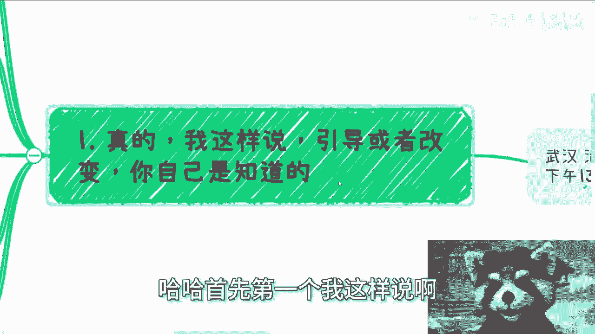
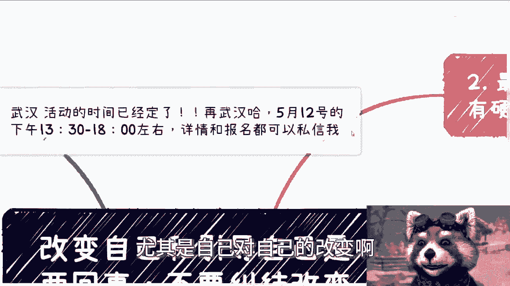
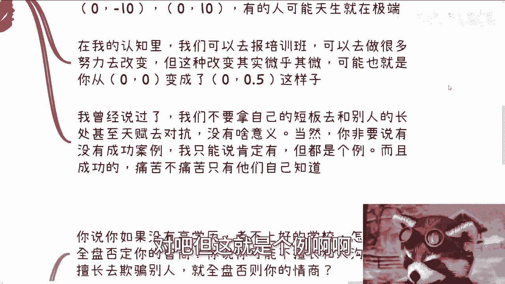
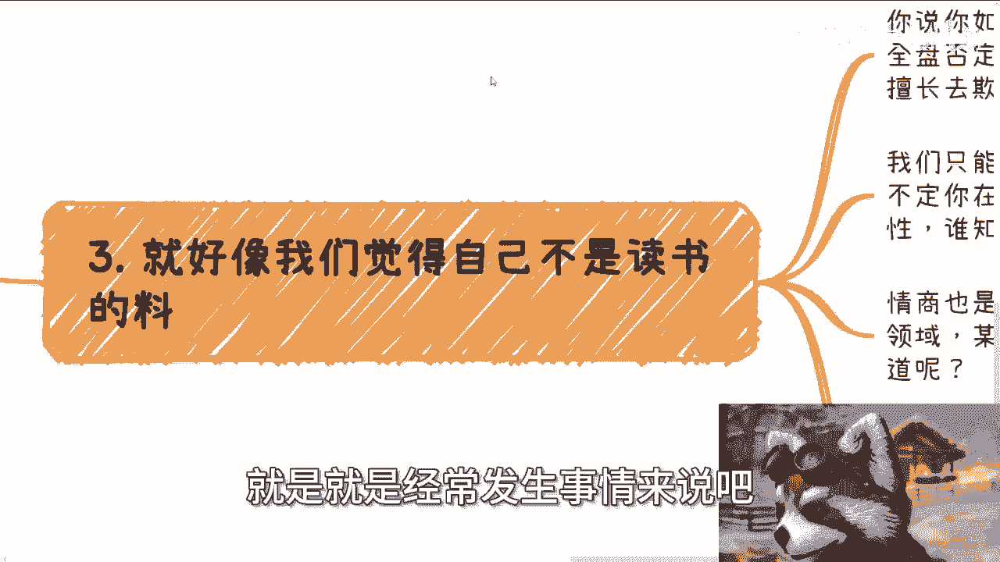
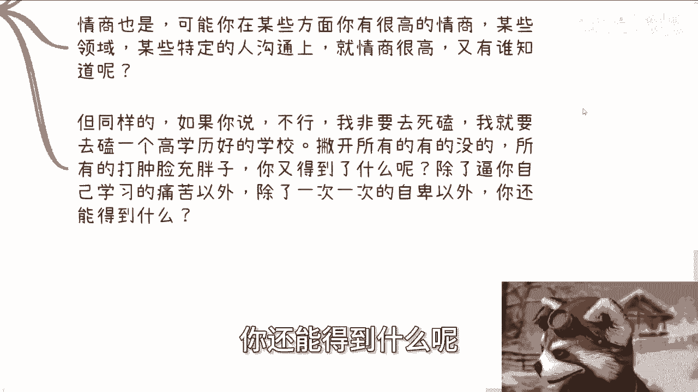
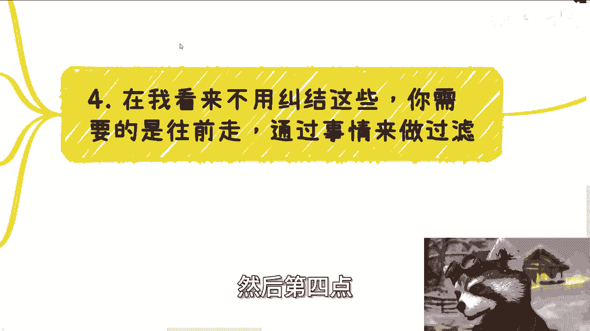
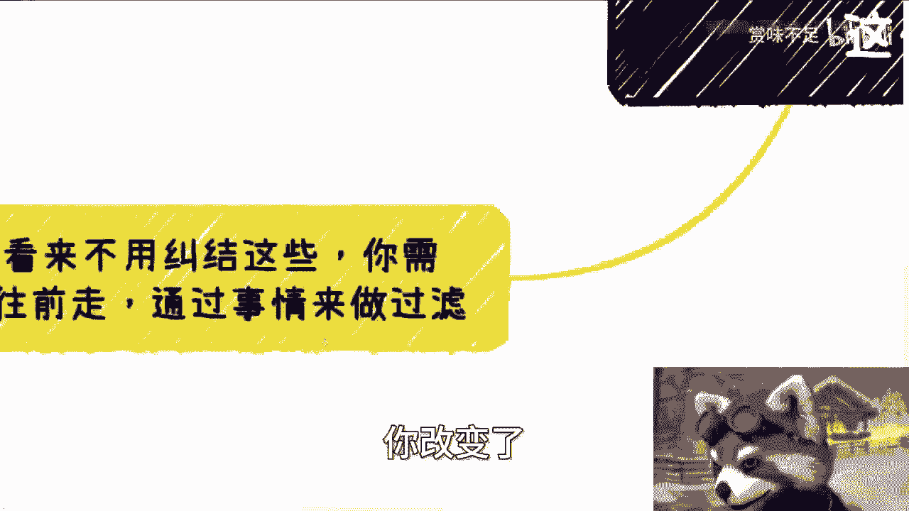

# 课程名称：改变与引导的本质区别 🧭 - P1

在本节课中，我们将要学习“改变自己”与“引导自己”这两个概念的核心区别。很多人对自己不满意，并试图强行改变，但这种方法往往效果不佳且令人痛苦。我们将探讨为何“引导”比“硬改变”更有效，以及如何通过具体行动来发现和发挥自己的潜力。



## 概述：改变与引导是两回事

很多人对自己不满意，并试图改变。但经过观察和交流，我发现“改变”本身可能并非最佳路径。与其费力改变，不如思考如何“引导”出自身的天赋和潜力。硬性改变自己常常源于外界的压力，而引导则需要发现内在的亮点。

## 核心概念：感受与自知


引导或改变，其根本区别在于内心的感受。你是否被引导或被改变，自己心里最清楚。即使别人不了解，甚至你自己也不完全了解，但内心对于是否排斥、是否有天赋、感受如何，总会有一些直觉。

**核心公式**：
`内心感受 = 判断“改变”或“引导”的关键信号`

## 案例分析：竞技体育的启示

并非说改变完全没有结果。以体育竞技为例，国内许多家庭培养孩子成为“竞技人”。最终能走到大众视野、获得成功的只是极少数，其背后是大量未被看见的付出者。


以下是关于此现象的两个关键点：




*   **幸存者偏差**：我们只看到了成功的少数，而忽略了绝大多数未能成功或过程痛苦的个体。
*   **归因谬误**：不能因为一个人成功了，就反向推导出他一定有天赋或非常热爱。这二者没有必然的因果关系。

上一节我们提到了成功案例的局限性，本节中我们来看看强行改变可能带来的问题。

## 强行改变的代价

那些从底层通过竞技走到台前的人，他们究竟是喜欢还是痛苦，只有自己知道。很多时候他们“身不由己”，无法对外言说真实的感受。因此，改变，尤其是自己强加给自己的改变，往往伴随着巨大的内在消耗。

**核心观点**：
`自我强行改变 ≈ 低效 + 潜在痛苦`


## 普遍存在的“自我PUA”

许多人想要改变自己，其实是受到了周围环境的“PUA”。常见的自我否定包括：认为自己内向、情商不高、不会打扮、不擅长沟通等。





但在我看来，这些所谓的“问题”，更准确地说是每个人的“特点”或“属性”。对于一个二三十岁的人而言，这些属性已经相对稳定。

我们可以用一个坐标轴模型来理解：

**属性坐标模型**：
假设某个属性（如社交能力）的两个极端是 `-10` 和 `+10`。大多数人可能从 `0` 点开始。即使通过培训、投入大量精力去改变，最终可能也只是从 `0` 移动到了 `0.5` 或 `-0.5`。

`改变效果 = 初始属性 + (努力 × 极小的系数)`

这种微小的改变，意义不大。我们不应拿自己的短板去硬磕别人的天赋或长处。

## 逻辑辨析：避免以偏概全




我们常常因为某个单一表现而全盘否定自己，这是不合理的逻辑。



以下是几个常见的错误推论：

*   **学历与智商**：没有高学历 ≠ 智商不高。只能推导出：你可能不适合**中国的应试教育**。
*   **沟通与情商**：不擅长某种沟通 ≠ 情商不高。只能推导出：你可能在**特定领域或人群**中沟通方式不同。

如果你非要死磕自己的短板（比如非要考取高学历），除了获得痛苦、自卑和浪费时间，很难得到实质性的回报，如赚钱能力或更好的工作机会。

`错误逻辑：单一表现A → 全面否定结论B`
`正确逻辑：单一表现A → 可能仅说明不适合场景C`

## 行动指南：用做事代替空想

与其纠结于改变自己，不如聚焦于行动。你需要的是“向前走”，通过具体的事情来“过滤”和“筛选”。

很多人纠结于“我情商不高怎么沟通”、“我太容易相信别人怎么办”。解决思路是回归目标：




*   **如果你的目标是避免踩坑**：那就设定规则（如必须签合同），而不是依赖主观判断。痛了自然就学会了。
*   **如果你的目标是赚钱**：那就让对方拿出切实的证据和保障。
*   **如果你的目标不明确**：那可能需要先理清自己到底想要什么。

我们所有的行为方式，本质上都是一种“过滤机制”，旨在吸引那些与我们三观、目标一致的人。一个二三十岁的人，能改变的表面东西有限，内心很难真正改变。因此，关键不是“改变”，而是“引导”和“发现”。

**行动代码**：
```python
# 伪代码：通过行动进行过滤与引导
def personal_growth(perceived_weakness):
    if goal == "avoid_trouble":
        action = set_rules() # 例如：必须签合同
    elif goal == "make_money":
        action = request_evidence() # 要求对方提供凭证
    else:
        action = clarify_goal_first() # 先明确目标
    result = take_action(action) # 采取行动
    filtered_circle = attract_like_minded_people(result) # 行动结果会自然过滤出同频的人
    return filtered_circle, self_understanding # 返回过滤后的圈子及对自身的新认知
```

## 总结

本节课中我们一起学习了“改变”与“引导”的核心区别。强行改变自己，尤其是基于外界PUA或自身焦虑的改变，往往是低效且痛苦的。我们剖析了以偏概全的逻辑谬误，并指出每个人的特点更应被视为属性而非缺陷。

真正的成长路径在于：停止自我否定，通过设定明确目标并采取具体行动，在实践中过滤出适合自己的方向和人际圈，从而引导出被忽略的潜力与天赋。记住，你无需改变本质，只需找到让它发光的方式。