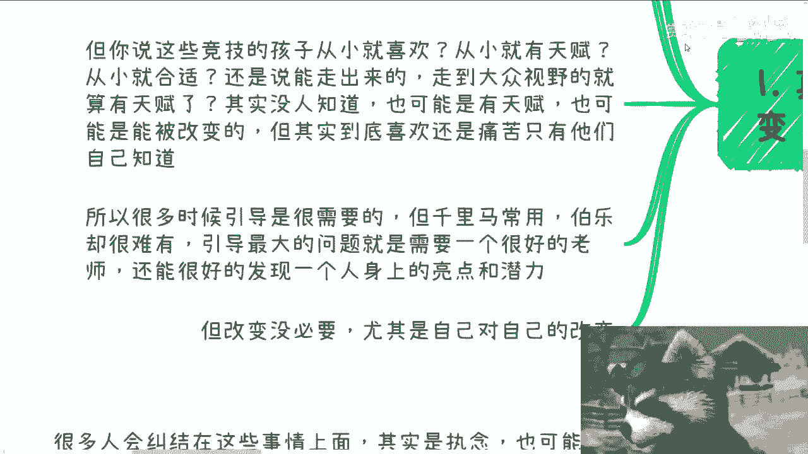
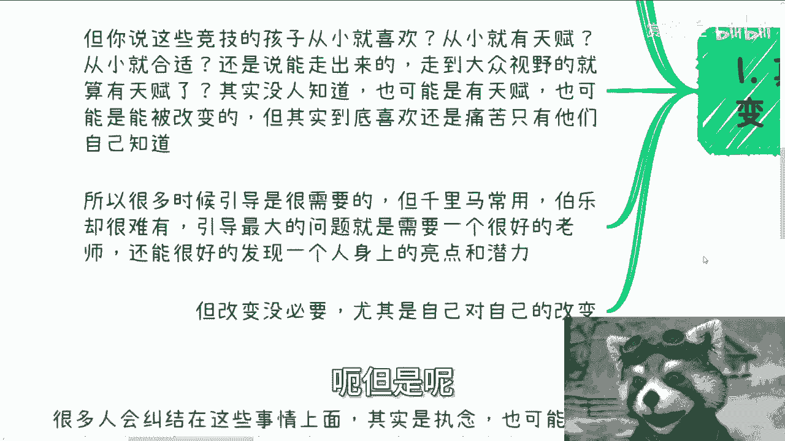
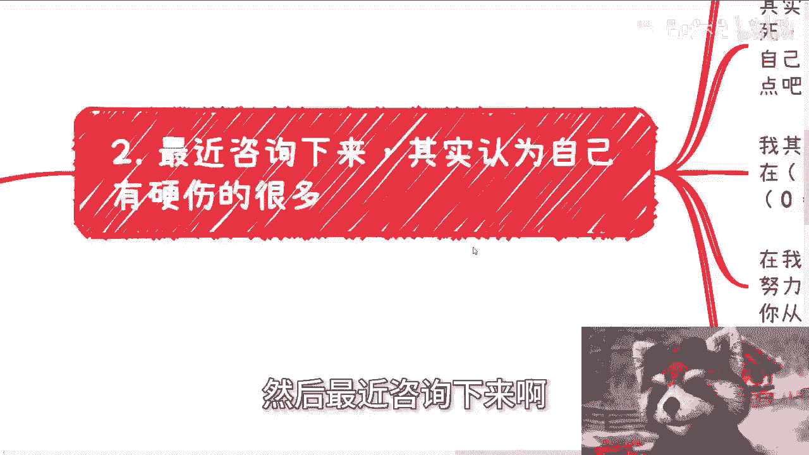
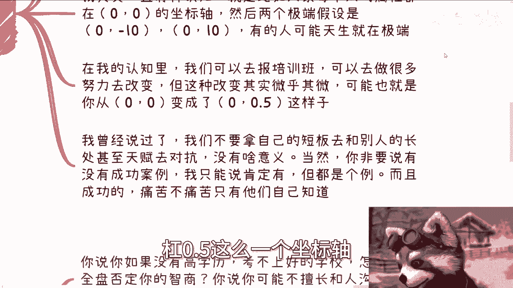
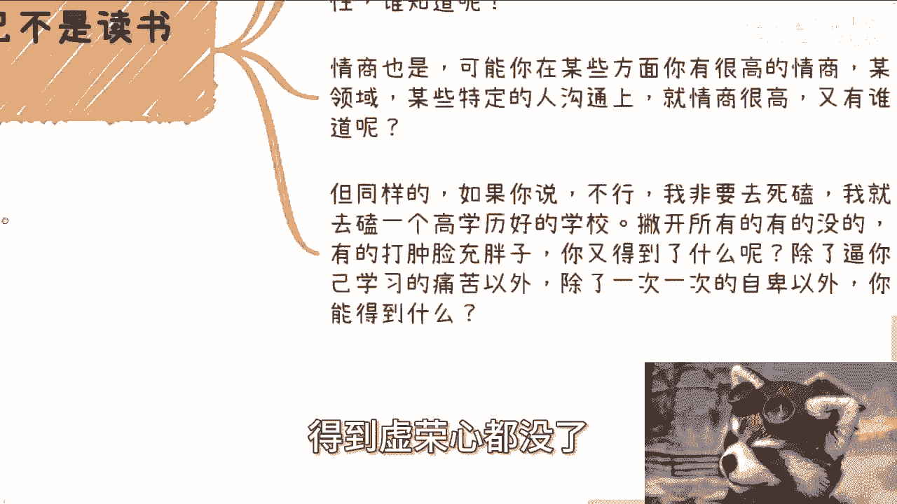
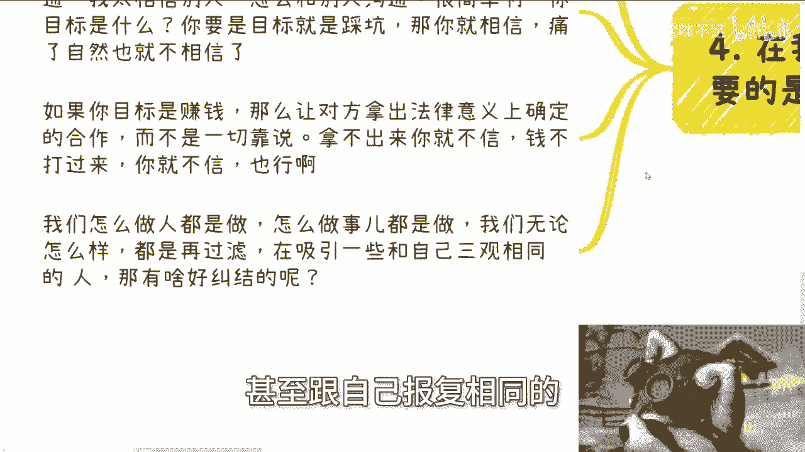

# 改变和引导是两回事儿，不要硬改变自己 - P1 - 赏味不足 - BV1AZ421n7Hn

好这个呃武汉活动已经定了啊，在武汉在武汉5月12号好吧，下午01：30到六点左右，然后地方我也定了时间，我也定了，详情跟报名都可以私信我啊，呃然后今天我们讲的这个主题，叫做改变自己跟引导自己啊。

我就最近聊下来，发现就是好多人其实对自己不是很满意啊，然后就在改变，但是呢我后来看了一看呢，就是我每次都跟他们讲，我说不要改变，没啥好改变的，你要说真的引导啊，比如说引导出你的天赋啊，你的潜力啊。

那也就算了，怎么你说改变这个事啊，我觉得真的不要想，就是你们要是觉得真的能改变的，又又又处于两个问题，第一个就是说幸存者偏差啊，第二个就是说你们可能电视剧看多了啊，爽文看多了啊哈哈。

首先第一个我这样说啊。

引导或者改变，其实你自己心里是知道的，就是说你自己被引导一件事情，或者被改变一件事情，你心里应该最清楚，别人可能不了解，但也当然了，你可能自己也不了解，但是你心中多多少少啊。

就是这个呃感受上你可能是有感受的，也就是说你排斥不排斥啊对吧，你自己有没有这个天赋啊，你感受怎么样啊，你多多少少有这个感受，我觉得这是第一个第二个呢，当然啊并不是说改变没有结果啊，我们就拿体育竞技来讲。

你你们想想看啊，国内多少家庭是做题那个竞技人啊，那么竞技本身走出来的是万众瞩目，我说的背后的那堆尸体对吧，但问题是你们想想看有多少人关心过那堆尸体，又有多少人关心过两者的比例是多少。

而且更何况你说那些禁忌的孩子从小就喜欢吗，啊还是说从小就有天赋呢，还是说从小就合适呢，还是说能走出来的，能到大众视野的就算有天赋呢，其实你没有人知道，你不能说。

这就像我们不能说一个人考上清华北大，你就说他智商高，这没有因果关系，你懂吗，甚至就是说你说你考上清华北大，我得出一个结论，这个人很爱很爱学习，这也没有因果关系，对不对，就是你只是反过来推的时候。

你觉得你这样推可能比较通顺啊，或者说这样推有依据可可循啊，那就像我们这边说的，我说比如说我们现在有些禁忌的孩子，从以前小农村啊到大众视野，然后呢走到大众视野之后，你就跟我说，嗯因为他走到大众视野。

所以他有天赋，你这个结论你只能说他有没有天赋呢，我们不知道，或者说大概率有天赋，但是你说我们完全从A就能得到B吗，不可能的，得不到B的啊，哥哥们姐姐们啊，那么也有可能他是被强行改变的。

也就是说到底他是喜欢呢还是痛苦呢，只有他们自己知道，为什么呢，因为他能怎么说呢，对吧你他不可能说啊，从一个小镇做题家对吧，然后到了一个大众视野，然后变成了一个可能别人羡慕的一个模样，然后他还跟别人说啊。

我很痛苦对吧，怎么样子，很多人没有办法，你知道吗，叫身不由己啊，所以很多时候呢引导是需要的，你会但是你会发现呢千里马常有，但伯乐很难啊，所以引导最大的问题是需要有一个很好的老师。

很好的这么一个天时地利人和的这么一个人啊，然后他能很好的发现一个人身上的亮点和潜力，但是这种呢很难非常的少啊，呃但是呢我的观点还是一样的。

改变呢是没有必要的，尤其是自己对自己的改变啊。

你们大部分人对于自己的改变，都来自于周围的PUA啊，有一说一啊，然后最近咨询下来啊。

其实认为自己硬伤呢呃很多啊，这一类人很多，就是说比如说有的人呢觉得自己内向，不善于社交，有的人觉得自己情商不高，有的人觉得自己不会打扮，那有的人呢就像我前两天说的。

觉得自己不会沟通啊等等等各种各样的原因啊，但其实我的观点就是什么呢，就是你明白吗，就是说大概率大概率大概率啊，虽然我不能一棒子打死，但是这个大概率可以说，99。99998%，大概率是什么意思呢。

你一个20多岁，30多岁的人，你要是发现自己有些问题，当然我甚至觉得我甚至觉得说这是个问题，都是PUA，我觉得不能叫问题，只能叫每个人的特点啊或者属性啊，就是说你会发现你自己有这些特点或属性。

你改变啥呢，我觉得没啥好改变的，我跟你们这么说，我其实一直有种认知是什么，就是你比如说大家每个人的属性点，都在0。0这个坐标啊，然后呢两个极端的假设啊，就是两个极端的这个这个这个点啊。

比如说你今天某个属性啊，这个属性总有极端嘛对吧，那么我们假设两个极端的点是零负十跟零时啊，那么有的人可能天生都在极端啊，有可能比如说这个人啊很不好啊，运气不好，在零负时啊，这个人天天天赋极高啊。

临临时对吧，都有可能，但是在我的认知里面啊，我觉得我们可以去报培训班，我们也可以去做很多努力去改变，我们也可能被外力所改变，但我觉得这种改变其实是微乎其微的，尤其是你20多岁，30多岁的时候。

就可能你会发现你一顿操作猛如虎对吧，什么10万20万80万怎么投下去对吧，你无非也就是从零变成了零杠，0。5这么一个坐标轴。

你说就像我跟你们讲的，你说有帮助吗，有但不多有卵用啊，对不对，就我曾经说过啊，我们不要拿自己的短板去跟别人的长处，甚至天赋去抗衡，没有意义的，那当然啊你非要说有没有成功案例，我只能说有。

我怎么说没有呢对吧，你单纯中国就14亿人，全球就不知道多少人了，对不对，你要问我有没有特例，当然有啦对吧，但这就是个例啊啊而且成功的就像我刚刚说的。

就算成功的人痛苦不痛苦，只有他们自己知道啊，你总不能拿这个东西当一个常论，就是就是经常发生的事情来说吧。

对啊，那么第三就好像我们觉得自己不是读书的料啊，你比如说你说啊，你说你如果没有高学历啊，考不上好的学校怎么了呢，全盘否定你的智商吗，然后你说你不可能啊，你不擅长跟人沟通，不擅长去欺骗别人，怎么了呢。

全盘否定的情商吗，你们觉得这逻辑通不通吧对吧，这就好像就说你说你今年没考上好的学校，可能没有得到好的学历，我们只能说啊，我因为你的你要这么想啊，你你你得出结论，你要有依据啊，你不能信口开河啊，对不对。

那依据是什么，就是我们现在能看到的，只是你没有高学历和没有好的学校，那这个逻辑我们只能得出一个结论，就是你不适合中国的应试教育，没有了呀，我还能得出什么，卧槽我他妈，因为这个事情我就能得出你智商不高啊。

你脑子笨，那不好意思说你这张不跟脑子笨的，就是PVA，你因为从这个结论只能得从这个意志，只能得出这个结论来，那还能得出什么结论呢，没有了呀，对不对，那说不定在别的方面你有很好的发展呢对吧。

也有很好的悟性呢，也有很好的智商呢，对不对，谁知道呢，对不对，那情商也是啊，可能你在某些方面有很高的情商，某些领域某些特定的人群沟通上面，你情商就很高，那他妈又谁知道呢，对不对，你总不能说二创老师。

因为我不擅长跟别人沟通啊，然后别人就得呃你你就被别人不停的PUA，包括你父母不停的PUA对吧，得出个结论就说我情商不高，他们没有关系的，对不对，但同样的如果你说不行啊，老子他妈非要死磕对吧。

我就要去考一个高学历好的学校，对吧好，那我跟你讲啊，撇开所有的没的，所有的打肿脸充胖子，所有的就是所谓的为了面子，死受罪活受罪的这种情况啊，你还得到了什么，我就问你还得到了什么。

除了逼你自己学习的痛苦以外，除了一次一次的自卑以外，你还能得到什么呢。

你除了在浪费你的时间，你还能得到什么呢，我不明白你还能得到什么，得到虚荣心都没了。

真的就没了，你实实在在能得到什么呢，我就问你能赚钱吗，不能哼，等你出去能找到工作吗，不好意思，你年纪这么大了，可能也不能，那我不知道你得到了什么，对吧好，然后第四点啊。

在我看来呢，其实不用纠结这些，你需要的是什么，是往前走，通过事情来做顾虑，什么意思呢，就很多人会纠结啊，在这件事情上面什么哎呀，我觉得我情商不高哎呀，人家说我智商不高对吧，怎么样怎么样就就很可笑。

你知道吗，真的很可笑啊，我不关心你们到底是执念，还是到到底是真的想改变，也或者也有可能是病毒，病急乱投医啊等等等，但事实证明啊，你们身上的某些属性只能得出来某一些结论，不能以偏概全，对不对。

然而你们用这个以偏概全的结论啊，然后去做改变，一切都是徒劳的，你说有用吗，当然有，但不多啊，有人就问我，他说陈老师我情商不高，怎么跟别人沟通啊，他说我不太相信别人，怎么跟呃，对，他说我我太我不是。

我不是不太相信，他说我太相信别人，怎么跟别人沟通，那很简单啊，那我就问你，你的目标是什么，如果你的目标就是踩坑，那你就去相信你有什么好改变的呢，痛了自然也就不相信了，对不对，你被骗多了，自然就不相信了。

对不对，那如果你目标是赚钱，那你就让对方拿出所有的证据对吧，意义上面在中国这个国家法律意义上面确定的，比如说合作啊，合同啊或者其他东西啊，而不是靠说对不对，那你但凡跟我说啊，我又不是为了踩坑。

又不是为了赚钱，我就是太相信人家，那只能说你自己太过家家，对不对，一切的心魔在你自己这边啊，那你要说怎么改变，没啥好辩的，你要变的是你做事方式，不是要去改变，你这个人真的变好，改变的呢，对不对。

你你你就看你要真的赚钱，我说了，你就拿出东西来，想要让别人拿出东西，不拿不出来，你就不信对吧，钱不打过来，你就不信不就好了吗，结束了呀，哪这么多逼逼的事情呢，你为什么一定要说哦，我要去判断一下。

我要通过我的什么情商，通过我的沟通去了解一下这个人，没必要啊，为什么呢，对不对，那我我跟你讲，我们怎么做人都是做，怎么做事，也都是做，我们无论怎么样，都不可能迎来所有的人都讨厌，都喜欢我们。

也不可能迎来所有的人都讨厌我们，对不对，你所有做的事情无非都是一种做事情的态度，无论你怎么做，你都是在过滤，所谓过滤就是在吸引一些跟自己三观相同，跟自己目标相同，甚至跟自己抱负相同的这一类人。

有啥好纠结的呢，你改变了。

你能改变什么对吧，你一个20多岁，30多岁的人，你能改变什么，你改变的都是自己的一些表面东西，甚至强迫自己改变，但你的内心会改变吗，不会的，我跟你讲，不会的，你还是那个你你懂吗，所以你要去做的是引导。

那但凡你不知道你能引导什么东西，那你就去做，你要通过事儿过滤来筛选，你觉得自己擅长是什么，而不是在旁边，就是别人说一天到晚别人说什么对吧，然后你就像最近我咨询那些小伙伴，他们就是一直被身边的人PUA啊。

包括他父母朋友对吧，一天到晚说什么吗，哎呀你不你内向对吧，你不擅长这个，你不擅长那个他妈的我擅不擅长他妈关你事，对不对，真的我真的就这么觉得，你们自己擅不擅长关别人吊事啊，而且另外一方面就像我说的。

有事说事啊，没事他妈的滚对吧，不要来跟我说他妈的说这些结论啊，就就什么啊，因为你学习不因为你学历不高吧，说你智商不高，他妈脑子有毛病吗，这不是对不对，哎毫无逻辑性啊，但是呢就这种结论呢很打击人。

而且最主要的是什么，就像就像我们以前说的，就像我们以前说的那个吃苦，这个苦不是我不能吃啊，主要是我不明白这苦吃的有什么用对吧，就像我刚刚说的，这打击不是不能打击，我也不明白这打击有什么用对啊。

你非要打击他，你情商不高，你智商不高，然后呢，然后呢哎呀妈奇了怪了对吧，好吧行啊，那就这么着啊，然后那个武汉活动好吧，我们开始报名了，然后那个叫什么，就是呃职业规划，商业规划啊，然后股权啊。

呃分红啊对吧，股份啊，融资啊，商业计划书啊啊包括你们手上有什么牌，你们希望通过我的视角呢，能更好的给你们做些啊规划啊，或者说一些建议的，你们可以整理好问题，整理好你们手上的牌啊。

