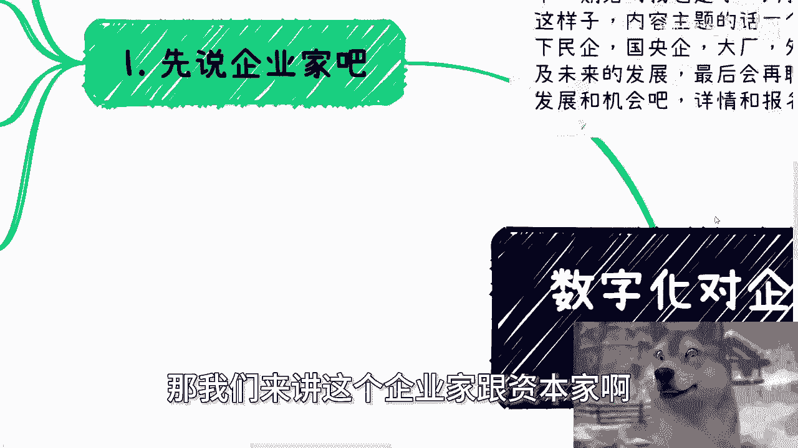
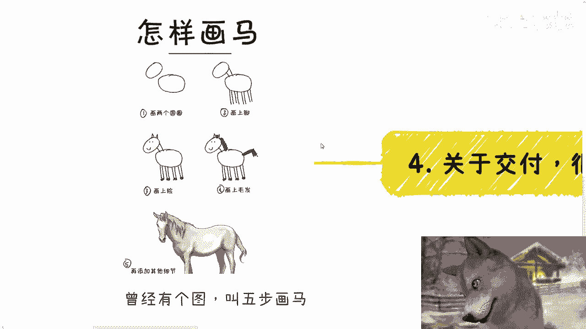
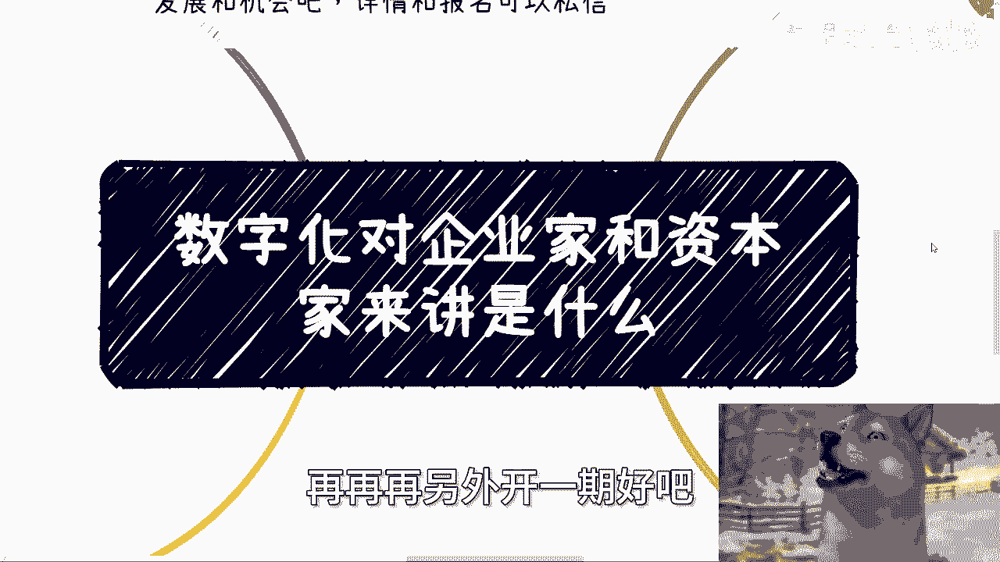
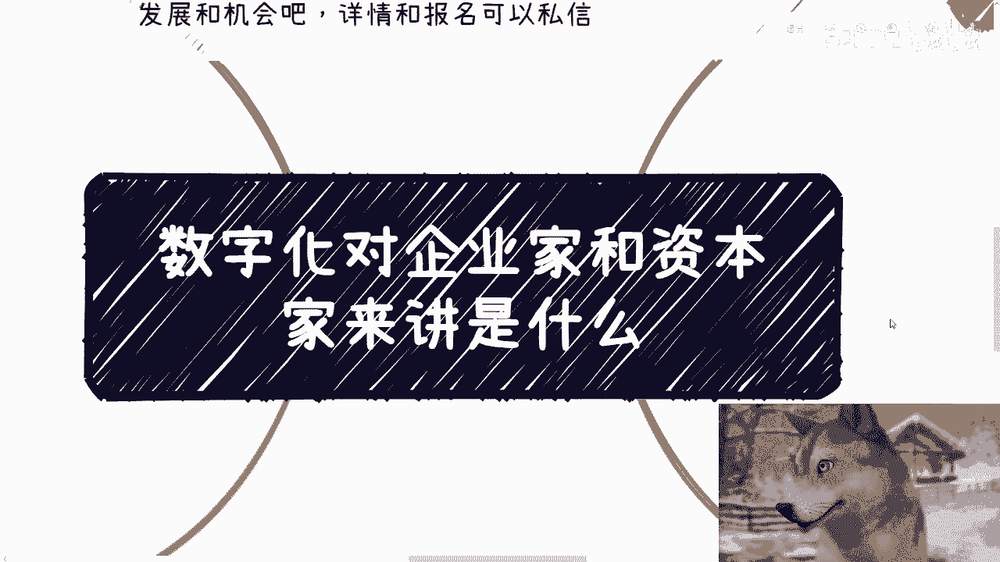

# 数字化对企业家和资本家是什么 - P1 - 赏味不足 - BV1wE421P7kx

好大家好啊，嗯今天我们来讲的是一个就另外一个话题了啊。

就数字化对于企业家和资本家来讲是什么啊。

呃首先这个下一期活动我也定了好吧，7月13号下周六在南京啊，下午一点到六点这个样子，然后内容主题的话，一个是低空经济，一个是分析一下这个呃民企啊，国央企啊，啊大厂外企当下入职的一些优缺点。

以及未来的发展好吧，然后呃再跟大家聊一下，当下企业这个做数字化或者数字资产啊，有数据要素发展的一些机会好吧，详情跟报名可以私信我啊，好额，那我们来讲这个企业家跟资本家啊。

首先先说企业家啊，企业家里面呢，我们主要是分成传统企业跟互联网企业啊，还是有些差别的，呃传统企业做数字化呢，从根本上来讲呢，其实啊我们说本质上来讲，它是为了提升效率以及方便管理对吧。

你比如说就像现在好多地方呃那种做审计啊，做做会计，我了解下来，你说他系统有吗，有的啊，但是他妈的跟没有没什么区别，非常难用对吧，那么你数你你数字化改造对吧，比如说你你有了一些呃CIM系统啊。

ERP啊对吧，包括你你有一些这个这个这个手机端或者，前端的一些展示，你能够让管理上面和整个的这个效率上面，更有提升，这个是肯定的啊，那么传统企业呢，另外一方面是需要数字化来做故事的衍生。

以及一些生态的对接啊，我们一直说数字化是企业往下发展的第一步，为什么啊，我们举个例子啊，你比如说像今天我们打个比方，比如说各个传统企业也想找到突破口，也想找到一些嗯，就是就是新的一些方向嘛对吧。

那么打个比方，比如说传统企业说要做数字资产啊，那你让他怎么做呢，对吧，你你说哦，他甚至连前后就是前后端的这个数据都没有，它现甚至连数据积累都没有，它甚至连第一步数字化都没有，你怎么数字资产啊。

你们在搞笑嘛，对不对，所以说你会发现就是他不做数字化，它其实它当中是断层的，但是数字化本身的这个过程啊，它利润空间就很高，为什么，因为大家不知道标准是啥，你更别说那些传统企业的高管和企业家了。

他妈更不懂对吧，然后也不知道，比如说一个系统啊，一个软件应该卖多少钱，他不知道的企业家其实没有概念的，隔行如隔山啊对吧。

这就好像我今天问你们，比如说我今我今天有一个A2V2的对吧，就是呃套上那种低空经济，套上那个数字经济的这种产品，应你们觉得应该多少钱。

你们知道个屁对吧，你包括就是说我说元宇宙区块链。

你们知道成本吗，你们不知道你知道啥呀，哎呦然后二啊，这互联网的企业家啊。

我跟你讲这事呢，互联网这边啊，它跟时代有关，2000年到2008年啊，其实大家还是想着怎么落地，想着做产品，想着产品能有多少人去用，你去看啊，当然你们可能不了解啊，就就是当年的那些产品和团队都是看日活。

看月活，真的那个时候就是大家真的是想做点东西，真的想改变世界哦，2008年到2013年左右，其实是全民创业的阶段，那段时间有一个很大的优势是什么，就是融资很好融啊，那么你会发现大家呢。

可能不像2000年到2008年，那个时候这么纯粹哦，那么但是呢大众还是奔着，就是说自己能做就做啊，做的不好呢就当精力呃，就当一些阅历啊，做得好呢，就IPO就是还是一个比较良性的一个循环。

那么到2018年到201113年，到18年左右，我跟你讲就开始变质了，其实你们去看啊，滴滴也好，饿了么也好，OF1OOFO也好，包括现在的新能源电动车也好，走的都是这个路线，就是你会发现一个产业。

大家不是为了去把产业做好，大家为了是尽可能在这个产业被卷死之前，先捞钱跑路，这个就是他们要做的啊，所以说就是说这个叫做什么叫做资本运作，在当时几年里面，大家都学会了资本运作，也就是说这个产品做的好不好。

谁关心啊，我就这么说，比如说现在呃我们打个比方，比如说那个滴滴也好，包括呃那个高德，包括打车平台，他们吸血吸的非常多，包括外卖平台吸血吸的非常多，包括这些平台里面有诸多不合理的东西，有人来管吗。

没有谁来管，对不对，前面的投资人，前面的股东，前面的那些那个那个前期的员工，包括前期的创业者捞钱早就跑路了，谁管你啊对吧，就算不跑路，他现在也是养老，谁管你呀，这叫什么，这叫资本运作对吧。

这跟2000年到2013年那段时间，大众想做想真的想做事情，真的想把事情做好，这个态度很不一样，那么18年到后面就更别说了啊，他18年到现在简直就是13年到18年的，他妈的这个扭曲版对吧。

就加速版到现在基本上就是全部为了功力，全部为了钱，只有极少数的人，还有当初的梦想，就这么简单，所以对互联网的企业家来讲，现在是所谓的数字化是什么，就是故事增加故事性，增加这个故事的可可展望性。

增加他的未来的上限对吧，当然这些话都是冠冕堂皇，冠冕堂皇的话说，用说人话就是画饼啊，好那么第三资本家啊，其实对于资本家来讲，一切都是工具啊，我管你什么数字化也好，数字经济也好，我管你什么东西都一样啊。

都是工具，那么我曾经也说过，无论你们多么你侬我侬，故事多么美好，大家多么认可，就是你们跟资本家双方啊，无论你们双方多么的认可，多么的感情多么的好，我告诉你们，资本家只关心两件事情，一回报周期多长时间。

我能赚到多少钱，二回报比例对吧，也就是说我投入多少，我能拿回多少，没有了，你不可能谈别的呀，谈别的，否则就不叫资本家的，谈别的叫什么资本家，对不对啊，数字化互联网时代最大的优势在哪。

在于项目流程越来越短，项目越来越碎片化以及越来越多的切入点，你比如我们随便打个比方，你比如说以前的土木对吧，或者说其他的一些，你说呃跟我们打个比方，比如说高铁也好，铁路铁路也好对吧，包括基建对吧。

或其他东西，你告诉我它流程短怎么个短法，你造个楼就这么点时间，你怎么短对吧，然后你造个楼碎片化怎么碎，你跟我说，今天他妈的我我我今天一个项目只造一个窗户，行不行不行的呀，但但他妈互互联网可以呀对吧。

数字化可以啊，我今天就给就就他妈给你打个补丁也行啊，对不对哦，以及回款周期越来越快，故事性啊，我我就这么说，故事性越来越多，甚至我我就说不叫故事性，叫什么叫越来越科幻，甚至他妈的可以叫越来越魔幻好。

然后第四点啊，第四点我回头呢，我觉得我可以展开跟你们跟你们再说一下，就是关于交付，很多人啊，很多人他真的会有很大的误解，我们曾经有个图叫五步画马啊，你看到没有，第一步画两个圈圈，第二步画上脚。

第三步画上脸，第四步画上毛发，第五步就变成他了，你们知道什么意思吗，意思就是你们大部分人认为的交付是五，而你知道吗，实际上的交付是一，你懂吗啊但是可能有到这个时候啊，可能有人就要问了，他说那为什么呢。

甲方不是，对甲方的确不是，但是我们就这么说，我们就这么来讲，整个一个池子里面有20%的项目，它是避不开的，就是说这些项目跟人命啊，比如说医疗铁路建筑基建，它跟人的生命安全有关。

它跟很多一些物理世界的东西有关，那你没办法，但是如果你跟互联网有关，我就这么问，甲方真的知道你交付的是个什么东西吗，对吧，你比如说今天你们觉得这样五步画马很荒唐，为什么，是因为你们对马是有理解的。

是有认知的，但是我就这么问，我今天打个比方，我今天交付一个区块链产品，你们有认知吗，你们他妈知道交付一个什么东西吗，你们不知道，所以说甲方也是一样的，甲方的领导，甲方团队知道吗，他们也不知道。

那这个里面的空利润空间就大了，画饼空间就大了，我就指鹿为马，我就跟你们说，那头鹿就是个马，你能把我怎么滴啊，我就跟你们说，这两个圈圈就是马，你能把我怎么滴，你懂个屁啊，懂吗啊。

所以说就是说很多人会觉得就是说啊，这个交付对吧，很难交付，很成问题或者怎么样子，那我就告诉你们，这是因为你们对这个社会的运作逻辑不了解，这是因为你们太过实诚，而且我我我们再退1万步来讲。

我觉得也是你们太过傲慢，因为你们觉得是交付五，但是你们仔细想看，你们有能力交付五吗，没有你在搞笑啊。

就我就这么说，就以你们在学校里面所学到的东西，就以你们在企业里面打工的这些经验，你们就想给甲方交出来一个产品能交到五，你不是你不是在搞笑，是在干什么呢，对不对，你不是你傲慢是什么呢对吧。

所以说就是说我一直说我们做事情要切实际哦，我跟你们讲话，两个圈圈交付，很多人觉得我不切实际哼，但是事实上是你们不切实际，明白吧啊这个回头我给你们扩展出来，再再再另外开一期。

好吧啊行啊，那我们今天反正这个内容就讲这么多，反正你们自己掂量掂量啊。

那个活动好吧，这个下周六啊，7月13号好吧，报名和咨询的继续报，然后呢就是那个那个职业规划，商业规划啊，股权期权项目计划书，白皮书，分红分润啊，这个合同啊，包括就是说是你自己有些什么好的项目啊。

或者你呃有一些什么呃规划啊，或者有一些什么其他方面的想法，你希望通过跟我的沟通啊，能够将你的这些计划，或者来说规划做的更接更接那个地气一点的话，那么你们可以整理好详细的个人背景跟问题。

我们再来走咨询好吧好行。

