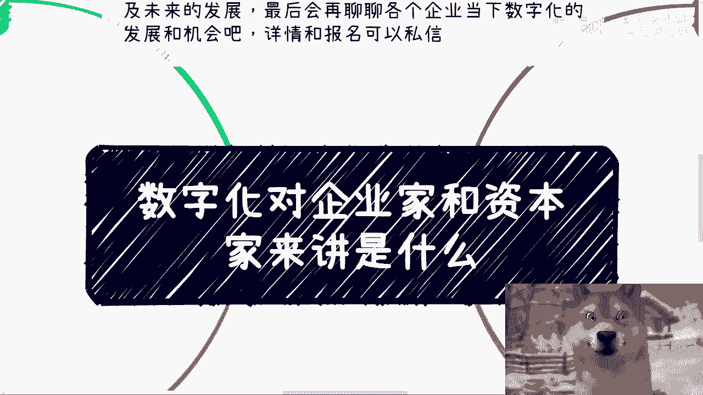
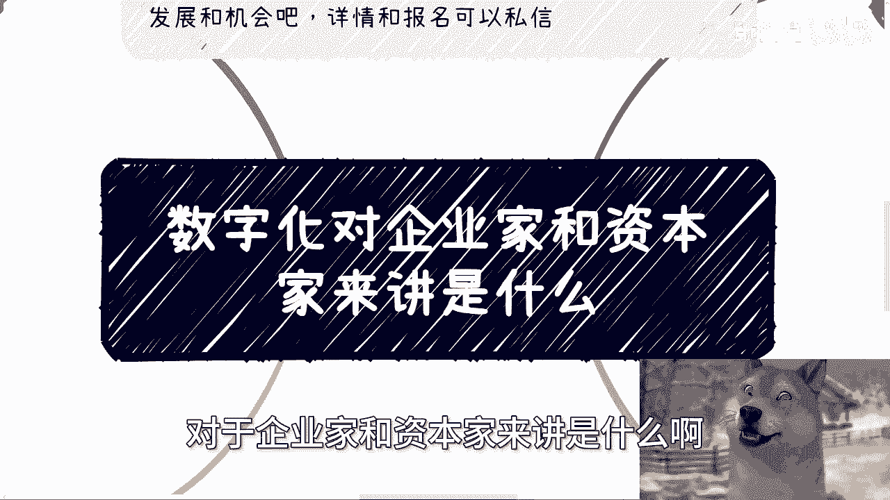
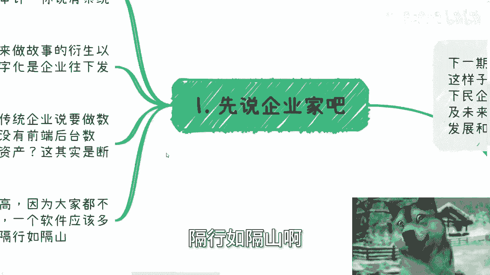
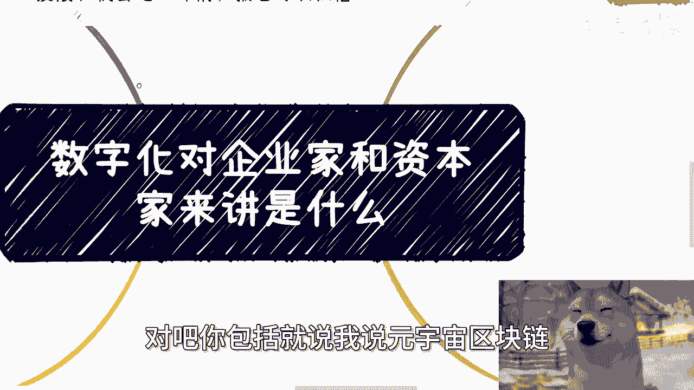
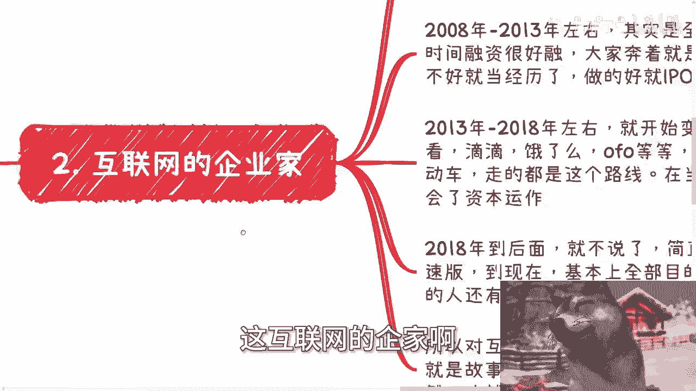
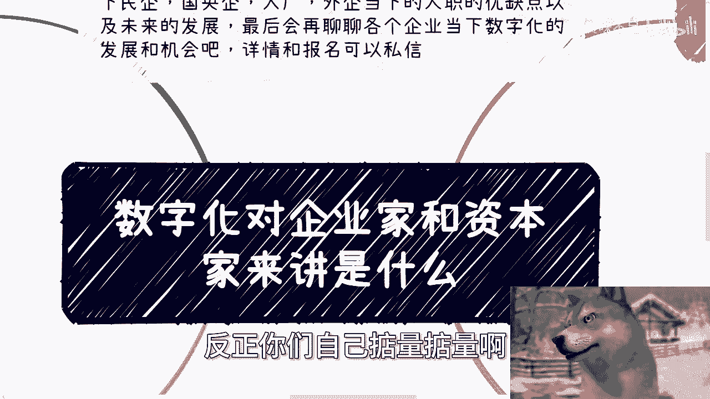

# 数字化对企业家和资本家是什么 - P1 📊

在本节课中，我们将探讨数字化对于企业家和资本家分别意味着什么。我们将分析传统企业与互联网企业在数字化进程中的不同动机，并揭示资本家视角下数字化的本质。课程内容将帮助你理解数字化在当前商业环境中的实际角色与运作逻辑。

---

## 企业家视角下的数字化

企业家主要分为传统企业和互联网企业两类，他们对数字化的理解和需求存在差别。

### 传统企业的数字化

对于传统企业而言，数字化的根本目的是提升效率与方便管理。

例如，许多领域的审计或会计工作虽有系统，但系统难用，效果有限。进行数字化改造，引入如 **CIM系统**、**ERP系统** 以及移动前端展示等工具，能切实提升管理水平和运营效率。

另一方面，传统企业需要数字化来衍生新故事并实现生态对接。数字化是企业向下发展的第一步。

举例来说，如果传统企业想涉足数字资产领域，但其前后端没有数据积累，甚至未完成第一步的数字化，那么谈论数字资产便不切实际。数字化过程本身存在利润空间，因为行业缺乏明确标准。

传统企业的高管和企业家往往不了解数字化，例如他们不清楚一个系统或软件应该如何定价。这体现了隔行如隔山的现状。

这就如同询问一个结合低空经济与数字经济概念的产品（例如 **A2V2**）应该定价多少，大多数人并无概念。同样，对于元宇宙或区块链产品的成本，公众也知之甚少。

### 互联网企业的数字化

互联网企业对数字化的态度与时代背景紧密相关。

*   **2000年至2008年**：这个阶段的企业家专注于产品落地与用户增长，关注日活、月活等指标，抱有改变世界的理想。
*   **2008年至2013年**：进入全民创业阶段，融资环境宽松。大众心态虽不如前期纯粹，但主流仍是尽力创业，成功则寻求IPO，形成一个相对良性的循环。
*   **2013年至2018年**：行业开始变质。许多产业（如滴滴、饿了么、共享单车、新能源车）的参与者目标并非做好产业，而是在行业“内卷”致死前捞钱离场，这被称为资本运作。产品好坏已非首要关切，前期投资者与创业者获利后便不再关心平台后续发展（如抽成过高、规则不合理等问题）。
*   **2018年至今**：可视为上一阶段的加速与扭曲版，极度功利化，一切向钱看，仅有极少数人保有最初梦想。

因此，对当今的互联网企业家而言，数字化的作用是增加故事性、可展望性与未来上限。用更直白的话说，就是**画饼**。

---

## 资本家视角下的数字化 🧑‍💼

上一节我们探讨了企业家的视角，本节中我们来看看资本家如何看待数字化。

对于资本家而言，一切皆是工具。无论故事多么美好，双方关系多么融洽，资本家只关心两件事：
1.  回报周期：需要多长时间？
2.  回报比例：投入多少，能收回多少？

数字化与互联网时代带来了巨大优势：
*   **项目流程缩短**
*   **项目碎片化**，切入点增多
*   **回款周期加快**
*   **故事性（甚至魔幻性）增强**

以土木工程为例，其流程难以大幅缩短，项目也无法像互联网项目那样极度碎片化（例如只造一扇窗）。但数字化项目可以，甚至为一个系统打补丁也能成为一个项目。

---

## 关于项目交付的深层逻辑 ⚙️

以下是关于项目交付的一个关键误解，可以用“五步画马”的比喻来理解。

很多人理解的交付是完整的第五步（一幅完整的马画），但实际交付可能只是第一步（两个圈圈）。造成这种认知差异的原因在于甲方对交付物缺乏认知。

举例来说，如果交付一个区块链产品，甲方的领导和团队很可能并不清楚它具体是什么。这种认知空白创造了巨大的利润与画饼空间。服务方可以“指鹿为马”，将初步成果宣称为完整交付。

许多人认为交付困难，是因为他们不了解社会运作逻辑，太过实诚，甚至傲慢。他们自认为能交付“第五步”，但以多数人在学校或职场积累的经验，实际上不具备交付完整产品的能力。认为能交付“第五步”反而是一种不切实际的傲慢。

---

## 总结 📝

本节课我们一起学习了数字化对不同角色的意义：
1.  对**传统企业家**，数字化是提升效率、管理升级以及为未来故事铺垫的基础。
2.  对**互联网企业家**，数字化在当今主要是增加融资故事性与画饼的工具。
3.  对**资本家**，数字化仅是追求快速、高回报的投资工具之一。
4.  在**项目交付**中，存在巨大的认知差与操作空间，实际交付物与理想预期往往存在差距，理解这一点是把握商业现实的关键。

---