# 数字经济——web3的A面和数字经济的B面 - P1 - 赏味不足 - BV1Gm4y1v7ED

啊大家好啊，这个我也尝试尝试两个一起更是吧，这个我看到有小伙伴说我没有根啊，我让我来跟一下啊，这个最近呢找我咨询的啊，这个说web 3和数字经济的也有啊，也不少啊，我也我也我觉得我得跟你们说明白啊。

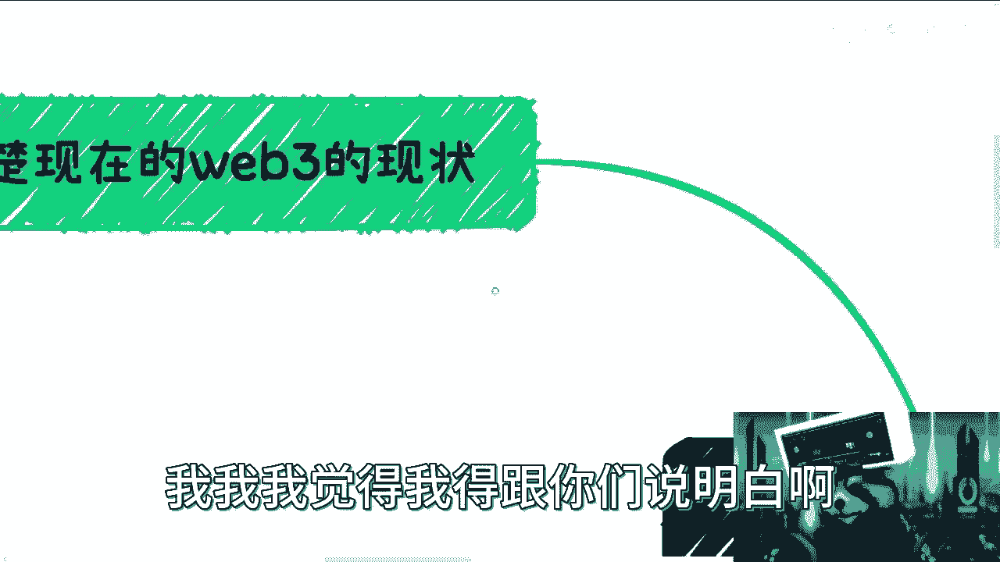

首先认清楚现在web 3的现状。

什么意思呢，就是如果你想去做区块链，那你就去好好做区块链，别来跟我说，你去投了web 3哦，也别来去说你去做了web 3，听明白吧，这是第一点啊，第二点是，你要么就好好在国内做数字经济的发展。

或者就好好做区块链做基础建设，你要么就出国去割，想办法割，要么就去香港割，你明白吧，就是我没有给你别的选择，就这两个别跟我说，你们要去吃块链或者去web 3，或者去哪里还要打工，没有的不存在的。

你听明白，没有不存在的哦，别抱有任何幻想，我可以明确的跟你们讲，至少35年内是不存在的，别想啊，听不懂啊啊还有就是什么呢，都别那么天真，就去做web 3，发展web 3，你要但凡想做事情，想要去发展的。

你就别去web 3，你现在进去跟自自取灭亡没有任何区别，你知道吗，你但凡进去就是割，你不割你进去，我就觉得你在浪费时间，你在浪费生命，就这么简单对吧，你告诉我你要去一个地方，你又不割，你进去干嘛。

被割了对吧，我跟你说，真的就是就是大家但凡去做一件事情，你们都要先去了解清楚，你不了解清楚，就在那边说，我他妈的要去干活了啊，我要去发展web 3，我他妈懵了。

我都，你懂吗。

第二那有人要说了对吧，说数字经济妈的一群人说数字经济只他妈知道，web 3，我他妈也是绝了，你知道吗。

web 3当中有没有数字经济的未来发展，有我这么讲有，但是web 3整个centralized的生态肯定是有的，我也是看好的，但他现在没有这个生态啊，他现在就是一团乱啊，他现在哪来的星际进数字境界。

哪来的未来呀，没有呀，对不了你。

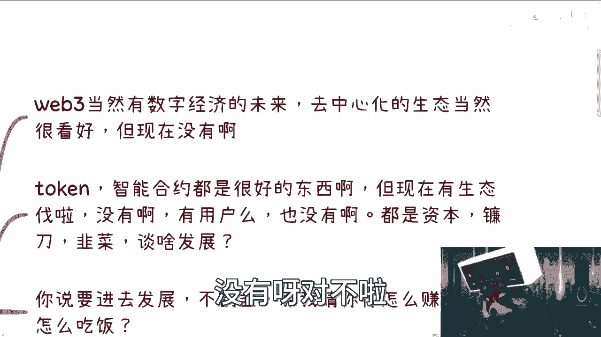

你没有这个东西，你现在进去干嘛呢，你进去要么被割，要么割，你又做不了格。

那你能被割，对不对啊，你跟我说，token也好，智能合约也好，都是很好的东西。

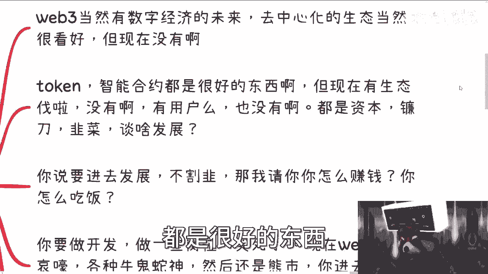

我也我也知道呀，但现在生态有未来没有呀，有用户本来没有呀，都是资本镰刀韭菜呀，你跟我谈什么发展呢，你进去干什么，你告诉我你进去你是做资本。

你能做吗，不能你能做镰刀吗，很多人也不能，那你只能做韭菜。

你还能做什么呢，哎我操，我他妈也是绝了，你知道吗啊，还有就是什么。

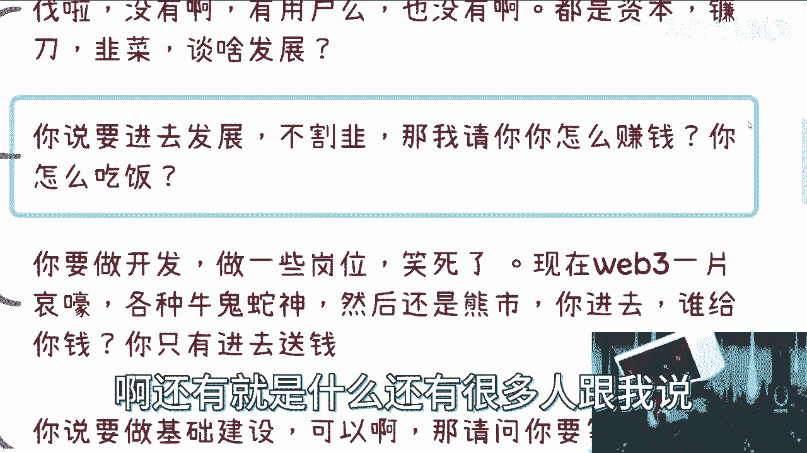

还有很多人跟我说，他说我要进去发展，不割韭菜，那我请问你，我请问你草他妈还少写一个字，我请问你怎么赚钱，你怎么吃饭，唉我真的绝了，真的是家里有矿，你家你家里有矿，你就去对吧。

啊还有跟我说什么，他说哎我人在国内我又出不去，但我要做web 3，你做什么东西啊，你人出不去，你做web 3，你除了被歌，你还能干嘛，对不对，你要么割别人，你又割不了对吧，良心又放不下。

那你说什么东西呢，对吧，你你开还有很多人跟我说，我要做开发，做marketing，做bd对吧，做sales啊，笑死了。

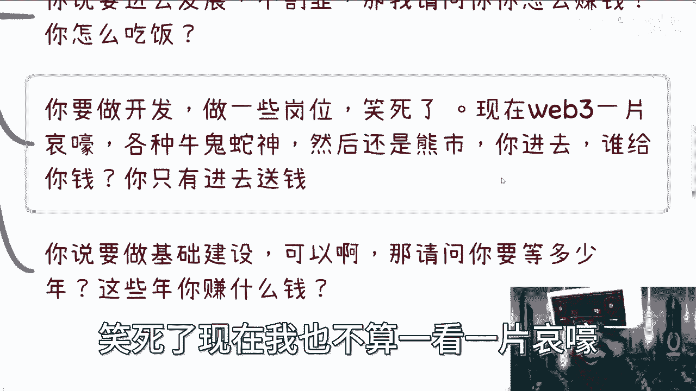

现在web 31片一片哀嚎，你们进去看看，你们都他妈的什么牛鬼蛇神啊，然后熊市熊成狗了，已经s e c他妈的都都疯了啊，你进去你给你谁给你钱，我就问你啊，这些人自己都他妈没钱了，你进去只有送钱对吧。

你跟我说做基础建设可以啊，那我请问你吗，你得等多少年才有基础建设给你做啊，你等10年，你家里是有矿吗，你在那边耗10年。

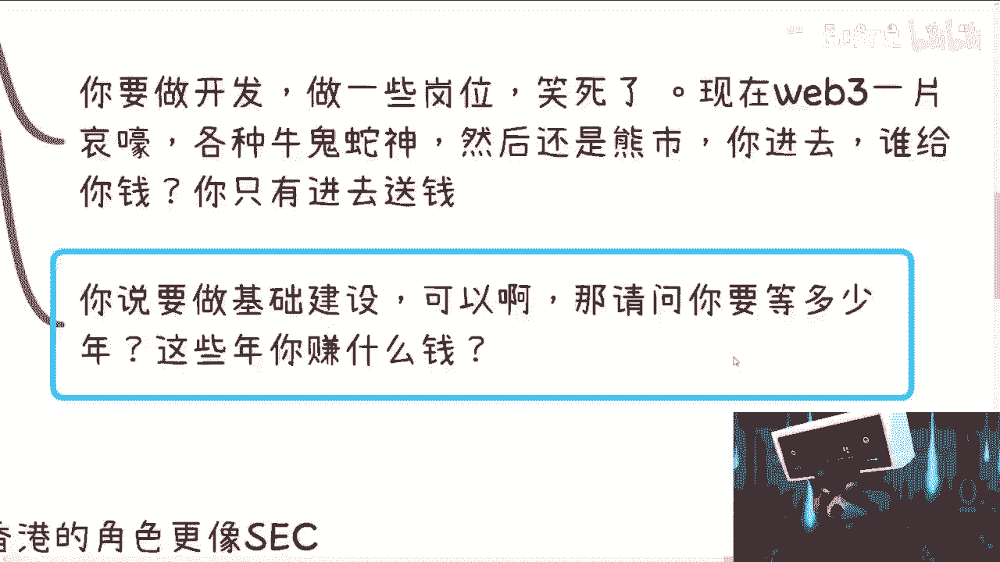

真的我他妈就真的绝了，你知道吗，真的就我跟你讲，我真的是很气很烦。

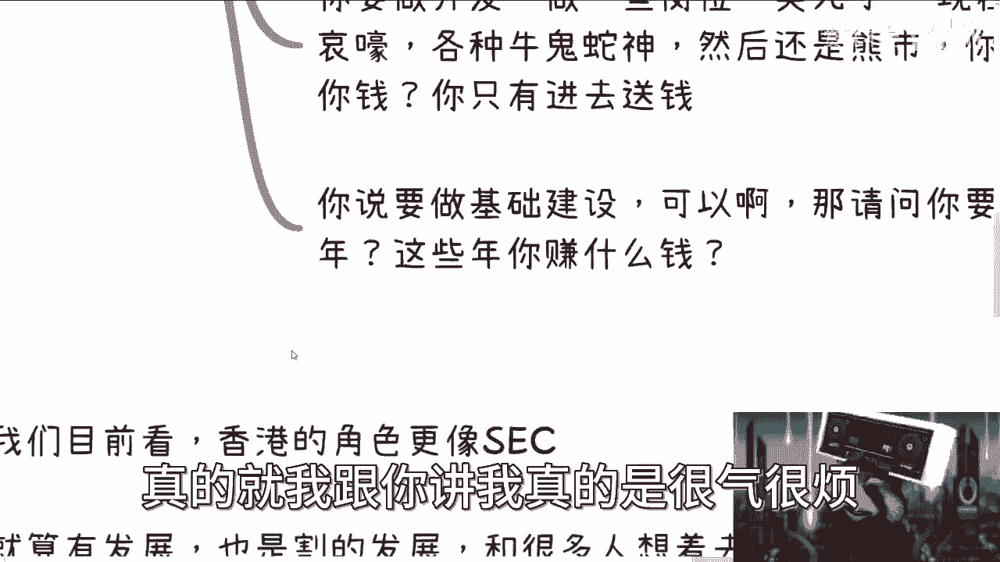

一种就是跟我说要做吕老师，我要做数字经济啦，然后我他妈要去微博三了，哼，唉又他妈蛋关系啊对吧。

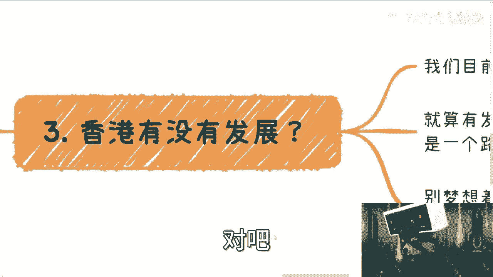

还有跟我说什么，哎我就要去香港行行，那我们来说啊，首先香港去年宣言大家也都知道对吧。

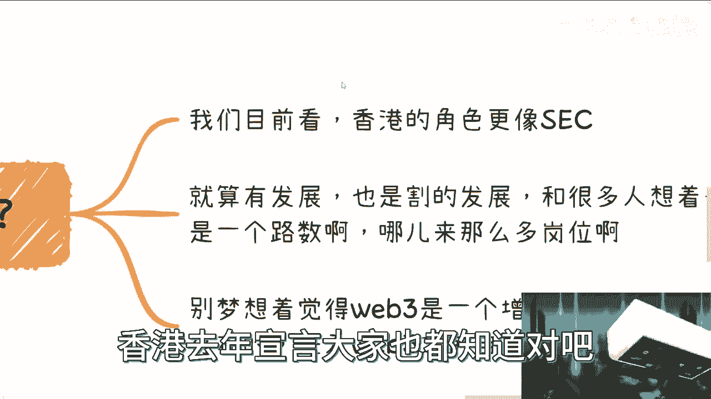

香港4月13号开会，大家也都知道对吧，我们目前来看香港的角色更像a s e c。

你懂了没有啊，我觉得香港政府觉得更像s e c。

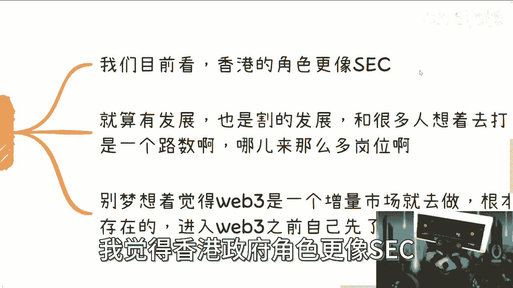

你懂了没有啊对吧，这是第一个，第二个就算有发展，也是歌的发展跟你有关系的啦，啊你们都想着去打工，跟你们去打工不是一个路数啊，哪来这么多岗位啊，哥需要有这么多岗位不需要呀，对吧，所以我跟你们讲。

别梦想着老觉得要做web 3，这是一个增量市场对吧，你们但凡有脑子的去了解了解，就知道这他妈不存在的啊，2016年中国这个很多人炒币，到现在这么多年了，你看到有多大增量市场了啊，我就问你们现在进去的人。

占整个中国世界亿人百分之多少吗，有吧啦没有的呀，对不了，你别老是自己pua，自己说，哎呀，这个市场很多的，这个市场很多年轻人进去有多少了，永远就那么一小撮人有多少了。

你别动不动自己pua自己说数字经济好吗。

对吧，那第四点对吧。

你说到这个我就再反过来说啊，国内数字经济当然是个很好发展，而且这是一个绝对的增量市场对吧，毫无疑问啊，整个政府给出来的各个信息好，都已经确定这件事情。

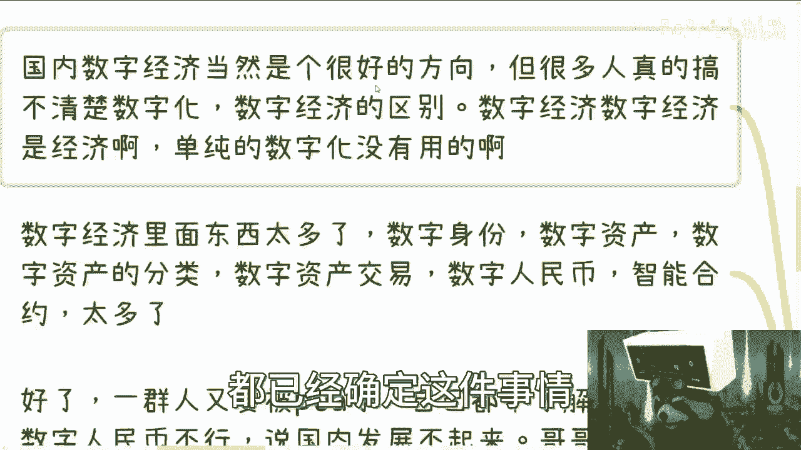

但是很多人都搞不清楚数字化跟数字境界区别，然后在那边说哎呀吕老师，我们要做数字化了对吧，这个东西怎么样怎么样，我跟你们讲数字化也好，那个叫什么信创也好，很多东西这他妈都是老生常谈了，都已经多少年了对吧。

什么意思，就是该切的蛋糕都切完了，别进去送死对吧，别进去，就是说做一个东西感觉自己做了，但其实还是在给别人打工，或者在给别人白嫖对吧，数字经济，数字经济核心是经济，核心是金融。

单纯的数字化没有用的，它不叫数字经济，他最多只能以前叫数字化，是信息化改造对吧，你多去了解了解，真的唉。

我跟你们说啊，就是就是很多时候说了。

不是我老是说这些东西，是我说了，你们听不进去，你知道吗，就是我说了很多遍了，数字经济，数字经济，数字化是数字化对吧，信息改造是信息化改造，信创是信创对吧，很多老的东西都已经做过很多遍了。

你们但凡去查一下这个政府相关东西就知道了，对吧，不要手眼高手低，不要好高骛远，不要人他妈在国内想着，国外也别也别在国内想着那些有的没的。

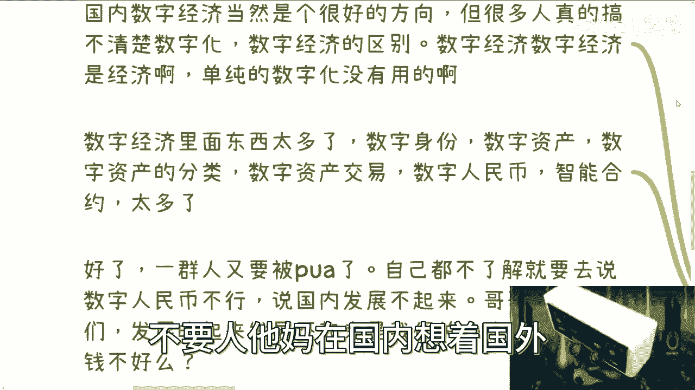

你要好好做就好好做，好好了解。

你知道吗，数字经济里面东西很多，数字身份，数字资产，资产的分类，资产的归属，对资产的划分，资产交易数字，人民币智能合约很多很多啦对吧，没有什么不能做的都可以做。

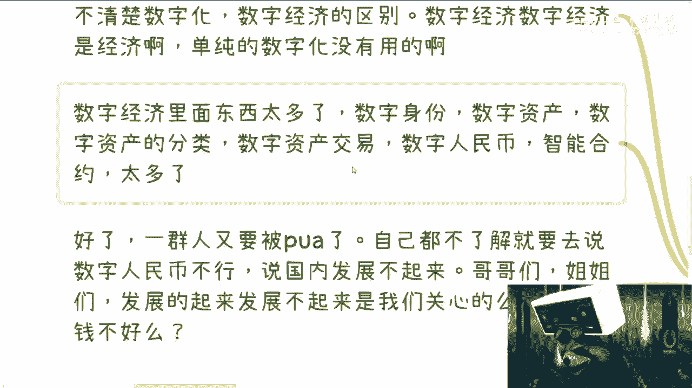

只不过就说切入点没这么好切，对吧好，那么你说到这个时候呢，我跟你讲一群人又要说了对吧。

又要说被p u a了，又要说哎呀，刘老师不是的，我们在b站，在微博，在各个地方看到有很多信息的，都说数字人民币不行对吧，这个东西不行，那个东西不行，那不行，你们滚啊，你们他妈的出去啊，倒是。

我真他妈夜吃绝了，真的是对吗，哦所以以后你们所有东西，就是你们所有东西看行不行，就看短视频啊，所以行不行，自己没有判断的，永远就看别人说行不行，那照这么说，没有东西行李啊，那没有增量市场价都不行。

对不啦，就存量市场已经没明摆着不行了，存量市场已经是属于一根毛巾在里面卷，卷不出水水来，只能卷出血了，现在你们吃不来，你们又不愿意去对吧，那剩下我跟你们讲啊，有增量市场，比如说双碳对吧。

医疗医疗器械对吧，生物医疗对吧，机器人有很多的，不是说，当然并不是说这个领域就一定都是增量市场，它在某些这个领域里面的细分行业，它会有很多的增量的机会出来对吧，包括包括那个新能源的电电池在利用对吧。

不是说没有很多很多，包括你说像大数据，大数据，接下来那个那个数据的这个归类，数据的这个资产的划分也是增量市场，但是你单纯造数据就是他妈的死啊，就垃圾啊，存量市场卷不动了，对不对，你要辩证的去看点。

你不能老是拿一个东西在里面说，哎这个东西是活，这个东西是死，这个东西是增量市场，这个东西是不是增量是没有用的呀。

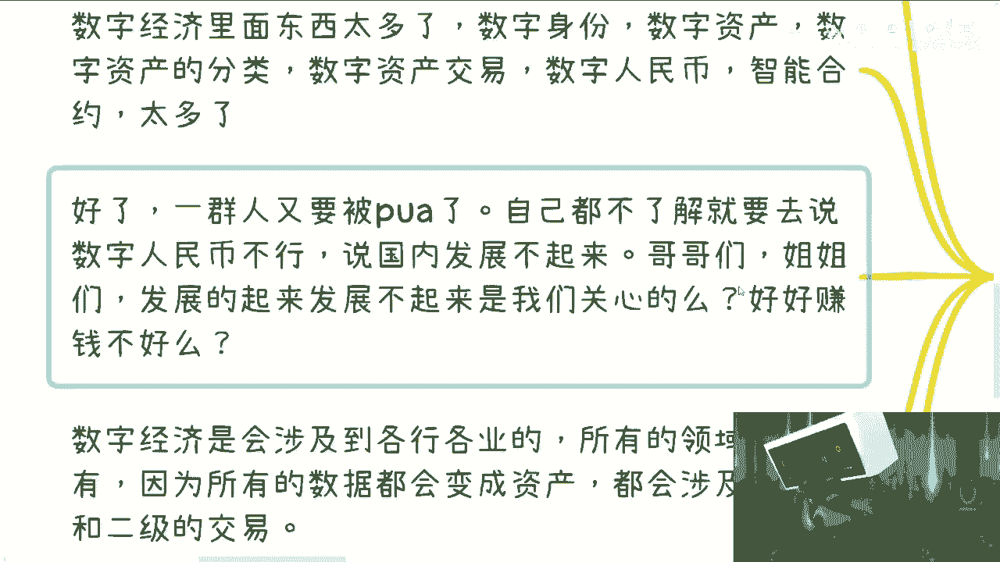

对不对，再说了，发展得起来，发展不起来，是我们要关心的不难啊，你们摸摸自己的屁股对吧，是我们要关心的吗，你好好赚钱不好对吧。

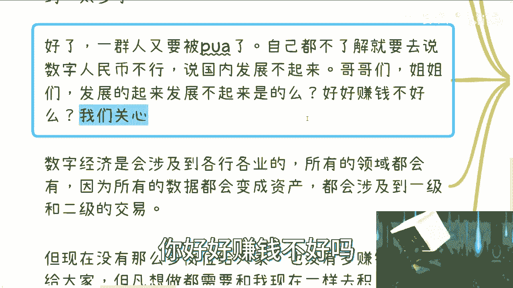

还有什么呢，你数字经济一定是会涉及到各行各业的，什么律师啊，会计啊对吧，各种各样的东西都会涉及到的，我现在给这么多高校做课程对吧，就是他明摆着就是个很前期的事情，我已经跟你们讲了，这现在就在做铺垫对吧。

各个领域都会有，因为你只要有数据的地方就会有资产，只要有资产的地方就会涉及到一级二级交易，只要有一级二级交易，它就会有收益，就会有红利期对吧，就会有赚钱不就这么简单的事情嘛。

对不对啊，但是我又跟你们讲了，现在没有这么多岗位对吧，也没有这么多赚钱机会，因为现在是一个早期的时间，你但凡要去想要做，你需要跟我现在一样去做积累，你该认识人，去认识人，该积累你的关系，积累你的关系。

该打造你的品牌，打造你的品品牌对吧，别老是在那边想着说哎呀，怎么现在不知道怎么切，不知道怎么做，没有什么没人知道怎么做，谁知道怎么做啊，不是所有东西不都是一边做一边摸的吗，哪有知道怎么做呀对吧。

所以我跟你们讲，要谨慎，你别动不动就说我要做自主经济来，更别动不动说我要做web 3了对吧，或者说是吕老师说要做的，我这个锅我不背啊啊对吧。

就是我跟你们讲的认清楚啊，别什么都不了解，就往里面冲对吧，然后就真的到现在为止就没几个人搞得清楚，做区块链是做什么，做尾巴三又是做什么，做数据经济又是做什么，我讲了这么半天对吧，也没有人搞得清楚对吧。

就说白了这视频发了也没人看对吧，就该问我的还是要问我就该该他妈的问了两句，我要拉黑还是要拉黑对吧，真的就我觉得就是要么就是好高骛远，要么就是浮躁对吧，根本不愿意去沉淀，根本不愿意去积累。

那我就请问嘛怎么赚钱嘛，你怎么到后面，比如说我就算告诉你明年有红利期，明年有大的发展，跟你们有关系吗，对吧，你只要有沉淀了，打造品牌了，你才会有关系啊，否则怎么会有关系呢，对不对，我早就跟你们讲了。

你们也头上不长角，我也不张角，那凭什么未来政府要发展，企业要发展你们，你们能赚到钱或者我能赚到钱呢，大家都赚赚不到钱，只有那些有准备的才有可能赚得到钱，不就这么简单吗对吧，你还想我说啥呢，对吧。

还想我说啥，有很多东西就我刚刚给你们举例子，就很多东西可以做，这些东西都是空白的，包括高校里面的什么课程，什么东西大家都可以切，就是哦哦收到这个东西，说到这个东西，很多人又要说哎呀。

这个东西普通人接不了的，那个东西普通人接不了的啊，这个东西普通人做不了那个东西，普通人做不了哎呦，你们做过吗，我就请问你们没做过，怎么知道就做不了了呢，是吗对吧，我就问你们是跑到院院学校这边找个院长。

还找过副校长，还找过校长说就不能做了，人家是直接跟你说，他妈的我们不要的还怎么说，没有吧对吧，你不人家不合作，最关键的原因不是你做不了，是你手上没有没有成熟的产品，没有成熟的这个叫什么内容，那没有。

你去找啊，你去积累啊，你去想啊，你去找合作伙伴呢，对不对，这不是都是机会吗，好吧我希望啊就说同样的，反正大家对web 3就是这么一个清楚的了解，别抱有任何幻想，数字经济也是这么倾斜了，结业表。

别别抱有任何幻想，简单来讲就是说对吧，你该去割就去割，你该去做沉淀，就是沉淀，不要想着说什么还有什么所谓的稳定的领域哦，给大家什么打打工对吧，未来还什么什么什么多点股票对吧，多点怎么样赢取白富美对吧。

算了啊，别想啊，这个时代已经过去了，没有这个时代了，不好意思啊，好吧行，就这么着吧，没事，我的小浣熊怎么又又又失去，哎呀又失去那个识别了，好吧就这么装吧，然后你们有什么这个职业发展好吧，或者别的。

你们反正在整理好question list好吧，然后再给我给我发给我发给我私信，再发给我。