# 数字经济课程 P1：解析中银国际发行代币化票据 📜

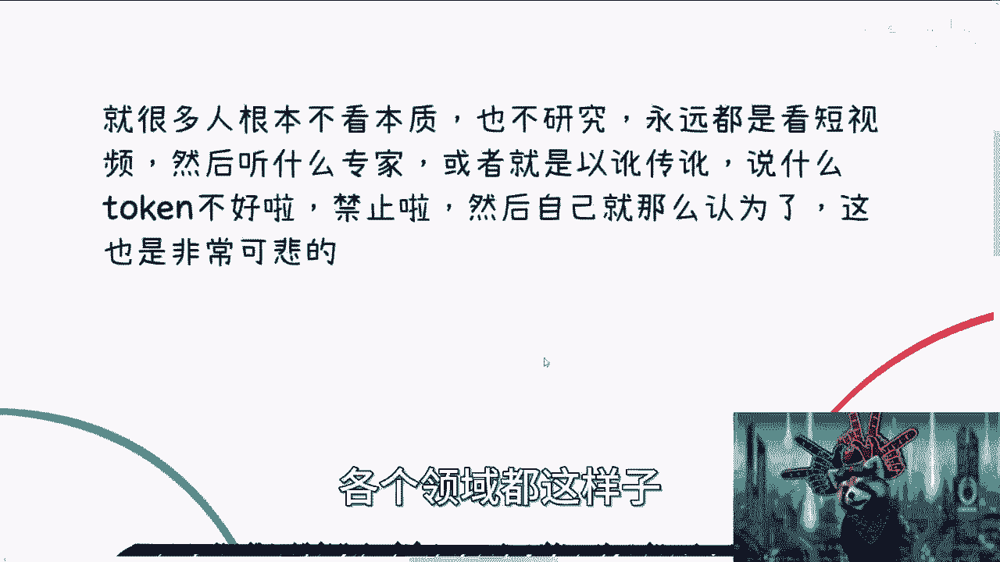

在本节课中，我们将深入探讨中银国际（BOCI）在以太坊区块链上发行2亿元人民币代币化票据这一事件。我们将澄清关于代币（Token）发行的常见误解，分析其合规性，并探讨当前区块链生态的现状。

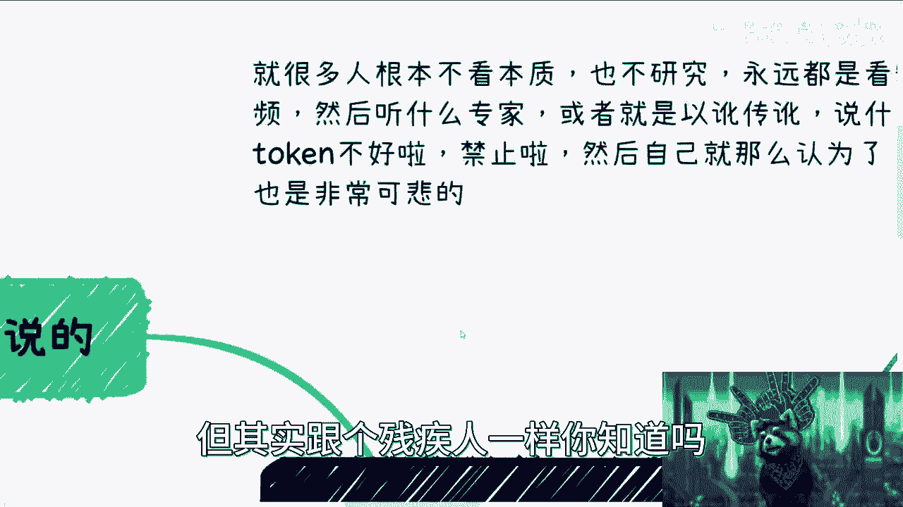

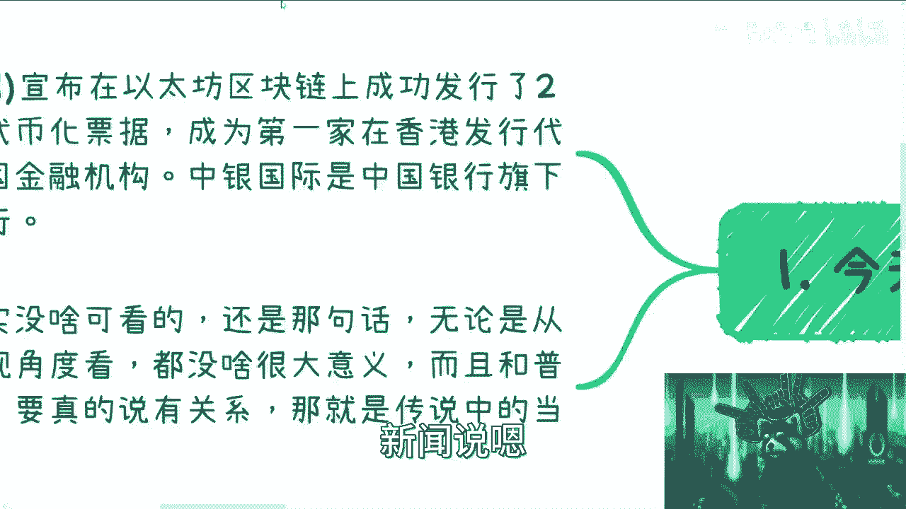

---

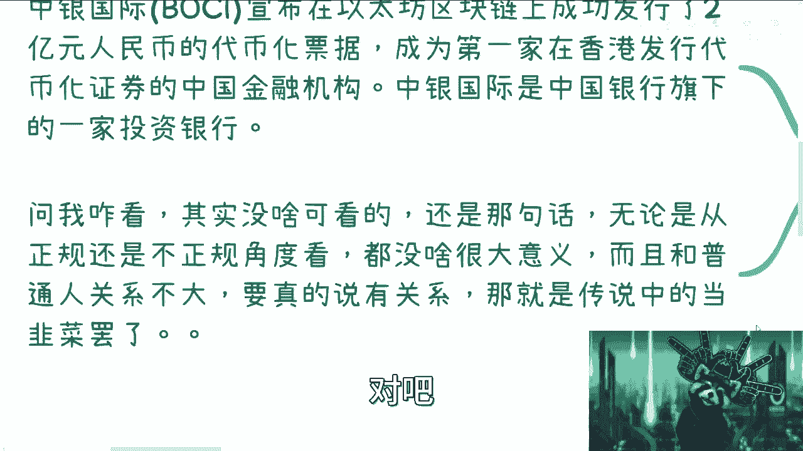

很多人关注中银国际发行代币这件事，认为这很了不起。实际上，这件事本身没有太大意义。

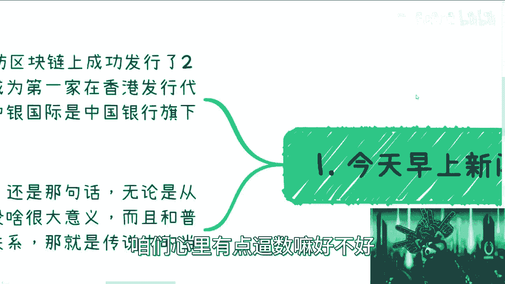

新闻内容是：中银国际（BOCI）宣布在以太坊区块链上成功发行了价值2亿元人民币的代币化票据，成为首家在香港发行代币化证券的中国金融机构。中银国际是中国银行旗下的投资银行。

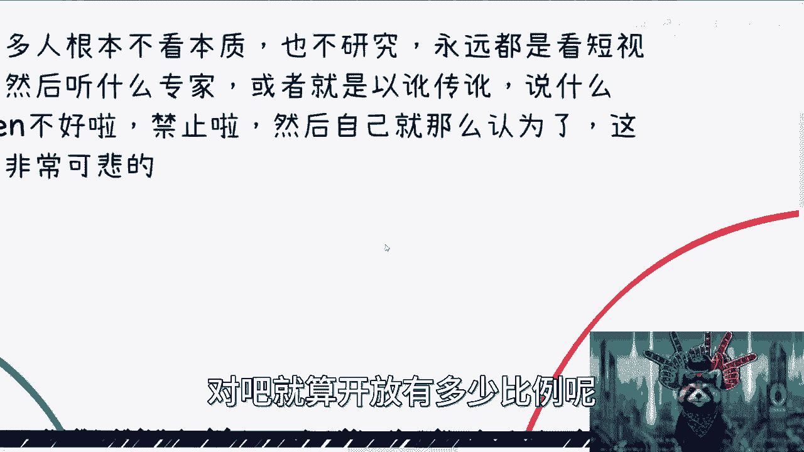

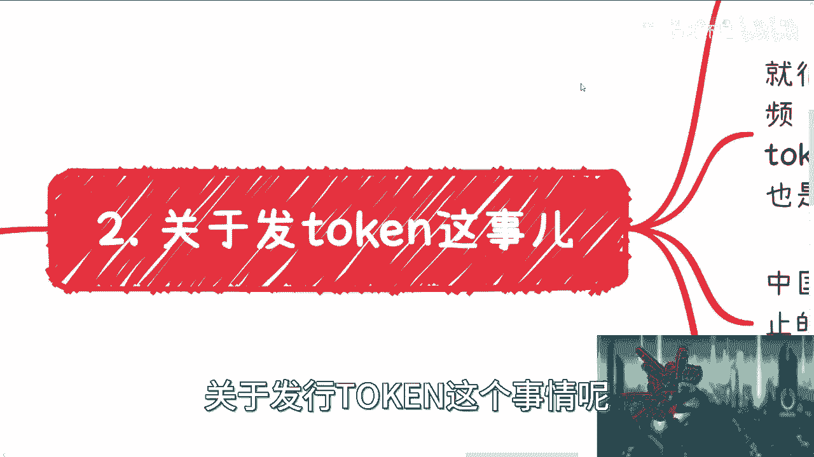

这件事没有太多值得关注的地方。无论从正规还是非正规的角度看，意义都不大。这件事与普通人基本没有关系。如果非要说有关系，那可能是普通人成为“韭菜”的潜在风险。指望在中国银行旗下的投资公司里赚钱是不现实的。

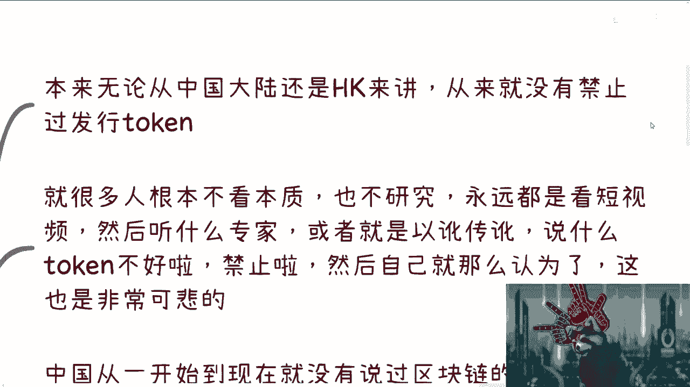

退一步讲，普通人是否有相关的KYC（了解你的客户）认证？香港向大陆开放KYC认证存在诸多问题和复杂流程。即使开放，比例也有限。

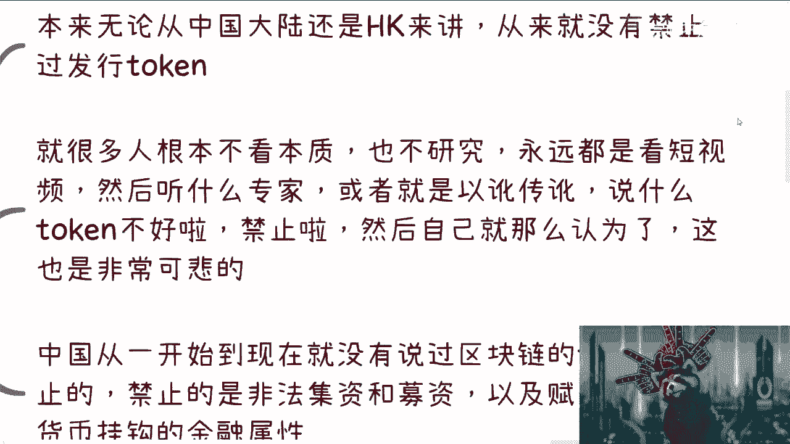

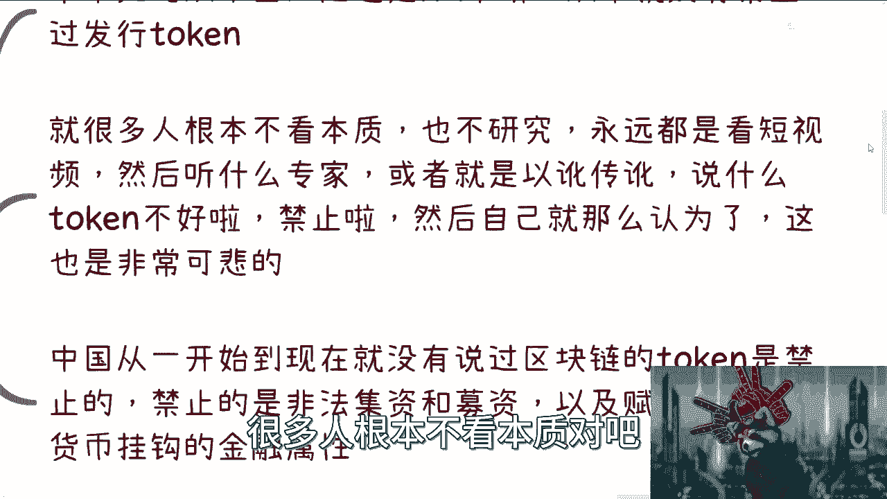

---

上一节我们介绍了事件本身，本节中我们来看看关于发行代币的常见误解与法律实质。

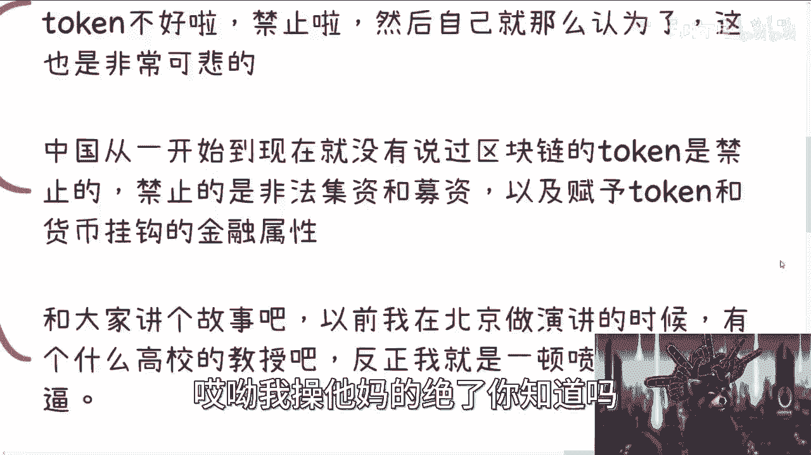

关于发行代币，需要明确以下几点：

第一，从古至今，无论是中国大陆还是中国香港，政府或法律从未禁止过发行代币。这种“禁止发行”的舆论不知从何而来。这可能是资本家散布的舆论，目的是阻止普通人参与，以便他们自己“收割”。

很多人不看本质，也不做研究，只通过短视频获取信息，听信所谓的“专家”言论，导致以讹传讹。

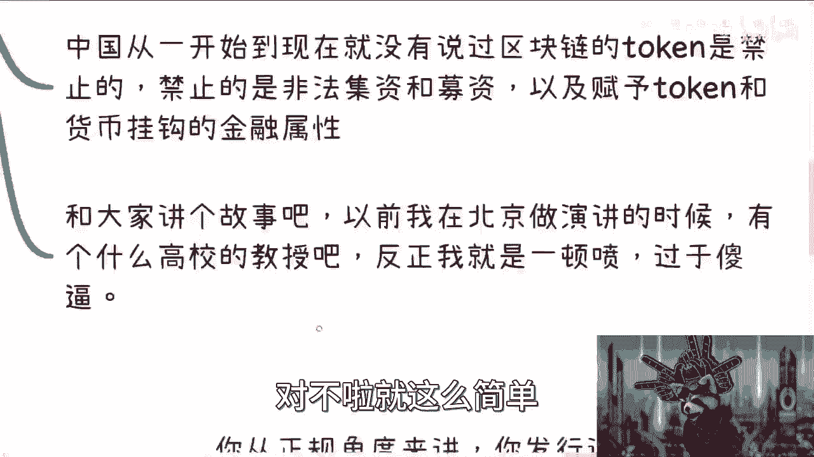

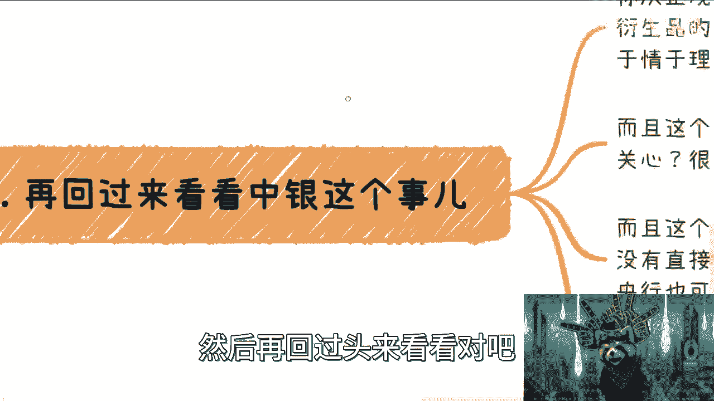

第二，中国从未在法律或任何层面禁止区块链代币。禁止的是利用代币进行非法集资、募资，以及赋予代币与法定货币挂钩的金融属性。

赋予代币金融属性是指，发行一个代币并直接锚定美元、日元或人民币等主权国家法币，这是不被允许的，是违法的。但这与代币本身无关，因为代币只是一种媒介。非法集资可以用代币，也可以用石头或鸡蛋。不能因为用石头非法集资，就禁止所有石头。

---

上一节我们澄清了法律边界，本节中我们来具体分析中银国际此次发行的性质。

回过头看中银国际这件事：
1.  **从正规角度**：发行证券化代币属于金融衍生品，是一种数字化产品。香港去年已发布相关宣言，允许此类发行，因此合规。
2.  **从事件影响看**：此事目前影响有限，需要更长时间观察。许多类似事件最终可能没有实质性发展。
3.  **从技术选择看**：此次在以太坊上发行并不奇怪。香港已发布宣言支持NFT和数字货币，并颁发了虚拟货币交易所牌照，因此在以太坊发行合乎逻辑。
4.  **从本质看**：代币化是不可避免的趋势。任何国家的央行数字货币（CBDC）本质上都可以视为一种代币。

---

上一节我们分析了此次发行的多个维度，本节中我们来探讨当前区块链与代币生态的现状。

当前整个生态存在严重问题：
*   许多人缺乏基本认知，将区块链与芯片、挖矿等不相关的事情混淆。
*   生态的受众大多只想通过代币投机发财，追求十倍、百倍收益。如果这种心态不改变，生态难以健康发展。
*   代币与智能合约技术本身是好的，但容易被“镰刀”（操纵市场者）用于“割韭菜”（欺诈散户）。目前理解其本质的人太少，谣言却很多。
*   许多人抱怨中国区块链发展慢，这恰恰是因为投机者太多，真正理解并建设生态的人太少。
*   整个Web3领域目前充斥着庞氏骗局和传销。虽然可能有人在认真做事，但很多项目既不解决真实痛点，也没有真实需求，只是凭空创造概念后进行发币募资。

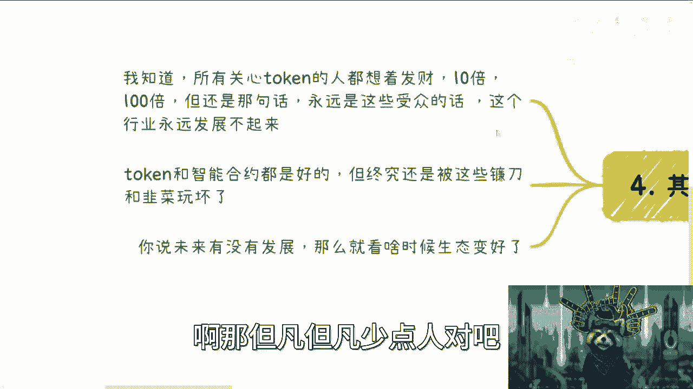

---

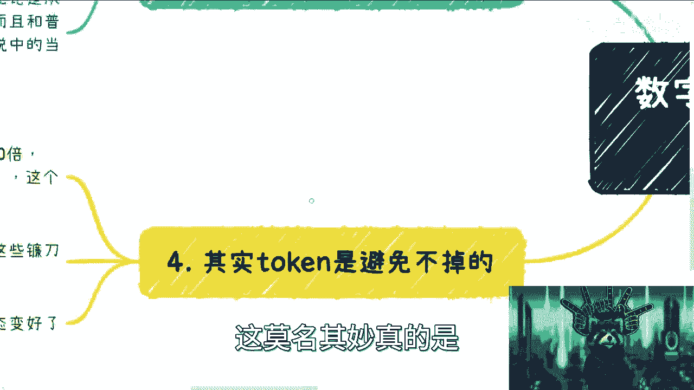

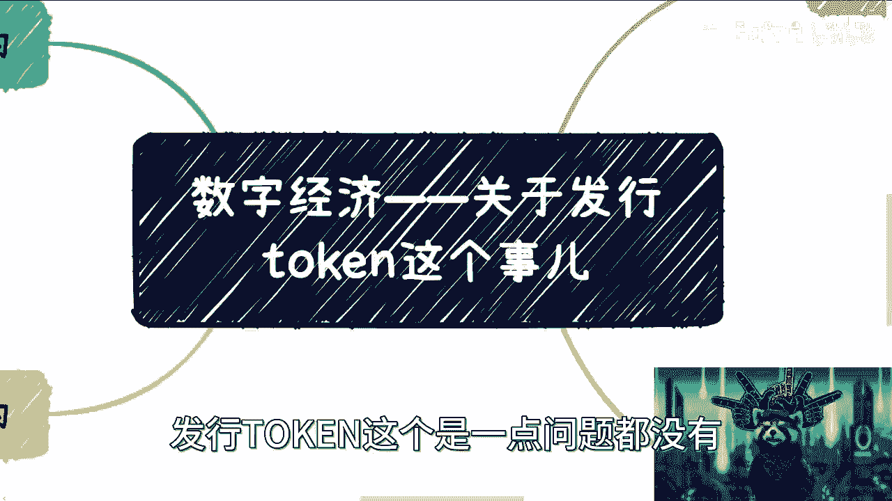

发行代币本身没有问题，中国未来也一定会有相关发展。但发展路径绝不会是当前Web3的这种模式。当前生态仍是一个“韭菜”、“镰刀”和传销盛行的生态，是一个庞氏骗局。

对于个人而言，建议先系统学习，理解本质，再参与讨论或投资。不要轻信以讹传讹的信息。

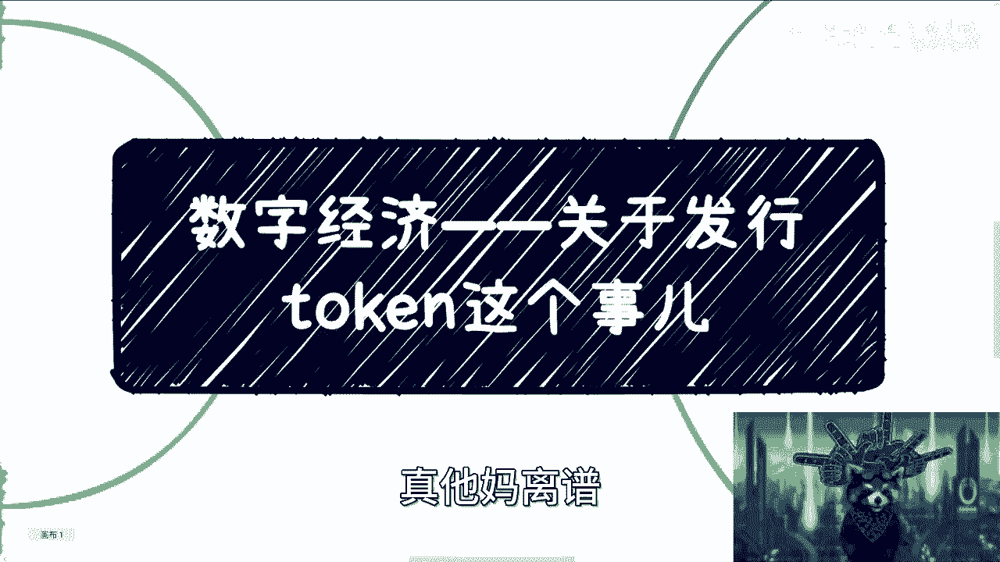

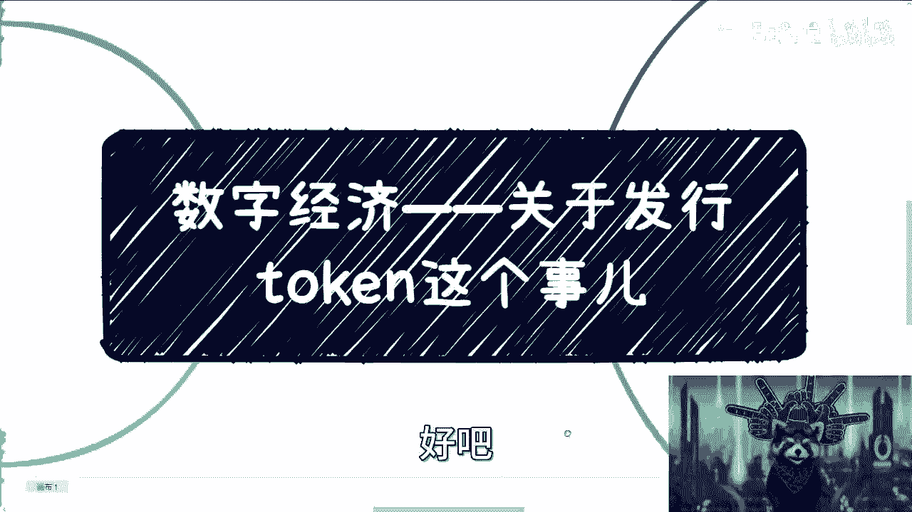

未来如何发展，需要拭目以待。

---

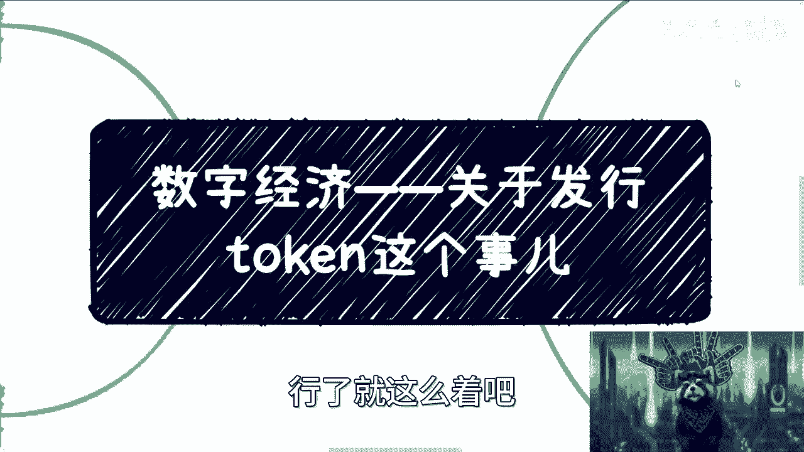

**本节课中我们一起学习了**：
1.  中银国际发行代币化票据的事件本身意义有限。
2.  中国从未禁止代币发行，禁止的是非法集资和赋予代币货币属性。
3.  此次发行在合规和技术层面均属正常。
4.  当前区块链生态被投机和欺诈行为主导，远离了技术本质。
5.  个人应通过学习理解本质，理性看待代币与区块链发展。