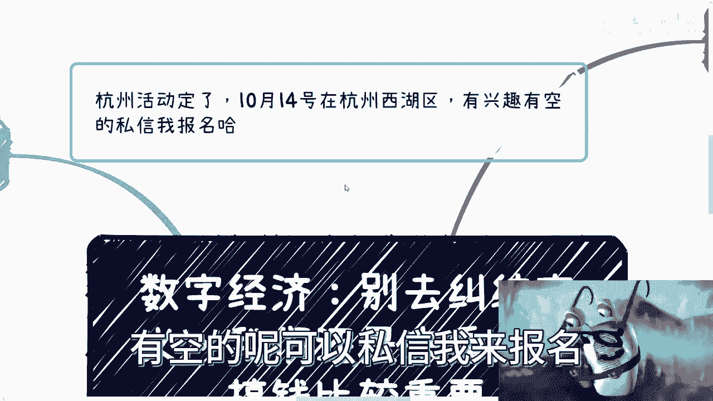

# 数字经济-别去纠结定义-我们还是来看怎么搞钱比较重要---P1---赏味不足---BV1CH4y1d

在本节课中，我们将学习如何绕过对数字经济概念的纠结，直接关注其核心的落地机会与盈利模式。课程将基于最新的市场信息，分析当前的政策环境、行业趋势，并提供具体的行动思路。

---

## 一、 最新动态与活动通知 📅

距离上次更新数字经济相关内容已有一段时间。本次更新主要分享近期获取的一些信息。

杭州线下活动的时间与地点已经确定。

**活动时间**：10月14日。
**活动地点**：杭州西湖区。

有兴趣且时间允许的朋友，可以通过私信报名参加。

目前报名情况尚可。由于场地空间较大，仍有充足名额。活动安排在国庆假期之后。

---

## 二、 核心趋势：等待与蓄力 ⏳

上一节我们提到了线下活动，本节中我们来看看宏观的政策与市场环境。

从当前情况看，仍需继续等待国家层面的具体政策。经过多方询问，结论是一致的：需要等待。政策可能在今年11月、12月出台，也可能推迟到明年。具体时间无人知晓，但政策一定会出台。今年剩余的时间将继续处于等待期。

是否有新的方向出现？目前尚不明确，只能等待中央与地方的政策指引。

过去一年，虽然表面上看市场似乎“停摆”，但实质上可以理解为各方都在“水下”积极运作。大家都在建立联系、积蓄力量、拉帮结派。因此，今年也是“搞关系”的一年。明年则将是蓄势待发、加速发展的一年。

当然，不同行业（如进出口贸易等）情况各异。但无论如何，明年发展速度肯定会加快。无论是受美国大选影响，还是因为今年积累的势能，加速意味着机会必将增多。

目前，我确实没有看到全新的颠覆性事物出现。从下半年各地方政府释放的信息来看，对于大众而言，相对容易切入的领域可能仍然是**数字经济**。

其他领域如光伏、半导体、芯片、储能等，门槛较高，不易切入。这些领域要么需要极高的技术或资金起点，要么需要非常硬的背景资源。

---

## 三、 具体赛道分析：元宇宙与数字藏品 💎

在明确了数字经济是主要方向后，我们来看看其中两个备受关注的具体赛道。

很多人关心元宇宙和数字藏品的现状。我之前也发布过相关内容。大家主要关心的问题是：这个领域是否已经“凉了”？是否还有人提及？是否无法继续做？是否不赚钱？

我的观点始终如一：一个领域“凉”与否，并非由我们决定，这本身也不重要。关键在于**一切跟随政策走**。只要有政策支持，就有盈利空间。有政策，就意味着这是一个自上而下推动的流程。

用上海话的生意经来说，这种业务的本质是 **“有总比没有好”**。

我们开展业务讲究**从上往下**推进。从上往下才有操作余地和退路。如果从下往上走，一旦路径走死，就真的没有回旋余地了。

我来解释一下“从上往下”的含义。例如，上海在今年城市建设规划中，再次提出了元宇宙相关政策，还包括区块链（如“浦江链”等具体项目）。这说明了什么？说明政策上确立了这些方向。

那么，无论企业、政府、高校、园区还是其他各类机构，就一定会有相关的项目申报、对应的竞赛，以及随之产生的培训、咨询需求。为什么？因为最终目的是为了“汇报”，而汇报需要蹭新的热点和概念。有了城市规划的方向，汇报不往上靠，就是失职。

即使某些具体路径暂时走不通，也没关系。因为市场发展是波浪式的。上面的政策和行为，一定会层层影响到下面。

**影响链条公式**：
`政府政策 -> 国企/央企 -> 大型企业 -> 中小型企业 -> C端散户`

这是一个一浪接一浪的影响模式。数字藏品也是同样的道理。

关于数字藏品，我想说的是：不必过于纠结它的**名称**。国家时常更改其称呼（如数字藏品、数字文创、数字资产等），这并不重要。叫什么无所谓。

虽然之前的市场模式可能发展有限，但国家保留这个称呼，意味着市场未必消失。国内完全可以结合“数字化改造”，走出一条不同于以往的新路。数字藏品依然会有一大片增量市场，只是玩法发生了变化而已。名称不重要，实质才重要。

---

## 四、 商业发展的波浪式滞后规律 🌊

理解了具体赛道，我们还需要把握商业发展的宏观节奏。

商业发展具有**从上往下的滞后性**。任何由政策或大趋势驱动的领域，其发展通常是波浪式、分阶段滞后的。

这种滞后性主要体现在两个层面：

以下是滞后性的具体表现：

1.  **政府与机构层面先行**：政府相关部门会率先行动，表现形式可能是培训咨询、创新项目申报、产业园构建、国家标准/行业标准的编写，或是人才培养方案的制定。这些活动一定是最先出现的。
2.  **逐级传导与影响**：之后才会影响大型企业进行相关的咨询与培训；进而影响中小企业开始思考数字化转型与改造；接着是各类项目逐步落地；最后，才会反映到企业的招聘需求上。

因此，对于普通“打工人”而言，如果只盯着最终的招聘端，可能会觉得机会少、前景不明。但从整个商业金字塔的发展来看，招聘需求处于非常末端的阶段。

当然，有时不同层级的事情可能同时启动，但**出结果会有先后顺序**。例如，项目申报、标准制定、企业项目可能今年都在做，但结果公示可能分布在明年上半年、下半年甚至后年。这依然是波浪式的结果呈现。

第二个滞后性是**城市间的梯度差异**。一线城市到五线城市，对于新概念的关注度、接受度、感兴趣程度存在滞后，这个时间差一般有一到两年甚至更长。

这是中国城市发展的客观规律。

---

## 五、 行动策略：万物皆可数字化，故事决定一切 📖

掌握了规律，最后我们来看看具体的行动策略。

目前看来，“数字经济”是一个非常大的概念。几乎没有什么不能做的，关键在于你如何包装和讲述你的故事。

不要总想着问：“老师，这个东西到底该怎么结合、怎么发展？” 这没有标准答案。数字经济不是应试教育。能怎么做，完全取决于你的**故事怎么讲**。

也就是说，无论是之前的数字化改造（降本增效）、元宇宙、数字藏品、数字人民币、数字资产，还是数字化后的各类产业，都可以与“数字经济”挂钩。这取决于你的叙述方式。

**行动时间线参考**：
*   **项目申报**：今年下半年基本已开始运作。
*   **项目制合作**：今年下半年完成产品包装、方案包装、故事梳理。
*   **市场拓展**：明年一开年，或今年下半年铺垫，开始跑销售和商务。

其实各行各业大多都能结合，除了极难结合的领域。农业、金融、游戏等都能结合。因为“数字化改造”、“降本增效”本身就像万金油，是近两年不变的主题。

**核心策略**：我们具体做什么并不最重要。关键是找到自己熟悉的关系链，然后在宏观包装上，一定要向**数字经济、数字科技、数字XX**等方向靠拢。这样事情才靠谱。

因此，无论你想做培训、做To B生意、To C生意、To G（政府）生意还是To 高校生意，都可以做。方向已经确定，具体“怎么做”还不知道——而这，正是机会所在。

看待很多问题时，不必过于纠结“这个东西好不好”。这不是我们需要关心的重点。我们只需关心：**政策是否扶持？是否有对应文件？**

只要有，就去做。就这么简单。因为只有这样，你才有机会“高举高打”（占据高位势能），有了高举高打的机会，才有后路可退。如果没有这个机会，也就没有退路，那就很难操作。

---

## 总结

本节课中，我们一起学习了数字经济领域的当前态势与实战思路：

1.  **关注政策**：核心是等待并跟随中央与地方的政策出台，这是所有机会的源头。
2.  **认清赛道**：数字经济是当前相对容易切入的大方向，其中元宇宙、数字藏品等赛道仍有新玩法和新机会，关键在于理解其“自上而下”的发展逻辑。
3.  **把握节奏**：商业发展具有波浪式滞后规律，从政府、大企业到中小企业、个人，机会逐层传导，需要提前布局。
4.  **采取行动**：“数字经济”概念包容性强，万物皆可数字化。找到自身资源，并学会将业务用数字化的故事进行包装，是落地的关键。

记住，**有政策支持就行动**，在方向确定的领域寻找“怎么做”的具体答案，这便是当下的机遇所在。