# 数字经济——关于中银国际(BOCI)发行了2亿元人民币的代币化票据 - P1 - 赏味不足 - BV1Ez4y1i7MA

哦那这个就是让我们回归主题啊对吧，游戏也打了是吧，哈哈哈啊，那个今天早上中银国际那个事儿对吧，嗯是有大部分人可能还关心啊，他发行token的这个事情，这个事啊其实也没啥好关系呢，为什么呢。

因为嗯没什么大不了的，我跟你们也在这边说一下吧，我觉得大部分的事情啊，其实大部分的人他是不看本质的，也不去研究，你知道吧，就永远就看短视频，然后听什么专家对吧，人一边骂骂专家，一边还要听专家。

还听的是一些野鸡专家，你知道吗，还什么赤脚医生，你知道吧这种，然后然后就以讹传讹，说什么token不好啦，禁止了对吧，然后有人就比如说中银国际发了对吧，大家哇牛逼牛逼牛逼啊，鼓掌是吧啊。

然后自己就这么认为，其实我跟你讲各个领域都这样子。

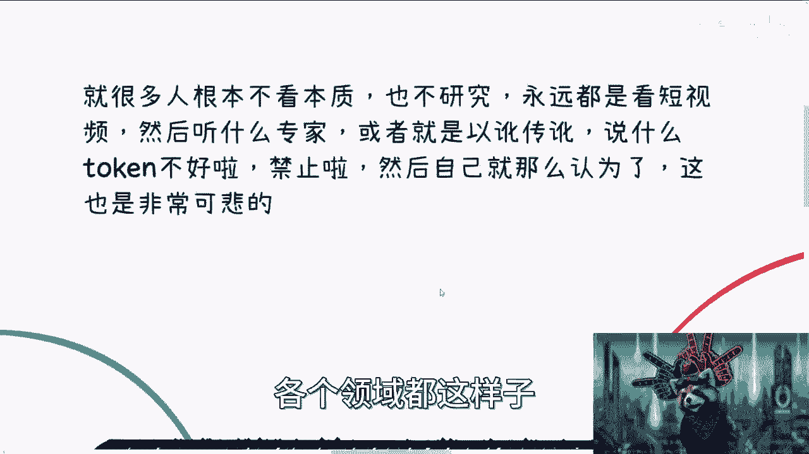

就可悲的很，你知道吗，就现在看似很多人很健全啊，但其实跟个残疾人一样。

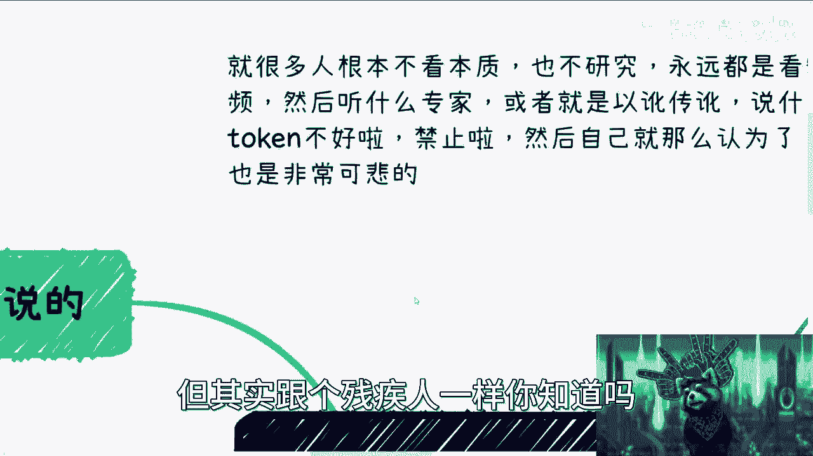

你知道吗，就唉他妈离谱啊，新闻是这样讲的啊，新闻说嗯中银国际啊。

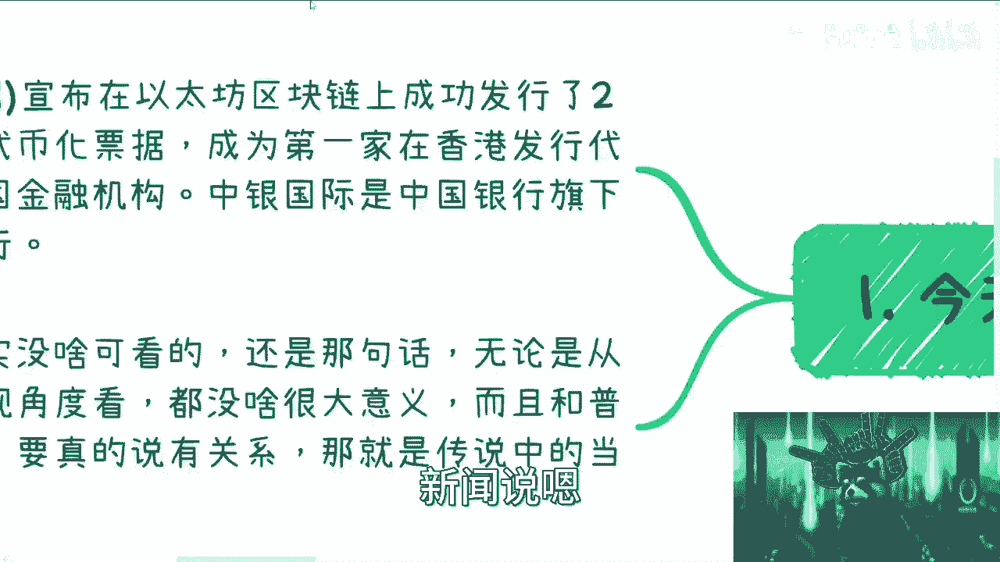

BOCI宣布在以太坊区块链上面，成功发行了2亿元人民币的代代币化票据，票据票据，成为第一家在HK发行代币化证券的，中国金融机构啊，中银国际是中国企银行旗下的一家投资银行啊，好，问我咋看是吧。

我跟你们讲了，没啥可看的，为什么，因为还是那句话，无论从正规的还是非正规的角度来讲，没有什么很大的意义，怎么了呢对吧。

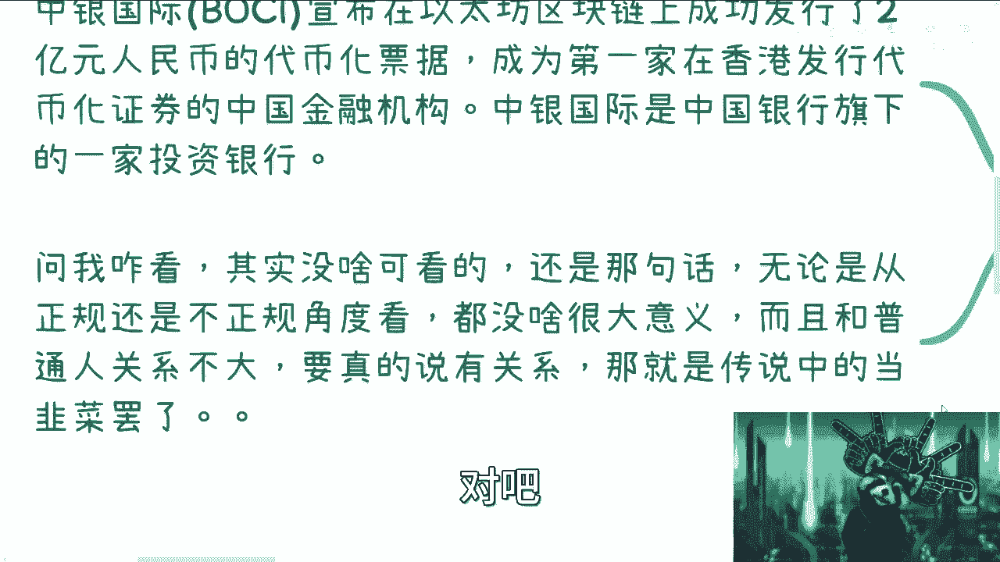

而且说白了跟普通人也没什么关系，你要说真有关系，就是你你们去当传说当中的韭菜，你还指望着说啊，你能在中国银行旗下的投资公司里面赚到钱，What，啊那咱们心里有点逼数嘛。

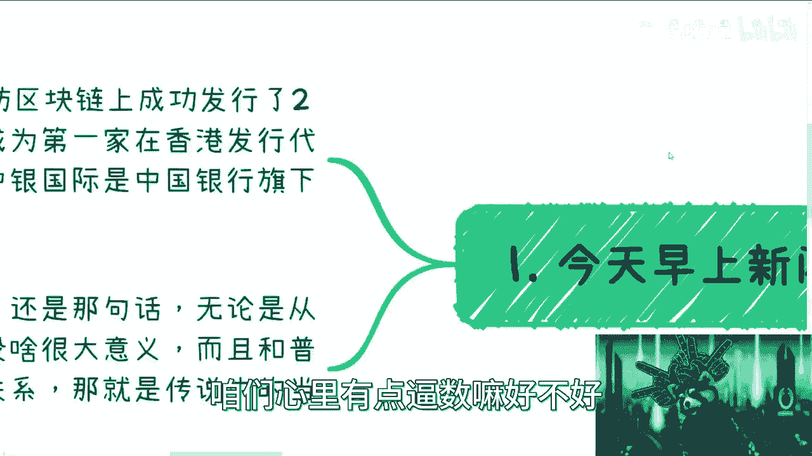

好不好，啊然后我们退1万步来讲对吧，你有相关的KYC吗对吧，香港要开放大陆QYC，这个当中有多少个问题啊，当中有多少流程啊对吧，就算开放有多少比例呢对吧。

你不想想看对吧啊，关于发行token这个事情呢。

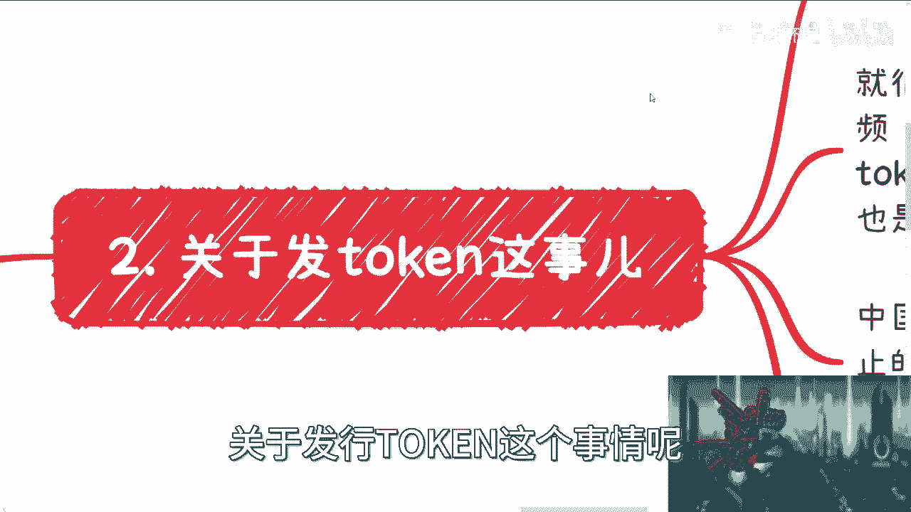

我在这个地方啊，正好顺便跟你们好好说一下啊，第一从啊从古至今啊，无论从中国大陆还是中国香港来讲，从来就没有政府这边啊，或者法律这边从来就没有禁止过发行token啊，从来都没有过。

我也不知道就是这种舆论怎么出来的啊，不能发行发行禁止的对吧，怎么样，我也不知道这种东西，怎么怎么就有个传说出来了，很是奇怪对吧，我只能理解为资本家把这种东西舆论放出来，告诉大家好，你们别干啊。

你们千万别割韭菜，让我们来割就可以了，不就这种逻辑吗。

对不对，用泛化来讲就是H2啊。

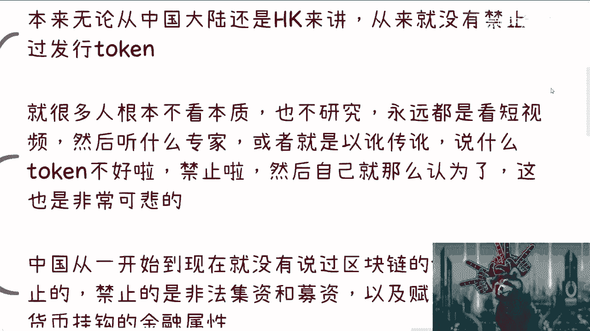

对吧啊，就很多人根本不看本质对吧。

也不研究对吧，永远就看短视频，那我就不重复了对吧，这话我真说过一遍了啊，然后呢，中国从一开始到现在就没有说过，区块链的token是禁止的，无论从法律还是从任何地方都没有说过哦，禁止的是什么。

禁止的是其非法集资跟募资，以及赋予token和货币挂钩的金融属性，你明白吧啊什么叫富裕，token跟金融跟货币挂钩的金融属性，就是说你今天发现一个token，你直接去锚定美元或者锚定日元。

或者锚定人民币，只要是锚定主权化国家的法币，这都是不被允许的，这个事情肯定是违法的，为什么啊，为什么这个事跟token没有关系啊，因为token只是个媒介，你知道吗，你今天可以拿token类非法集资。

你也可以拿个石头来非法集资，只要你有本事，对不对，这个这个你总不能说我拿石头来非法集资了，好你妈把中国石头全部给我禁了，啊啊那照你这么说，那这么说吧，我我我我我用鸡蛋去去飞吧，鸡蛋那照你这么说。

从明天开始，整个中国人民不要吃鸡蛋了，鸡蛋就违法的，这不莫名莫名其妙吗，你你你要么去跟鸡说啊，你声带是违法的，你懂不，咕咕咕哎呦，我的绝了。

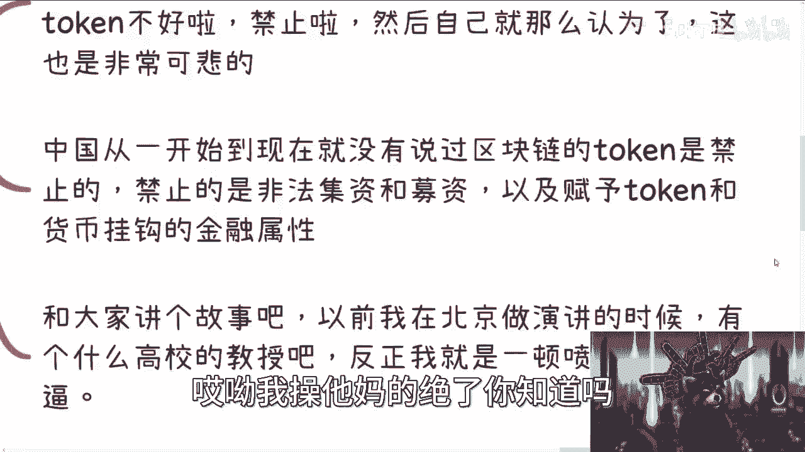

你知道吗，就，就我觉得现在的人啊真的就看似长了脑子，但其实没有脑袋啊，嗯然后呢跟大家讲个故事啊，以前我在北京做演讲的时候呢对吧，当时还有个高校的教授，哎呀他妈离谱到家了啊，我当时做演讲的时候。

有前面有人提问啊，就说什么呢，他说啊陈老师你能不能讲一下智能合约啊，跟这个token啊相关的一些事情啊，包括一些边界，然后那个教授老牛逼了，你知道吧，我忘记哪个学校了啊，唉反正就是个教授。

而且还是个编制教授，牛逼了，然后就什么拿那个拿话筒对吧，因为他是那个什么出品人嘛，拿话筒就在那边说啊，这个东西中国不允许的，我们就不讨论了，然后我就直接怼他，谁他妈跟你说不允许的啊。

你告诉我哪个法律不允许的，这莫名其妙的怎么就不允许了呢，啊我们又没物资，又没怎么样啊，我们拿出来讨论不允许了哈，我跟你们讲，中国就这个样子啊，就是有非常多的教授腐朽啊，但不自知还不进步。

然后有非常多的年轻人对吧，不需学习，也就每天在那边听短视频是吧，反正我一顿喷啊，我怎么管他，真的是对吧，我不我跟你讲，我的三观是这样子，我他妈管你是教授是谁啊对吧，你怎么说的不对，就是。

就他妈喷你怎么了呢，对不对，就这么简单。

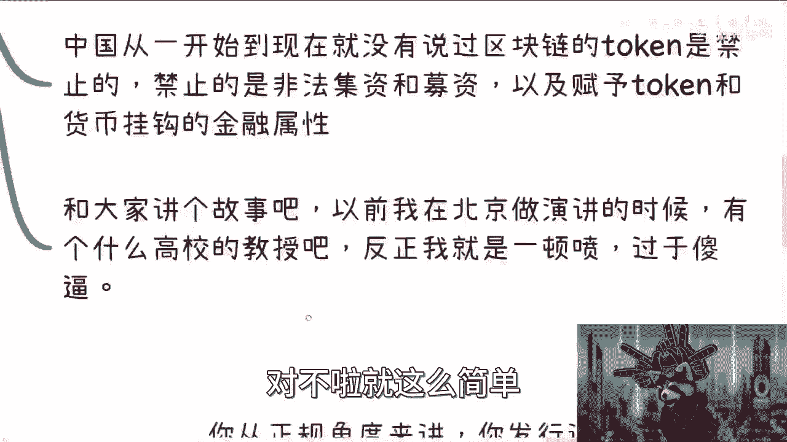

睁眼说瞎话，我跟你们讲啊，然后再回过头来看看对吧。

中营这个事对吧，你从正规角度来讲，你发行证券，你可以理解为是金融衍生品，是一种数字化的产品，那么本来香港去年就已经发行了啊，就已经发布了这个宣言，那你于情于理可以发呀，没问题啊，对不对啊，没毛病啊。

然后第二个这个事你从我来看，我早上瞄了一眼对吧，因为有推送嘛，我早上瞄了一眼，他也就是个屁呀对吧，就是对我来讲，你让子弹飞，你飞个一年两年再说吧，你说至于未来怎么样，有多少人关心，没人关心对吧。

很多事情我跟你们讲，这个发展到现在你们还不知道吗，很多事情他就他妈的是个屁啊，就是很有可能过了N年，他他妈还是个屁呀，怎么了呢，对不对，那不用激动啊，不用不用那个什么，反正就观观察着对吧。

而且这个token，他也没有说直接跟法定货币挂钩啊对吧，也没有说直接怎么玩啊对吧，也没说这个这个怎么比例啊对吧，很多人可能爽的就是说，他怎么在以太坊上面发，那又怎么样呢，HK发宣言的时候就说了。

我们支持虚拟货啊，不是我们支持那个NFT，我们也支持数字货币，那你在以太网上面发怎么了呢，对不对，他都已经发发行交易所牌照了，都已经可以支持虚拟货币的交易了，那他妈他在以太网发怎么了呢是吧。

他要不在以太网发，我才觉得奇怪呢，你说是不是哦，你只要愿意，谁都可以发，无所谓啊对吧，没有说，那从法律角合规角度没有说有问题啊，任何国家的CBDC都可以发，是不啦，第四个啊。

其实本质上token是避免不了的，但是呢哎呀我跟你讲很搞笑的，就真的我就发现很多年轻人啊，他他还说因为你们不知道，昨天晚上有人私信我，你知道吗，就说就问我，他说这个未来中国是不是区块链很有发展，说嗯对。

然后他就跟我说啊，这个东西是不是跟以后这个国内的芯片有关，我就一脸懵逼，跟芯片有什么关系啊，他说现在难道不是因为芯片问题，所以说这个没有挖矿，挖不过别人吗，哼你要么就说web3，你要么就说传销对吧。

你要么就就说割韭菜，你别说区块链跟区块链有什么关系啦，对不对，你要么就跟我说，你想发财十倍100倍，你就结束了，这他妈跟中国国内新品有什么关系，中国就算芯片超出整个全球，超出火球火星了，超出水星来了。

超出太阳系来了，也他妈跟挖矿没关系，我就这么跟你们讲，对不对，就这么简单，这事儿我跟你们讲，真的就人活在世界上啊，对这个世界毫无认知，对对政治也毫无认知，就感觉唉唉算了，不吐槽对吧，还是那句话啊。

现在的整个生态如果依然是这种受众，就永远所有的人看到痛痛就想着发财，想着100倍十倍200倍，如果一直这样的话，这个生态永远发展不起来的，你们别想了对吧，别一边在那边说自己想买token啊。

自己想在想在那边就投机取巧，然后还一边在那边问哎呀，这个现在什么时候发展起来了，这个未来能不能发展发展，你妹要么发展，对不对啊，这是第一个，第二个是什么，就是你token跟智能合约。

嗯我的小浣熊怎么脱钩了，诶呜呜呜，怎么回事，垃圾，唉呀，啊好了好了好了对吧，你token跟智能合约是好的啊，我也认为是好的，但终究还是要被这些镰刀割韭菜玩坏，因为到现在为止，我不是说了吗。

有多少人能明白这个东西，能有多少人能理解这个东西啊，都以讹传讹在前面说啊，这东西不好，这个东西违规违我一个魅影对吧，然后你问我未来有没有发展，我跟你说，这就看到底什么时候生态变好了。

这就看这些投机者什么时候离场，知道吧，这就看这些镰刀什么时候割完，对不对，就这么简单哦，你现在就这么一个生态，还指望他好，怎么个好法啊，整个中国到今天对吧，很多人说爱区块链发展慢，区块链发展不起来。

他妈的你们也不看看他们发展慢，发展不起来，他妈因为学的关系啊啊，就他妈因为基本盘太大，太多，他妈才发展不起来的呀，啊你但凡但凡少点人对吧。

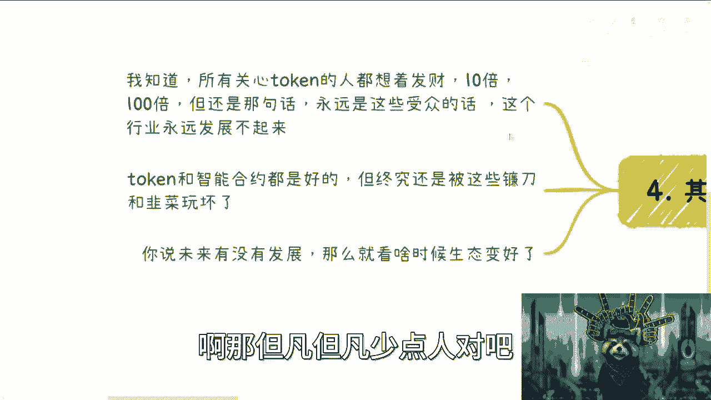

在这边投机取巧，多点人能够明白它的本质会发展不起来了，莫名其妙。

真的是对吧，所以我跟你讲啊，发行token。

这是一点问题都没有，不要去想这么多啊，而且这个生态没有这么快好的，从目前来看还是一个韭菜，还是个镰刀的生态，还是一个传销的生态，就这么简单，就是一个庞氏骗局，整个web3全是庞氏骗局，就这么简单对吧。

你要说有人在不在做事，我相信有的，但是他很苦对吧，而且真正做事情那些人我跟你们讲，你们去看对吧，对区块链也不了解的，对金融也不了解的，其实都是他妈半瓶水，对吧，就说白了就是说产品既不解决痛点对吧。

也没有真正的需求，自己YY出来的需求，自己YY出来个痛点，然后就开始发币，发币之后就他妈开始募资，就这么简单，还说什么生态啊啊，说什么发展有什么发展啊对吧，那今天给你们200倍叫发展，明天他妈的没有币。

没没有零倍对吧，破发了对吧，这个这个叫什么，归零了就叫没发展啊，这他妈叫发展啊，这他妈叫传销，真他妈离谱。

好吧。

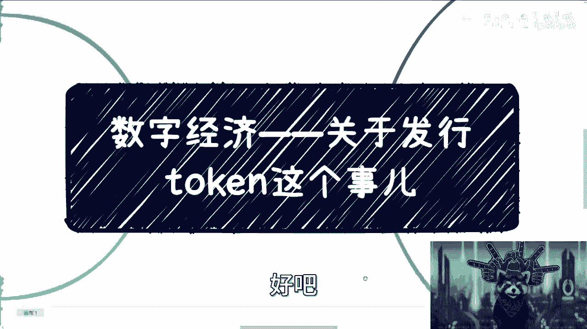

所以我跟你们讲就是这样子的啊，你就就我建议啊，就是你们要找我讨论，或者你们想想要真正发展，你们自己先学习再来找我讨论啊，不要拿那些有的没的东西，以讹传讹的东西来问我，好吧，我说不好听点啊。

我作为一个给政府做咨询，给给南大交大对吧，这边NBA上过课的人，我他妈都觉得我丢人，情商他妈芯片跟区块链，我真的是唉，我跟你讲，真的不拉黑已经是我最后的仁慈，好吧就这样吧啊那个关于token这个事情。

我觉得反正未来发展肯定是要要的啊，国内也会有的，我明确跟你们讲啊，一定会有的啊，但是是不是说像你们现在看到WB3这种用法，拭目以待对吧，走一步看一步啊，未来的事情谁都说不准，我也不是一棒子打死。

但是绝对不会就是我可以打死的是什么，就绝对不可能像web3现在这么发展啊，就这么简单好吧，嗯行了，就这么着吧。

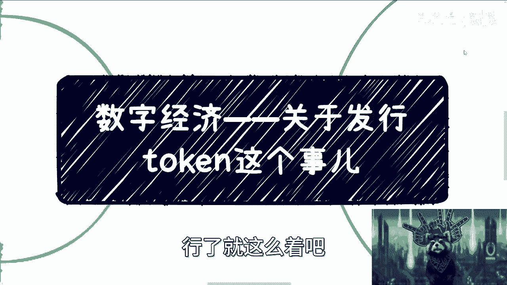

好吧。