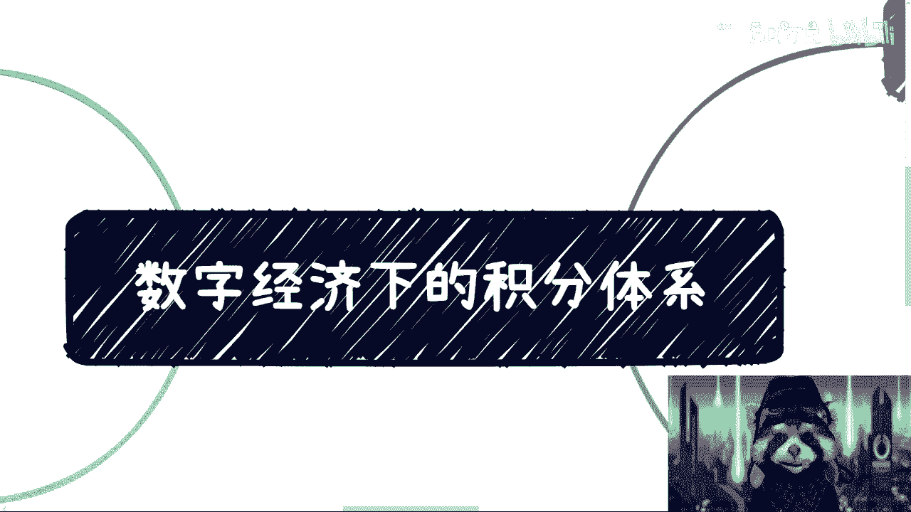
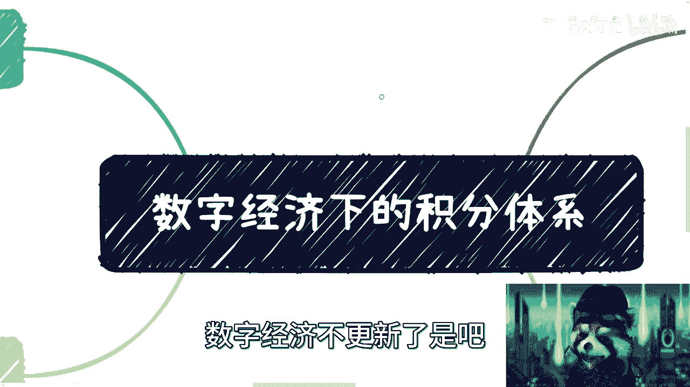
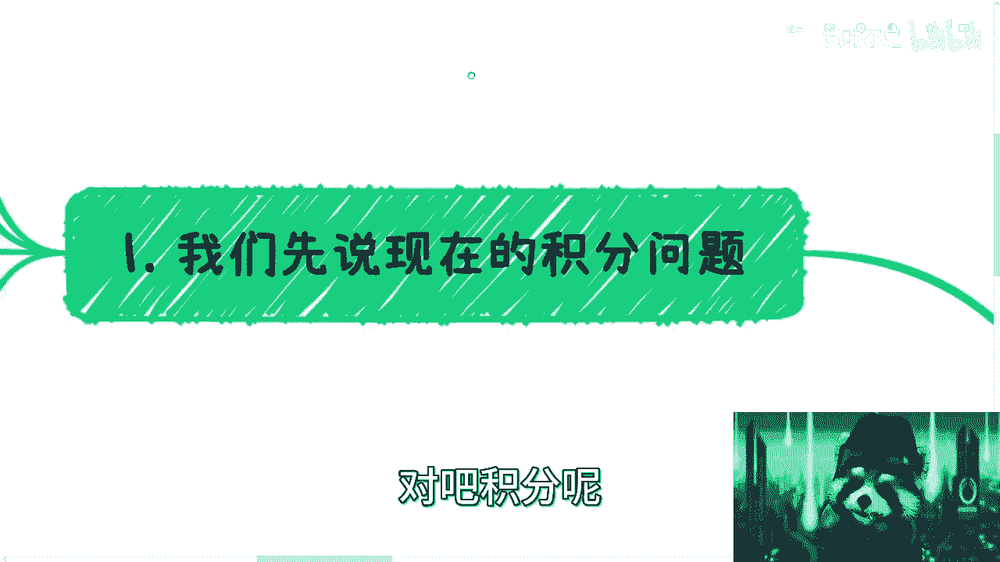

# 数字经济下的积分体系和其场景 - P1 - 赏味不足 - BV1rT411b7LY

好各位小伙伴大家好啊，这个对吧，我我把这个小浣熊放到右下角了，因为有小伙伴反馈说很容易挡住字是吧，我也觉得唉我也发现很容易挡住，我这个头为什么歪了，稍等啊啊好了好了好啊。

那么还有很多人来问啊，数字经济不更新了是吧。

来更新更新了更新了啊，我这个今天有点晚。

先更新这个积分的问题，因为上次我们说了这个通证嘛对吧，积分呢现在是这样子的啊。

我们先说现在这个积分问题之前呢，我们也都提过对吧，就是这个烂发啊没有实际的一些作用对吧，这个是一方面啊，呃对我要开始讲专业的东西，妈的每次讲专业的东西没几个人看，你知道吗，第二呢就是说呃。

现在积分呢最多也就是商城的兑换啊，哦我这个地方提议者啊，就是大家看数字经济，这个时候尽量把合集里面的东西都看一下，因为我所有的内容前后是有关系的哦，它不是一个独立的东西。

因为独立的东西你去看可能你看不懂好吧，呃然后呢就是说这个商城兑换呢，其实换不出什么东西来，大家也都知道嘛对吧，那么第三呢就现在流行的话呢，是积分加钱的方式，就比如说啊什么2万积分加299对吧。

什么吸尘器对吧，加199什么东西啊，但其实你们会发现呢，就是这些东西，你们到淘宝或呃闲鱼上或者其他地方去看呢，其实本质上价格大差不差，所以说呢就是说你会发现就是嗯也就是个幌子，你知道吗。

那积分可能本身也没有太大作用，嗯但是本质上来讲啊，我们说这个东西一直存在到今天，就一定是有他的这个意义的对吧，那所以说呢并不是说它不重要啊，其实是一个非常重要的一个经济模型当中的，一个环节啊。

但是呢就是说呃没有被很好的利用起来啊，积分呢它既是一个轻量级的一个激励机制，就是能够促进用户去使用啊，包括去消费对吧，那么又能够呢跟别人啊，什么叫跟别人哎呀我傻了，跟企能够和其他的对吧。

能够跟这个其他的这个经济资产呢做数字资产。

做这个挂钩啊，但这个我们后面会讲的啊，嗯这是第一点。

第二点呢就是新的这个积分系统啊，我们来讲啊，首先呃有几种可能性，因为我现在也不清楚嘛对吧，第一种就是说啊，很有可能是互联网跟区块链系统，的一个双层架构，也就是说两层都存在啊，那么底层可以是互联网。

区块链，可以是上层是吧，或者上层是互联网，底层是区块链，无所谓啊，可以用来做这个数据的一个记录对吧，这是第一块，第二块呢就是说呃，互联网系统跟区块链的智能合约，所生成的一个双积分模型。

也就是说因为原本啊非常多的生态，你不可能完全使用过新的生态去替换它嘛，那么这个时候就会出现一种，就是说互联网的生态跟区块链的智能合约，所生成的这个积分生态并行的这么一个生态，那么这种生态呢就是说呃。

做的时候也有很多种方式嘛对吧，第一种就是啊两者可以仅仅是一种兑换的关系，第二种呢就是说在后台的这种啊，这个这个这个技术当中啊，我们可以把这两者两者去做一种映射的关系啊，也行啊。

反正就是这个就是看具体的业务业务形态了啊，然后呃还有一种呢就是说啊，最终呢可能会把比如说互联网的这种系统啊，老式的这种积分啊全部替换掉，但这个你说可能这个得花很多年啊，花很多年。

那么最终呢就是说区块链智能合约啊，这边这个所生成的这么一种积分系统啊，那么从宏观上角度来讲呢，就是，啊这样就不会挡下面挡无所谓啊，从宏观上角度来讲呢，就积分也是一种数字资产啊。

就是在链上它一定也是一种数字资产，只不过呢他没有直接的金融属性啊，就没他没有直接跟金融去挂钩啊，这种资产，那从整个经济形态跟经济模型上面来讲，这种资产一定是存在的对吧，你不能说哦。

我今天所有的这种资产全部跟金融挂钩对吧，我我这个没有这种轻量级的这种啊，激励积分或者激励资产，那么这样的话呢，其实就等于说用户想要去拿到这种数字资产，成本会很高，或者门槛会很高。

那这种呢也不不是非常适合，促进整个经济的一个发展，或者来说呃资产的一个流通，那么我们说呃新一代的这种这个数字经济，数字经济下的这种积分能解决什么问题呢，好我们来看啊，首先第一个就是这个积分的滥发对吧。

这个肯定是能解决的，因为你通过练通过合约这个东西它是公开的啊，就是理论上啊他的这个发行方，他的用户应该都能够看到，就是别的啊，我们说一些跟商业机密有关的东西，他看不到。

但是积分本身的这种总量和它的流通记录，他应该是能看到的对吧，这是第一点啊，第二点呢就是它的一个积分的记账对吧，那么这个东西呢就是原本是中心化的记账，那接下来就是多中心化，或者来说链上的记账。

那么这种相对于不管是对于用户也好，还是对于这个呃商家也好啊，或者主体也好，它都是非常相比现在的这个互联网的主体来讲，来得安全啊，那么第三个呢就是记账的这个数据安全啊。

因为本身链上的数据呢它是有这个叫什么，就是那个加密学来做数据涨数据安全把控的嘛，那么不管是整个链的溯源也好，还是练的这个记账的数据安全也好，都会比现在中心化的数据来的嗯，来的更可信啊。

因为在这个事情上面也很简单嘛，因为你中心化的平台很多数据说改就改对吧，那呃改了之后我也可以不留记录对吧，那你说改了之后，是不是一定要到网信办或者别的地方，就是有这种有这种方式嘛，也不见得对吧，也不见得。

所以说很多东西就是一种糊涂账对吧，就是大家说不清楚，那么这个呢其实在未来肯定是要解决掉的，你否则说白了积分这个东西做的再好对吧，你回头只要这个东西乱发，只要这个东西数据不流通，只要这个东西不可信。

那回头还是没有人会用啊，那么呃还有呢，就是最重要的是整个积分的一个流通，就是通过啊数字经济的这么一个积分，他一定是会增加它的流通性，这个事情呢啊这个事情呢我们后面会来讲的。

就是整个呃例子当中我们会来说的啊，那么还有一个呢，就是它需要是天然的，跟其他金融属性的资产做流通，呃，但是我们说到这儿啊，我们想想看啊，就是这两点啊，我们假设现在互联网的积分啊，就要解决两个痛点。

那为什么不能解决呢，是因为互联网现在最大问题是你要增加流通性，它就要增加你销售，就要增加你去商务，你你要去攻克商务难关，销售难关这么一个瓶颈，这么一个门槛，但这个门槛是很高的对吧。

而且来说如果我是一个商家，或者我是一个主体，你来跟我说，你要流通对吧，那我肯定会问你，我为什么要流通，我流通的目的是什么，我流通的好处是什么对吧，你很难去解释这件事情对吧，而且你流通的本质还要去打通。

你的背后的这个系统对吧，成本其实很高是吧，那第二点是什么呢，就是需要天然的跟其他的金融属性资产做流通，那么做流通这件事情呢又来问题了，就是我就算今天可以做流通啊，那么你会发现你的资产就是你的积分。

资产用的是系统a对吧，其他金融属性资产用的是系统b系统c系统d，那你把这两个毫无关联的系统要去做挂钩，要去做流通，我就问嘛怎么流通，怎么挂钩，那大家背后的数据库这个表怎么建是吧，你你你你你谁来维护是吧。

你说我来维护吧，你不信啊，你来维护吗，我不信你找一家第三方担保机构维护吧，我们都不行，那请问怎么搞嘛是吧，那做事情大家也都知道啊，我我觉得我觉得大家要明白一个本质啊，技术永远不是问题，问题永远是商务。

永远是信息，安全永远是钱啊，这是问题，那么我们说它最终不能流通的原因是什么，原因就是ok啊，我们不可信啊对吧，我就问你们这找谁写信是吧，那么你只要有人不可信，只要有企业不可信。

那么你这个盘子就很难做大是吧，好那么接下来我们举个例子啊。

我们随便举个例子啊，随便举个例子，比如说比如说现在的停车场，各个停车场都有积分，那当然有的没有积分啊，无所谓啊，无所谓不重要啊，假设我们各个停车场都有积分，但是现在各个停车场的积分。

不要说他们之间不互通，甚至跟他们所在的商超都是不互通的，对吧好，那么问题来了，他们相互不互通，和商超不互通的问题到底在什么地方，请问是技术问题呢，还是说停车场不愿意呢，这个还是说商超不愿意呢。

还是说各个停车场的这个服务公司之间，自己不愿意呢，还是最后他们吃动力不够呢，对不对，就你会发现什么问题，首先你技术是问题吗，不是对吧，他们自己不愿意吗，也不一定对吧，你最终驱动力不够吧，可能驱动力不够。

但是你说它最终的核心原因是什么，是我就问我能不能赚钱对吧，我投入比如说我投入50万改造这个系统，可不可以，可以的，那请问我能赚多少钱，你能不能说明白这个问题，说不明白，对不对，因为本质上线到今天为止。

大家也都知道，积分这个东西是为了鼓励用户去做某些行为，或者做某些消费的，对啊这没错啊，但是问题是用户现在已经知道了，就是我要这些积分积分有差用是吧，你就像我现在我作为联通的什么五星级vip用户。

我有很多很多积分，那积分后面无数个零是吧，那我有什么用啊，我也不知道有什么用切我说不好听的，你说你让我到这个这个这个这么商商呃，电商里面去兑换，没有一个我想要的呀，而且我说从我自己来讲。

我也觉得你兑换出来这东西，可能跟拼多多上面买出来差不多的是吧，那那我去买它干嘛啊，那么这个就是说本质上的问题啊，那么这个时候呢我们可以这么讲啊，首先数字经济新一代的这个积分呢，它可以大家一起维护对吧。

也就是说不管是那个停车场与停车场之间打通，还是停车场与商超之间打通，大家可以同时维护，谁都不是主体，谁也都是主体，信息安全是可以保障的啊，信息的信任度也可以保障的，那么这个时候就是说不会存在谁和谁扯皮。

也不会存在第三方的担保机构对吧，那这是第一点，第二点呢就是说信息本身也不是说都互通的，我们可以根据不同的业务进行数据的加密，对或者说数据的隔离对吧，那么这个就是说能够满足大家在商业化。

能够保护自己数据隐私的这么一个要求对吧，那么第二点呢，就是说积分本身，我们是可以通过底层的天然的流通，或者跨平台交易，这句话是什么意思呢，就是说因为为什么啊，因为新一代的数字经济的积分。

它全部是通过智能合约来生成的，那么通过智能合约来生成的话，那么它在整个技术层面啊，我们说未来比如说跨链也好，或者侧链也好，或者别的一些方式也好啊，就是它可以通过底层的一个天然的一个呃，通用的环境。

因为既然你都已经是智能合约生成的，那么你当大家其实都是平等的嘛，就不存在谁是主体，谁不是主体嘛，对不对，那么既然是一个通用的一个天然底层，那么这个时候它在整个链上也好。

或者来说在数据库里面的这个存储要去流通，要去做记录，甚至跨平台交易，它就会变得通顺，因为呃或者说变得比较比较比较畅通，因为你现在纯中心化的平台，每个人用的架构都不一样，每个人的积分生成方式也都不一样。

每个人的积分的所使用的表也都不一样，那这个东西是很难制作流通的对吧，那么以后全部都是使用智能合约的话，那虽然链可能不同，就是底层的这个记录方式，或者是底层的共识机制可能不同。

但是它通过智能合约所生成的东西，是会有一定标准的，那或者说它是有个过程，就慢慢慢慢是会统一化的对吧，那么这个资产它的流通就会变得相对，比较平滑啊，而且在大家这个互通的时候，它的成本就会相对比较低。

不管是沟通成本还是这个叫，只要技术成本都会相对比较低，对吧，那么我们来看最后一个呀呀呀呀呀，点错了点错了，啊那么来看最后一个，就是同时呢这些积分在未来是可以天然的啊，和其他数据资产做兑换。

也可以产生更多的金融玩法或者经济效应，为什么呢，是因为以后的数据资产也是在链上产生的，也是在智能合约上产生的，那么只不过它拥有金融属性啊，或者说我们从从法律角度，从各个的框架业务角度赋予它金融属性。

那么它由于的两边都是从这个智能合约产生的，那么自然而然它肯定是能够天然去兑换对吧，那当然了，这个兑换本身你说怎么兑换，兑换规则，他肯定也是要有一定的法律依据对吧，或者说呃业务行业航标啊对吧，团标啊。

国标啊肯定也未来也都会有啊，但是这个它能够你就会发现它能够给予积分，带来更多的，衍生出更多的金融玩法或者经济效益对吧，那我们随便举个例子，比如说你今天这个积分是一个积分对吧，你未来我们说啊。

我们可以跟啊，这个比如说呃，某某某金融的这个他链上的数据资产做兑换，只不过呢这个兑换可能有一定的门槛对吧，但是你可以兑换啊，好然后呢这个资产有什么用呢，这个资产可能就跟早期的余额宝一样。

你可以带来很多的利益对吧，比如说你直接可以抵押生成数字人民币啊，或者怎么样怎么样等等等等等等，那么你这个时候你就会发现，积分是整个金融体系金融模型的底层，但是它已经能够带动整个金融的生态了对吧。

金融生态了，他也能带动老百姓的一个一个一个创造激励，或者说能够带动一个一个激励模型对吧，那么它就会跟现在会有很大区别，那么这个时候呢我们说到这儿，有小伙伴要问了，他说本质上啊其实现在也可以做。

你说现在能不能能不能做，可以做啊，不是不能做啊，但是我跟你们讲，为什么现在没有左，是因为啊嗯很多时候不能做，不是技术不能做，不是业务不能做，而是没有很好的法律框架或者技术框架。

或者通用的一个综合性的东西来约束它，你明白吧，因为本身金融这个东西啊，发展到今天，你们应该也明白，就是单纯的通过法律框架去约束，是很难约束的啊，历史上也就有非常多的例子了对吧。

那么为什么数字经济上这些东西就能够做的，是，因为区块链和智能合约，有很好的技术底子来做约束，那既然如果技术上能约束到了，那么再加上法律的框架的约束，那么双管齐下，整个这个生态就可以用了。

不是说这个生态不能用啊，而是说这个生态当下，他没有办法进行很好的约束，那么自然而然就不能放开啊，但是一旦某个时间点，它能够很好的约束，自然就会放开对吧。

那么ok那么我们回到回到这个地方啊，我回到这个地方就是啊我一开始就说了。

就整个讲述的经济呢，其实说就看的人很少，但是呢我跟你们讲就很奇怪的，在哪里呢，所有人都在问我，增量市场在什么地方，我就跟你们讲了，这个就是增量市场，但是关心的人很少，你知道吗，就是就人就这么个生物。

行吧就这么着吧，好吧，回头我会把其他的体系，反正一个个都讲下来，因为就跟上次的通证把它拆分开来说嘛，对吧，因为，别的我嗯怎么说呢，就是说他面很大，但是我我也不是先知是吧，我也不能知道未来到底怎么发展。

我只能把我能知道大概知道的对吧。

