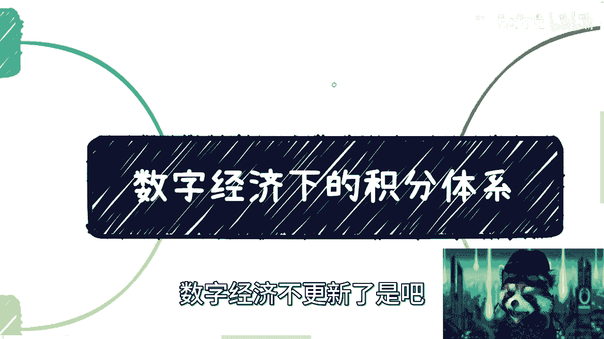
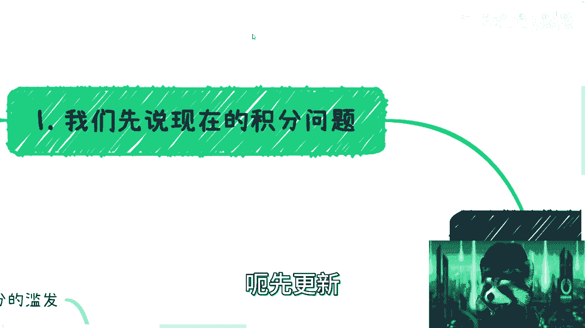
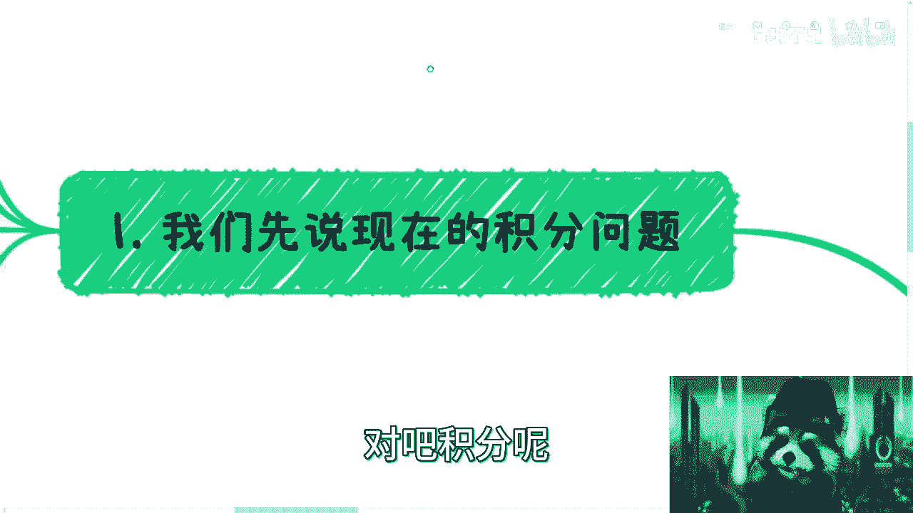
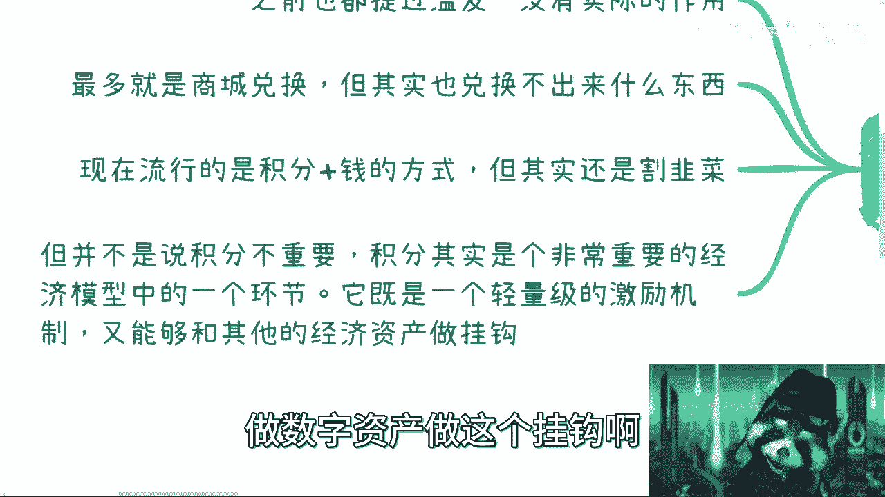
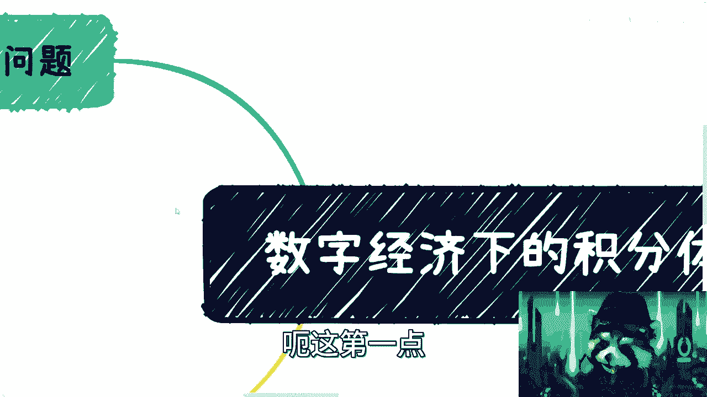
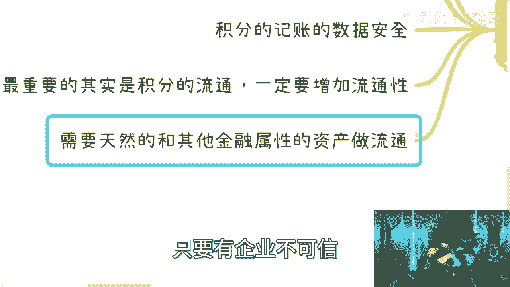
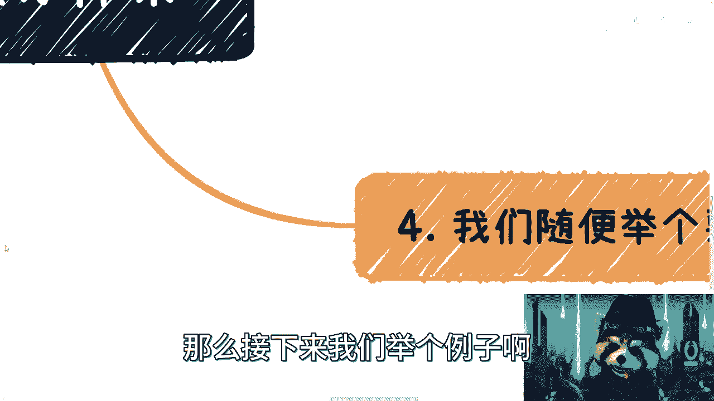
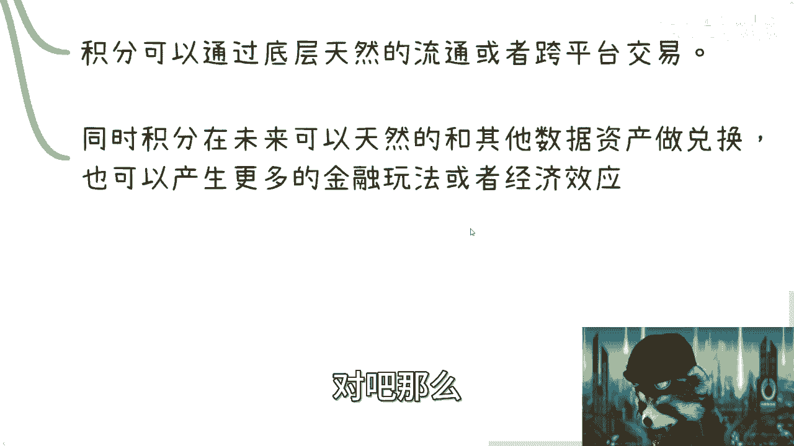
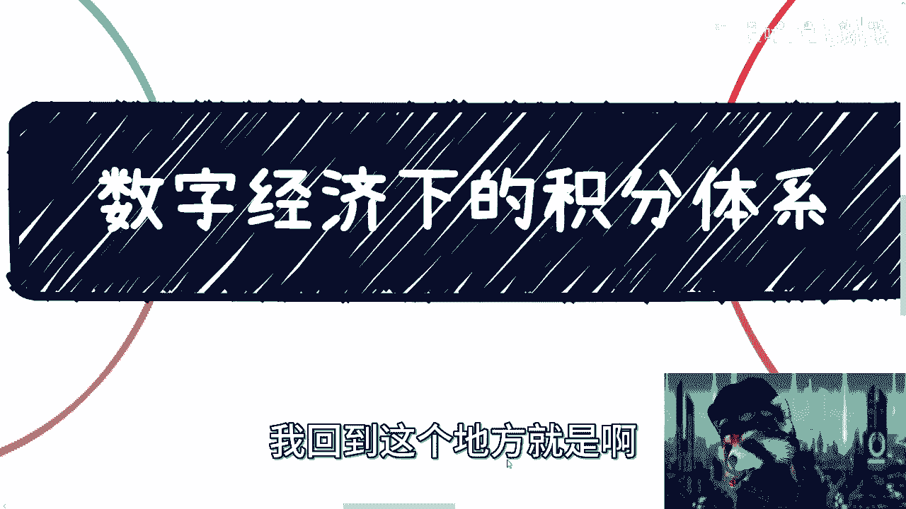

# 数字经济下的积分体系和其场景---P1---赏味不足---BV1rT411b7LY

在本节课中，我们将探讨数字经济背景下的积分体系。我们将分析传统积分系统存在的问题，并了解基于区块链和智能合约的新一代积分系统如何解决这些问题，以及它可能带来的新机遇。

---

## 传统积分系统的问题

上一节我们介绍了数字经济的宏观背景，本节中我们来看看当前积分系统面临的挑战。传统的积分系统主要存在以下几个问题：

以下是传统积分系统的主要痛点：

1.  **滥发问题**：积分发行缺乏透明度和约束，导致其价值被稀释。
2.  **用途单一**：积分通常仅限于在特定商城内兑换商品，而这些商品往往缺乏吸引力或性价比不高。
3.  **价值存疑**：流行的“积分+现金”兑换模式，其实际优惠力度有限，积分本身的价值感不强。

尽管存在这些问题，但积分作为一种轻量级的激励机制，在促进用户活跃和消费方面依然具有意义。它的核心价值在于能够与其他数字资产进行挂钩，只是目前尚未被有效利用。

---

## 新一代积分系统的可能性

既然传统积分系统有诸多不足，那么新一代的数字经济积分系统应该如何构建？接下来，我们探讨几种可能的技术架构。

以下是几种可能的实现方式：

1.  **互联网与区块链的双层架构**：系统可以同时包含互联网层和区块链层，两者协同工作。区块链层可用于记录关键的、需要可信存证的数据。
2.  **双积分模型**：在过渡阶段，可能出现传统互联网积分与基于区块链智能合约生成的新积分并行的模型。两者之间可以建立兑换或映射关系。
3.  **全面替换**：从长远看，传统的中心化积分系统可能被完全替换为基于区块链智能合约的积分系统。在链上，积分本质上也是一种数字资产，只是不具备直接的金融属性。

这种轻量级的激励资产对于降低用户获取门槛、促进经济活跃度至关重要。

---

## 新一代积分系统能解决什么问题？

了解了新系统的形态后，本节我们具体看看它能解决哪些核心痛点。

新一代积分系统主要从以下几个方面带来改进：

1.  **解决滥发问题**：通过公开透明的智能合约发行积分，其总量和流通记录对相关方可见，增加了约束力。
2.  **改进记账方式**：从中心化记账变为多中心化或链上记账，对用户和商家而言都更安全、可信。
3.  **保障数据安全**：利用密码学技术保障链上数据安全，其不可篡改和可追溯的特性，比中心化数据库更值得信赖。
4.  **增强流通性**：这是最关键的一点。新系统能极大提升积分在不同场景间的流通能力。
5.  **实现资产互通**：积分需要能够天然地与其他具有金融属性的数字资产进行兑换和流通。

当前互联网积分难以流通的核心障碍并非技术，而是商务合作中的信任、数据安全和改造成本问题。例如，不同停车场、商超的积分无法互通，根源在于各方缺乏共赢的动力和可信的中立技术平台。

---

## 新一代积分系统的优势与前景

那么，基于区块链的积分系统如何具体克服上述障碍呢？本节我们来分析其内在优势。

以下是新一代积分系统的核心优势：

1.  **共建共治，提升信任**：积分系统可以由多方共同维护，没有单一的绝对控制方。这解决了商务合作中的信任问题，无需依赖第三方担保机构。同时，通过技术手段可以实现数据的隐私保护，满足商业保密需求。
2.  **底层互通，降低流通成本**：由于积分均由智能合约生成，它们在技术底层具有同质性或标准化的潜力。这使得跨平台交易和流通在技术层面变得顺畅，显著降低了不同系统对接的沟通成本和技术成本。
3.  **开启更多金融可能性**：未来的金融属性数字资产同样基于智能合约产生。积分与这些资产具备天然的技术兑换基础。在合规框架下，积分可以衍生出更多金融玩法，例如兑换生息资产、作为抵押品等，从而成为激活更广泛金融生态的底层激励工具。

有观点认为，这些功能在技术上现在也能实现。但关键区别在于，区块链和智能合约提供了**技术层面的原生约束能力**，结合法律框架，可以形成“技术+法律”的双重保障，使得这类涉及价值的复杂生态能够安全、可控地运行。

---

本节课中我们一起学习了传统积分体系的局限，以及基于区块链的新一代积分系统在解决**滥发、信任、流通**等问题上的潜力。它通过**智能合约**实现透明发行与记账，并通过技术上的同源性为跨场景流通和与金融资产互动奠定了基础。这或许正是数字经济中一个重要的增量市场方向。

---
**课程来源**：数字经济下的积分体系和其场景 - P1 - 赏味不足 - BV1rT411b7LY