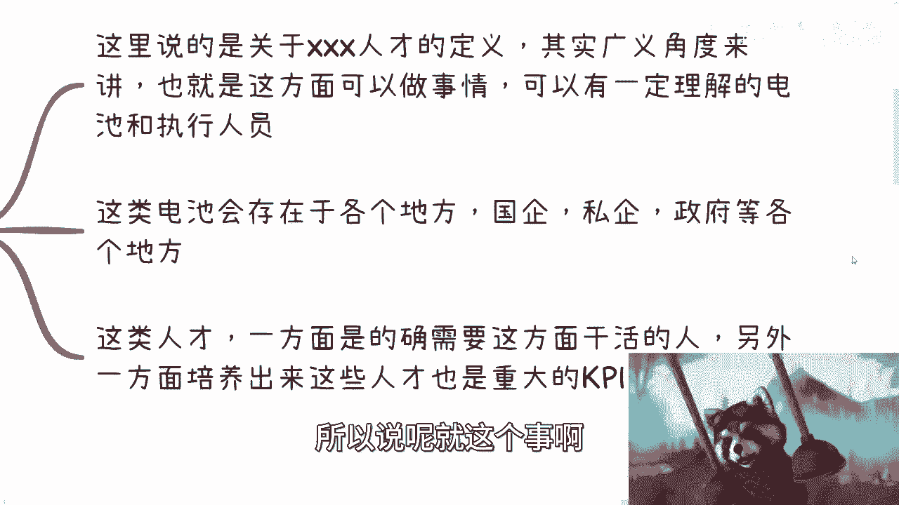
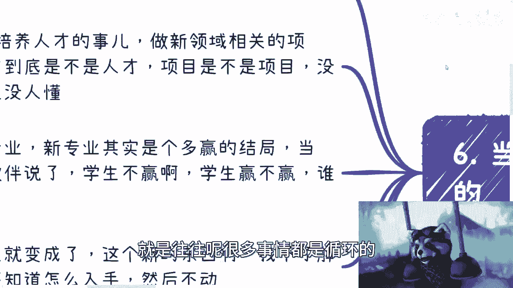

# 数字经济专业和数字经济人才培养 - P1 - 赏味不足 - BV1wh4y1j7nV

好各位小伙伴大家好是吧，呃我们这一期呢还是回归到这个数字经济啊。

这个专题啊，人才培养，因为今天我看到群里面正好在讨论嘛，就关于这个AIGC啊，这个相关的这个人才培养啊，人才培养跟那个叫什么技术创新啊。

我们来看一下啊，首先呃我们来说这么几个问题，第一个呢就是说你说数字经济人才啊，怎么定义数字经济人才，第二呢就是广义角度啊，数字经济的人才培养为什么近几年来很难哦，非常难，这个不单单是数字经济。

你们会发现新的领域都很难啊，那么第三个呢，就数字经济这个人才到底重不重要，嗯第四呢就数字经济人才，是数字和数字经济专业是什么关系啊。

我这个打错了啊，什么关系，首先啊。

我们先说怎么定义这个数字经济的人才啊，那么我们在这个地方这么说，不管是不是数字经济啊，就整个新领域的一部分的这个，这小浣熊哎呀识别有问题，就是不管是不是新领域的啊，这些啊就是你会发现关于人才的定义呢。

就是我们先从广义角度来讲，广义角度来讲呢，就是说在这方面可以做事情对吧，可以有一定的理解啊，也就是说你跟他讲了一些数字经济相关的东西，他不需要你跟他解释对吧，也或者说从上级到下级。

整个过程当中的一些沟通啊，大家至少能一些没有障碍的沟通啊，你说呃今天有个数字经济的这个人啊，他事情做的怎么样，咱先不去说他啊，但是至少咱们说在这个沟通当中啊，不会有太大问题。

那么也就是说我们从数字经济人才，广义角度来讲，我们需要的什么呢，我们需要的是有一定理解力啊，同时呢对于这个东西要有一定的掌握的，电池和执行人员啊，叫做执行层面的这个人员啊，这第一点，第二点呢。

就是说这一类执行人员或者电池呢，存在于各个地方啊，就是说国企啊，央企啊，私企啊，政府啊对吧，等各个地方啊，那么第三方面呢就是这里的人才呢，就是一方面啊，的确我们说事实实事求是来讲。

是需要这方面的干活的人啊，另外一方面呢就是这方面啊，就是另外一方面，就是培养出来这些人才也是重大的KPI，也就是说包括今天我在群里面回他们的，就是说嘛就是说啊你说数字经济人才。

AI经济人才重不重要重要啊，但是培养这些人才，或者说要告诉大家，我们要培养这些人才这么一件事更重要，因为这个事其实是真正的KPI之一，至于你说培养出来怎么样的人才，这个没KPI没有细到这个程度啊。

大家能明白吧，啊所以说呢就是呃这个是关于人才啊，广义上面对于人才的定义，那么说到这里呢，就是也有小伙伴会问吗，他说那驴老师，你之前也说的很清楚对吧，就是数字经济往后啊，这个在一定的时间里面。

他的就业岗位其实不会那么大哦，那么为什么我们说培养人才，又变成了重要KPI之一，因为本身这两件事情并不冲突，为什么呢，因为培养人才跟就业岗位，他没有说过有因果关系，对不对，就是说我们无论从哪个政策。

或者从哪个切入点来讲，比如说啊我们说一年啊培养出来啊，比如说每个地方啊，比如说培养出来1万个人才，但是也没有人说过，这1万个人才的就业率要百分之百啊对吧，从单纯从KPI角度来讲，这是两条线的事情啊。

就业观，就业人才归人才，对不对，那人才出来没有说一定要就业，包括就业的也不一定是人才，这无所谓啊，首先这是第一点，第二点是什么呢，就是说从就业本身来讲，他的确也不会很多，但这个不会很多呢。

跟政策没有关系，主要还是因为就是嗯，C端市场和企业对于这个东西需求没那么大，因为本身岗位岗位这个东西要有，他得产生利益价值对吧，因为企业都是资本家，在没有产生利益价值之前，他是不可能去开一个岗位。

去去去招一个人，因为很简单嘛，就是当他没有想明白一件事情的时候，我开个岗位招个人，就是纯投入，那么纯投入是什么，就是亏本买卖，亏本买卖谁会做啊，对不对啊，所以说呢就这个事啊。

就是它只是在不同的层面啊，大家不要太就说嗯叫什么，就是就比较单纯的去理解这个事情。

那么第二点呢就是关于广义上面来讲，数字人才的培养啊，为什么非常困难这个事啊，呃好多年了嗯，为什么呢，因为你会发现哦，从C端的角度来讲，本来就是从基本盘的这个比例来讲，它就没有几个人会听到过这些新的词。

你知道吧，就包括最近就是咨询我的人里面，你比如说你跟他们讲区块链，他可能还还听到过一点，你跟他讲元宇宙，你跟他讲元宇宙他就不知道了，你知道吗，哦所以说就是就单纯这个东西就比较那个啊。

那么你根本就没几个人听到过，也没几个人去理解，那更别说去参与了，对不对，因为你人才人才培养要一方得要有培养，对不对，另外一方得要参与对吧，那你现在这一方参与方他就已经就是卡住了，对不对，那这是第一个。

第二个呢就是说从C端基本盘来讲啊，大家大部分无论是在经济好也好不好也好，就基本上来讲它都是守住自己有的东西，你就打比方说他一年可能就赚10万块钱对吧，他虽然一直说啊说啊，我要这个赚30万，赚50万。

赚100万，但是你让他真的迈出去这一步就很难，就很多人他是有未知的恐惧的对吧，你让他守住已经已经有的东西，他自己就不会再去想，也不会愿意去扩展性的东西，然后为什么不愿意呢，他会跟你说出一大堆理由。

就像我前两天说的那个视频，就是说束缚住，就是你如果今天说一个问题啊，说一件事情呃，你去分析一件事情，你可以通过你的YY啊，通过你的这个天马行空的想法，去幻想出1万种问题，但是你可能根本想不出来。

这1万种问题的解决方案是什么，那么这个时候你就会发现哦，我想做一件事情啊，这个我前面有1万个问题等着我就很恐惧对吧，然后怎么样，但是你们要明白一点，就是我觉得那个之前有一个一本书，上面写的很清楚。

叫什么叫做除了生老病死以外，所有的恐惧其实都是不存在的，就是或者说所有的恐惧是你感受不到的，都是你自己给你自己强加上去的，你就像很多人跟我，我跟他们聊事情也是的，就是他们会问我，他说他说哎呀。

这样子会不会做有风险，哎呀那样做会不会怎么样子，哎呀这样做会做，这不是我，我说你们是之前有发生过风险的，还是自己经历过啊，亲亲自经历过还是怎么样子，我说大部分情况是你们都没有经历过，全部都是道听途说。

你知道吗，然后就开始说哎我担心这个，我担心那个有什么好担心的，干就完了呀，有啥好担心的，你知道吗，那么这个是这个C端所面临的问题，那么你从各个地方政府来讲呢，是这样子的啊。

各地方政府呢你别说数字经济了啊，但目前连区块链，元宇宙可能是啥都还没搞清楚啊，还没还没搞得7788啊，那么你更别说啊，比如说他们说哎有一套完整的这种培训方案啊，对吧，或者人才培养方案啊，或者什么东西。

你哪哪里来了对吧，再加上啊我这个政府做事情的节奏和态度啊，这个这个频率啊，包括他们的这个这个事情，你会发现一年一年就过去了，就是就是今年提了一个东西好审批对吧，到写方案啊，到这个落实啊，到签合同。

到往后等等等啊，到到到披露对吧，到到公开招标对吧，反正你们两三年过去了，对不对啊，但是你要明白啊，就是各政府做这个东西，你你是按照这个节奏走的，但是真正市场上的东西不是这样来的。

市场上现在越来越快啊对吧，那高校也是一样的啊，高校呢应该是社会化人才培养最多的一个源头，好一个产出点啊，但是高校有个问题是什么呢，就是高校基本上是不知道市场要什么的好，他只知道在大战略要什么。

但他不知道市场上要什么啊，你就你就比如说你跟他讲，你说哎我们要数字经济人才嗯，对没问题，战略上是这么讲的，对不对，但问题是数字经济人才，什么是数字经济人才呢，对不对，学什么东西呢，他得掌握什么东西呢。

一律不知道对吧，就是说这你跟他讲这四个字，他知道的啊，你但凡往下切他就不知道了对吧，包括你比如说要什么教材呢，要要要要有什么实训吗，要要要课程是什么吗，他不知道的。

这就好像这两年新能源那边的那个高校毕业，出来什么职校，技校和本科毕业出来一样的呀，我跟你们讲，你们去问问看那些学生啊，读了这么多年书跑出来啊，可能做的是什么售后对吧，或者是什么什么器械维修。

对吧或者怎么样子的，你就问他们啊，你们读书的这段时间里面有没有碰你手，有没有碰过新能源电动车，你有没有去修过，你有没有怎么样，有个屁对不了啊，因为为什么，因为理论跟不上，时间就更跟不上了对吧。

你校企合作，校企合作开设出了出来了很多专业，他本身也不接地气啊，啊这个企业企业过来他也不是很专业的对吧，高校高校也不知道怎么分辨什么是专业的，反正大家合作能干对吧。

所以说呢你说啊就基本上一年已经很快了对吧，再加上这两年疫情本来就更快啊。

所以说呢这个其实是就是就是基本情况两端，就是你培养一方面是培养方，另外一方面是参与方都有很大的问题啊。

那么这个是这个第二点，第三点呢就数字经济这个人才到底重不重要啊，你就这么来看啊，首先从政策上来讲，他一定是重要的，你从战略上来讲，他也一定是重要的啊，这些毫无疑问啊，那么从生态上来讲它也是重要的。

就像我们未来说唉，各个地方他一定要有这么一些人在的啊，他不可能没有人，要么就内部培养对吧，但你内部培养也叫人才啊，对不对啊，但是呢你会发现，其实每个新的领域都会有很多人才，就是他是个循环。

你知道吗啊历史总是重复的，你知道吗，就是说但凡你们这个能看到过很多历史，你就会发现每一次性的东西他都会有很多人才，有的人他就是从这个专业对口出来的对吧，有的人是自学成才，有的人是就是就是年纪一大把了。

摇身一变，马上变成人才，马上变成专家，你知道吗，就是哼就是今天AI火了好，他就是AI专家，明天区块链火了，他就区块链专家，后天比如说什么啊，这个什么挖矿火了，他就挖矿专家，你知道吧，再后天传销火了。

他就是传销专家，就是这样子的，你知道吗，就没有办法就整个行业，因为你会发现我们为什么说学生学校啊，包括就是打工都还是比较单纯的，因为你大部分都是在一个框框下面的，比如说高校啊啊比如说企业啊。

这个大框架下面的，你一旦到了社会上，到了商业里面，你就乱了，鱼龙混杂，那阿猫阿狗，三教九流，什么都有啊，对不对，你说你是人才，那他妈你对面100个人都说他是人才，你怎么说啊，怎么证明啊，对不对。

你越是证明越是证明不了，因为这就好像你在那个网络上，大家说什么网暴是一样的，你知道吗，就是你一旦从网络上去沟通，或者你一旦就是面临普罗大众都是陌生人。

说你去沟通，你就沟通不了了，对不对，因为对面人他可能有的就不想来沟通，有的他跟你就不在一个这个知识水平线上面，有的就是不在一个正常的三观下面，你怎么跟对方这么多人沟通啊，对吧啊。

到最后你自己逻辑就一团乱。

你知道吗，好那么还有一个呢，就是我们说啊数字经济专业跟人才的关系，就这个东西是这样子的，就是高校呢一定是要去做的，因为这个是大的战略对吧，那你做了呢，其实对于社会来讲，对于对于公司来讲。

对于整个商业来讲，其实就是大海捞针，就是比如说你培养出来10万人，对不对，那其实市场上实际上要的就是1万人对吧，那我就以1/10的概率去挑选里面好的人，对不对，反正人多，然后这个东西开了专业对吧。

它既能促进学校招生，又能够为社会，又又能够为社会做贡献对吧，的确商业上面也的确需要自贸这一方面的人才，那何乐而不为呢对吧，那当然你又要问我了，你说啊，那那那那剩下的9万人怎么办呢，对吧。

剩下的这些人怎么办呢，没人管，who care啊，输了，那那历史循环就这样子的呀。

没有办法的呀，对不啦，所以说我们来看最后一点，就是当然啊。

我们在这个地方，我在这地方写了，就是往往很多事情都是循环的。

就都是重复的，你知道吗，就任何一个新的东西出来，从上到下你去看啊，KPI导向做培养人才的事，做新领域相关的项目，你说人才到底是不是人才，项目到底有没有交付或者交付的东西，有没有价值，无所谓啊。

who care啊，你跟我说谁care，对不啦，这都没人关心你啊，你你你对不对啊，你难道你就跟我说啊，我一个省市区培养出来10万个人才，你还要让我我我就告诉你啊，我按照这个标准啊，发证书啊。

发出来就是人才，怎么了呢啊你非要跟我抠细节，谁来给你扣啊，对不对，这一方面，第二方面是高校开创新专业，新专业其实是个多赢的结局，你知道吗，就企业也赢啊，这个政府也赢，高校也赢对吧。

然后当然有小伙伴又要说了，他说学生不赢啊，学生赢不赢，谁关心，who care啊，Who care，是不是啊，这就本来就这个样子的呀，这个对吧，来要拎得清一点，你知道吗啊，然后到了个人这边呢。

就变成了就是说这是个新的东西啊，我不了解，就很多人会这么想，他说这是个新的东西，我不了解，我根本就不知道怎么入手，然后就不动了，你知道吗，就是他会跟你表达我很焦虑哦，他会跟你表达我，我不知道什么方向。

但是你跟他讲了之后，他会跟你表达自己很多YY出来的，这个天马行空的想法，然后跟你说我不懂对吧，然后继续抱怨啊，我不行啊，我觉得市场不行，你知道吗，这第一点，第二点呢就是说呃一个新的东西他会去想。

就是哎呀连我都知道，应该大部分人都知道算了，先别做了，我卷，不过别人，就是就是就是就是嗯没有任何数据支撑，你知道吗，就就那种感觉就是说哎呀我知道了，好像应该我知道的东西。

就好像是这个大部分人应该都知道了，我也不知道干嘛妄自菲薄，对不对，那么你就会发现其实就是所有的东西啊，其实出来若干年后，存量市场就已经很卷了，因为卷不动了嘛，对不对。

那么呃不管是企业要转型还是个人要转型，都会去转型，去迎合性的方向，那么你就会发现这些人到最后他还是只能付钱，做韭菜，没有办法的，逃不掉的，你知道吗，这就好像我跟企业去那个合作，跟政府去合作的时候。

我就会跟他们讲嘛，我说你们今天做不做区块链和做不做数字经济，我一点都不关心，为什么，因为在我的认知里面，你们早晚都是要去做的，为什么，因为政治正确，只不过你们当下不是你们的KPI。

但是过若干年一定是你们的KPI，这个我跟你讲这个东西当中主要有两个原因，第一个原因是，他们现有的KPI已经没有什么很多创新的点了，他必须找到一些新的创新点，而且又是符合战略方针的对吧，这是第一个。

第二个就是说你到时候越来越卷，你没有你你你你随着整个发展，你早晚是要往这上面靠，因为你没有东西考对吧，而且从目前数字经济整个大局来讲，你也没有更多的东西往上靠对吧，那怎么办呢。

是吧哦所以说呢就是你们去看啊，不管以前的安卓IOS，就像我当年最早做安卓的时候，就是市场上面的人都跟我说，哎这什么玩意儿对吧，我们都不晒白奶，对不对，那我当时也跟他们说的很清楚。

我说这个东西你不做以后你也会做，你要么就失业，那当然了，这个数字经济是更宏观的东西，它不像安卓，IOS这么的这个这个这个技术理性对吧，那你说对于很多人来讲也是一样的，就是你也许不做这个方向。

你也许不做这个专业，你也许不做这个东西，但是你会发现不管是你要就是就是我们就说啊，就除了执行层以外啊，就是中中中高层的管理层对吧，包括企业的这个向上汇报，包括企业的融资，包括政府的向上汇报对吧。

他一定会往这上面靠啊，因为他没东西靠了对吧，那你一定要往这上面靠，你不得去学吗，你不得去了解嘛对吧，那你既然要去了解，那你还不如早点了解对吧，把你的这个这整个面铺垫好，准备好，然后去做。

是吧，所以说啊我们回到这个地方来了。

就是啊现在可能很多大家都会觉得，就是说哎呀我们这个人才培养是个问题对吧，包括这个高校啊，跟商业不可能不接地气对吧，或者说所有的这些这个新的方向，可能有很多的坑或者很多风险对吧。

但是其实你会发现所有的历史都是重复的啊，就是你我跟你讲啊，其实无非只有两种，只有两种可能性，一种就是你不做，你不停地带，错过所有的循环和错过所有的重复呃，重复的这个历史对吧，还有一种就是你做的。

但是你做了并不代表你一定赚钱，但是一定代表着是你在整个这个叫做漩涡里面，已经是滚过一遍，那你滚过一遍，咱们就这么说，你滚过一遍情况下面，你就算这一次这个风口你没赶上，那至少下个风口，你滚过一遍之后。

你有一定经验，你至少怎么滴也能喝到点汤，吃点渣渣吧对吧，其实是这么个过程啊，你包括今天咨询，还有人才，还有人来问我，他说那除了打工跟创业，还有什么别的，我说我说我说你创业，你创什么业对吧。

我跟你们讲就是创业，更不创，就是创业跟非创业的区别是什么，非创业的点，就在于你很清楚一个东西的商业逻辑，你很清楚怎么变现，你就你就去赚钱，别想别的，你别来跟我说，我是创业，我要去做一个产品。

我要服务于大众，没别别这么高大上，没他妈的这么多高大高大上的东西，我就赚钱就搞钱，你知道吗，这是要搞钱啊，你要跟我说创业，那就是说你要做一个产品对吧，你要做一个产品，你要做一个服务，你要做什么东西。

但是你当你问他搞不搞钱的时候，怎么搞钱，我跟你讲哎，他跟你解释不清楚的，为什么，因为他一旦要创业，他的商业逻辑是很复杂，很复杂的，他不是那种短平快才能来钱的东西，那怎么他怎么搞钱啊，他最后要么就融资。

要么就自己垫钱，要么就贷款，对不对，所以我才说就是就是一般人大部分人别去创业，对吧啊，你要搞钱就好好搞，就把搞钱那个进行到底，哦好吧哎呦，小熊猫又又又又又是失效了啊，行就这么着吧好吧，然后行。

大家有什么这个想要了解的或者怎么样，你也可以欢迎大家评论区或者告诉我，或者私信我好吧，然后有这个职业规划或者副业，上面的一些发展的啊，包括就是现在我发现最近找我的，大部分都是大啊，大二大三的啊。

然后有一些这种就未来职业发展，发展规划上面的，也可以这个走咨询好吧行。