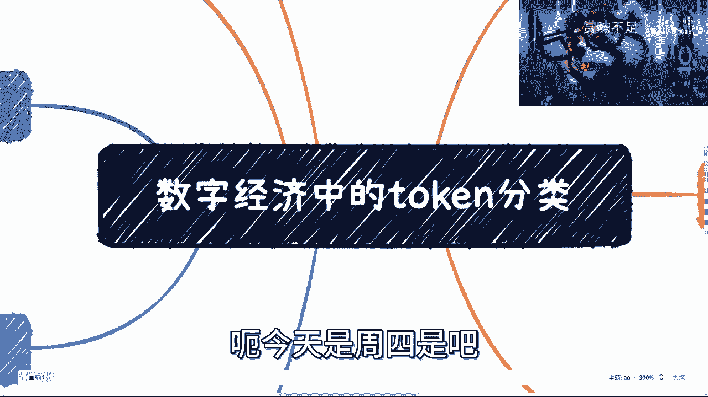

# 数字经济中的Token分类 🪙 - 课程P1

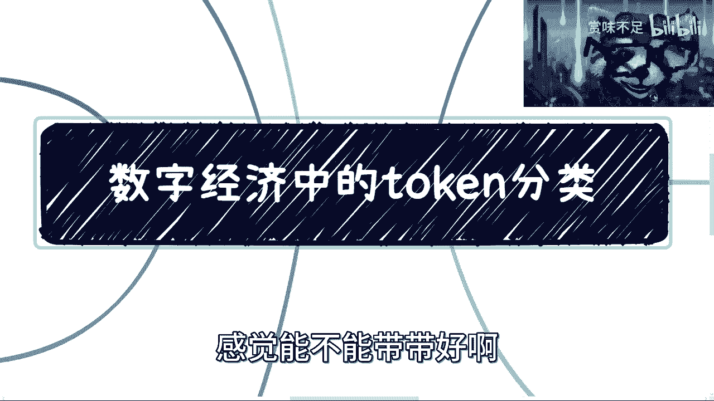

在本节课中，我们将要学习数字经济中Token（代币）的基本概念与分类。我们将探讨Token为何是数字经济发展的关键产物，并了解其不同类型（如积分、资产、权益等）的核心特征与应用场景。理解这些分类是理解未来全新经济生态的基础。

---

## 概述：互联网数据与区块链资产

互联网上的数据通常被称为“数据”。区块链上的数据则被称为“资产”。目前所有的信息都指向这一区分。

上一节我们明确了数据与资产的根本区别，本节中我们来看看为什么数字经济需要Token。

## 为什么需要Token？ 🤔

Token是迎合数字经济发展而产生的产物。它可以被理解为积分、VIP卡或身份象征。这是数字经济时代在技术层面的一个标志，与每个人相关。未来将基于此产生全新的经济形式和融资方式。

Token的存在也是后续与智能合约进行技术对接的必然要求。

无论数字经济的底层建设如何运作，最终都必须与法律挂钩。不考虑法律因素，任何构想都无法落地。

---

## Token的必要性：三大基础

以下是Token及其底层技术不可或缺的三个原因。

1.  **需要天然的分布式记账底层系统**
    我们需要一套基础建设来提供可信的、分布式的记账功能。区块链正是承担这一角色的基础建设。其战略意义在于构建一套完整的底层系统，而非仅仅强调去中心化或不可篡改。

2.  **需要与业务强绑定**
    底层系统之上必须有能与业务紧密结合的技术，如智能合约和Token。所有业务最终都与金融和经济绑定，缺乏金融属性的系统没有实用价值。

3.  **需要具有金融属性的技术支撑**
    全球互联网市场已趋饱和，需要寻找增量市场。数字经济提供了新的可能性。理解其背后的统一金融逻辑，比追逐表面行业热点更为重要。

了解了Token存在的必要性后，我们接下来具体看看它的几种主要类型。

---

## Token类型详解

### 1. 积分Token 🏷️

积分Token顾名思义就是积分。基于区块链基础建设，它能实现积分透明、总量可控、流转消耗过程被链上记录且可溯源。

以下是积分Token的核心特点：
*   **透明与可控**：积分总量和规则由智能合约设定，相对透明。
*   **流转可溯**：所有积分流转、消耗记录在链上，可追溯。
*   **生态互联**：未来可与其他类型Token建立兑换机制，规则由智能合约控制。

**那么，为何要在数字经济中“重复造轮子”？**
互联网积分早已泛滥，但其核心问题在于规则不透明和随意增发，导致积分急速贬值。区块链技术通过智能合约保障了发行规则的执行，从根源上提供了相对可控的保障，使积分体系能重新获得信任并发挥更大作用。

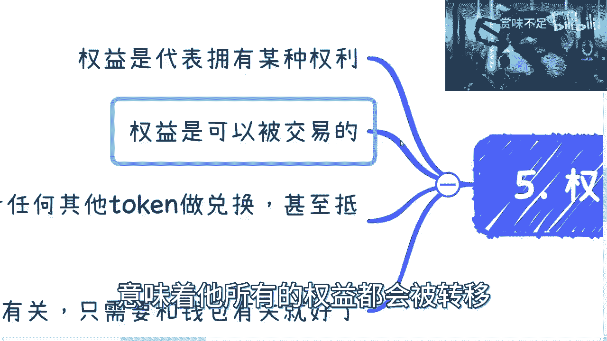

### 2. 资产Token 💎

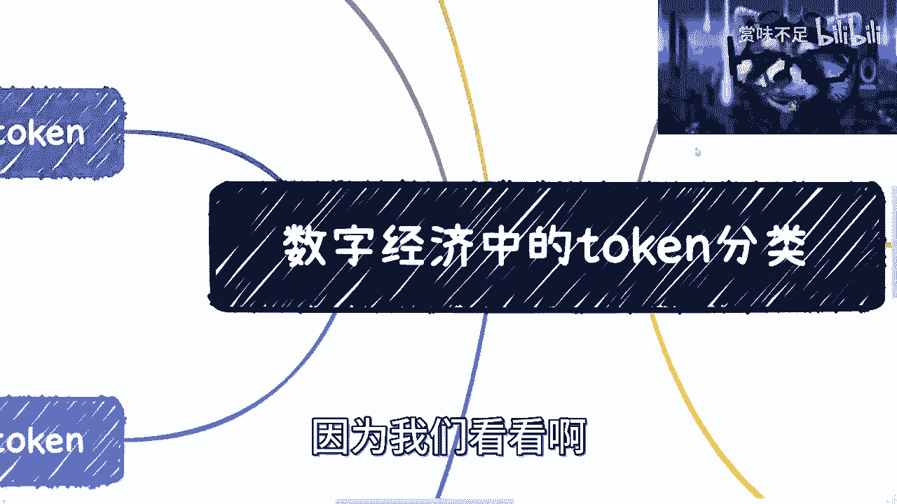

资产Token是一种数字资产。从互联网角度看，它本质上是数据。

以下是资产Token的核心特点：
*   **权属明确**：资产归属于特定钱包或个体。
*   **权益绑定**：资产可以与权益Token绑定（例如，持有某VIP权益Token每月可领取特定资产）。
*   **底层保障**：资产的生成、交易由链上记录和智能合约管理。
*   **虚实映射**：可以与互联网数据或实体物品建立映射关系（1:1或1:X）。

所有业务的落地都是在实践中不断完善，不存在一开始就完美无缺的方案，只要法律允许即可推进。

### 3. 权益Token 👑

权益Token代表某种权利，其关键特性是**可以交易**，且交易会导致与该权益绑定的所有智能合约业务一并转移。

以下是权益Token的核心特点：
*   **可交易的权利**：交易不仅转移Token本身，还转移其背后的一切合约权益。
*   **金融属性**：权益可以与其他Token（资产、积分）进行兑换或抵押。
*   **与钱包绑定**：权益只与钱包地址关联，而非与具体的人绑定。智能合约只认Token所在的地址，这提升了效率与可信度。
*   **防重复获取**：需在智能合约中设定锁仓期、冻结期等规则，防止权益在短期内被重复领取。

### 4. 金融Token 🏦

金融Token本质上是**被法律或国家赋予金融属性**的Token。它本身可以是积分、资产或权益中的任何一种，其金融属性是外界赋予的，并可通过智能合约留存。

其他类型的Token是金融Token的基础建设。只有当各类Token业务广泛落地后，才会衍生出真正的金融Token，这将深刻改变融资、消费和娱乐等方式。

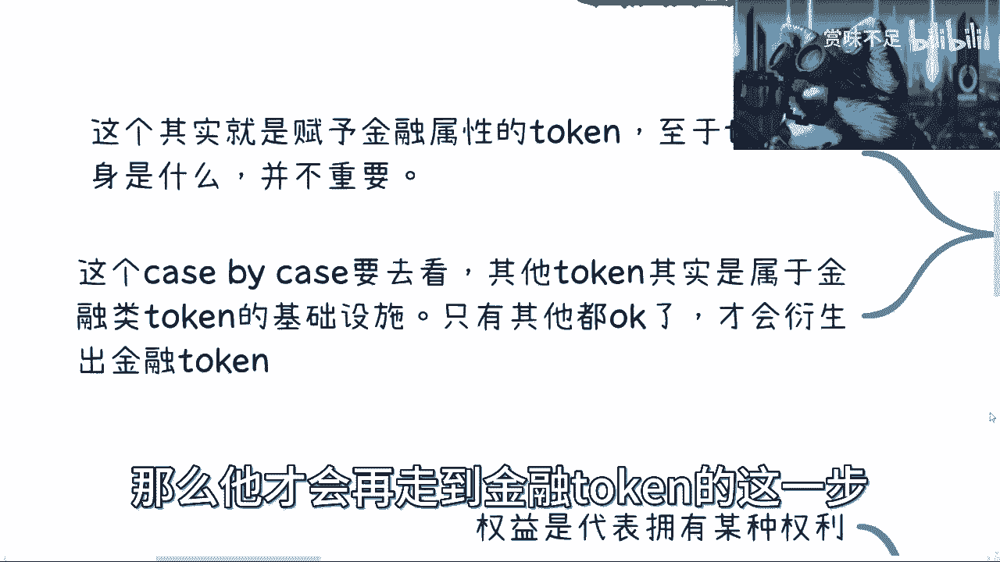

---

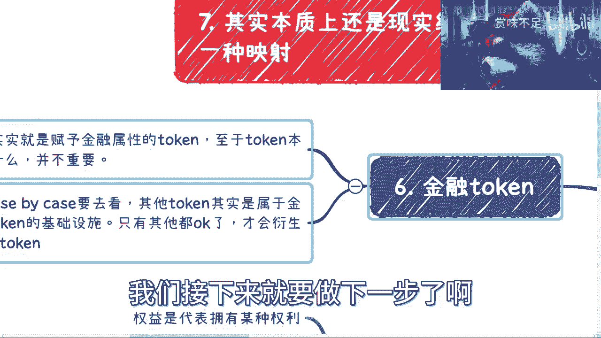

## 核心本质与现实映射

无论Token如何变化，其本质**仍是现实经济体的一种映射**。数字经济中90%-95%的模式仍源于传统金融。新技术并非要打破原有的合理、稳定的经济模型，而是为其提供更强的技术保障，从而催生新的游戏规则和落地方式。

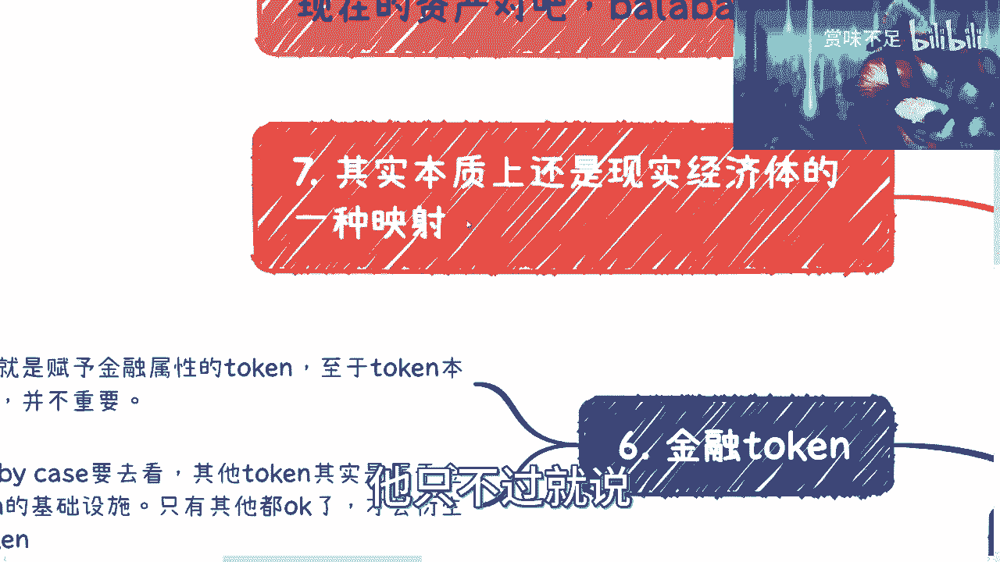

---

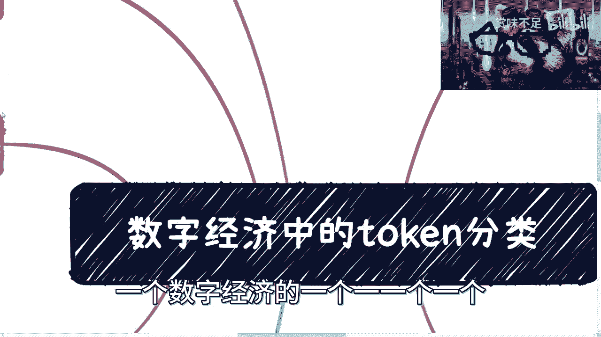

## 重要辨析：当前乱象与未来正道

目前市场上所谓的“数字藏品”、“数字货币”等，与我们所讨论的**数字经济体基本没有关系**。因为它们尚未与各国法律框架下的具体监管口子（如经信委、版权局等）进行绑定和获得认可。

试图仅凭技术突破法律框架是不现实的。真正的数字经济落地，必须与庞大的法律框架和基础设施结合，这条路很长，但现在正是进行知识和能力储备的关键时期。

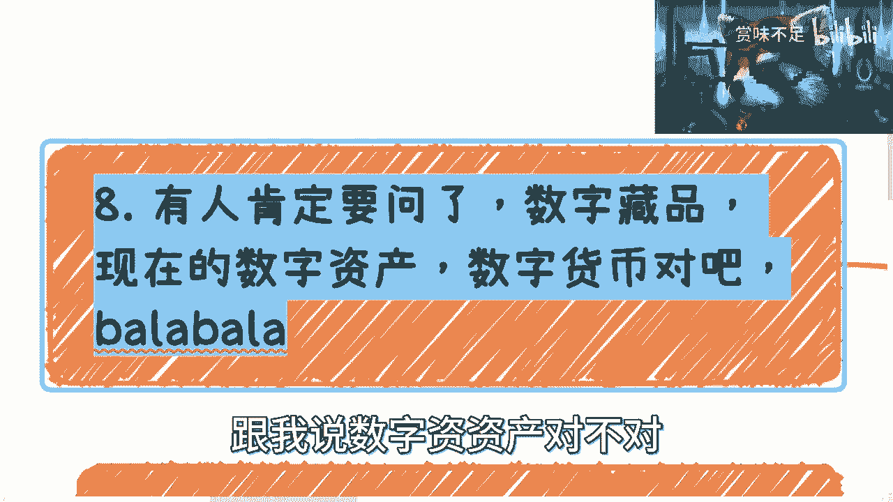

---

## 总结

本节课中我们一起学习了：
1.  **Token的定义与必要性**：它是数字经济发展的关键产物，需要与法律结合，并依赖于区块链底层建设。
2.  **Token的四大分类**：
    *   **积分Token**：强调透明、可控与可溯源的积分体系。
    *   **资产Token**：权属明确的数字资产，可与实体映射。
    *   **权益Token**：可交易且附带智能合约权益的权利凭证。
    *   **金融Token**：被赋予金融属性的Token，是生态发展的进阶形态。
3.  **核心理念**：Token经济是现实经济的映射，需在合法合规的框架内发展，与当前市场乱象有本质区别。

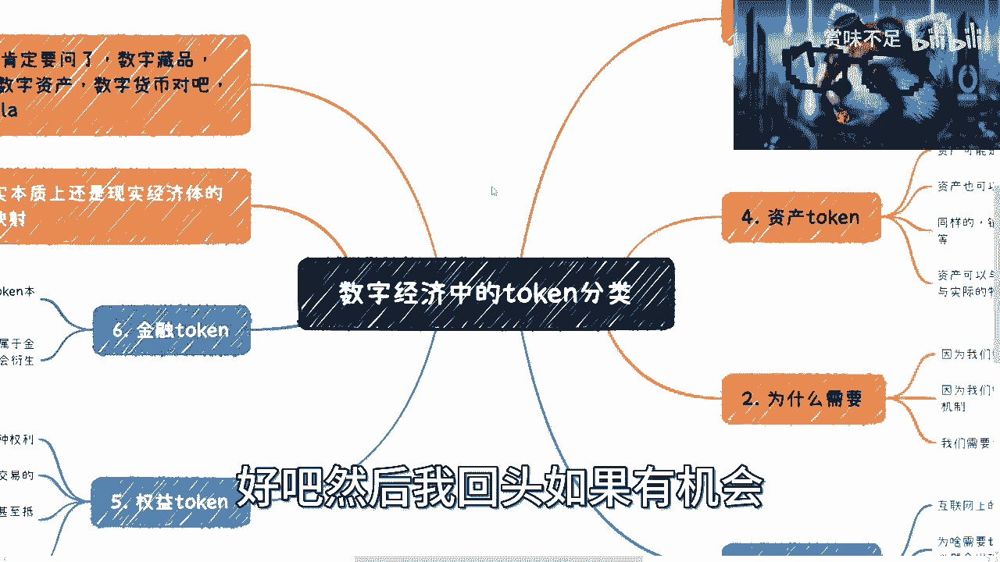

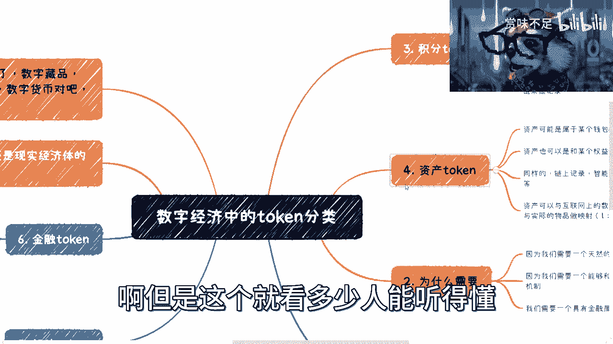

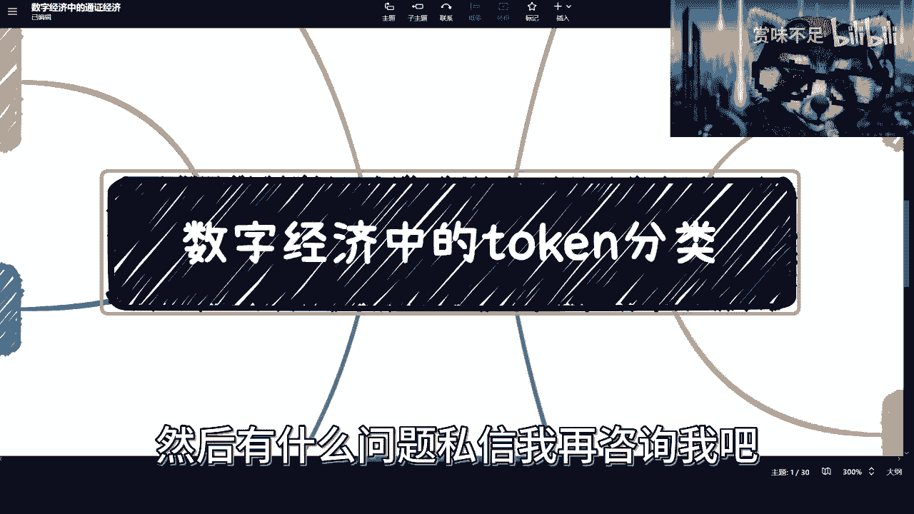

理解这些分类和逻辑，是把握未来数字经济浪潮的第一步。