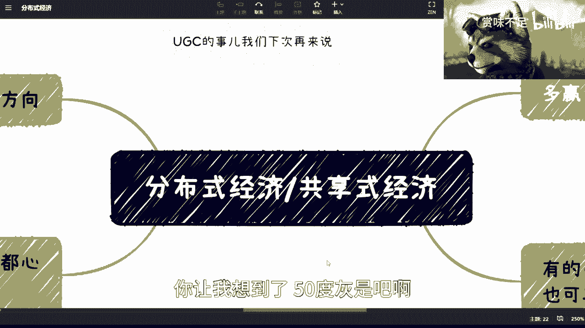
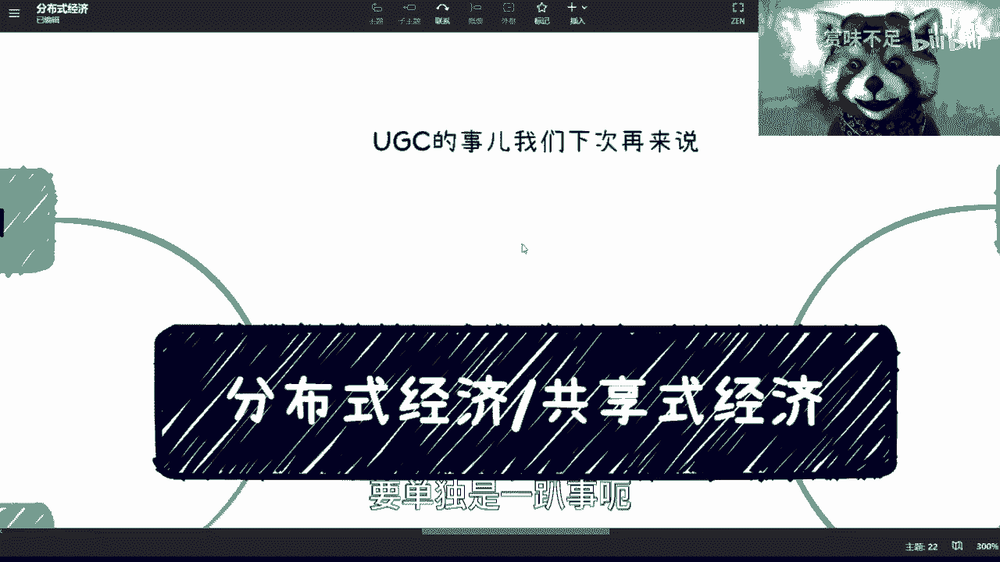
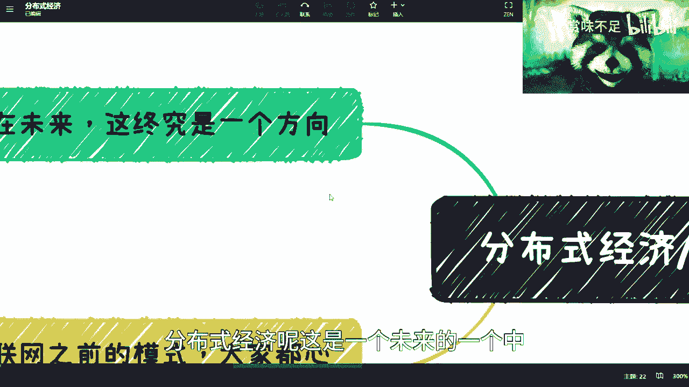
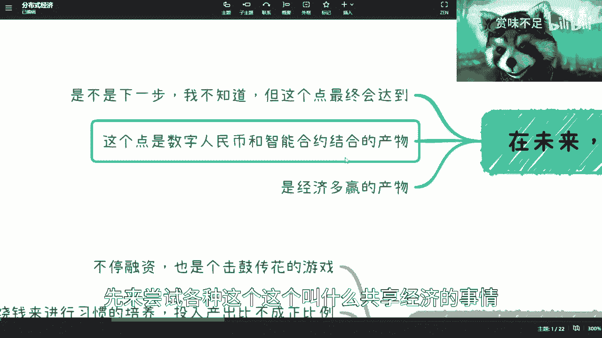
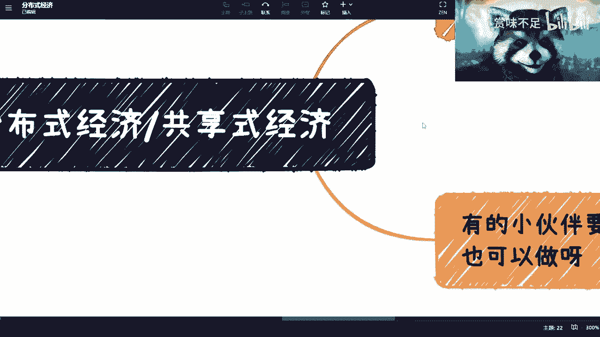
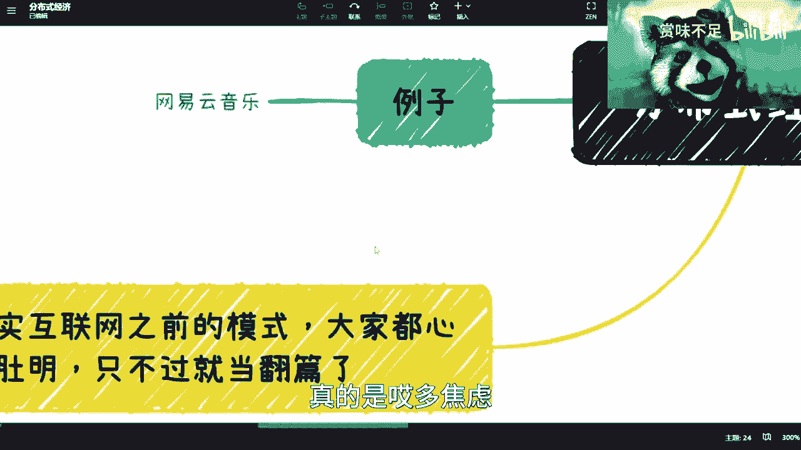
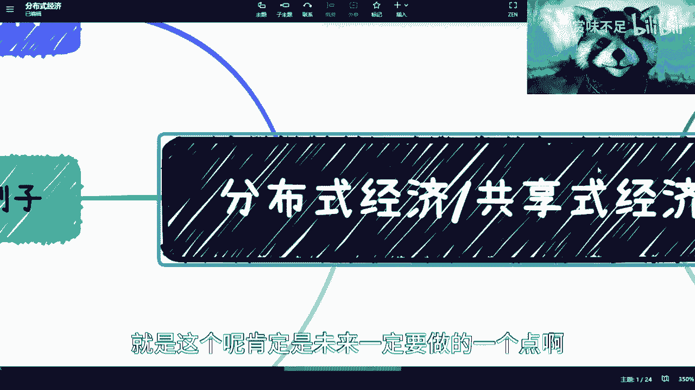
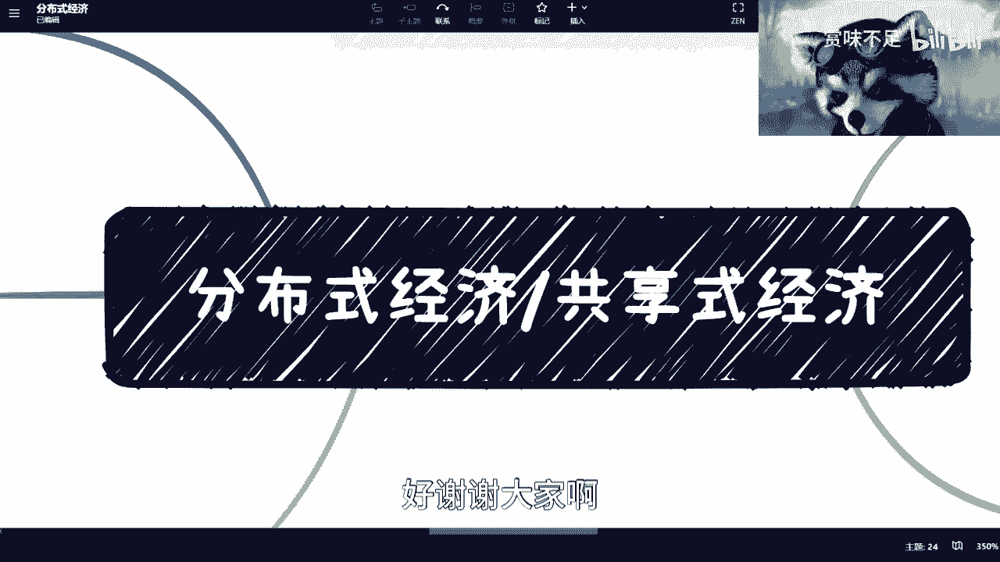

# 数字经济中的分布式经济是什么 - P1 - 赏味不足 - BV1Sa4y1T7Az

好大家好啊，这个我是吕老师是吧，哈哈对，每次他们都问我，你到底姓什么，我也很尴尬是吧，对然后我们继续还是来讲数字经济啊，还是来讲数字经济呃，对然后那个昨天评论区还有人问我。

他说这个吕老师情感问题能不能咨询，可以你们想咨询啥都可以好吧，还有人还有人跟我说，吕老师这个500块钱一个小时，是不是这一个小时我随便做什么都可以。

你让我想到了50度灰是吧啊，这个，OK然后那个呃职业啊对吧，包括考研啊对吧，包括出国啊，反正大家要是有什么问题呢，你们还可以在私信问我，然后内容上面我觉得其实差不多了，就是我能这个讲的对吧。

然后覆盖大家的这个内容的，我觉得应该也差不多了，就剩下的可能有很多，就是跟我聊过的小伙伴应该也都知道啊，就是还有很多就我没法公开去讲了好吧，就讲了。

人人都要没了是吧，然后这一次呢我们来讲这个分布式经济，当然这个内容啊这个名词我也不知道叫什么，你知道吗。

就是就是因为从学术上有很多种叫法，我也不知道到底叫什么，反正大家就就知道这么个意思就可以了。

然后呢这个很多小伙伴也在做UGC的事情，就是叫做创造者经济呃，去年的时候就有深圳，当时那个就有个研究生那跑到上海来了，跟我聊UGC的事情，然后然后最近也还有啊，然后我觉得这个事呢我们下次再来说这个事情。

要单独是一趴事嗯，分布式经济呢这是一个未来的一个中。

也不叫中级吧，就下一个阶段方向，但是你说下一个阶段到底是多久，我觉得我不知道，你知道吗，就是这个事儿呢，得要看就整体的一个发展方向啊，对昨天那个海南海南还说到封官的事情。

唉这个事情我就我我我也不知道怎么说啊，就是我可能不太好说，因为我总感觉B站对于这种内容的审核比较严，你们知道吗，我觉得先放放弃吧，好吧，先放弃，然后呢是这样子的，就是也有很多小伙伴问我。

他说我们现在学区块链对吧，学这个数字经济，也有数字经济啊，数字治理，然后他说是不是，当我们毕业能够这个找到好的工作对吧，或者怎么样，这个东西我说不准啊，因为在我看来国家的整个发展没这么快。

就是不是说你们学了两年，3年出来说哎，我正好能赶上了红利期，不见得，而且从目前来看的话，就是整个的这个发展呢，其实还有很多优先级高的事情，就数字经济其实是一个长期的一个计划啊，那么最终呢他会达到。

但是它不是一个这个这个这个终极目标啊，但是下一步肯定还有这个下一步的计划，那这是一个第二个呢，就是说这个数字呃，就这个共享经济呢本质上是数字人民币，这里多了个空格。

就数字人民币和这个智能合约结合的这个产物，啊结合这个产物，那么呃也就是说在这个形态下面哦，数字人民币是不可或缺的，智能合约是不可或缺的啊，那么否则的话，它是达不到一个相对比较理想的状态的。

当然你说是不是要等到数字人民币跟智能合约，非常成熟之后再做，其实并不是，因为很多事情都是就是先零就用我们说嘛，先0~1对吧，所有的事情就是先有对吧，你说这个东西多么完美，多么当中有任何瑕疵。

这没有问题啊，整个就是说我国做事情都这样的嘛，就是先0~1，然后再1~100对吧，那么1~100的话就慢慢慢慢再去做嘛，所以说往往整个流程当中，应该是先以互联网的技术为底，就为为这个基础，然后呢。

先来尝试各种这个。

这个叫什么共享经济的事情哦，对对对，我想起来了这个地方。

这个地方有个例子，我本来想起来的，但是我忘记忘记写了。

我先写一下啊，你们回头可以看一下，先网易云音乐对吧啊。

然后就这是一个产物啊，然后最终呢其实是一个那个经济，多赢的一个产物，因为为什么呢，因为嗯我们说啊一个正常的良性的循环呢，肯定是多赢的对吧，你不能说在一个经济体或者一个循环体当中呢，只有就这几方是多赢的。

一方是永远不赢的，那其实这个流程或者这个生态环境，是不可持续发展的啊，那么这个事情就不管是不是在中国，在任何一个国家其实都一样啊，那么这个是我们说的啊，当然这个时候你们看到这里。

你们可能还是不知道这个东西是什么东西啊。

有关系不大，我们先往下讲，那第二个其实互联网之前的模式呢，大家其实都心知肚明对吧，就是比如说用户端啊，企业端啊，这个C呃叫什么企政府端其实都一样。

嗯但是呢就是说现在就翻篇了啊，就是说有几个一个你比如说不停的融资，其实本质上不停融资是什么呢，就是击鼓传花对吧，只不过呢这个这个这个花或者这个鼓啊，这个传的时候呢相对还是比较合法合规的对吧。

就符合当下的这个这个整个的一个，生态大框架啊，所以说呢其实你们这个以前如果了解过，你们会发现很多的企业呢说是说奔着IP去的，就我们说的上市去的，但其实本质上呢，他要的就是我就是不停的融对吧。

A轮龙王找B轮，B轮轮王找C轮，而且找的时候呢，A轮会去，就A轮的投资方自己会去找B轮的投资方，B轮投资方自己会去找C轮呢，为什么呢，是因为他们自己要解套对吧，就就就游戏规则嘛，然后这是一个第二个呢。

就是烧钱来培养用户习惯，这个事儿呢，其实所有的这个互联网公司都做过对吧，你比如说点评啊，滴滴啊，美团啊，饿了么对吧，什么携程啊啊拼拼多多啊对吧，其实都都做啊，包括现在你说以前的抖音啊。

快手啊啊包括还有什么还有什么啊，今日头条什么极速版对吧，什么什么什么什么赚钱版对吧，很多很多嗯，但是呢其实投入产出比是不成正比的，为什么呢，因为这个之前我也说过对吧，就是在总结一下。

其实本质上就在于说很多的产物，它是一个发展过程当中必然会出现的，就是就是前两年啊，或者说之前这段时间就算不少钱，今到今天发展到2023年，我们依然也会有外卖这个产业，也依然会有，比如说叫什么。

就是呃快车，或者说网约车这么一个产业，但是你说是不是一定要烧钱来做的，其实不是的，只不过呢就是可能现在我们看到的，并不是饿了么，美团，并不是滴滴，高德，你知道吗，而是说它只是一个互联网发展到一定程度。

必然会出来的一个东西啊，到底是不是他们这不重要，但是为什么我们说投入产出比不成正比呢，是因为这是一个历史过程当中，既然必然会出现这个结果的话，那么我们为什么要一定要投入几10亿。

十几亿甚至几10亿上百亿去烧这件事情呢对吧，所以你用你们想想看，这个烧这件事情背后的钱到底到哪里去了对吧，所以说其实本质上是这么一个点，这也是为什么我之前一直说嘛，就说互联网在透支未来对吧。

来了就是就是做自己的这个帝国吧对吧，那这是第二点，第三点呢其实浪费资源，因为呃怎么说呢，就是首先你服务器本身对吧，你的整个的宣传各方面，其实这些就是看上去虚拟资产的东西，其实都是资源。

因为你服务云服务也需要资源嘛对吧，这是第一点，第二点是你像以前的OFO，或者其他的各种各样，就是嗯也有很多小伙伴之前提到过，就是你看啊最早的膜拜，但它的使用包括现在的各种车对吧。

但是其实本质上在这个过程当中，很多的行模式是CTRLCCTRLV的，但是呢CTRLV了之后呢，用户其实并没有真正的去就说啊大面积的使用，其实你会发现，真正用的也就是那么啊1212个品牌的。

剩下品牌其实都是浪费的，这也是为什么我们会看到有非常多的这种车，堆积在这种这种垃圾场对吧，或者被回收对吧，或者被被损坏对吧，其实这种东西的话呃，之前新闻当中，我不知道你们有没有看到过。

其实有很多人抨击过，就这个资源的浪费，其实是的，就是说做很多事情，他应应该从需求角度，应该从用户角度，但是你你们看啊，之前很多项目的切入角度并不是用户，也不是资源，而是纯资本的切入啊，那资本侵入的话。

就是你不能说它不对对吧，你说哎我我资本我就看好这个项目，你你能说我什么，你总不能说你不看好，你不看好，这是你的事情，跟我有什么关系啊对吧，但是但是本质上就是说，他不能把大家当傻子玩嘛对吧。

就正常有脑子的人一看就知道吗，就是你不就是为了CTRLCCTRLV圈波钱吗是吧，但是这个事情没有办法对吧，嗯然后这边呢我们说用户得到了什么啊，啊用户得到了呢其实是一个服务对吧，其实是一个服务。

其实是个生态，但是呢还是那句话，就是说呃两个点，第一个点是为了用户得到这个服务，和得到一个生态，并不是一定要去浪费资源或投入大量资金的，首先这第一点，第二点是用户得到了这个服务跟生态。

但是用户在这里面并没有得到利益对吧，你说用户如果来说烧钱给用户补贴，算用户利益的话，那么我觉得这个事情有点扯淡啊，这有点扯淡，为什么呢，因为呃我可能举个不恰当的例子啊，就是这就好像今天有一个基金跟我说。

他说啊陈老师我们要投资啊，不是要投资吧，我们有一笔这个呃foundation，然后这个foundation呢是可以来扶持大家的对吧好，然后呢我就来了很多小伙伴说好，我们有错，我们有项目啊。

我们我们想来了来得到支持，然后呢这个反对性就跟我们说，哎陈老师，你看啊，就是呃我们的支持是这样子的，比如说你必须要做满两年啊，然后呢或者做满一年对吧，你的员工必须要达到多少，然后呢我们在水电煤啊。

这个免税对吧，我免免这个租金对吧，免这个各个方面给你支持对吧，那你相当于一年就省了，比如说五六十万对吧，这个就很扯淡，为什么呢，因为我要的是真金白银对吧，我要的是利益。

而不是说你给我什么所谓的免什么什么东西呢，因为，其实大家仔细想看就能想通，就是我要的是资金，然后呢我想去做这件事情，但是如果你不给我这笔资金，或者你不给我这个利益，我有可能就不去做。

或者说我可能缓缓以后再去做对吧，那么你如果变相的说啊，我给你免了，就等于给你资金，我去做，那我说实话你还是等于挖了个坑给我跳对吧，好，那么最后一点呢，就是其实是不可持不可持续发展的。

因为就像我还是回到我们刚刚那个例子来讲，就是你整个的过程当中对吧，你比如说这个foundation foundation，肯定是希望所有的人，更多的人越来越多的人进来参与对吧，那么做好项目。

那么他才可以有股份啊，有变现啊，有四两拨千金啊，啊投入产出比高的方式去得到回报，对不对，但是如果说哎你说我没有真金白银的，我就是给你们免免购种东西对吧，然后啊这个这个课本你们的部分成本。

那这个东西还是那句话，他在外面去招能招来多少团队呢对吧，然后这个团队嗯我自己出钱，我又能持续发展多久呢对吧，其实都一样的，所以你会发现，为什么我说这个互联网的整个模式，它一去不复返。

然后然后也有很多人问我，他说以后会不会回暖，我说回暖这件事情啊，就是你可以把它理解为有新的增量的市场，比如数字经济，而不叫互联网的，这个就互联网加的回暖，因为他不可能回暖了，就这一趴就已经翻篇了。

你知道这一趴叫做扭曲的生态，它在回暖，谁来回啊啊，到今天为止，所有的资本，所有的这个政府，所有的企业端都已经懂了，这个模式是不可持续发展的，谁脑子有毛病再往里面扔啊，你说是吧，因为退役再再说的直白一点。

你你你今天有脑子啊，没脑子往里面扔，那么所有声线有脑子的不会来接盘吗。

对不对，哎呀我怎么觉得我要感冒了呢。

真的是哎多焦虑，然后我们来看共享经济和分布式经济，这边我们说的是多赢对吧，多因是什么呢，就是资方肯定要赢嘛对吧，核心团队就比如说股东啊，以及你的其他团队，对其他团队有没有看你良心嘛对吧。

那这个这个这个这个叫什么啊，肯定要有利益嘛，对吧好，然后用户啊，先用户先不说格斗荒，合作方，这边呢这个多赢呢倒不是说他一定是股权上的，而是说他也要赚钱对吧，但这个赚钱呢。

就是嗯我们现在说的只有法律约束嘛，因为你企业跟企业的合作，你就是啊这个这个叫什么，就是合同上对吧，约定我要做什么，约定什么时候交付对吧，约定我给你多少钱对吧，约定怎么分润。

那这个是合同合同上的那最惨的呢就是用户啊，因为用户呢就像我们说的，就是说啊你就是一个使用方对吧，然后呢你是不可能有利益的对吧，但是本质上来讲呢，其实呃我们说一个良好的生态。

就像为什么我们今天一开始说很多人会做UGC，就是因为他们觉得其实用户激励是很重要的，而且用户激励呢不能仅仅是积分对吧，不能经济是积分，他一定是要有真金白银的积累的，否则你怎么做了，我们再再想想看。

有很多人就说，为什么当时余额宝能够做得起来，为什么余额宝能够轰炸天下，就是因为余额宝既是一个用就是C端的产品，又是一个能够让用户看得见真金白银，赚到钱的东西，就我就这么简单，我跟你们说。

就就就所有的逻辑到最后就是钱啊，你们千万不要觉得庸俗啊，不要觉得这个这个粗糙对吧，不要觉得哎我我就是对吧，这个很很很很怎么样的，我觉得这个我不想被金钱污染，对吧啊，我跟你讲啊，不不要怎么说呢。

就不要这么的清高对吧，也不要怎么样，因为毕竟我们活在这个世界上。

你总归要遵守这个世界的规则对吧，那么当下呢其实整个分布式经济。

共享经济其实缺的是什么呢，一个就是缺用户，房就是用户是没有利益的，第二个缺的是什么呢，就是缺的是资方啊，核心团队啊，和合作方啊这几部分共赢的模式啊，因为共赢的话，这个当中如果但凡只有就是背书信任合同。

信任，那么这个当中会出现非常多的分歧和扯皮啊，这也是为什么有非常多的这个这个叫什么，就是啊企业的合作，会包括合伙人之间会闹到法庭对吧，那么最后呢就在这要说的呢，就是有小伙伴肯定要说了。

他说你说了半天对吧，我觉得互联网技术也可以做对吧，你你你如果互联网技术能做，为什么10年前不做呢，为什么5年前不做呢，为什么到今天都没做呢，对吧好，其实本质上我跟你们说啊，可以做，但是可以做呢。

这也是为什么我之前说数字经济里面，区块链是很重要的一个环节，或者来说可以不叫区块链类，区块链的技术是一个很重要的环节，为什么，因为我们除了人性的信任，除了法律的保障，我们还需要技术的保障。

你互联网技术是保障不了的，因为互联网技术所有东西都是中心化的，所有东西都是说我说了算，你说了算，那我跟你之间信任还是建立在合同，信任和法律和人性信任上面，你要如果今天去作恶，你要改个数字。

我还是不知道对吧，等我知道了，我还是给你闹到法律法庭上面，那这个事情有什么意义呢，没有意义啊对吧，所以说呢本质上我们的供那个未来的呃，数字经济需要的是人性的信任，再加法律的保障。

再加技术保障的三重的保障啊，那么他是一个真正的一个完整的一个信任啊，那么这第一块，那么第二款呢就是大家约定的规则呢，它必须是什么呢，就是也不是一方能改得了的，而且这个东西呢是必须自动化。

自动化交易流程呢，什么意思呢，就是说我们今天约定的合作规则，其实是在法合同上的，对吧好，但是合同是合同，合同其实并不能去影响你的交易，这就好像我今天说，我4月1号给大家转100块钱对吧。

但是我说归说我可以不转啊，你能把我怎么滴吗对吧，你最多民事诉讼，刑事都刑事是绝对不可能的，对不对，但是呢就说这个事情你放到C端，放到B端，放到极端，那么它的影响力就会很广对吧。

所以说呢我们在未来的技术保障上面，需要的是什么呢，就是既在合同上约定规则，又在我们说区块链的智能合约上面啊，你们可以认理解为是一个自动化的脚本对吧，去呃那个智能合约上面去。

把这个交易流程和交易规则写进去，然后以链上的合约来进行自动化的交易流程，当然在这个里面有很多人会提出一些细节问题，对吧，就比如说哎我要是账户里面没钱呢对吧，我怎么知道这个账户里面有钱呢。

他怎么知道我这个规则有没有这个满足呢对吧，有没有怎么样呢，这些技术层面我跟你们讲，所有的这些点在技术层面都是有解决方案的，就看最终到底选择哪个解决方案啊，你们要感兴趣呢，我后面也可以跟你们讲啊。

就怕你们听不懂是吧啊，都有都有很多方案啊，包括多签对吧，包括多签，那我们说对CP值三端其实都是一样的，就是你们会发现，不管就是说是用户端还是企业端还是政府端，他其实都不能说完全的靠法律保障跟合同保障。

因为单纯靠法律保障，合同保障，所有的风险都是后置的对吧，就是我们只能祈祷不出问题，出了问题你还是只能起诉他对吧，那么这件事情你会发现在整个生态里面，它就是无解啊对吧，你你你这就不是一个正叫什么。

就是健康的生态对吧。

所以说所以说我们再回到这边，就是为什么我们会说1UGC的事，我们下次再来讲，包括有很多人说UGC的时候，我就跟他说，我说我有些想法都是好的啊，但是怎么说呢，就现在还缺几张牌对吧，一张牌是数字人民币。

一张牌是智能合约，另外一张牌是区块链的基础建设啊，我觉得还还说啊，包括那个法律框架。

还缺这四张牌对吧，你不是说你在整个牌没有齐的时候，你就去打。

基本上很难打哦，那么我这个地方举个例子，现在呢也有一些那个在尝试的。

比如说网易云云音乐啊，这个词我妈发音的时候老是很难发，就是在音乐里面呢，会你们会去看到有一个就是叫做呃拍卖店啊，拍卖数字音乐的这么一个地方，然后拍卖数字音乐呢，它是这样子的，它是比如说你可以进价拍卖。

然后拍卖完了之后呢，你可以在一年或两年，就是他约定的时间里面，你可以享受这这个音乐，在未来的交易里面所得到的啊，所有资金的70%啊，创造者分20%，平台分10%啊，那么我们说这个其实就是。

其实未来这个数字经济，共享这个经济的一个雏形，因为为什么说雏形呢，是因为它现有的这个流程呢，还是基于那个网易云音乐，网易本身的这个信任和法律框架，以及这个叫什么，就是啊这个这个这个企业的新人啊。

但是我们还是那句话，我们也不能保证网易里面的，就我们不能保证网易一定靠谱，我们也不能保证网易里面操作这个项目的人，已经靠谱对吧，那万一网易某一天倒闭了呢对吧，或者万一网易某一天里面的人就要作恶对吧。

等等等，那是不是用户叫受受受损失了，是不是创造者就拿不到钱了对吧，所以说其实本质上呢就是这个雏形很好啊，而且你们会发现这个东西呢不仅是数字音乐，就数字版权啊，啊数字这个这个这叫什么专利啊对吧。

数字书籍啊对吧，数字所有的数字的东西，都会都会以这个方向去做，只不过呢有很多变种啊，我在这个地方也可以提一下，因为也不见得只有拍卖模式啊，也不见得只有竞价模式对吧，有很多种，比如说可以直接购买啊对吧。

然后比如说可以众筹啊对吧，可以其他的哎，我跟你讲未来想象空间还是很大的啊。

就是我总结一下吧，就是这个呢肯定是未来一定要做的一个点啊。

而且呢方向很多，就大家去想的时候呢，一定要明白了，一定要去想两件事情，一个呢就是不要被以前互联网，或者你们已知的很多东西束缚住啊，第二就是说你们想问题的时候，一定要去结合当下的法律框架啊。

因为我发现很多人哎呀怎么说呢，法盲真的是法盲，我跟你们说哈，哦回头我得回头，我再给你们出一期啊，出一期我至少我至少以什么呢，我至少以数字资产的切入点，我可以跟你们讲一下啊，法律上可以擦边的地方啊。

也不叫擦边的地方，就是可以按照当下法律框架区去去去什么，去银河的地方，你知道吗，就就别真的，我发现有很多天马行空行空，到最后其实啊你说idea对不对，好的，但是法律允不允许，不好意思不允许啊。

要允许的话，中国人这么聪明，也轮不到你做啊，哎呀行吧，就这么着吧，唉我真的我越做越长了啊，快点打赏了嗯。

