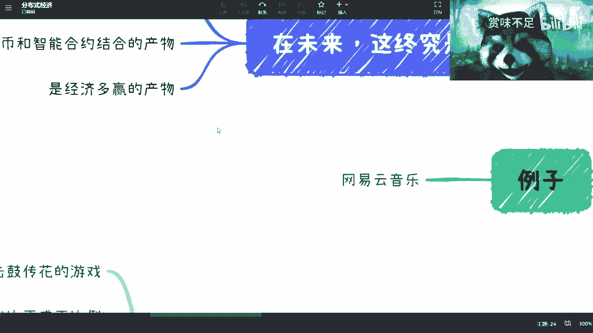

# 数字经济课程 P1：什么是分布式经济？ 🌐


在本节课中，我们将学习数字经济中的一个重要概念——分布式经济。我们将探讨其核心定义、与传统互联网模式的区别，以及它为何代表了未来的发展方向。


## 概述

分布式经济是数字经济演进的下一个重要方向。它并非一个终极目标，而是发展过程中的一个阶段。其本质是数字人民币与智能合约技术结合的产物。一个理想的分布式经济生态需要数字人民币和智能合约作为不可或缺的基础。

## 传统互联网模式的回顾与反思


上一节我们概述了分布式经济，本节中我们来看看它所要替代的传统模式。在深入探讨分布式经济之前，有必要先理解其试图解决的、传统互联网经济模式中存在的问题。


以下是传统互联网模式的几个核心特征及其弊端：




1.  **持续融资与击鼓传花**：许多企业的目标并非创造真实价值，而是通过一轮轮融资（A轮、B轮、C轮）进行“击鼓传花”。早期投资者引入后期投资者以实现自身退出和解套，这构成了当时的游戏规则。

2.  **烧钱培养用户习惯**：互联网公司普遍通过大量补贴（如外卖、网约车、短视频平台）来培养用户习惯。然而，许多服务是社会发展必然出现的产物，巨额烧钱投入的产出比并不合理，且资金消耗巨大。

3.  **造成资源浪费**：许多商业模式是简单的复制粘贴，并未真正满足用户需求，导致大量资源浪费。例如，共享单车领域曾出现众多品牌，最终大量车辆被废弃，造成了实体资源的巨大损耗。

4.  **用户未获得核心利益**：用户虽然获得了服务，但并未在生态中获得真正的利益。平台提供的补贴是临时性的，并非可持续的利益分享机制。

5.  **模式不可持续**：上述依赖资本输血、资源消耗和用户补贴的模式已被证明是不可持续的。整个行业已经认识到，这种扭曲的生态无法回暖，已经成为过去式。

## 共享经济与分布式经济的核心理念：多赢

理解了旧模式的弊端后，我们来看看新范式的主张。分布式经济或共享经济的核心目标是构建一个**多赢**的良性循环生态。在一个健康的、可持续发展的系统中，所有参与者都应获益。

以下是多赢生态中各方角色的理想状态：

*   **资方与核心团队**：获得合理的投资回报。
*   **合作方**：通过合作赚取利润，其权益不仅依靠法律合同约束。
*   **用户**：**这是关键转变**。用户不仅是服务的使用者，更能通过参与生态获得真实、可持续的利益（而不仅仅是积分或临时补贴），例如从他们贡献的内容或数据中分享收益。

然而，当前的合作多依赖于法律合同和人性信任，容易产生分歧和纠纷。未来的经济模式需要三重保障：**人性信任 + 法律保障 + 技术保障**，以此构建完整的信任体系。


## 技术保障：区块链与智能合约的关键作用

要实现上述多赢且可信的生态，技术扮演着至关重要的角色。这正是区块链技术（特别是智能合约）在数字经济中地位关键的原因。


互联网技术无法提供自动化的信任保障，因为其系统是中心化的，规则可由单方修改。而区块链和智能合约能提供以下关键支撑：


1.  **自动化执行约定规则**：合作各方约定的规则（如分润比例、支付条件）可以写入**智能合约**。这是一个自动化的脚本，当预设条件满足时，合约将自动执行交易，无需人工干预或担心违约。
    *   代码示例（概念性）：
        ```solidity
        // 假设一个简单的音乐版权分润智能合约
        if (音乐被播放) {
            向版权持有者转账(收益的70%);
            向平台转账(收益的10%);
            // ... 其他逻辑
        }
        ```

2.  **规则透明且不可篡改**：链上的合约规则对参与者公开，且一旦部署便难以单方面更改，提供了前文所述的“技术保障”。

3.  **解决信任后置问题**：将法律合同条款与链上智能合约结合，使得许多风险可以被前置预防，而非事后通过诉讼解决，从而构建更健康的商业生态。

## 实践雏形与未来展望


目前，我们已经可以看到分布式经济理念的早期实践。例如，**网易云音乐**的数字音乐拍卖模式：用户竞拍数字音乐版权，在未来一定期限内，可以分享该音乐产生收益的70%（创作者得20%，平台得10%）。


这虽然仍建立在平台自身的信用和法律框架上，但已初步展现了**用户参与价值分配**的雏形。未来的想象空间巨大，可延伸至数字版权、专利、书籍等各类数字资产，形式也可包括购买、众筹等多种模式。

在探索未来方向时，需注意两点：
1.  不要被过去的互联网思维束缚。
2.  必须紧密结合当下的法律框架进行设计。

## 总结


本节课我们一起学习了分布式经济的概念。我们回顾了传统互联网经济模式不可持续的弊端，进而探讨了以**多赢**为核心的分布式经济理念。我们认识到，实现这一理念需要**数字人民币、智能合约、区块链基础设施以及相应法律框架**的共同完善。分布式经济代表了数字经济未来发展的一个重要方向，旨在构建一个用户、创造者、平台等多方共赢且可信赖的可持续生态。


---
**核心概念公式**：
分布式经济 ≈ **数字人民币** + **智能合约** + **多赢生态**
信任基础 = **人性信任** + **法律保障** + **技术保障**