# 数字经济中的智能合约——一种全新的经济模式 - P1 - 赏味不足 - BV1bj411c7zF

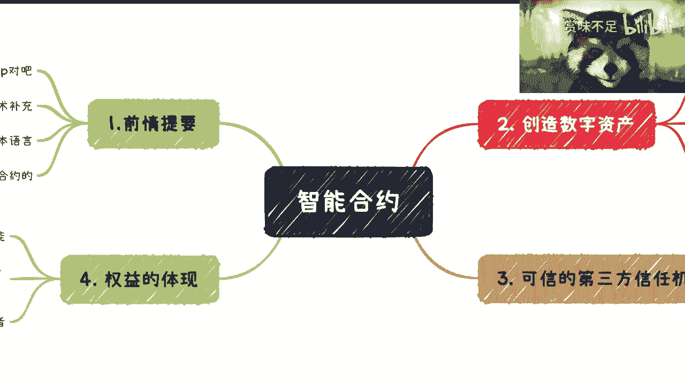

好啊大家好啊，你们有没有看到有什么变化啊，我我我其实也不知道这个之前的功能，能不能用啊，反正但是还是要感谢感谢一下x max麦，从b站上找到了我，然后送了我一个会员对吧，然后我要学习一下x麦的怎么用。

哈哈哈啊啊，那这期我们来讲一下这个智能合约啊。

智能合约是这样子的，就是说呃我封了几个，一个是啊之前已经讲过了对吧，我给大家前提前情提要一下，第二呢就是从234这边呢。

我会去讲一下，就是这个啊分就细分的这个功能好吧，大家可以对这个东西有一个了解，为什么我之前会说，智能合约是比练更重要的这么一个存在啊。

当然啊我在这个地方先提一点啊，能讲的也就到这个层面了，再往下我就讲不了了啊，讲不了你，你们这自己领悟吧，哦自己领悟，第一呢就是说智能合约它是个链上的application啊，这个就我们那就先说了对吧。

就练你们就当成是一个windows或者安卓ios。

智能合约呢就是里面的这个应用对吧，好第二呢就是那个智能合约。

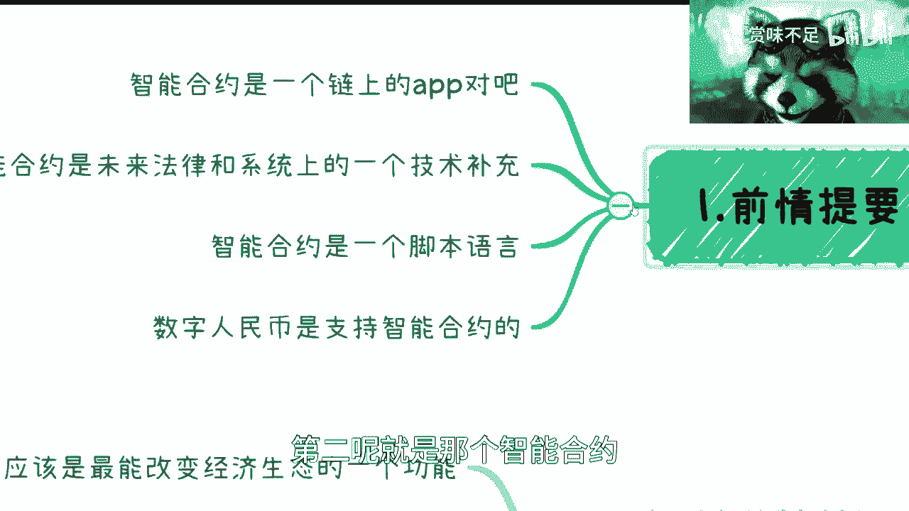

它是一个在法律和合同，我写错了对吧，法律和合同上面的一个技术的补充，简单来讲就是说法律和合同该怎么去做的，他还是会延续的啊，但是就是说合约这边呢，会去做一个技术上的一个保障啊。

那么这个我们后面也会来讲的，第三呢就是智能合约是一个脚本语言，就是它本身就是个代码啊，而且呢这个代码就是说啊，它是可以部署在这个区块链上的啊，第四个呢是数字人民币，数字人民币这边呢从目前白皮书来讲呢。

它是支持智能合约的，当然具体你说怎么支持，怎么编程，这个当下应该是还没有给出来啊。

那么这个是我们的前景提要。

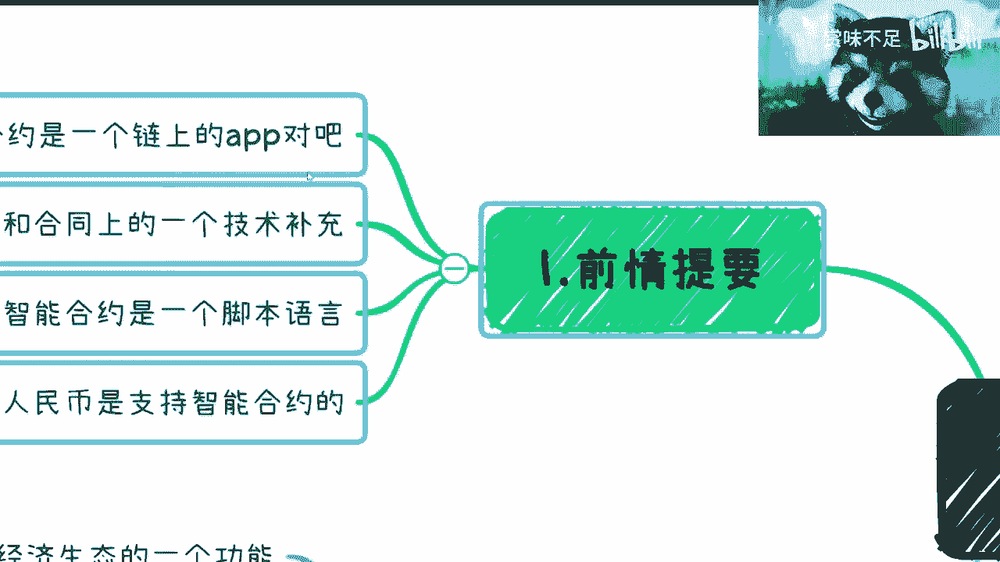

那么从功能来讲呢，我这边总结了几个，一块是智能合约是可以创造数字资产的啊，那么创造数字资产呢，你们可以理解为就是一个，类似于像以前积分的东西，但是呢由于它的合约的属性。

所以说它是可以通过区块链的智能合约的协议，来创造属于自己的这个属性的资产，什么意思呢，你就比如像去年的数字藏品对吧，或者叫数字新闻创啊，那么哎呀对吧，那么你比如说打个比方，你现在那个小浣熊对吧。

什么以前那个干脆面里面有108将对吧，你们现在比如说像很多小朋友玩的那种，奥特曼的卡片对吧，你你说我现在要去发行，你的一个数字的一个资产，那么你如何保证你的资产是唯一的独一无二的。

那么他就得去遵循它里面的一些那个，特殊协议啊，那么比如说我们现在在协议上面有e r c，那么由合约创造出来的这个东西，就从他的dna，从他出生的那一刻开始，他就是几者都是不一样的，好那么这个是第一个啊。

第二个呢，就是说我们可以从合约的这个代码上面，能够看到，比如说你发行的东西的总量，以及是否可以交易对吧，包括其他的一些属性啊，就是你都可以设置啊，那么在这个里面呢。

就是说它相对现在的就是你说西方很多东西，大家对它的理解可以一样，但是呢它的属性的确是能更好的，把他的这么一个资产发挥出来。

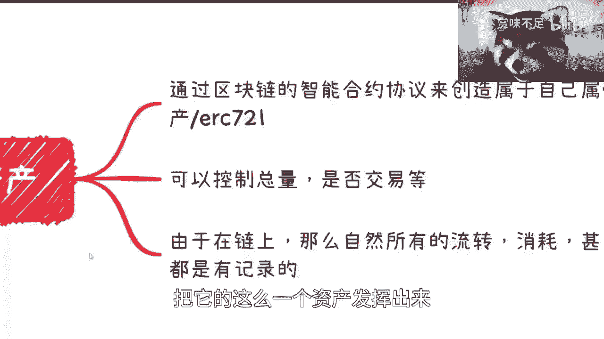

因为本质上来讲，如果你今天发现了一个东西，它的总量是不受控的对吧，一天到晚在那边增发对吧，或者怎么样子，那么这件事情你想嘛到最后就是就烂掉了对吧，你今天一开始发出来，可能大家觉得嗯还好。

但如果你最后就说总量一直增发对吧，然后这个东西也没有价值，那就烂掉了对吧，这是第二点，那当然了，也有很多人说啊，他说那你前2年这个数字藏品，数字新闻创不是一样也烂掉了嘛，对不对，我跟你们说。

本质上还是那句话，就是你一个东西好不好，你得看他有没有应用场景，你得看它本身的这个使用是什么对吧，你不能说这个东西应用某一个东西的，应用场景不好，就否定他的技术，或者否定它的这个这个这个这个功能。

那肯定是不行的是吧，那么第三点呢，由于合约所创造出来的资产，它本身由于练的属性，它就是一个本身就是在链上的这么一个东西，那么自然而然它的就是所有的这个流转啊，消耗啊，甚至增发对吧。

就不管他有任何的这么一个东西，他都会在链上有记录，那么又由于我们上一期说的就是练，它是一个多节点控制的一个技术，那么导致是说这个记录不会轻易的被篡改啊，不会轻易的被篡呃。

被篡改好，那么这个是第二点啊。

第二点好，那我们继续往下讲，这个其实大家之前应该都知道对吧。

这第二点第三点是什么呢，就是可信的一个第三方信用机构好。

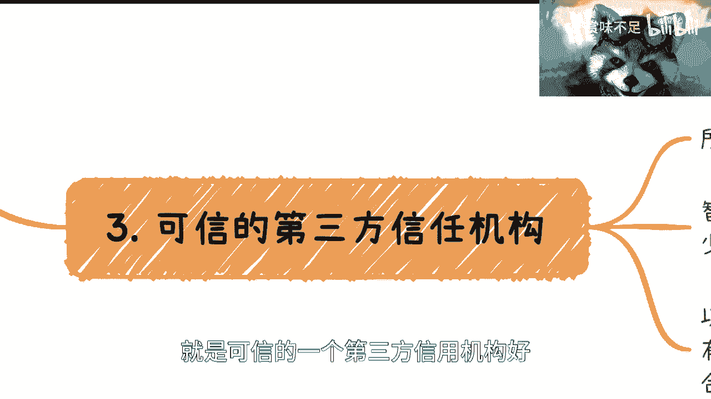

那么信这个呢就是说合约可以变成一个替代。

一个可信的第三方机构，那么也就是说像我们上次所讲的，第三方信任机构，最最最最最最好的切入点是什么，就是所有的预付款，包括所有的担保。

就金融担保其实都可以啊，因为预付款其实就是一个我付给那个叫什么，就是甲方付给乙方，或者客户付给机构的这么一个付款，而为了防止机构跑路，那么必须要有个第三方担保机构，来存这笔钱对吧。

那么以前我们说存这笔钱可以是政府对吧，也可以是企业或者第三方保险公司对吧，但是问题是不管怎么样，有很多人你从这个人性角度来讲，你说唉今天某一个政府背书，因为你要政府来给你存，你也不可能是央行给你存了。

对不对，它最多是一个比如说政府背书的机构对吧，或者企业给你存，那这个时候你也说了，哎那个政府机构，政府被说这个机构或企业，那我也怕他会跑路啊，是不是，那第三方保险公司更不要说了。

但大家说哎我都没有这个安全感是吧，那你说那么那么按照我们刚刚说的，你说啊你这个这个第三方去存啊，或者担保，那么你肯定也会有合同对吧，也会有法律约束，诶诶诶诶诶诶诶诶对吧，但是就是说你有合同和法律约束。

他跟这个政府机构，或者或者说某一个订单贸担保公司会不会跑路，它没有因果关系啊对吧，你签了合同他一样能跑路啊，是不是，所以说呢就说合约在这个预付款，或者说第三方担保里面，它是一个用的最多的一个一个场景啊。

那么这个时候呢，就是说智能合约本身它是有地址的，也就是说有钱包的，那么可以替代所有的第三方可信机构，但做什么事情记住啊，就是合约它是不可能替代很多的业务流的啊，也就是说也就是说。

比如说今天我们做一个淘宝对吧，淘宝是个电商，那你说这里面有很多电商的逻辑，什么上架啊对吧，然后什么什么什么什么，填写这个物品的详细信息啊对吧，或者怎么样啊，这个合约它最多的就智能合约。

最最最最最核心的功能是在于资金的流转啊，也就是所谓的这个这个这个转账啊，资金流转，那么你说这些业务流要不要放到合约上，其实本质上啊，我们从真正的这个这个架构角度来讲。

大部分的业务还是存在于中心化的系统上面的，但是资金的流转会存入到智能合约上面，其实是这么个逻辑，当然这个我也只能说是当下的情况，以后是不是怎么样，我不能保证啊，这这是第二点啊。

第三点呢就是说以后的b to b，就比如说企业q企业的合作，跟企业出个人的合作，甚至啊比如说企业to这个这个政府的合作对吧，就是等等等啊，就是说他依然会有合同，依然会有一些系统或者法律的约束。

这都没有错啊，但是金融上的交易会先写到合约上，什么意思呢，就是说我们举个例子，比如说今天啊我们说1月1号啊，202024年对吧，1月1号啊啊这个吕老师给陈老师啊，这么说吧，企业给陈老师。

企业转500块钱是吧，好那么这个时候呢，你在合同上面一定会有一个具体的日期，然后会有个金额，然后呢会有一个这个如果违约了对吧，比如说逾期一一周对吧，如果违约了，那么每天按照或者每个月按照多少的利。

利息对吧，这个赔给这个陈老师对吧，那一定会有这么一个东西呃，这个是法律合同一定会有的，然后呢这份合同也是肯定具有法律效益的，也没有问题啊，然后呢这份合同在操作流程上面，第一步会干嘛呢。

这份合同会把它的哈希值啊，就是它的哈希值，它的一个就是你们可以理解为，它的一个在计算机上面的这么一个数据，先把这个哈希值呢存到链上啊，以乙乙怎么说呢，以保证这份合同不会被篡改对吧，首先是第一步啊。

第二步是会把什么呢，就是2024年1月1号某一个前提，因为你你你你你比如说a公司转给b公司，你总会有个前提啊，你不可能莫名其妙转的，对不对啊，你总会说哎他是不是交付了某个东西，或者说大家确认了他。

比如说完成了某个项目对吧，这个转给他，那么这个时候呢就说在合约里面他会写写清楚，就是说什么时间啊，什么进行条件啊，然后谁给谁转500块钱，你知道吧，那么这个呢是在合约里面也会写好的。

就相当于是一个呃叫做合同的代码版啊，写在合约里面，那么这个时候呢就说等到到时候，比如说通过双方或多方，因为这个东西相当于是技术上可以实现的，你们可以理解为什么呢，就是这个合同它可以全自动的执行啊。

呸这个智能合约它可以全自动的执行，它也可以由人为确认之后再来执行，或者说所谓多方确认之后再来执行，都是可以的啊，都是可以的，那么我们说在确认之后，其上链部署，然后最终执行对吧，那么这个时候你会发现。

那么我们不但签署了合同，我还把这个合同的代码化，由比如说多方参与者确认之后上链进行部署，部署就是相当于把这个app装到了这个链上对吧，部署，然后一旦到这个链上，那么这个合约就不能改了。

或者来说要改就要多方一起签名，也所谓签名就是多方一起赞同才能改，那么这个就是进一步的去加强了，我们说的这个怎么说呢，就加强了b to就是个人出个人啊，企业去个人啊，企业去企业。

企业企业区政府的一些这个叫什么，就是信信任关系表，更确保了这个风险的这个这个前置性，你知道吧，因为你没有这块东西，那么按照现在的逻辑是什么，就是超过1月1号，吕老师企业不给陈老师，企业赚500块钱。

哎我这个字都写错了，垃圾输入法对吧，500块钱，那么这个时候你就会发现它的风险是后置的，因为我能怎么办呢，我只能去起诉刘老师的企业，然后走司法程序对吧，但是如果说你有合约做一层保障，我们不能说。

因为呃我在这地方提一下，我们以前一直有一个东西叫银带，对吧，就是不是说智能合约有了之后，就能解决所有的问题啊，那么回头人家要说了啊，吕老师你说了啊，这个东西怎么样怎么样怎么样啊，以后就是很很牛逼对吧。

很很怎么样，没有啊，我没有说过啊，就所有的东西它只是技术上的一种保障，但是它不可能成为一个淫荡去解决所有问题啊，不可能是对吧，他总他总有纰漏对吧，总有一定的瑕疵，但是不管怎么样，它从一定程度上面。

能够将现在的这种全后置风险的东西，变成一定风险前置的东西，你们能明白吧，好那么这个是第二点好，那么接下来就是最重要的，最最最最重要的核心中的核心是什么，就是权益啊，权益我们来讲。

首先这是一个能够改变经济生态的一个功能啊，这毫无疑问啊，这个已经完全得到了证实，只不过尾巴尔，现在没有多少人能够明白这件事情，这是第一点啊，我们举个例子啊，比如说长租房，长租房什么概念呢。

就是我们举个例子，比如说a是房东，b是租客，c也是租客，对不对，好，那这个时候呢我们假设啊，所谓长租房里面呢很容易出现的问题是，a是房东，b是组合，但是b呢它其实是二房东对吧，为什么呢。

因为他可以跟房东去约定，把这个房子再租出去对吧，或者他不确定他也做出去无所谓啊，这个关系不大啊，然后c是组合，那么c我们说的是真正的组合啊，到这边就结束了，但是问题是什么呢。

往往事实上面呢很有可能不止这三方，很有可能是a b c d e f g对吧，然后这当中呢可能还有些什么什么什么第三方，保险公司啊对吧，什么担保机构啊，老多老多了，还有中介公司啊对吧，很多很多啊。

好那这个时候我们来讲啊，就从这个例子来讲，你们想想看，如果今天我们刚刚说啊，就拿三个人来讲，我们说a要成为房东，b要成为二房东，c要成为真正的租客，那这个时候首先第一点是什么。

你a b c3 方一定是有合同的啊，我们不说他是不是一个三方合同，他一定是一个2222的一个合同，对不对，这毫无疑问啊，啊你要说b和c a和b都没有合同，那我只能说是这些人自己对这个。

这个法律上没有意识嘛对吧，那正规来讲你一定是有合同的对吧，好第一第一点啊，那第二点是这个合同说的是什么呢，这个合同就是说哎这个谁是租客，谁是房东对吧，然后每个月多少租金，无非就这么个东西啊。

然后租的时间是多长对吧，是怎么个怎么-3加二还是怎么说对吧，反正就是就就就就这么些东西啊，好那么这个时候呢你们想想看啊，如果今天啊单纯是这么个逻辑，它会出现一个什么状态呢，就是c可能拖b房租。

b可能拖a房租，甚至a可以不租给b对吧，反正就是说各种各样的方式去扯皮，你可以扯到天荒地老，对不对，好，那这是第一个问题啊，第二个问题是，如果今天b说他不做了对吧，他不租了啊，然后由c来做二房东啊。

或者来说b说我除我除了想要租出去以外，我可能想要有些别的收入也好，或者经济模型也好，那怎么办呢，好我们来想想看啊，如果今天b不租了，那么是不是说a跟b一样，还是要去进行合同的更更改跟签对吧。

然后c如果作为一个真正租客，没有了二房东之后，他要做二房东，那么他也必须要经过一个合同的更改对吧，这个是一个正常的流程啊，好正常流程，那么这个时候我们说如果通过智能合约，怎么来做。

通过智能合约是这么做的，就是今天我们通过智能合约呃。

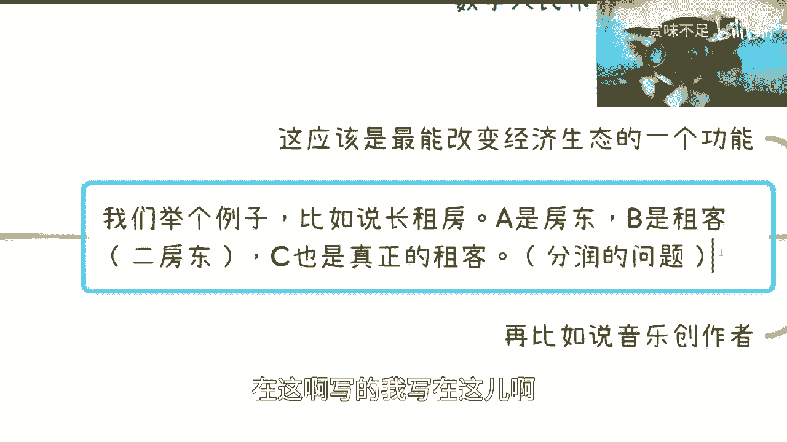

在这写，我写在这儿啊，比如说今天啊我们通过智能合约发行权益呃，叫什么token啊，权益token，那么这个权益token你们怎么理解呢，就是说啊我们打个比方，每个月的租金是1万啊，1万好。

那么这个这个叫什么租客对吧，好租客，我们说，租金是1万啊，然后b比如说每个月拿2000对吧，a每个月拿一拿8000，对不对好，然后c每个月诶诶诶c每个月付多少，付1万对吧。

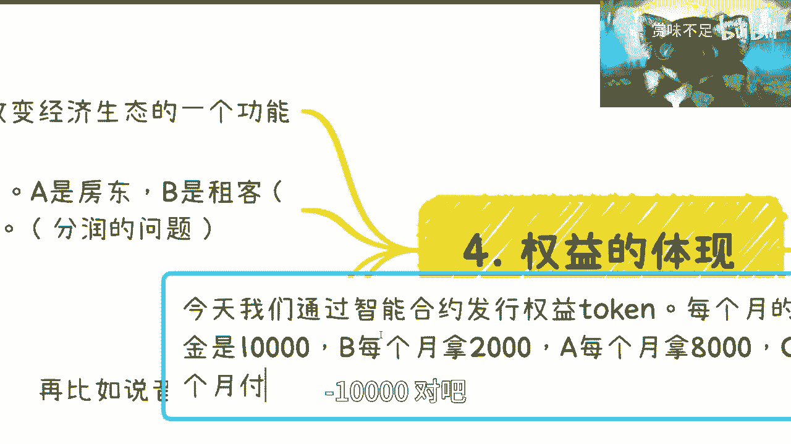

我们假设啊是这么个逻辑好，那么这个时候呢我们说这个token是什么概念呢，token就是说a发行了这个token，a拿，啊a拿百分就是token总量的80%啊，b拿token总量的20%。

其实就这么个逻辑对吧好。

我们先不说发行总量是多少啊，因为这个后面再来说啊，假设发行总量我们在这个地方写啊，假设发行总量是x，为什么我感觉这是一个数学题。

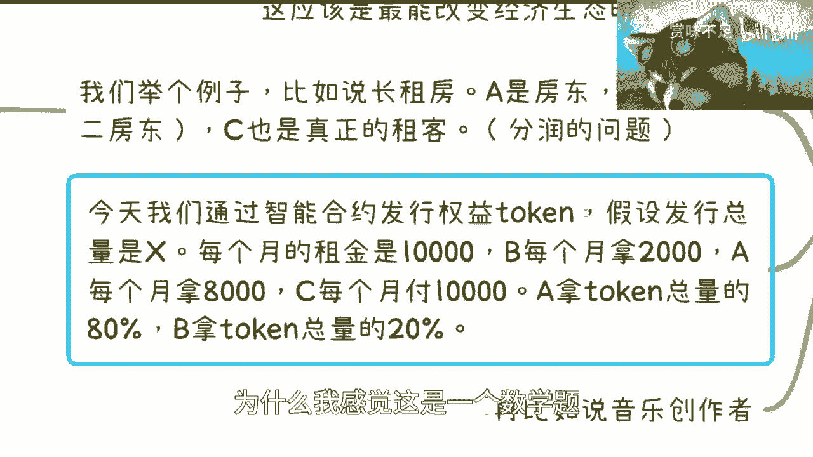

数学我在教数学嘛，哈啊然后呢，你看啊。

那这个合约怎么写呢，这个合约就说哎每个月的月底啊，由c这边会扣除1万块钱，然后把这1万块钱分别给到a跟b，但是给到a跟b怎么给呢，你如果说给2000，给8000行不行行，但是问题是什么。

问题是你在合约里面如果把2000和8000写死了，这件事情就是很傻，对不对，因为为什么，因为你回头万一不是2000，不是8000呢，要涨价了呢，对吧，你每次难道换个合约吗，这个事情就很傻。

没有人这么做的啊，在合约里面会怎么做呢，就是会按照a跟b拿token的总量的百分比，进行分配啊。

那么你们想想看啊，我们再往下走一步，如果这个逻辑是这样子的话。

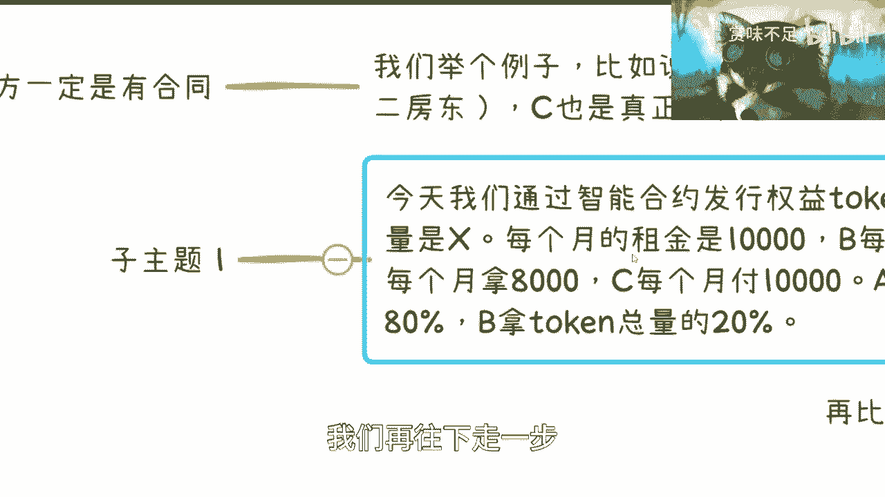

意味着什么，意味着a跟b的手上的token是可以交易的，我们先不说交易啊，是可以转移的，对不对，好，那么今天我们说如果b不想做房东了，他只要将这20%转给a，由a拿百分之百的token。

他即可获取这笔钱，对不对，那么这件事情，大大大大大大增加了整个的交易效率，也大大大的增加了法律上的保护，因为它既不需要再通过什么重签合同，也不需要大家来扯皮，你们能明白这个道理吧。

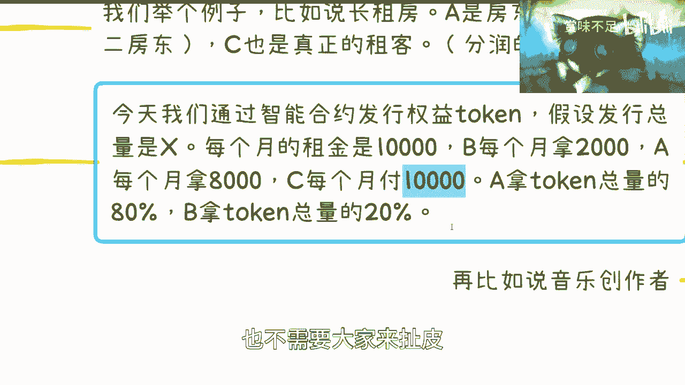

对不对，好，那么如果来说我们刚刚说了，如果来说这个东西不单能够转移，还能交易的话，你们自己想想看对吧。

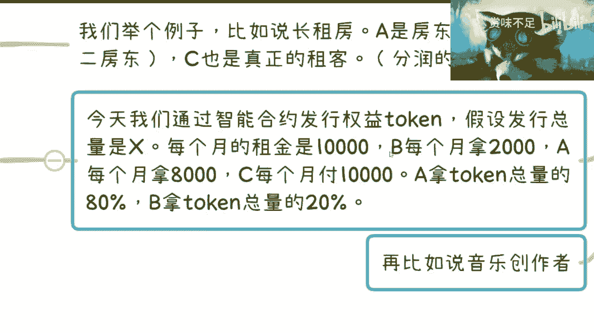

它就会成为一个全新的经济生态，你明白吧，权限经营生态，也就是说我今天可以把我的token进行交易啊，我可以把它去卖给别人，如果有人愿意来买的话，那么他可以拿到租金的百分之y，这个要看他卖买多少。

对不对啊，那么这件事情呢你会发现，无论从可信度上面还是从经济模型上面。

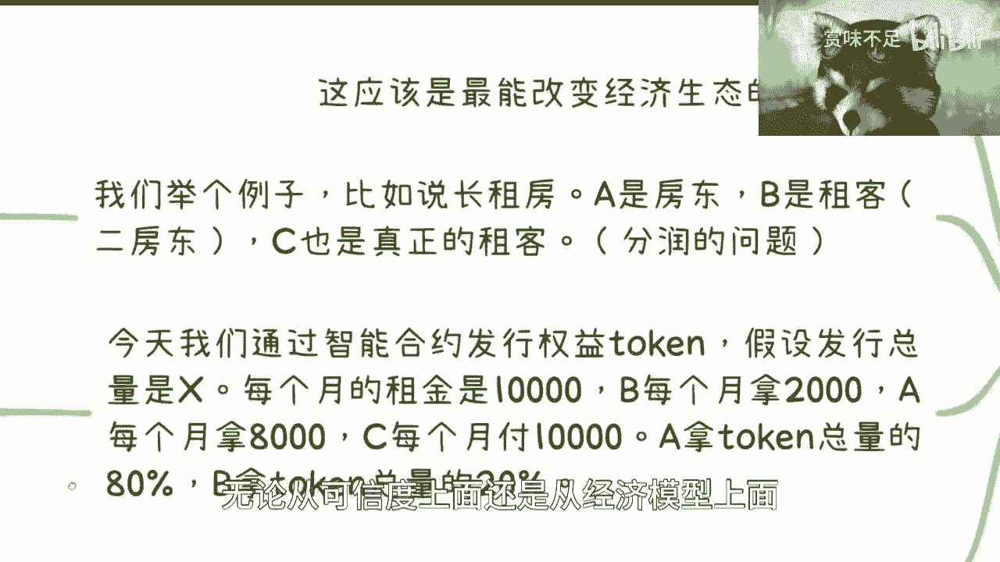

它都是一个多赢的一个关系，因为它既保障了信任，又大大增加了流通性，就是这是一个业务跟金融并行的一个存在。

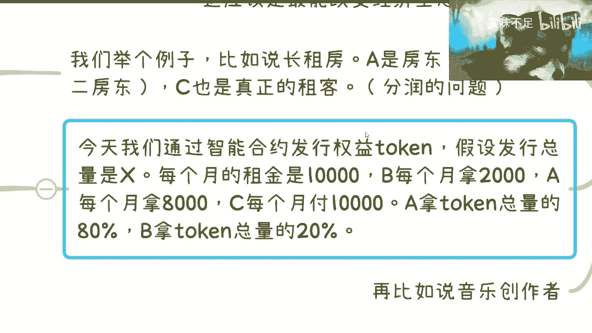

啊这个你们可以想想看啊，你们可以想想看，那么再比如音乐创作者，音乐创作者也是一样的，什么意思呢，就是说你比如说今天创造了一个音乐啊，然后呢这个音乐本身本身就是一个token。

打个比方本身就是个token好，那这个时候意味着什么呢，意味着这个音乐所有的播放，会被默认记录在链上，对不对好，这是第一点啊，第二点是这个音乐的所有的分销方，对吧，或者还说渠道方啊。

那么不管有经过多少个分销商，分销方，不管经过多少个渠道方，他也都会都会被记录在链上。

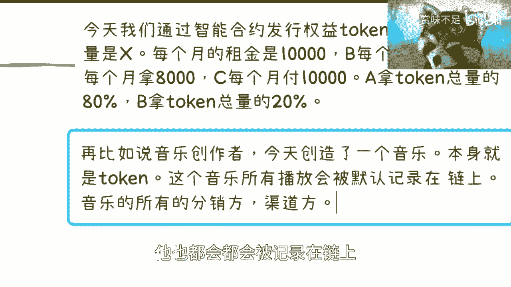

对不对好，那么这个时候呢关于分销方跟渠道方，包括经济经纪人对吧等等等，他应该拿多少钱，这件事情。

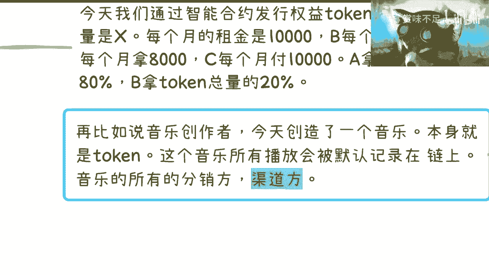

其实本质上也是可以通过这个模型来做的啊，或者来说他是他甚至都不用去发行，这个权益的token，他甚至就是说哎，我就直接在这个智能合约里面写清楚对吧，比如说啊分销方一级分销方是多少，二级分销方是多少对吧。

然后渠道方是多少对吧，我就写清楚啊，然后比如说呃分销了，比如说100首对吧，是多少比例，1万手是多少比例等等等对吧，那么这件事情呢对很多的就是说啊，你说产权也好，版权也好对吧，专利也好，他从逻辑上。

从源头就已经把这件事情控制住了啊，但是呢就我们说啊。

就是这个是我们要告诉大家，或者我要告诉大家的一个权益的体现。

但是这件事情里面你们可以想想看，有很多细节可能还是有缺失的啊，这个缺失很有可能是现在生态上的缺失，也有可能是法律上的缺失，也有可能是技术上的趋势都有的，就是但是这个逻辑啊，我们说从技术上的逻辑。

这个逻辑是ok的，而且在我看来这个逻辑就是个多赢的，没有任何毛病啊。

没有任何毛病，所以说呢就是为什么要来说为什么在我看来，智能合约会高于练，是因为合约才是真正的有价值的东西，练它只是一个记录啊。

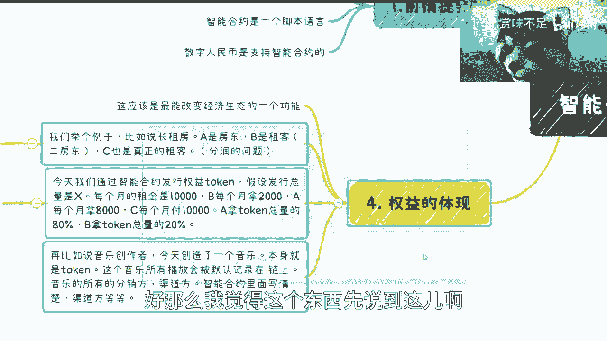

好那么我觉得这个东西先说到这儿啊，说到这其实本质上还有再往下的这个叫什么，就是价值和意义啊，但是这个东西我就不在这个地方讲了，我说这个直接点说，这个东西也不是说收不收费都要讲，而是这个东西再往下讲。

就就就涉及到敏感信息，不太合适啊，好吧，那么基本上就这样子。

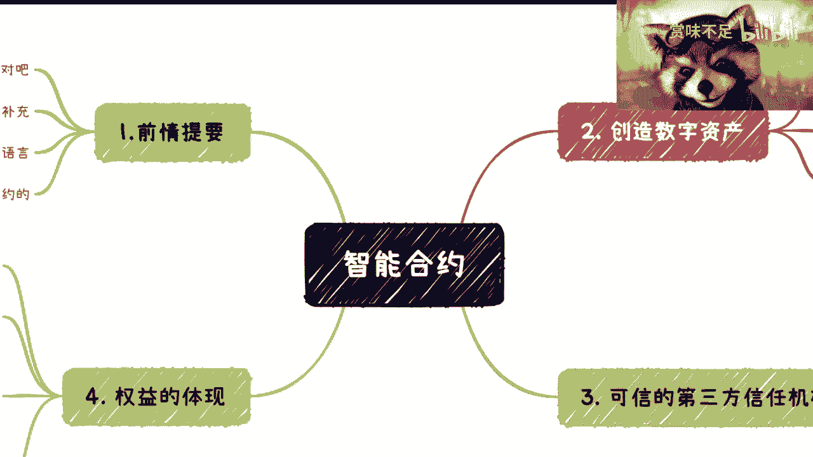