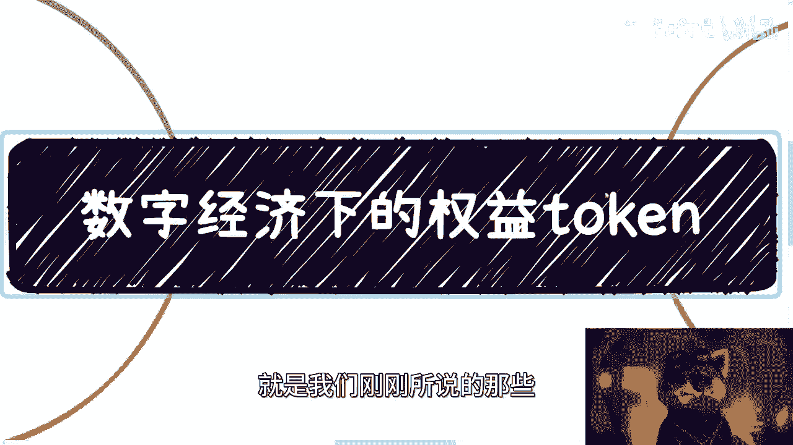

# 课程 P1：数字经济中的权益Token 🪙

在本节课中，我们将要学习数字经济中的一个核心概念——权益Token。我们将了解它的定义、基本与进阶优势，并通过具体例子来理解它如何在实际场景中应用，以及它所带来的全新经济形态。

## 概述：什么是权益Token？

上一节我们介绍了数字经济的广泛性，它像互联网一样，会渗透到所有领域。本节中我们来看看权益Token。

权益Token可以被理解为一种数字化的权益凭证。它就像一张VIP卡、一份预付费服务合同、一张电子门票，或者代表房产、版权、专利等所有权的证明。任何能够证明你拥有某种权益的东西，都可以被数字化为权益Token。这种权益不一定只与金钱相关，也可以与其他非经济利益挂钩。

## 权益Token的基本优势 🔑

由于所有Token都是通过智能合约生成的，这带来了几个根本优势。

以下是权益Token的三个基本优势：

1.  **公开透明与可编程**：智能合约本身是一段代码，它生成的Token数据在链上（或对特定合作方）是公开可见的。同时，Token可以自带特殊属性，例如：
    *   **代码示例**：`token.isTransferable = false` （设定Token不可交易）
    *   **代码示例**：`token.lockPeriod = 90 days` （设定Token有90天锁仓期）
    这些属性可以根据具体业务需求灵活定义。

2.  **可追溯的记录**：无论Token是被赠送、交易、抵押还是锁仓，所有操作记录都会被永久记录（在链上或中心化服务器）。这使得所有信息都可以溯源，确保了过程的可靠性。

3.  **权益与资产的叠加性**：很多时候，权益Token不仅仅是权益，它本身也是一种数字资产。例如，一位音乐人创作的数字音乐，它既是资产（有版权价值），也附带权益（如后续的分润权）。这种叠加性增加了Token的复杂性和价值。

## 权益Token的进阶优势 🚀

了解了基本特性后，我们进一步探讨权益Token更强大的进阶优势。

以下是权益Token的四个进阶优势：

1.  **高可信度，不依赖单一方**：即使没有法律合同的直接约束，权益Token本身也具有很高的可信度。因为权益和对应的资金由智能合约管理，而非某一家企业单独控制。这意味着即使服务提供商倒闭或跑路，你的资金和权益凭证（Token）依然是安全的，可以被平移到其他服务中。核心在于保障资金和权益凭证的安全，而非依赖单一企业的信用。

2.  **权益随Token转移，流程极简**：Token的转移即代表权益的转移，无需额外的合同或技术流程。这是因为权益是绑定在Token本身，而不是绑定在某个特定的人或账户上。这从根本上避免了因账户变更、身份验证等带来的复杂性和扯皮问题。

3.  **源头规避系统风险**：由于权益跟随Token，而Token的流转规则由不可篡改的智能合约定义，这最大限度地避免了中心化系统“想改就改”的风险。系统的控制力被削弱，用户资产的安全性在源头得到了加强。

4.  **可分割性带来巨大经济潜力**：权益Token可以被分割。这意味着像房产、大型版权这样的高价值权益，可以分割成小份额进行流通和交易，极大地提高了资产的流动性和普惠性。虽然目前法律可能有分割上限（如200份），但技术上的可行性为未来更灵活的经济模式打开了大门。合规的关键在于“可控”，而区块链技术提供了这种控制能力。

## 应用场景举例 🎫

理论优势需要结合实际。让我们通过几个常见场景，看看权益Token如何运作。

以下是三个具体的应用示例：

*   **预付款与会员卡**：
    1.  预付款直接打入智能合约地址，而非企业账户，从源头杜绝商家卷款跑路。
    2.  消费时，系统通过验证用户钱包中的Token来确认权益，并从公共合约中扣款。这需要结合AI（如人脸识别）、IoT等技术连接物理世界。
    3.  会员卡（Token）可自由转移，扣款逻辑只认Token不认人，因为Token的转移历史在链上清晰可查。

*   **电子门票与优惠券**：
    1.  智能合约可以直接定义Token属性，例如 `token.canBeUsed = true; token.canBeTraded = false;` （只能核销，不能交易），有效打击黄牛。
    2.  门票可以转移但无法造假。因为每个Token都有独一无二的哈希值，伪造底层哈希值在密码学上不可行。
    3.  增发通常需要重启新合约并明确告知差异，这保护了原有生态的稳定性和持有者权益。

*   **广泛的应用前景**：权益Token可应用于直播打赏、用户积分、供应链金融、二次元数字藏品等几乎所有涉及权益确认与流转的领域。每个人、每个组织都有可被数字化的权益。

## 挑战与展望 🔮

尽管前景广阔，但权益Token的普及仍面临两大挑战。

1.  **基础设施建设周期长**：包括区块链、数字身份、物联网等在内的新一代数字基础设施建设，是一个可能需要5-10年甚至更长时间的工程。数字人民币的全面推广也是一个长期的进程。
2.  **法律与合规框架尚待完善**：现有的法律法规对于这种全新的数字权益形态，还有许多需要明确和适应的地方。合规之路需要技术与法律框架的协同演进。

然而，正是因为在发展期和建设期，它才是一个巨大的增量市场，为各行各业、不同规模的企业与个人提供了新的机遇。数字经济的产业链非常庞大，不可能由少数巨头完全垄断，这中间蕴含着广泛的参与和协作机会。

## 总结

本节课中我们一起学习了权益Token。我们明确了它是一种数字化的权益凭证，探讨了其公开透明、可追溯、可编程的基本优势，并深入分析了其高可信、易转移、防篡改和可分割的进阶优势。通过预付款、电子门票等实例，我们看到了它如何解决传统经济中的信任和效率问题。虽然面临基础设施建设和法律合规的挑战，但权益Token代表了数字经济中一种重要的全新经济形态，其发展值得持续关注。

---
**课程名称**：数字经济中的权益Token，全新的经济形态
**课程编号**：P1
**视频来源**：BV1Cg4y157d4