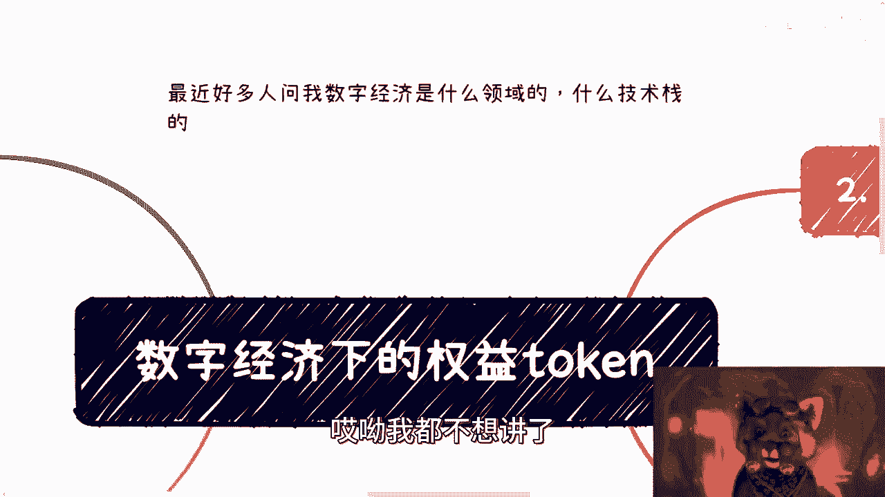
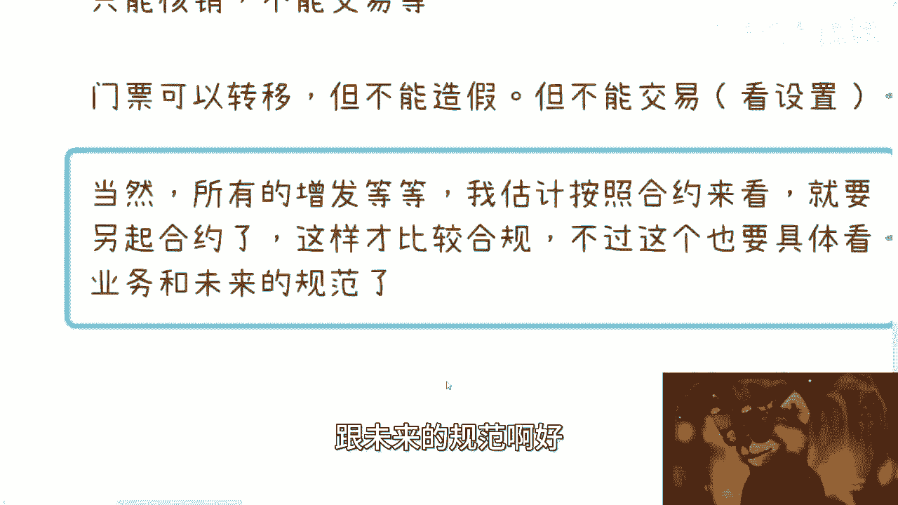
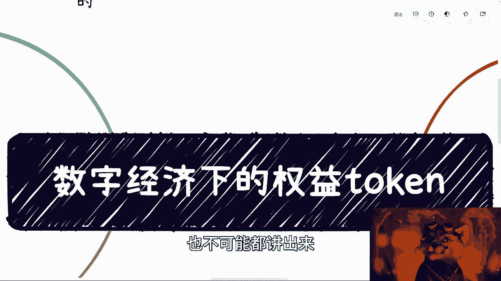

# 数字经济中的权益token，全新的经济形态 - P1 - 赏味不足 - BV1Cg4y157d4

好啊，这个今天我们继续来讲这个数字经济啊，呃最近因为好多人也在问我，数字经济是什么领域的对吧，什么技术占的呃，从本质上来讲呢，其实他就你们就把它理解为什么呢，就是跟那个呃互联网是一样的。

就是它本身就是一个会涉及到所有领域的对吧，你你说一定是某个领域吧，或者有一个技术站，这个我也不能不好说对吧，而且另外一方面，现在有很多关于数字经济的政策，我相信未来都是会这个慢慢慢慢去，怎么说呢。

明朗化的对吧，就这个东西你让我现在说，我真不知道是吧啊，你看我我还我我这个眼球啊啊啊哈哈哈，这超好玩是吧，哎呀我都不想讲了。

呃然后今天就来讲这个权益token啊，就这个权益token呢。

你们可以把它理解为是像一个怎么说呢，就是我在这个地方练呢，比如说呢一个vip卡对吧，就你现在就是说呃类似于像你拿到了一张vip卡，或者你预付款的给别人说，我比如说买了1年的tony老师对吧。

或者买了1年的培训对吧，然后呢你比如说去这个周杰伦啊，或者别人的这个演唱会对吧，你说我买了一张电子门票啊，就是说所有刻意证明你拥有某些权益的都算，那包括就是房产啊对吧，版权啊啊专利啊对吧。

就是你们所有的认为跟你就是有关的对吧，然后呢能代表一定权益的，那当然这个权益啊，不不不仅仅只是就是说钱有关，他可以跟别的啊，非嗯就是利益相关的这种东西都可以有关啊。

那么我们都可以把它归类在叫做权益token里面，对吧，ok那这是第一个啊，第二个呢关于权益token的这个基本优势啊。

啊在这地方我这边提一点啊，其实嗯嗯我想想啊，就是嗯这么说吧，就是很多的权益token呢，他不是那么单纯就是说权益token，很多时候他不单单只是权益，他可能还是资产，就是今天比如说打个比方。

比如说你是一个自由音乐人对吧，自由音乐人，那这个时候你说我这个编了一首曲子对吧，做了做了首曲子，这个曲子出来之后呢，他肯定是首先会变成一个数字资产对吧好，那么他的手他的这个属性，第一步肯定是数字资产。

但是啊这个音乐本身，这个资产本身他肯定也有一定的权益对吧，这个权益可能我们打个比方，这个权益可能是一定的啊，这个分润对吧，或者分红，或者说啊这个这个或者其他的一些啊。

这个这个我们k400 k再说啊，所以说他有很多时候他的权益是叠加的，他不是说一定独立的，你说这个是一个权益，或者这个是个资产不一定的啊，但这个看具体的业务好吧，嗯那么这个是一块啊，然后我们来看啊。

就是权益token的基本优势，基本优势呢由于我们之前说过了对吧，就所有的token呢都是通过智能合约来生成的，那么智能合约呢又是一个就按照逻辑来讲啊，就虽然他不是一个完全公开的。

比如说他可能在国内的这个逻辑上面，他不见得会公开给老百姓，但是呢他一定会公开给我们链上的节点，或者联盟，联盟链上的这个合作方对吧，或者说我们产业链上下游的合作方，那么这个智能合约本身它其实就是串代码。

它生成了东西呢，它其实也是链上的一个一个一个一个一个一个，怎么说呢，一个一个数据啊，然后呢这个数据呃，所有的属性都是公开可见的啊，当然这个公开可见就是呃，我们指的是说有一部分按照不同的业务。

可能是给老百姓看的，也有可能是给用户看的，也有可能是给合作方看的，但这个就是kiss by kiss再说啊，然后呢同时呢它也可以自带某些特殊的属性，就是啊就我们比如说他呃这个这个token。

他比如说只能使用对吧，他不能交易，或者说呃也不能转正对吧，或者说他这个有冻结期对吧，或者抵押之后有这个锁仓期对吧等等等，他有很多呃，可能有很多这种属性，那么这种东西呢就是到时候看啊。

具体业务具体再分析对吧，这是第一点啊，第二点呢就是这个token呢，其实本质上是可以赠送或者交易的对吧，那么不管我们赠送还是交易还是抵押借贷对吧，还是这个锁仓，所有的记录都会在链上进行记录。

或者在中心化的服务器上面进行记录，这个并不重要啊，并不重要，那么所有的信息呢可以溯源，那么这个是所有的啊，所有的token的基本优势，它不仅仅只是权益，我只是在这个地方列一下对吧。

就怕就有很多小伙伴可能第一次看对吧，但他居然忘记了，那么第三呢就是关于这个权益投ken的进阶优势，进阶优势就很多对吧，那么第一呢就是说，你哪怕现在没有法律和合同的约束对吧，权益本身也是非常可信的啊。

因为智能合约会在最大程度上，保证其权益的兑现，因为什么呢，因为呃，稍等就是为什么呢，因为也很简单，就是说呃我们比如说你今天有一个权益，你今天是买了张托尼老师的卡对吧，那么这张卡你这么想啊。

这张卡现在如果你要去啊这个理发对吧，包括他要给你去兑现，那咱们就说嘛，就是说啊你跟他如果他每次都对线，问题不大对吧，但是如果他今天倒闭了，或者说转移，就是就是比如说这个店不开了对吧。

或者说他说我就我就是耍无赖，我就想不想给你对吧，那这个时候你会发现你也是很尴尬的，为什么呢，因为你很难就是说去约束他对吧，包括就是说你说我可以报警对吧，我可以干嘛，我可以起诉对吧。

但是这个事情就后面很复杂，对不对，但是从权益token本身来讲呢，就是说哪怕啊我们今天没有法律和合同的约束，其实你的权益也是很可信的，为什么呢，因为这个权益本身首先是在整个链上，跟数字经济平台上面的。

第二就是说，这个权益已经不是这一家企业会去控制的，也就是说他跑路不跑路无所谓对吧，他能不能兑现你也无所谓，重要的是你的钱是安全的对吧，也就是说他今天可以倒闭，他今天也可以跑路。

但是他的你的钱不可能被他卷走，那么也就是说你的权益和你的钱，都能够达到最大的保证，那你有的小伙伴也要说了，他说哎那你这连这个店都没有了，你怎么保证这个权益呢，没有关系啊，你钱只要在对吧。

那么我们可以平移到别的店里，或者别平移到别的服务上面，这些都可以的，最怕的是说你的资金没有了，你知道吗，这个是一个问题，第二个问题是token的转移，也同时代表着权益的转移，不需要额外的技术或者流程。

什么意思呢，就比如说今天对吧，打个比方，你说你今天一样的，你在tony老师这边买一张卡对吧，你跟你跟我说，哎这个卡给你了啊，以后就别来找我了，我给你交易好了对吧，你给我，比如说2万块钱1年对吧好。

但是你会发现我去消费的时候，唉人家店里面不一定认啊对吧，人家店里面就说哦这个这个卡转给你了，你是这个人吗对吧，你是以前消费过吗对吧，你你比如说你你跟这个人什么关系对吧，那虽然他不见得会跟你说啊。

你这张卡就不能用对吧，但是你会发现，你依然需要在第三方服务机构那边，去做额外的技术或者流程啊，就就就这个是根据这家公司的这个那个小大嘛，对吧，你比如说啊有的小小企业，你就可能走起来比较顺畅对吧。

你到些大企业好了，他有的给你搞了，哎他说哎你还要填表格啊，签合同，签个转移的，巴拉巴拉巴拉对吧，一大堆对吧，那你就会发现很烦对吧，但是权益token不一样，权益的token就是说你在任何人之间相互转移。

它其实就已经代表着你的权益的转移，你是不需要再去有任何的额外的，比如说合同流程啊，或者技术流程，为什么呢，那为什么我们来看第三个，是因为其token的权益是跟着token走的，而不是跟着人走的。

你知道吧，因为为什么啊，因为我们就这么说，你任何的东西跟着人走，他是一个很复杂的东西，因为你今天虽然你是一个人，但是你身上所绑定的账户是很复杂的对吧，这个事情我们以前在数字经济这个合集里面的。

那个数字账户那一章里面，我们提到过，就是目前当下整个全国也好，全球也好，整个数字账户是很乱的一个状态对吧，那么而且这是一方面，第二方面是你跟着账户走，你会发现一个很尴尬的事情是什么呢。

就是我就是我今天比如说这个权益是我的，对吧好，那么我这个人可能有100个账户，那么无论我今天如果这个token，这个到哪个账户上了，对吧，你的系统还要去判断这个账户是不是我的对吧，这个账户是不是别人的。

你说烦不烦对啊，这是第一点，第二点是什么呢，就是如果一切的这个更改，是需要我们说后面的这个系统的来支持的话，那么你会发现虽然啊这个系统能支持你，但是也变相的意味着，这个系统其实能控制一切的东西。

你们想想看是不是对吧，他想变更就变更，那其实这个安全性是很差的，所以说其实权益的token他永远是跟着token走的，也就是说这个token在哪，他就代表着这个这个这个钱包里面，就是这个钱包对吧。

就因为数字人民币也好，我们说web 3互联网三点也好，都是有钱包的嘛，就是这个钱包就具有权限啊，你说跟谁或者跟账户没有半毛钱关系啊，那么他也会最大程度的保证你的这个token，token的安全对吧。

所以说我们在这个地方写的，就是说它能够最大限度的在这个源头，就避免到绝大部分的问题啊，那么你会发现这件事情本质上是会避免掉，非常多的扯皮的问题的啊，那么最后一点是什么呢，就是权益的token。

最大的点是在于它能够进行分割，他最大的这个经济利益，也在于它能够权益分割啊，当然根据当下的法律，最大限度也就200分啊，这个要看未来的发展，但是在这个地方我要告诉你们，就是说啊。

很多小伙伴会觉得你权益的风格以前也有对吧，只不过不合规啊，包括深圳的房产啊，包括其他地方，但是还是那句话，你们要明白很多东西合不合规，并不在于它本身这件事情好不好，而是在于不合规的原因。

是因为我们很难通过法律，或者很难通过一些框架的东西去约束它，你知道吗，因为你你一个人类的社会，你是无法通过框架去约束人性的，但是现在我们会发现嗯，通过框架跟技术，我们可以就是双管齐下的来做约束。

那这个时候就说人性本质虽然是不能控制的，但是我们在这个技术的本身源头能够控制掉，那么这件事情就是可行的啊，所以说本身可不可为，取决于它可不可控，只要可控，它未来就一定会合规啊。

这个事情很简单，好那么我们来看第四点。

第四点就比如说我们举个例子，比如说你的预付款跟电子门票对吧好，首先啊，比如说预付款现在是直接付给智能合约的，因为智能合约所有的合约，它都是有它的钱包地址啊，也不叫钱包地址吧，都有地址的。

但是可以去那个打资金上去的啊，打资产上去的，而不是第三方企业，那么这个时候我们可以从源头上就规避，第三方企业收费之后跑路的这个问题，对不对，这是第一点，第二点是权益token，他是可以判断谁有消费权。

谁消费了，然后从公共的智能合约去扣啊，也就是说从这个第三方智能合约去扣，当然这个地方你要说怎么扣，怎么判断，是不是我对吧，怎么判断，就是说我跟我就是拥有这个token呢，对吧等等等。

因为你们会发现我有这个token没有错，但是他怎么跟物理世界连接起来，对不对，那么这个地方肯定是要结合很多的技术，包括ai啊，包括i o t啊对吧，ai可能是脸部面部识别啊对吧。

或者说这个这个场地识别啊对吧，场景识别啊，i o t就物联网对吧，通信等等等，那么所以说你会发现，数字经济本身它还是一个技术的综合体，它只是一个比较宏观的一个方向，呃但是呢它会一步一步去走。

但是你要说第一步怎么走，第二步怎么走，这个我也不知道是吧，那这是第二点，第三点，你比如说权益卡对吧，那你权益卡呃，呃就我们刚刚说的，你比如说托尼老师对吧，或者说预付款对吧。

你这张权益卡也是可以直接转移的，就是跟着扣款是跟着token走的，并不是看谁来用的，你知道吧啊就是我今天来了对吧，只要我告诉你，我的钱包里面有这个token，就是我的啊，就是我的啊。

然后他就去扣就可以了，然后整个的逻辑一点问题都没有，因为在这之前这个token一定是交易过的，或者一定是转正转正过的，但这件事情本身也是在链上可查的，也是大家经过交易的对吧。

也就是说不可能出现说啊这个什么啊，你们之间都不认识对吧，然后他伪造了一个token不现实的，因为所有的token都是通过同一个智能合约，出来的，他无论如何伪造，他是没有办法去伪造合约的。

因为合约本身的所有的地址都是独一无二的，对吧，也就是说从和源头上，就已经规避了所有的风险啊，那么我们比如说电子门票也是一样的，合约可以直接定义其门票的属性，比如说只能核销不能交易对吧。

包括所有的优惠券也是一样的，只能核销不能交易对吧，那第二点就是说门票是可以转移的，但是不能造假，就像我们刚刚说的门票也是合约出现的，那合约里面所出现的门票的每个地址也不一样，合约本身的地址也不一样。

那么你无论怎么造假，你可以把系统做的很真对吧，你也可以把你的这个这个ui设计做的很真，但是你不可能把它的底层这个这个叫什么哈，希值啊，就我们专官方叫专业叫哈希值啊，就我们正常就是说一串数字。

这串数字是独一无二的，你不可能去伪造它，你知道吗，那么这个时候就说从源头上就已经规避了很多，什么黄牛啊，或者伪造啊，或者怎么样子啊对吧，当然同样的啊，包括增发对吧，这些按照我的理解。

他应该也是只能重开合约，他不能按照现有合约期走，因为你如果要增发，本质上有两种可能性，一种可能性是这个系统上面的所有的参与方，或者说所有的共识方，他已经约定了，表示可以增发，那增发对吧。

那么但是一般来讲，为了生态的安全或者为了生态的健康发展，本质上是不允许增发的，你要去发，不是不可以，你就另起个合约再去发对吧，然后你要跟大家说清楚啊，这个合约跟那个合约到底有什么区别对吧。

这个token跟那个token到底有什么区别对吧，那当然这个东西现在也只是一个说法啊，啊这个也要看具体的业务跟未来的规范啊。

好好，那么我们回到这个主题，啊呀呀呀呀呀好好对吧。

就是说呃权益token，你们但凡去想想，看这个东西是在任何一个地方对吧，包括现在直播间啊对吧，用户啊，产业链啊，供应链啊，供应链金融啊对吧，小林说啊啊二次元啊，就是所有地方他都会有。

因为每一个人都有每个人的权益啊，无论多大多小，他都有权益，对不对，那么这个东西是非常非常重要的，但是这个东西呢，现在最大的核心点还是两大问题，第一大问题是就是我们刚刚所说的那些。

所有的这些东西呢，他还在基础建设，就是我们这个2022020年4月份，就是说我们还在做新一代基础建设，这个东西呢没有个5年10年是很难成型的。

把这第一点，第二点是法律上面也法律合规上面也有很多的。

这个不叫漏洞啊，就是还未完善的地方。

你知道吗，那么这个东西呢就跟我们这两，我这两天给别人咨询也是一样的，就是也说到了，就包括数字人民币啊，其他东西啊，呃我还是那句话，传统的人民币迭代都要10年，更不要说数字人民币啊。

起码肯定是一个15年的工程，但是我还是就是跟大家说这一点啊，就是你们别老觉得哎呀这个事情很慢对吧，这个事情跟我们没有关系对吧，怎么样怎么样子，整个数字经济下面它过程当中总要发展的啊，正因为在发展期。

所以它才是个增量市场，正因为是增量市场，所以大家才有机会啊，那还是那句话吗，就是呃如果大家觉得没有机会，那大家就会默认说啊，是不是所有的东西都靠大企业对吧，龙头企业，垄断企业，政府就能做掉的。

你们自己回头想想看对吧，但凡只要是一代新的基础建设，只要涉及到各行各业，哪个东西是单靠就纯粹的完全靠政府，靠那些龙头企业就能做掉的，不可能的对吧，所谓产业链，产业链它是一个链呐啊他不能说啊。

我们大家都垄断掉了啊，你们别做了，不可能的，我不是说我真不是说呃他们这个呃叫什么，就是呃不会这么做或者怎么样，而是说还是说他们真的没这个能力啊，没这个没这个没有这个能力，也没有这个规模。

吃掉这么大块蛋糕不现实的啊，好吧，ok那这个我们先先说到这吧，我待会下午要出去了，好吧嗯，同样的有什么规划有什么问题，反正大家就私信找我好吧，我们走那个付费的流程啊，然后因为有很多东西这个线上啊公开啊。

很多也没法讲啊对吧，而且免费的，我呵呵，我觉得这也只能讲一部分啊，也不可能都讲出来。

ok好吧。