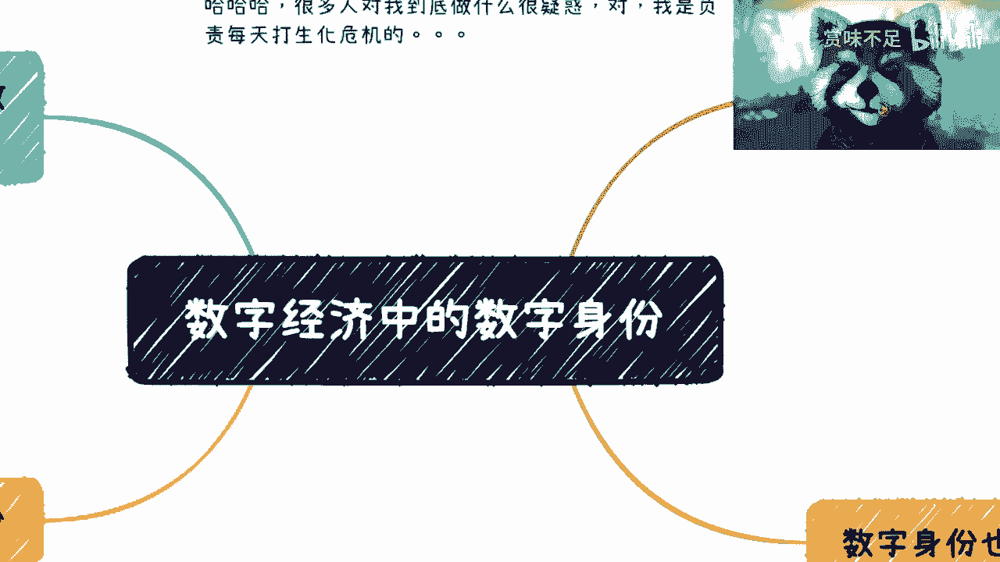

# 课程一：数字经济的基础建设——数字身份 🆔

在本节课中，我们将要学习数字经济中一个至关重要的概念——数字身份。数字身份是数字经济的基础建设之一，它虽然不像应用那样直接面向用户，但却是整个数字生态能够顺畅运行和发展的关键。我们将从概念、重要性、技术实现和商业机会等多个角度来解析它。

## 概述：什么是数字身份？

数字身份可以被理解为在数字世界中代表个人、组织或物体的唯一标识和属性集合。它类似于现实生活中的身份证，但在数字领域，它的形态和作用更加多样和复杂。

上一节我们介绍了课程的主题，本节中我们来看看数字身份的核心价值。

## 数字身份为何重要？🔑

数字身份已经发展多年，在“互联网+”、产业数字化改造、数字经济乃至Web3.0等概念中，它都扮演着最核心的角色。其重要性主要体现在以下几个方面：

以下是数字身份的几个核心作用：

1.  **方便管理与跟踪**：对于管理者（政府、平台、企业）而言，统一的数字身份便于进行高效的管理、审计和追踪。
2.  **提升用户体验与效率**：对于用户而言，当身份被有效管理后，办理业务、投诉反馈等流程的效率会大幅提升，避免了因身份信息混乱造成的“糊涂账”。
3.  **增强安全与隐私保护**：从技术演进的角度看，现代数字身份体系能采用更先进的加密技术（如国密算法），从而更安全地保护个人隐私和数据。

然而，构建一个完美的、大一统的数字身份体系面临着一个根本矛盾：**宏观统一性与微观定制化的矛盾**。

一个旨在全局统一管理的身份系统，很难同时满足医疗、金融、游戏、社交等各个细分领域对身份信息的特殊化、定制化需求。每个领域都有其独特的业务字段、数据结构和安全要求。因此，现实中的数字身份往往是分层、分域的。

## Web2.0 时代的数字身份困境 💻

在当前的互联网（Web2.0）环境中，数字身份的管理实际上非常分散。

我们日常使用应用时，通常用手机号注册。但问题在于，同一个手机号（如 `18612345678`）在A公司、B公司、C公司内部，会被分别映射成不同的内部ID（如 `xxx`, `yyy`, `zzz`）。

以下是这种模式带来的问题：

*   **企业视角**：每家公司都需要维护自己的一套映射表，管理成本高。
*   **生态管理者视角**：如果有一个平台想整合A、B、C三家的业务，它就需要再建立一张庞大的总映射表，将 `18612345678` 对应到三家公司的不同内部ID。当下面有成千上万家企业时，这种维护方式几乎不可行，且任何一方的改动都会导致上层数据混乱。

理想的解决方案是引入一个**统一的数字身份中间件或协议**。

这个中间件提供一个标准化的工具（如SDK），企业A、B、C都通过这个工具，将用户的原始信息（如手机号）映射到一个由该中间件生成的、生态内统一的身份代码上。公式可以简单表示为：
`统一身份ID = 中间件协议(用户原始信息 + 企业特定上下文)`

这样做的好处是：
1.  上层生态管理者便于进行统一监管。
2.  下游企业接入和管理更简便。
3.  用户数据通过统一的、安全的协议得到保护，实现了多方共赢。

## 数字身份的多样性与机会 🌐

数字身份的“统一”并非指只有一个身份，而是指在特定领域或生态内的统一。一个人可以同时拥有多个不同场景的数字身份。

以下是几个不同领域的数字身份示例：

*   **支付身份**：例如数字人民币倡导的“穿透式数字身份”。它意味着所有在法律上能代表你身份的凭证（如身份证、护照、车牌号），在理论上都可以被赋予支付属性，实现身份与支付的深度融合。
*   **垂直领域身份**：教育、农业、公安、产业园、社交等每一个细分领域，都有强烈的数字身份管理需求。例如，教育系统需要跨校的学生身份统一，农业数字化需要农户或农产品的可信身份。这些领域目前大多缺乏系统性的数字身份体系，存在巨大的市场空白和改造机会。
*   **Web3.0 去中心化身份 (DID)**：在Web3.0领域，数字身份（DID）强调用户自主掌控。它通常基于加密协议构建，既能保证身份的可验证性和可管理性，又能确保用户的匿名性和隐私安全。另一种做法是整合现有DApp的身份，为其套上一层统一的“外壳”。

## 实施数字身份的关键考量 ⚙️

在具体实施数字身份解决方案时，需要注意以下几点：

1.  **技术选型灵活**：数字身份作为基础建设，核心目标是达成管理、安全和互通的目的。**区块链并非必选项**，应根据具体场景、需求以及甲方的偏好，选择合适的技术栈（可能是传统中心化数据库，也可能是区块链或隐私计算协议）。
2.  **分阶段纳入规划**：数字身份的建设通常是整体数字化解决方案中的一个重要阶段。一个典型的项目路径可能是：**第一阶段**搭建底层基础设施（如区块链）；**第二阶段**上线核心业务；**第三阶段**建立统一的数字身份体系；**第四阶段**将数字身份与各项业务深度绑定。分阶段实施可以降低风险。
3.  **超越“管理”，走向“资产”**：数字身份最初是为了方便管理。但随着发展，它将被赋予更多属性，如支付属性、金融属性，并可能与数据资产挂钩。未来的数字身份本身就可能成为一种有价值的数字资产。

## 总结与展望 🚀

本节课中我们一起学习了数字身份在数字经济中的核心地位。我们了解到：

*   数字身份是方便管理、提升效率和保障安全的基础设施。
*   其建设面临统一性与定制化的平衡挑战。
*   当前Web2.0的身份系统是分散的，存在通过中间件协议进行统一的机会。
*   数字身份存在于支付、各垂直行业以及Web3.0等多个领域，形态多样。
*   实施时需要灵活选择技术，并将其作为分阶段数字化项目中的重要一环进行规划。

总而言之，数字身份领域存在着大量尚未被满足的需求和商业机会。对于从业者、创业者或投资者而言，理解不同场景下的数字身份痛点，并提供有效的解决方案，将是参与数字经济浪潮的一个重要切入点。