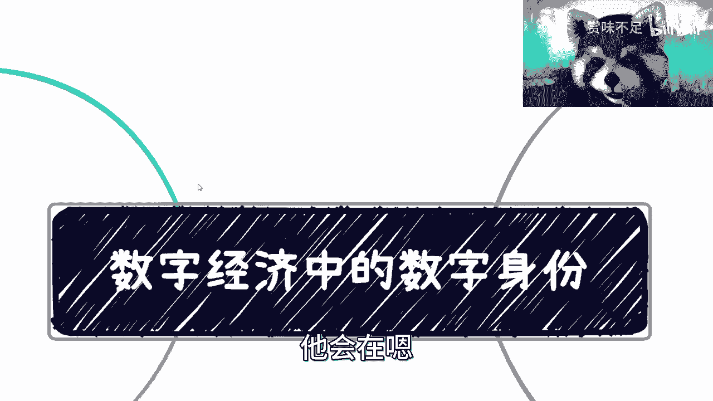

# 数字经济中重要的基础建设——数字身份 - P1 - 赏味不足 - BV1pM4y1y7Kc

好哦那个说好，今天下午我来讲这个数字经济的啊，首先呢很多人对我到底做什么很坏很很疑惑啊，很疑惑，对我是负责每天打生化危机的，我他妈到现在二周目还没打完，我靠我是个垃圾，我这两天一定要通关，我跟你们说啊。

这个再不通关。

这游戏他妈的退钱啊，对数字经济对吧，我们这一期来讲的呢，是这个数字经济当中的数字身份啊，这个东西呢是呃你们可以理解为基础建设，就是如果来说底层作为基础建设的话呢，它其实也是基础建设的一部分。

只不过呢它会在嗯决定底层技术之后啊。

再来做啊，那你们可以理解为像个中间件啊。

中间件，那么首先呢我们先来说就是数字经济，这边呢啊不是呸，数字身份这边呢其实已经做了好多年了哦。

好多年了，就可能大家也不是太有感知啊，但数字身份呢呃无论是以前互联网加，还是说是啊数字改造啊，还是说那个数字经济，还是说这个中国说的互联网三点啊，啊无所谓哪一个，但是它都是最重要的。

而且这个东西呢可能被很多人没有感知，因为这个东西就有点像很多人觉得啊，这个东西做了呢，你说我有感觉吗，没感觉，因为跟老百姓有关吗，可能关关关系不大，那大家就觉得唉考研这个东西可有可无，你知道吗。

但从整个生态跟产业链来讲，这个东西不能没有啊，没有的话，就很多东西是没法往下发展的啊，那么这个东西主要是干嘛呢，就是一呢方便管理对吧，然后方便跟踪啊，然后对上对下都是非常好的体验，为什么呢。

因为你想嘛对上来讲它是方便管理，对下来讲，其实啊，你如果来说今天有些什么问题或者怎么样，或者你去投诉，或者你去干嘛呢，你的效率会变得的更高，因为你的身份被管理了，你明白吗，就如果来说。

你你的你你目前当下就整个身份管理很糟糕，很糟糕，就没有管理，那么你要去做一件事情，你们想想看啊，就是你其实相当于是就是对你来讲，你只做了个投诉嘛对吧，但是对于你投诉之后。

就所有的这个相关的部门和相关的企业，他得开始去查对吧，那当然就是就算他们非常有心去查，但是如果来说没有很好的管理的话，那么他们很可可能这就是一笔糊涂账，你知道吗。

就这个东西最后就很难就给出一个这个结论啊，然后呢，数字身份呢就从技术的这个提升升级来讲呢，它也是能更安全，更能够保护隐私啊，这是毫无疑问的啊，毫无疑问的好，那么这个东西呢我跟你们讲啊，就是首先呢。

我觉得大家对于这个数字身份的这个认知啊，应该这个从上而下啊，然后说好老子要干一个数字身份啊，全国要给我统一是吧，这句话没有错啊，没有错，但是你要明白一点，就是就是世界是多元化的，什么叫多元化的呢。

就是说打个比方，今天你有身份证，对不对，好，那我就问你，你的身份证是不是在所有的地方，所有的场景，所有的地，所有的这种这种这种这种这种这种，就是上下文你都能用，不是吧对吧，那如果来说今天身份证能够统一。

那么你所有的地方，是不是只要刷身份证就可以了，但是理论上不可能，为什么呢，是因为你要这么想，就是说所谓统一化的一个东西，一定是从全局上宏观上来方便管理的，但是你要知道很多东西鱼与熊掌不可兼得。

就是什么意思呢，就比如说你今天要做一套这个身份管理，对不对，好你说我既想在宏观上面保证统一啊，又要在各个领域里面非常的简便，就非常的便利，非常的方便管理，可能吗，不可能，因为你在任何的细节领域。

比如说医疗啊对吧，游戏啊，社交啊，金融啊，每一个细分领域里面都有每一个细分场景的，特殊的，我们叫做就从技术角度来讲，我们叫做特殊的字段，对特殊的数据库啊，特殊的这个这个叫做叫做定制化的服务，对吧啊。

那你说我既要满足宏观的这个统一需求，又要满足细分领域的这个定制化需求，可能吗，不可能，因为这两个是矛盾的东西，你知道吗，所以说呢就是说从本质上来讲啊，你今天有一个数字身份，也许是大而全的对吧。

但是呢他在每一个细分领域呢，你可能还会有自己的数字身份啊，只不过呢就是说在某一个细分领域里面，你的数字成本被统一了，而不是说在整个所有的地方你都被统一了，这很难啊，这几乎不可，几乎不科学。

而且违反人性发展，你知道吧啊那么我们说啊，甚至呢他用的是不同的技术，因为有很多人会会那个嘛会confuse嘛对吧，会会疑惑，就说啊这个东西你说是说互联网三点对吧，说是说数字经济，那是不是啊。

这个数字身份要用到什么比较特殊的吧，比较special的这种技术呢，那不是啊，无所谓啊，就你只要做到一个结果，就说数字身份我能够出来对吧，然后这个身份方便管理，方便跟踪方便方便统一对吧，然后方便各各方。

就是因为你要统一的话，其实就是方便各方进来接入，同时做一个做一个translate嘛，其实就是做一个翻译嘛对吧，那你你我管你用什么技术啊对吧，你只要能做到这一点就可以了。

所以说这个用什么技术其实并不重要啊，重要的是你得有用对吧，你不能说啊，花了几百万，花了几千万下去，怕这个东西打水漂没有用对吧，没卵用对吧，这第一点第二点是你得赚钱呢，对吧好。

那么我觉得这个是核心的东西啊。

核心的，哎呀我跟你们讲真的。

我有时候觉得这个这个中国很多高校，这数字经济也不用上了。

你们就直接上我的课就好了，真的是啊，这学校里面老师教的都啥玩意是吧啊，然后第二个呢那就拆分开来对吧，就wb 2的这个数字成分啊，web的数字身份呢，首先啊从我角度来讲呢。

我最早其实还是知道是d i d对吧，就web 3的数字身份就叫d i d啊，那但是呢我知道的肯定不是真正的顺序对吧，就当然谁先谁后并不重要对吧，反正就是说我们知道一个结论啊。

就web 2 wb 3呢反正都要做数字身份啊，就这个没毛病对吧，好，这是第一点啊，第二点呢就是说一个应用的身份系统啊，这个身份的统一呢，其实这个现在其实是不统一的，我跟你讲为什么唉这东西太太太容易了。

就是我跟你讲为什么就是现在啊，比如说你们打吃鸡对吧，打王者荣耀啊，打各种各样的东西对吧，你们所做的是什么，就是这个这个身份叫什么手机注册对吧，然后身份证来验证那个防沉迷对吧，无非就这样子。

但是你就这么想啊，就是对于你来讲啊，对于你来讲，你的这个输入是一个手机号，对不对好，但是呢你要这么想，就是你今天输入的虽然是个手机号，但是如果你今天用了100个应用。

那100个应用对应的就是100家公司嘛，对不对好，那么你这个手机号在这100家公司里面，其实是每家公司都会存有你这个身份id的对吧，而且呢每家公司就是都会做一个映射，什么叫映射呢。

就比如说你今天这个手机号是186，12345678，对不对好，那么在a公司的映射成xxx对吧，在b公司呢要映射成y y y y对吧，因为c公司呢验证成z z z对吧，那为什么公司要映射呢。

是因为公司要做的是一张一比，一对一的一个mapping表，就是这张映射表，那这张表为什么会映射出来，是因为这个东西就是方便企业管理的啊，但是你看这个问题就来了，问题就在于说，虽然你这个人是同一个人。

对不对，但是你的xxxx这个身份在只是在a方面管理，y y y也只是在b方面管理，但是问题是如果某一天从你的角度，你是无所谓的，但是从上面的角度，他说唉我想管理一个生态，而这个生态里面比如说有200家。

500家这么几千家企业哈，那这个时候有个问题，就是你每家公司都有张映射表，那么从上层的管理角度，我怎么来很好的管理你这个id呢，没法管理啊，对不对哦，那按照正常人的逻辑，就是说那这样子呗对吧。

我既然来说有三家企业，那我再建一张表对吧，就是再建一个这个这个这个比如说excel对吧好，然后呢把18612345678映射成哦，在a公司是y y y b公司，a公司，xx b公司。

y y y c公司jz，再做一张大的映射表，你要么脑子有病，你知道吗，你要你就就要么脑子有坑，你知道吗，就你想想看，如果我下面有5000家企业，你相当于在上层再维护一张表，这张表示一对五五千。

这不是有病吗啊这不是有有有有有有病，快去吃药是吧对吧，而且有个最大的问题是什么呢，就是如果来说这么维护，下面有一个哎，他比如说改成了x x y x x y y，那怎么定啊，上面再改跟着改，这不有大病吗。

是不是啊，所以说呢就是说这个事儿啊，他本来就不应该这么做啊，那么从本质上来讲呢，就是说得要有一个统一的这么一个数字，身份代码呢，是把这个要1861345678，这个账号真正的做到。

这个某一个生态里面的统一啊，那么这个统一指的是什么呢，就是从技术角度，在企业的维护角度啊，全部走统一化的协议，而不是说在最终这个存储的时候，还是分别去存储，就当他在底层用的时候存储的时候。

就已经是一个映射关系了，只不过这个映射关系本来是，比如说这个s x x是谁做的，是a做的，对不对好，那么接下来这个映射关系呢，是由上层提供了一个我们打个比方，提供了一个sdk，或者提供了一个中间件啊。

其中提供了一个我们叫做translate，翻译的这个这个这个这个工具啊，那么这样子的话呢，a啊通过这个工具好映射到了这里，b通过工具映射到了这里，c通过工具映射到这里对吧。

那么这样的话a b c记好管理，那么同时上层也比较好管理，而且这个工具做的时候一定会采取国密对吧，采取各种各样的加密手段来保证数据安全性，那么你就会发现，这件事情是一个三方共赢的一个东西，为什么呢。

因为一上面方便管理，二下面用起来也方便，三老百姓在用的时候，你的信息也得到了保护，对不对，好是不是很完美啊，是不是很完美，是不是很清楚啊，啊但是我跟你们讲，现在这件事情是没有做的啊，那你们自己想好吧。

自己想啊，商机在什么地方，商机无限多，对吧啊，这是第二点，第三点呢就是说我们刚刚也说过了，就是啊你的数字身份统一并不是只有一个的，你会有很多个，那比如说还有什么呢，数字人民币，对不对。

数字人民币这边的数字身份统一了，更多的是像一种支付层面的一种呃，在白皮书里面叫做穿透式的数字身份，什么叫穿透式数字身份呢，你们详细可以见我数字人民币的那一期啊，我在里面也说的很清楚。

我在这个地方再简单提一点啊，就是说呃所谓支付的穿透式的数字身份呢，就是说所有能够代表你在法律上面，能代表是你的东西，它都具有支付属性啊，那么也就是说你的这个嗯，比如说身份证也好对吧，这个车牌也好啊。

包括你的这个通行证也好，护照也好，就是所有的能代表你身份，在法律上能够就是说成立的代表你身份的，他都可以，就理论上我们不是说是以百分之百，因为你想嘛你要让这些东西具有支付，你你还得开发的。

你不可能出来一个系统，说好默认全部支持不限制的，你总要开发的，对不对，那我们就是说从它的架构角度来讲啊，架从设计架构角度来讲，理论上它都是支持啊，那么这这这个第三点啊，最后一点呢。

就是说每个细分领域其实都是有数字身份的，而且有很大机会，那这个东西呢就是说我们随便举嘛对吧，你比如说刚刚我们说了啊，这个可能是游戏的啊，这个可能是不是这个支付的啊，那你想啊，你往下农业金融那个公安对吧。

那个什么社交啊，这个这个这个这个这个这个，这个包括产业园教育对啊，各个地方也多的是，我跟你说，每个西方领域其实都要的，就现在没有，而且我跟你讲没有的，很大原因，还是因为就产业链上下游都觉得这个东西。

就第一呢他们没有认知，第二呢他们也觉得，就当下这个东西不是一个，这优先级特别高的东西啊，但是其实本质上并不是这样子，啊所以我一直说嘛赚钱这个事呢，很多时候还是信息差的问题啊，我举几个例子对吧。

就是比如说像我刚刚说的教育啊，教育呢你比如说啊像这个教育系统啊对吧，跨学校的也好啊，同学校的也好啊，就教育系统里面，其实是需要统计数字身份的对吧，因为现在这个教育本身的这个系统里面，乱的很啊。

哪来统一身份，一会儿这个身份，一会儿那个身份对吧，统一都是就你要说真的统一吧，也就是那种打打补丁的统一，又不是说从底层上面就统一对吧，这是一个那农业这种更是吧，那你想在那种乡村振兴什么什么。

很多地方要做数字化改造啊，那你想想看吧，一个产业对吧，哦你一个产业都数字化改造了啊，但是你的整个数字化改造的底层，比如说你一个生态系统都输数字改造了，但你底层没有数字身份，没有数字身份管理。

没有数字身份统一，没有数字身份定义，那不是搞笑吗，你说是不是啊，就是每个地方都会要啊，就是刚需三就web 3的啊，呃其实我web 3呢就是我们这么说吧，从web 3角度来讲呢。

呃web 3跟互联网三点是两个东西啊，我再重申一点啊，互联网三点扯上关系，这完全不不大概的事情啊，就是啊首先是这样子的呃，d d对于f3 来讲，它是一个天生的有刚需的东西。

因为在web 3里面强调的就是身份自主，就是一个decentralized的这个去中心化的身份，所以说这个数字身份对于web 3来讲，是非常天然的一个东西啊，这第一定第二点呢从本质上来讲呢。

就是说呃web 3里面做数字身份的有一类，它是从隐私计算，隐私保护出发的，那么它更像什么呢，它更像一种中间件的协议，就我们刚刚说它像一个protocol，那这个flog protocol什么意思呢。

就是说呃就相当于我们做了一套加密的，隐私保护的协议，然后呢，所有的生态就想用我们的这个协议的生态，可以用我们的协议来做啊，身份的这个生成啊，然后他技能这个保证能够追踪管理，又能够保证匿名性啊。

又能够保证他的安全，那么这个就是一种数字身份的做法啊，第二种做法呢就是说呃很多dep，很多生态原本就有数字身份了，对吧好，那么他做的是什么呢，他做的是去整合这个dp或者做生态的整合，统一数字化身份。

那么简单来讲，就是说更像在多个生态或者多个账号外面，套一层壳啊，来统一化身份啊，这个事也不是不行啊，但是看他怎么套啊，看他怎么套嗯。

这个也是个不错的id啊，不错的id。

呀哦我这个地方没写数字是吧，忘记，啊这生化危机打的我人有点傻啊，人有点傻，思维不够活跃啊，有点迟缓。

第四个呢就是数字身份呢也是基础建设，这个地方也写了，就是说啊你说是不是一定要用区块链呢，无所谓啊，你用啥都一样，反正你达到目标目的就可以了对吧，看场景看需求，毕竟每个场景每个需求。

包括你的甲方爸爸是谁对吧，这个大家要爱爱好都不一样对吧，有的人喜欢用新的技术，有的人喜欢用老的技术，那谁晓得呢，是吧啊，给钱就行对吧，这是第一点，第二点呢就是数字身份呢。

我觉得啊就是肯定得要一开始考虑进去，因为你在做整个解决方案当中呢，你的方案一定是分阶段的，我举个例子啊，比如说第一个阶段，你建区块链底层对吧好，那你这个总归得近一段时间吧对吧，你你你共识机制啊对吧。

这个这个上链啊对吧，跟中心化的这个系统api对接啊，你不得接嘛对吧，那你建完之后呢，第二步啊，你说上业务好，上业务啊，那可能是第二阶段对吧，上业务啊，那么第三阶段呢，可能说哎我上了一部分业务了啊。

觉得问题不大好，开始建立数字身份对吧好，那么第四个呢就是把数字身份跟业务开始挂钩，你总会分阶段的对吧，你不可能说啊，我今天第一步好哼，我把所有东西全部包进去，那不好意思，你就算有这个能力包啊。

甲方也不会让你这么做的啊，这风险性太大了，鬼他妈知道你能做成什么样子啊，你说是不是啊，所以呢就是说就是说我不管你们分几个阶段啊，就是数字身份呢一定是其中的一个阶段，而且是一个比较重要的前期的阶段啊。

这个东西是避不开的啊，因为你想啊所有的身份，这个东西我们就这么说吧，就是从这对简单来讲，身份这个东西最早是用来干嘛的，用来方便管理的，对不对好，但是随着数字化的发展。

这个身份在未来就会慢慢慢慢去跟支付结合，慢慢慢慢跟金融结合，那你想想看这个东西不管你可能吗，那不现实，而且你不单单要管理，你还需要赋予它真正的一些属性对吧，比如说支付属性啊，金融属性啊对吧。

那你怎么赋予它呢，你怎么跟那些数字化改造平台所出来的，产出的那些数据挂钩呢对吧，这个都是数字成分要去考虑的问题，就它已经不仅仅只是一个数据了啊，它未来可能会变成一个资产是吧，那这是一块啊。

那么最后呢就是说我只能讲啊，机会呢在数就单纯说数字经济的数字身份上面，机会还有很多很多很多很多很多很多对吧，那你说我也只能说到这儿了啊，呃再往下说就是直接搞钱了，也没啥好说的，再往下就直接搞钱，对。

就就你告诉我什么地方要要我告诉你，我这边解决方案怎么做对吧，有什么团队要不要搞，能搞就搞，不能搞拉倒吧，就是结束了啊。

没也没什么再能网上讲的东西了啊，ok那么最后再提一点啊，这个关于职业发展对吧，这个数字经济发展啊，包括呃副业发展啊，包括其他各种各样的，反正你们只要想咨询的，还有人咨询情感的是吧，反正你们只要想咨询的。

反正你们私信我好吧，然后真的真的我我凭良心说，就是大家要是有资源，有有有那个啥的，也可以真的推荐推荐高校这个合作啊，找我我这边也有这个讲师团队啊，坚持团队啊，包括包括一些这个课程，现有的课程都可以合作。

真的我凭良心说，这些课程远远比高校里面那些哼老老掉，老掉牙的课程靠谱多了啊。

