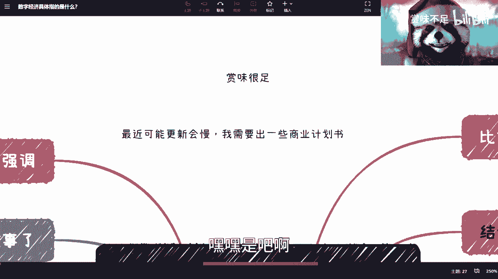
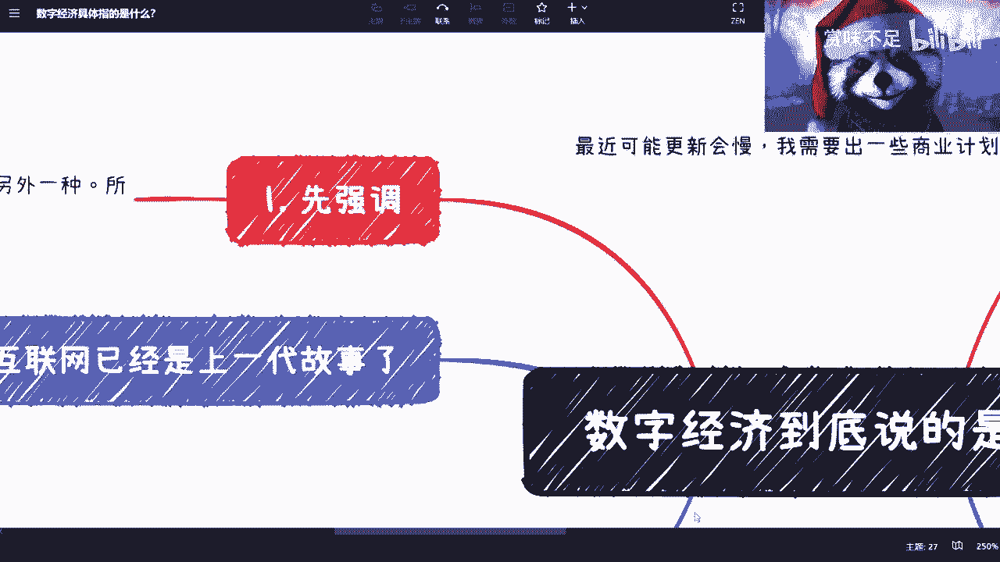
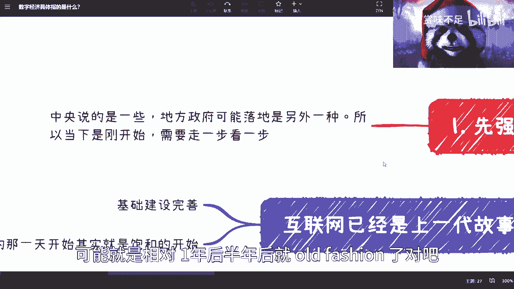
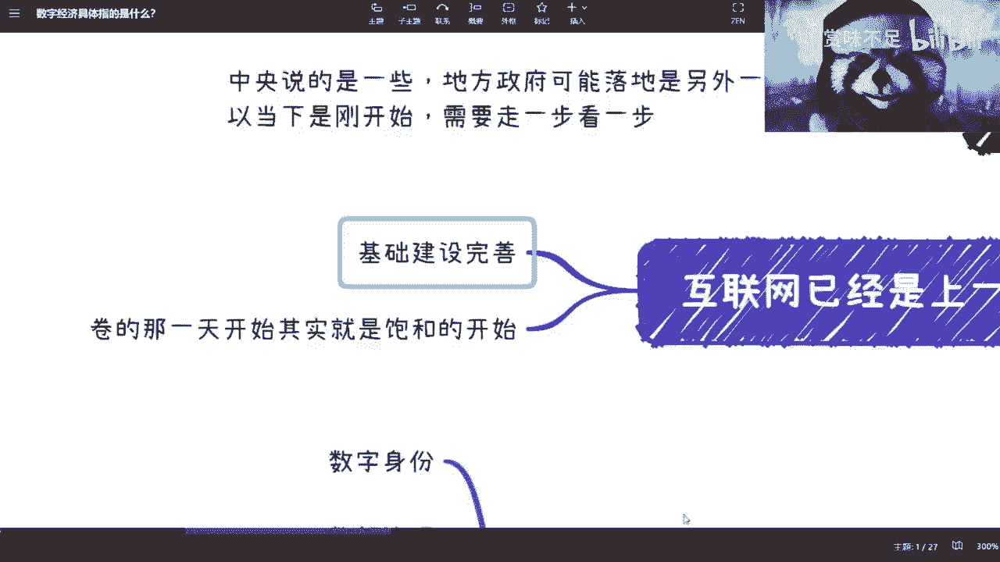
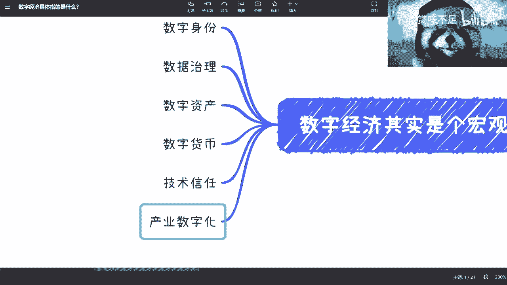
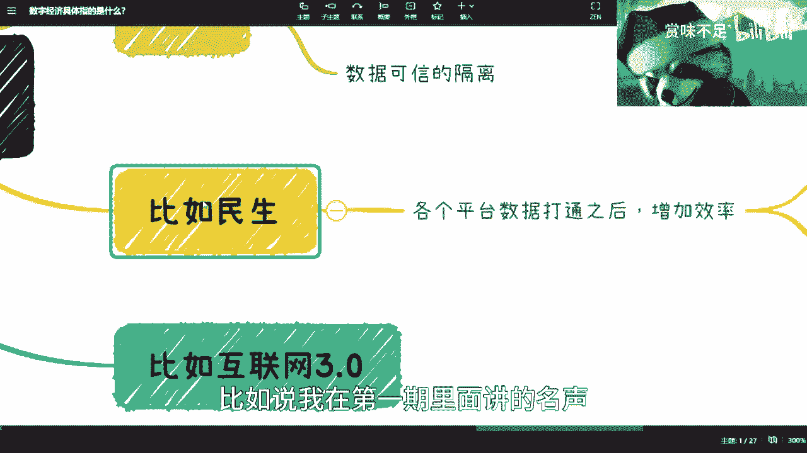
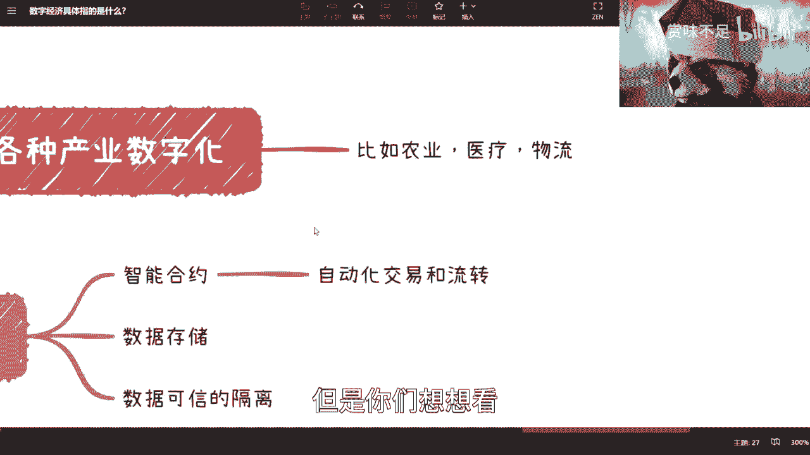
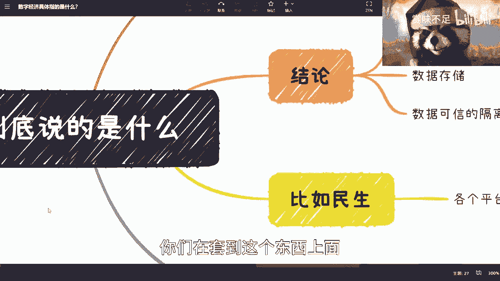
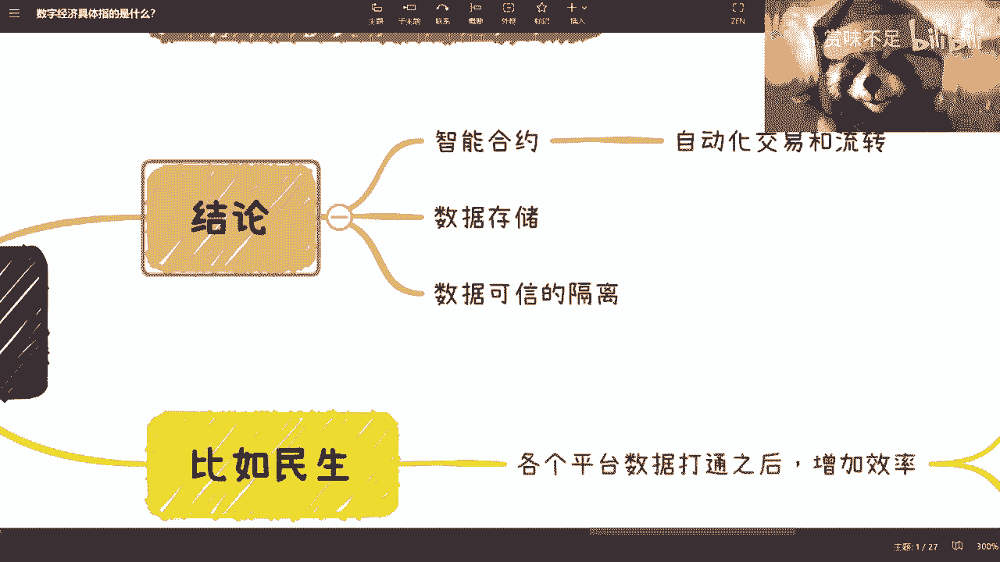

# 数字经济具体包括了哪些方向 - P1 - 赏味不足 - BV1ig4y1x7id

好大家好啊，又是我对，每次都是我对吧，我觉得我应该不会换人啊，然后有有两个事啊，一个就是就有很多人问我，这个微博上这个id是不是我啊，是我呃，这是因为就是赏味不足，那个id呢就是吃瓜了对吧。

就就就用来每天看八卦啊，这个id呢主要是用来，上面还讲些正正经点的东西好吧，大家回头看嘛，可以看这个id啊，你要吃瓜的嘛，就关注我大号是吧，呃然后最近可能会更新有点慢，因为我需要这个给那个新能源。

还有一些这个相关的一些产业，可能这边做一些BP对吧，就就就就哎我拖了人家很久了，我靠每天人家催我，然后人家问我，他说他妈的你有空你有空做B站视频，没空来给我们写书啊。

不是写写写BP，嘿嘿是吧，哦那么正经一点啊，就是我继续来这个讲这个数字经济啊。

对吧，正经正经一点啊，首先第一点。

诶我我我我呃，稍等啊，好首先第一点啊。

就是这个先强调一点是什么呢，就是我们说啊，当下数字经济整个的一个发展方向，和互联网的情况呢，其实是刚落地的啊，就是明面上刚落定吧对吧，就是潜意识里面其实很早就落定了对吧，就战略上应该好，很早就定了。

那么我们得要先明白一点，就是中央说什么啊，现在是中央说什么，但是地方政府呢要落地呢，可能会有一定偏差啊，所以说我现在所说的所有东西只是我的理解啊，大家也不要千万不要觉得啊，就是这么个样子对吧。

或者以后回头过了几年跟我说啊，超陈老师，你讲错了对吧，那那讲错很正常，我又不是先知是吧，哈哈啊，然后以下呢就是说所有的都是刚开始啊，我们就是走一步看一步，这也是为什么我跟你们说，我说你们不管做什么啊。

不管选什么方向啊，一每个月对吧，每个季度每半年都要去审视一下，因为现在这个情况变化太快了对吧，你用任何的就是呃，有可能比如说我现在讲的并没有错啊，只不过可能11年后半年后他变化太快。

可能就是相对一年后半年后就old fashion了对吧。

那这也不是我的问题是吧啊，那当然我的问题我也会承认的。

哈哈哈哈哈是吧，然后这是第一个啊，第二个呢就是互联网这个东西呢，我这个再跟大家强调一下啊。

就互联网这个东西呢，现在并不是说大家觉得我找不到工作，并不是只是因为它基础建设已经很完善了啊，就是说很简单，本来一个东西大家可能不太清楚，因为互联网也是新的嘛对吧，有可能这个东西大家不太清楚。

一个东西呢，可能比如说本来就要两个任务完成的，那由于大家不懂对吧，那可能招了20个人对吧，那现在整个基础建设完成了，那我说不好听的那20个人还要他干嘛呢，那恢复到两个人呗对吧，或者恢复到一个人呗。

这个就是当下其实面临的这个问题，而且呃红利期也也也没有嘛对吧，那这一个第二个呢就是你们看啊，我们一直说卷吧，卷是什么意思啊，卷的意思就是说有两种卷法对吧，第一种卷法是精益求精啊。

就是大家比谁的上限高对吧，这个是卷，那那现在是什么卷呢，现在是比比谁的下限低对吧，那所以你们想想看，为什么互联网会卷，就互联网卷的本质是什么，本质就是因为它的基础建设已经完善了。

就大家已经找不到那么多KPI和OKR了，那找不到这么多呃KPI跟OPI的情况，下面呢就是说那怎么办，你只能就是说我们说了吧，没有困难创造困难对吧，没有需求创造需求，那你没有这种创作需求，那只有卷啊对吧。

而且往死里卷对吧，所以就说你们无论从哪个角度去看，就是它的核心本质是基础建设完成的啊，就是其实已经很成熟了，没有必要再投入大量的资金，和大量的人力去发展，但是你说要发展吗，要发展的对吧。

不是说我们说啊互联网不发展了对吧，互联网已经是过去式了，不是的啊，就是哎呀就是就是我觉得很多小伙伴啊，就你们思考问题的时候，千万不要就是只有零跟一好吧，我之前说了很多遍啊。

嗯然后这个已经强调完了对吧，我们来看啊。

整个数字经济，在我看来它是一个宏观的大战略嘛对吧，那宏观大战略的意思是什么呢，就是它是覆盖所有行业的，就你们不要再去纠结是什么行业，也不要纠结什么专业，嗯这个并不重要，重要的是你们所有人做任何行业。

都会涉及到数字经济啊，而且很有可能涉及到最快的人就是公务员啊，你们我跟你们说，你们但凡你们但凡有听我这个内容，有公务员的对吧，你们就算不讲我，你们心里肯定也是有逼数的啊。

然后呢我们来看就是有几块数字身份对吧，数字身份你肯定要来，因为还是那句话嘛，你在互联网里面你们想想看啊，你们现在打这个王者荣耀对吧，打这个吃鸡啊，打打这个进入所有平台，你的数字身份其实是乱的。

你你抢是吧，就是说虽然你的这个注册号是你的，就就比如说认证是你的身份证对吧，注册号是你的手机，但是你今天注册1万个平台，就是1万个数字身份，这数字身份其实是不统一的对吧。

那么我们说就是你站在国家角度来讲对吧，或者你站在一个治理者的角度来讲，你觉得这好治理吗，肯定不好治理对吧，不不可方便的治理啊，我们先不说有没有什么解决方案，但是这肯定不是你想看到的，对不对，好。

这是一个第二个数据值对吧，数据治理就是我这两天一直跟大家说的，就是说呃互联网大数据云计算，它也已经达到一个饱和阶段了，那么本来是什么，是数据从无到有对吧，包括健康码是不是，那现在是什么概念呢。

现在就是说你数据有了，那有了之后就很简单，就是你你本来对吧，有的是一堆杂乱无章的啊，然后是一个我们称之为大数据的，可能做过一些初步清洗的这么一个东西，但是这个东西能达到治理吗，还不能或者远远不能对吧。

那么接下来一步就是要去做数据治理好，那么这个是第二点，第三点呢就是数据资产对吧，因为你互联网都已经济是基础建设了，你们现在所有的工作生活，谈恋爱对吧，所有的这个活动你都是离不开互联网的。

那么你在互联网上面竟然已经，就是说已经是一个嗯，花大量时间在网上的这么一个角色，那么大家以后多多少少都会有你自己的资产，只不过现在可能我们就说啊，从明智的角度，从从整个大宏观的角度。

大家其实都有你们的资产，只不过你们没有，就大部分人意识不到这个东西是个资产，你明白，就比如说我今天给你们录这个视频，这个视频从本质上来讲就是我的资产呀，但是问题就来了，难道B站上面打一个字叫做哦。

哦未经什么什么呃，作者允许不得转发哦，这就叫我资产吗，请问这句话有法律保护意义吗，没有对吧，就是真的有人，我到底是就真的有人去到了对吧，我是民事诉讼呢还是刑事诉讼呢，还是我去把他打一顿呢对吧。

就是其实你会发现所谓数字资产有很多种形式，都叫数字资产，只不过他的这个定义啊还没有清晰啊，然后这个叫做整个的，就是围绕它的一整套的叫做生态也还没有起来，哎呦这咖啡苦成果对吧，然后我们继续来讲啊。

你数字经济这个东西你都说经济了对吧，你能够跟货币脱钩吗，不可能对吧，那你肯定也有数字货币，哎呀这个东西呢还是那句话啊，这个我就不在这里多说了，哎呀有的人理解为非要讲知识，比特币或以太网的也行啊。

你们要觉得是数字人民币或数字港元，那也行啊，你们要理解为是呃美元的USDT的stable coin，或者来说像那个呃最近锚定这个数字港元的，某些s stable口音啊也行啊，这个我就不跟你们多逼逼了。

呵呵对吧，这个都可以啊，无所谓啊，哈那然后那个下面两个啊，第那个这里呢是这样子的，就是技术性能，技术信任是什么呢，就是说呃也也很简单，因为在互联网的这个生态里面呢，你靠一个主权化的信任。

其实你说可不可以可以，但是他不够完善啊，不够完善，我给你举个例子，这就好像什么今天比如说啊，你看B站小伙伴要给我三连对吧，然后呢要跟我咨询啊，然后呢我时间会告诉大家，我一般咨询呢反正就是友情价对吧。

一个小时500块钱啊，我就公开讲对吧，我也不藏着掖奖啊，500块钱，但是呢这里有个问题，什么问题呢，就是虽然我跟你们基于B站这个平台，大家认识的，但是呢我总就是你们会觉得诶我要是先付钱了。

那陈老师把我拉黑怎么办，对不对，好，那么我也会有个问题，我说哦我要是给你们做完了，你们不付钱怎么办，对吧好，但是呢问题在于哪里呢，就是说这个这个信任到底怎么解决，那有很多人就说了，他说你这模式我熟悉啊。

淘宝吗，是不是，那淘宝不就这样的吗，啊好我们来讲啊，淘宝的确解决这个问题，但是淘宝有个很大的问题是什么呢，就是淘宝是一个时代的产物，什么叫时代产物呢，就是它的模式没有问题啊，它的模式没有问题。

但是它的技术底层和技术支撑，在不同的时代会遭受不愁不同的质疑，我们举个例子，比如说现在所有的老百姓，你们我对吧，包括中国所有的普遍老百姓对于信任的，包括包括个个人资产，包括个人数据的这个隐私保护。

已经有了非常大的这个意识啊，那当然也有很多人说了，那你谈什么隐私保护啊对吧，我们都没有隐私了对吧，我们都是裸奔是吧啊，那我跟你们讲啊，就是说隐私保护分很多种对吧，就是你在一个国家国家去保存这个数据。

或者国家去拿这个数据，我觉得这个是就是有法可依的，或者有理可有有有理可据的对吧，就说这件事情本质上来讲，你你是没有主动权的，但是国家我认为他OK，但是并不代表所有其他的平台或其他的人是，OK对吧。

那么我们说从信任角度，我们不单单需要一个就是主主体化背书，主权化背书，我们还需要一个技术背书对吧，否则的话这个东西怎么弄呢对吧，是说我们出现矛盾好，我们一起找B站啊，B站啊，这个车老师骗我对吧。

那这个事情其实就是说你放在20年前，我觉得没问题，但是你放在数字经济往后的时代，你就会觉得很可笑，他是个笑到大牙的事情，就是技术如此发展，你竟然还解决不了这个问题对吧，那么你从B站来讲也很尴尬。

B站说B站人都跟你说好，那我这样子中国14亿人啊，还有海外的小伙伴哦，那我就每天给你们配客服啊，大家就就搞来搞去，那你这个这叫什么，这叫人海战术是吧啊，那么就非常不合理啊。

那当然这个事我就不在这里展开了好吧，不在这里展开了，我回头再再说啊，然后那个最后一个就产生数字化，好产业数字化呢其实讲了也也也蛮多年了啊，但是产业数字化还没这么快，因为嗯产业数字化，那或者这么说吧。

其实产业数字化呢是数字经济的前提啊，但是产业数字化这件事情呢，就是说呃做呢也做了，但是产业数字化本身它也有个成熟度嘛对吧，不是说我们今天一个制造业或者一个传统行业，不靠上互联网就叫产业数字化了。

他肯定也不是对吧，但是这个东西呢它没这么快啊，好我靠已经11分钟了。

我很焦虑啊，哦我这边还有这么多呢。

好那我们再来讲啊，你比如说现在中央啊，就北京这两天提到这个互联网3。0啊，呃首先是这样子的啊，这跟海外的web3不是一个东西啊，我再强调一下，不是一个东西啊，千万不要被忽悠。

也不要自己去PUA你自己好吧，你要做web3就好好做web3，千万不要把国内跟国外混在一起，你混在一起对你也没什么好处是吧啊，那么呃互联网零点啊，3。03。0呢概念也很简单，其实就像我刚刚说的。

就是互联网它已经翻篇了啊，我们要进入下一个时代，那那那你从中央点来讲，他总不可能跟你说来互联网翻篇了，我们进入数字经济时代，那也不可能嘛对吧，而且互联网这翻篇可能这个这个我可以说啊，这上面不能讲是吧。

而且大家理解就像我说在理解，就是说不是说互联网不做了啊，他只是进入一个新的一个阶段啊，进进阶的一个阶段啊，就像你打游戏转职一样的对吧，你技能数总归点着点着点着，你得升几下，是不是啊。

那么从这个大方向来讲呢，也没毛病啊，也没毛病，那么接下来就是就是数字经济啊。

我们举个例子，比如说我在第一期里面讲的名声啊。

那么名声这个直接的是什么呢，比如说啊你们要办什么五险一金啊，户口护照啊，户口啊对吧，什么什么什么医疗数据啊对吧，什么跨城市啊对吧等等等，就是说各平台数据打通之后，他肯定是能增加效率的啊，这毫无疑问啊。

毫无疑问啊，但是呢就有人这个前两天沟通的时候呢，有小伙伴问我，他说有几个问题，第一个问题是这件事情做了还可以做盈利吗，对吧，那从政府的角度来讲，它可以不盈利，为什么，因为它是一个从上到下的战略方向啊。

他的目标就不是盈利，那么他可以不盈利啊，这件事情没问题，因为它不像我们做商业化的对吧，第二个呢就是为什么睡觉要打通好，有很多人要说了，他说要打通，这不很容易吗对吧，那难难道还等到现在吗。

要打通几年前就可以打通了是吧，好你们想两个问题啊，第一个问题是打通谁来打啊，是谁来打，谁，打了之后能够被非常可信，这件事情怎么推啊，你们不要太想当然，就觉得啊这个东西政策一句话就能打通了。

政府做事情也没这么容易啊，政府一句话能打通，你们想想看啊，你们摸着良心想想看对吧啊，这是第一个，第二个是什么呢，就是说打通这件事情，它是一个可持续发展的事情啊，或者需要持续发展视频，什么意思呢。

就比如说今天啊有20人看我这个视频，我跟这20个人说来我们把数据打通啊，好那么这个时候打通怎么打通，你们说好B站签个头啊，B站这个帮帮帮我们撮合一下吧，大家相个亲啊，打通一下好也没问题啊。

但是你们想想看啊，我们一有我一个人跟20个人打通之后，那么剩下如果后面又有20个人进来，那我试问后面那20个人进来打通，他怎么打哦，B站说来我再撮合一下好，你们这边一这20一个人。

跟这边20个人凑在再打，再打通对吧，那你想想看B站哪里有这么空，每次来撮合对吧，首先是第一点，第二点是每次来的人是不是都会买B站的账，也不一定对吧，第三点是每嗯由于人数增多。

每次来的人要不仅要对B站有信任，还得对我们这边这个这么多人有信任，因为第一部对方20个人，只要对我这个人有信念，但是第二部这20个人不仅要对我有信任，还得对一开始这20个人有信念。

所以说你想想看这个逻辑，你越往后走，它的成本是越高的对吧，而且还是那句话嘛，最难治理的是什么，不是技术，是人对吧，所以说呢就是说不是说他不能打通，但是你们随便用膝盖，用脚趾头想想看。

就知道没这么容易啊对吧，这这这这这对吧啊好，然后呢还有什么就是各产业的数字化对吧，各产业数字化就是你比如说农业要数字化，医疗物流对吧，包括金融啊，银行对吧，这个各个从大大大领域到小领域都要。

但是你们想想看这些领域数字化的时候啊，数字化三个字是很抽象的对吧好。

但是你们想想看，当这三个领域或者N个领域数字化的时候，你们在套到这个东西上面。

请问这些东西有吗对吧，就你们用膝盖想想就知道，虽然可能你们也不懂对吧，但是你们用膝盖想想就知道有吗对吧，我们随便举农业，随便举一流对吧，请问有身份吗，没有智力有吗，数据进一步的清晰有吗，没有资产有吗。

没有货币有吗，也没有技术信任有吗，也没有产业输出，还有吗，也没有，这是什么都没有对吧，所以说所以说我们话又说回来，你说现在的医疗，现在的物流，现在的这个金融，现在的这个叫叫叫叫叫叫农业。

它有的是什么互联网化，因为他没有一个东西不联网啊，它没有一个东西，这个离离得开电脑，离得开整个互联网，离得开网站离得开，就是说整个软件系统它有吗，不可能，你现在跟我说啊，我去你去看个病啊，没有电脑的啊。

医生医生用用本子给你记啊，给你给你所有的东西寄，然后上面的医生看上面的下面配药的医生，看上面医生那个本子好，我来给你配个药对吧，现在已经完全达到了互联网化，但是他还离整个数字化，数字经济化很远对吧。

因为因为他没有这些基础设施啊，他怎么做。

你知道吧，所以说这个是我们说的下一个阶段啊。

下一个阶段，那么我们说结论，谁给我发消息O结论对吧。

结论是什么呢，就是我们需要一个智能合约哦，OKOK也有人就说了，他说陈老师对吧，我知道你是做区块链的啊，但是你不能这么强硬的把区块链套上去好，我来给你们解释一下，首先我们可以不叫区块链啊。

我们也可以不叫智能合约，随便你们叫什么无所谓，但是我们要的是什么，我们需要的一个是叫做可控的，可控的自动化的交易跟流转，什么意思呢，因为你所有的资产，你所有的数据没有交易，没有流转，就是没有金融。

就是没有经济，因为你经济是什么经济，就是要整个流通啊，你没有流通，哪里来的经济啊对吧，我今天有有，我还是那句话，你你今天有一亿亿对吧，一兆亿握在你手上，握在政府手上，请问他不流通有卵用对吧，没有用。

它造成造不了就造这个这个叫什么，就是制造不了更大的价值，对不对好，那首先是这个这个有吗，现在没有啊，现在没有，第二个是数据存储，数据存储呢就是说不单单是数据库的存储，而是说可信的存储对吧，第三个是什么。

就是可信的隔离啊，也就是说就是说我们比如说啊数据打通对吧，我们说数据共享好，但是呢当我需要用这些数据的时候，并不是所有数据我都有权限访问的对吧，那这样的话好了，大家就不要搞商业了。

大家大家就没有什么壁垒了，大家就变成了说啊我我我我我做慈善对吧，把我的这个有炸鸡的信息全部共享出来，那脑子又瓦特了，对不对啊，所以说呢其实也也要从技术角度去做到可信的，这个数据的隔离啊。

那么这个时候我们说啊，就有人来跟我讲了，他说陈老师，你这个是生搬硬套好，我跟你们讲啊，我前两天不是在重庆嘛，对不对啊，我那天晚上啊，我我也我我站在一个非常客观的角度，我就问对面这个一个创作者啊。

一个做新能源的，一个是体制内的，我就问他们，我说我说这个东西数字经济从各个方面，我说我没看出来跟区块链有半毛钱关系对吧，我说我说不是，我不信啊，我说我是自己都没看出有半毛钱关系对吧。

然后对方就问问我一句话，问我一句话，我今天就问你们啊，问你们，你们回答我好吧，他问我，他说创老师，那你想想看综合这些属性，在目前以你已知的技术里面，你选一个给我对吧，因为很简单嘛，他说政策要做东西。

你总要解决方案嘛对吧，你要有个扫毒，那他说你选个技术给我，你有吗，诶我想想有道理的啊，有道理的，我承认啊，除了区块链，我也想不出别的东西啊，有可能是我肤浅是吧啊，那你们也可以想想看啊，你想想看嗯。

当然了，我总结一下啊，这个是不是区块链并不重要啊，重要的是整个大方向是不变的啊，整个大方向是不变的啊，用什么技术实现它们也不重要啊，重要的是最终都会这样做啊，因为很简单，整个社会是要进步的。

整个社会是要发展的啊，你们千万不要觉得就是说你们看到的世界，跟你们看到的这个这个这个样子是怎么样的，其实还是那句话，整个社会的世界，地球上的这个洪流，这个时间线跟你们每个人的时间线，大家是互不冲突的啊。

也许你们是刚刚觉得啊，我们就是刚刚这个苗苗刚发芽对吧，刚要茁壮成长，但是你们茁壮成长的这个开始，可能已经是这个数字经济世界就是开战的啊，那个开头啊，那么也就是说，其实说白了就是没有这么多的时间。

和没有这么多的这个这个窗口期，给大家去成长啊，你们嗯我说句可能不恰当的话，就是你们得自己拔苗助长好吧，哎呀输出经济果然很花时间啊，我动不动就20几分钟啊好吧，然后回头的话呢。

我会后面再慢慢慢慢再扩展出来。

