# 数字经济课程 P1：核心方向解析 🧭

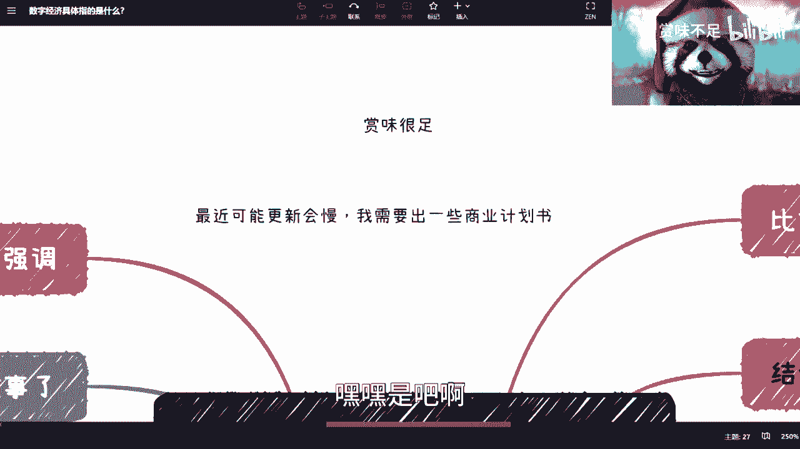

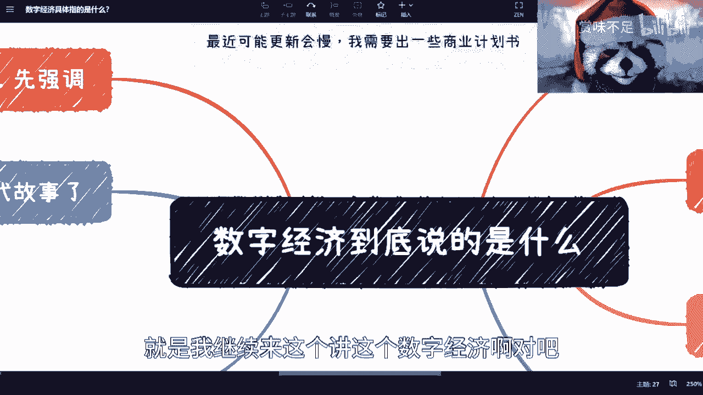

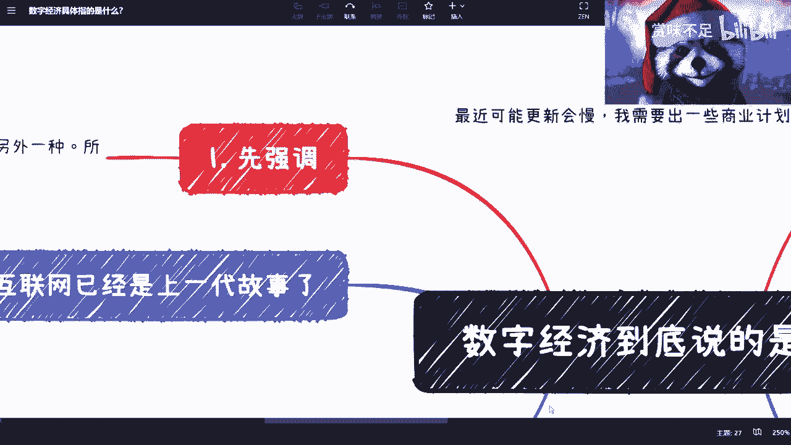

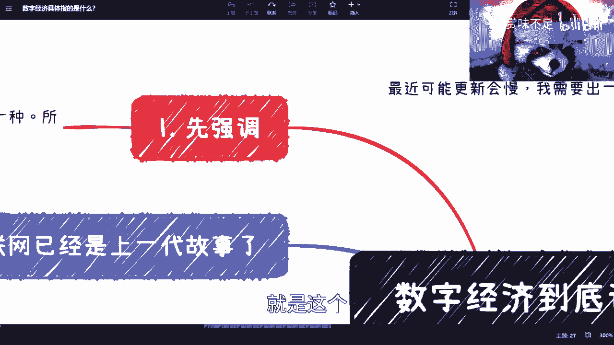

在本节课中，我们将要学习数字经济的宏观战略及其涵盖的核心方向。数字经济并非一个独立的行业，而是一个覆盖所有领域的宏观战略。理解其核心构成，有助于我们把握未来的发展趋势。

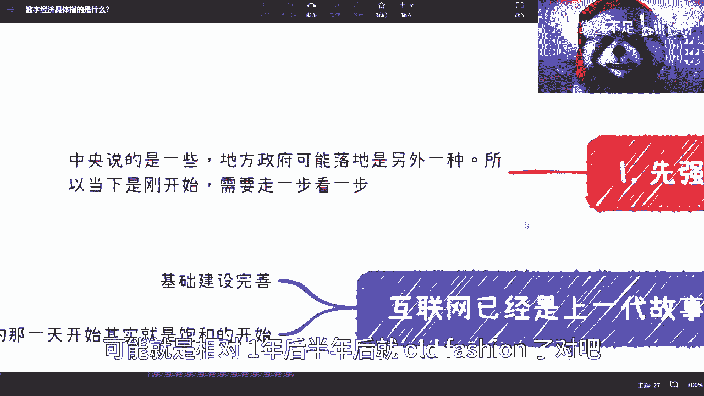

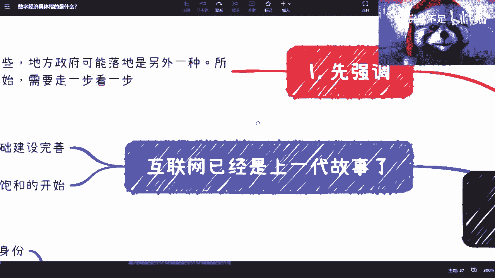

上一节我们介绍了数字经济的宏观背景，本节中我们来看看其具体包含哪些核心方向。

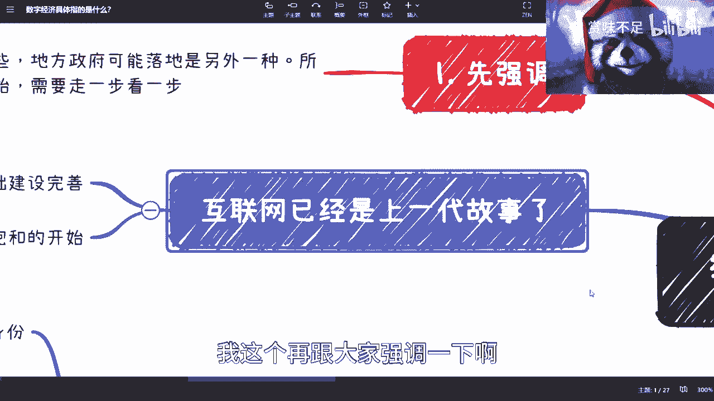

## 数字经济的核心构成

在我看来，数字经济作为一个宏观大战略，覆盖所有行业。其核心方向主要包括以下几点。

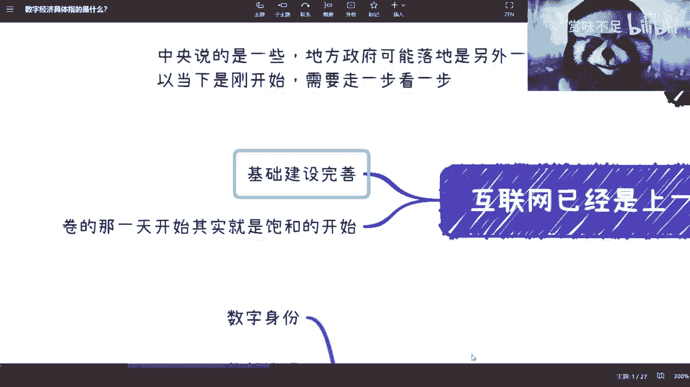

以下是数字经济涵盖的六个核心方向：

1.  **数字身份**
    当前互联网中，用户在不同平台拥有杂乱且不统一的数字身份。从治理者角度看，这不利于高效管理。数字身份的统一与规范化是基础。

2.  **数据治理**
    互联网大数据的发展已进入饱和阶段。数据从“从无到有”转变为“从有到治”。下一步的关键是对海量、初步清洗的数据进行深度治理，使其产生更大价值。

3.  **数据资产**
    人们在互联网上的各种活动（如创作内容、产生数据）本质上都是数字资产。但目前这些资产的定义尚不清晰，围绕其建立的法律保护和商业生态也尚未成熟。

4.  **数字货币**
    经济离不开货币，数字经济必然与数字货币相关联。无论是央行数字货币（如数字人民币），还是其他形式的数字货币，都是该领域的重要组成部分。

5.  **技术信任**
    在数字世界中，仅依靠中心化平台（主权化信任）进行背书和仲裁已显不足。我们需要技术本身提供可信的保障，以更高效、更低成本地解决交易与协作中的信任问题。

6.  **产业数字化**
    这是数字经济的前提和基础。它指传统行业（如农业、医疗、物流、金融）与数字技术深度融合的过程。目前许多行业仅实现了“互联网化”，离真正的“数字化”和“数字经济化”还有距离。

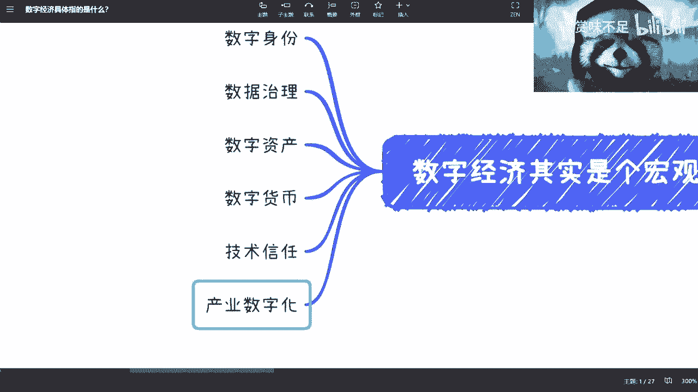

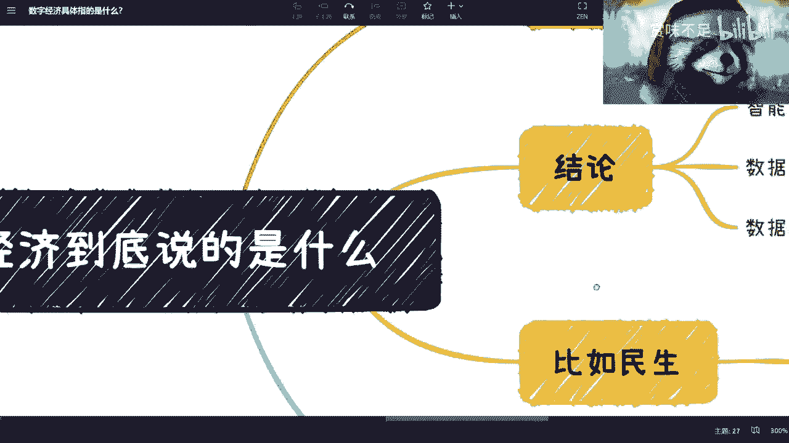

## 现状与挑战：以“数据打通”为例

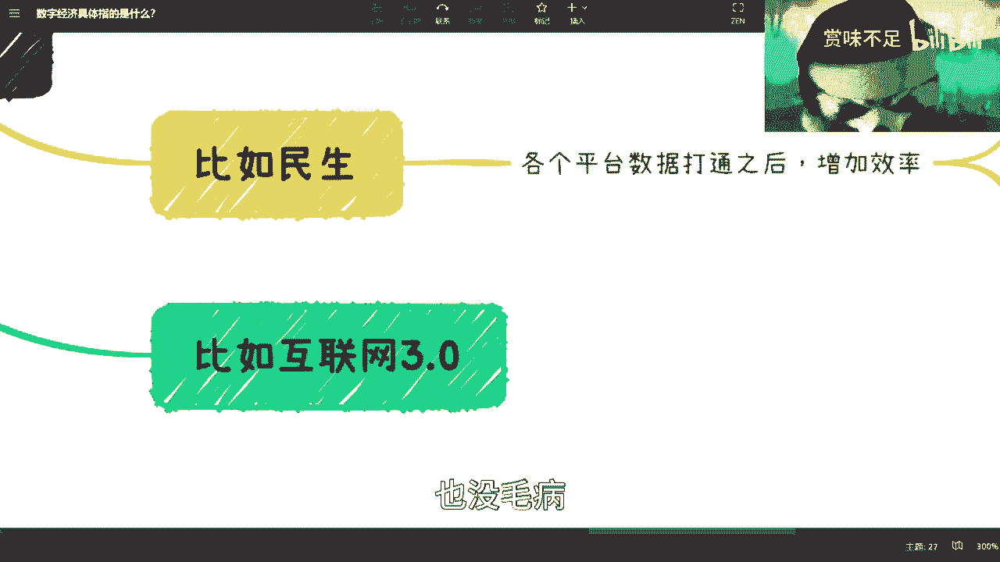

我们以“数据打通”为例，探讨当前面临的挑战。数据打通能显著提升社会运行效率，例如办理政务、医疗数据跨城共享等。

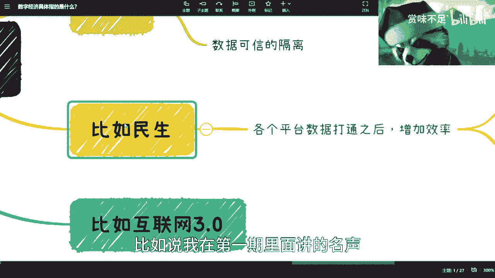

然而，实现全面数据打通面临诸多困难：

*   **协调成本高**：涉及多方主体，协调难度大，非一纸政策能即刻解决。
*   **信任建立难**：随着参与方增多，建立彼此信任的成本呈指数级上升。
*   **可持续性差**：缺乏一套可扩展、可持续的技术机制来支持动态加入的新成员。

## 未来展望：需要怎样的技术支撑？

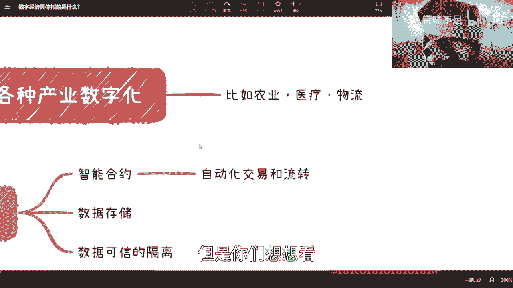

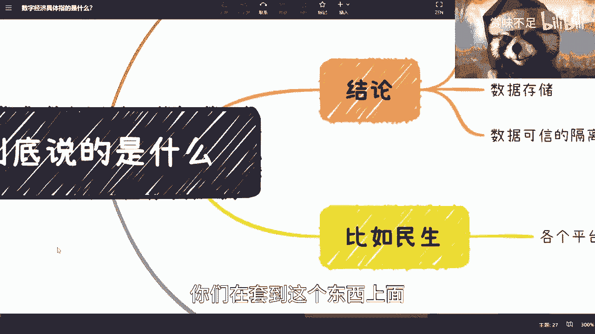

综合以上六大方向的需求，我们可以推导出未来数字经济基础设施需要具备的关键能力。

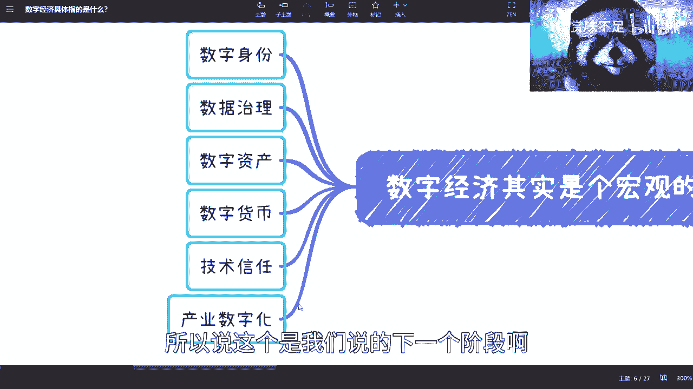

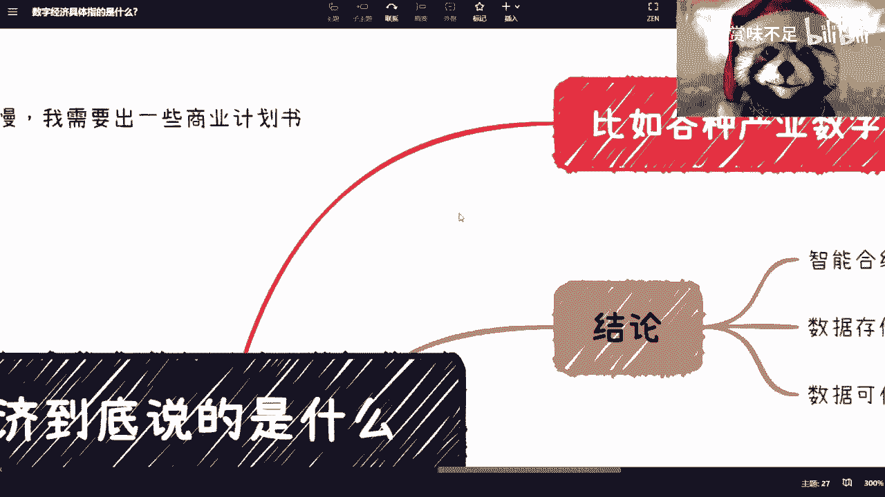

以下是支撑数字经济发展的三大技术需求：

1.  **可控的自动化交易与流转**
    经济依赖于流通。数字资产和数据需要在可信、可控的规则下进行自动化交易与流转，以激活经济价值。其核心可抽象为一种 **`可控的自动化执行协议`**。
2.  **可信的数据存储**
    不仅需要数据库存储，更需要数据不可篡改、来源可追溯的可信存储。
3.  **可信的数据隔离与共享**
    在促进数据共享的同时，必须从技术上保障数据能被安全、可信地隔离，确保不同主体只能访问其被授权的内容，保护商业机密和个人隐私。

目前，从已知技术来看，区块链及其智能合约在满足上述需求方面展现出独特潜力。当然，具体采用何种技术实现并不最重要，重要的是这些需求指向的发展方向是明确的。社会进步与技术发展的洪流不会停歇。

---

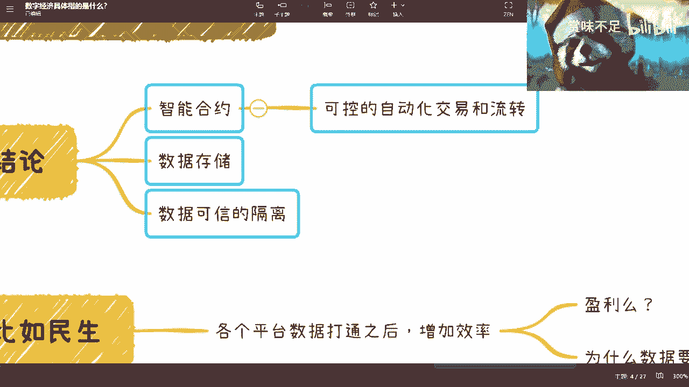

本节课中我们一起学习了数字经济的六大核心方向：数字身份、数据治理、数据资产、数字货币、技术信任和产业数字化。同时，我们也分析了当前实践中的挑战，并展望了支撑未来数字经济发展所需的关键技术能力。理解这些框架，有助于我们在快速变化的时代中找准自己的定位和发展路径。